# `cb` | Complete Basement
{ #cb }

[Lossless Bob LB-1979](http://www.losslessbob.wonderingwhattochoose.com/detail/LB-01979.html)

## Notes
Only Bob Dylan and The Band tracks are taken into account for analysis; cover versions are excluded.

## Description (from original info file)
Well, here is it, my third attempt to cover the Basement Recordings. This attempt is more of an 'Anthology' than simply the 'Dylan Basement recordings'.

I've used filler from 'influences' or 'originals' of most of the songs covered in the first 4 reels. I could be wrong, but it seems reasonable to suppose that Dylan and the Band were listening to recordings of Ian & Sylvia, Hank Williams & Johnny Cash and others, so these songs have been added. For me these songs add depth to the early sessions.
I was unable to locate any versions of: Baby Ain't that Fine (Frazier), No Shoes on my Feet (trad) - Cisco Huston (as Going Down the Road), Johnny Todd (trad), One Man's Loss, One Single River(Tyson / Fricker), Silhouettes (Slay / Crew), The Spanish Song (aka Amelita, Luisa, Carmelita) & Waltzing with Sin (Hayes / Burns).

I want to thank Randy for helping me locate many of the originals I used.

For the Reels 5-7 disk I have swapped the channels on about half of the recordings to be consistent with the details in Helyin's book - The Recording Sessions.

For Disk 7, I've retained the original 14 track acetate as the main tape, and simply filled up that disk with the additional alternate takes and the additional Publishers Demos (Big Ben). These recordings are noticaly differently mixed to the Reel versions.

I've also added a full CD of contemporary cover versions (Disk 8). I felt that as this was how we first came to hear these songs, they deserved to have a CD in their own right.
There were others I remembered (such as PPM - Too Much of Nothing), that I didn't have room to add. There are various detailed accounts of how these 60s-70s groups and artists came to hear and learn these songs, that are worth checking out.

Using my source tape I have remastered the recordings used for Disk 9 again, to remove the effects of 'noise reduction' apparent on my original attempt.

## Tracklist (from original info file)
Disk 1 (Reel 1) 01 Lock The Door (frag) 02 Baby, Won't you be my Baby 03 Try Me 04 I Can't make it Alone (cut) 05 Don't You Try me Now 06 Young but Daily Growing 07 Bonnie Ship the Diamond 08 Hills of Mexico (Trail of the Buffalo) 09 Down on me (frag) 10 One for My baby (and one more for the road) 11 I'm alright (frag) 12 One Single River 13 People Get Ready 14 I Don't Hurt Anymore 15 Be Careful of Stones that you Throw 16 One man's Loss (Always Another Man's Gain) 17 Instrumental 18 Baby Ain't That Fine 19 Rock Salt and Nails 20 (Now and Then Theres) A Fool Such as I 21 Silhouettes 22 Bring it on Home 23 King of France  filler 24 Be Careful of Stones that you Throw - Hank Williams 25 Bonnie Ship the Diamond - Judy Collins 26 Down on Me - Eddie Head & Family 27 Young but Daily Growing - Liam Clancy   Disk 2 (Reel 2) 01 900 Miles 02 No Shoes on my feet (Going Down the Road) 03 Spanish is the loving tongue 04 Piano & Harp Improvisations 05 Piano Instrumental 06 On a Rainy Afternoon 07 I Can't Come in with a Broken Heart 1 08 I Can't Come in with a Broken Heart 2 09 instrumental 10 Come All Ye Fair & Tender Maidens 11 instrumental 12 Under Control 13 O'l Rosin le Beau 14 I'm Guilty of loving You 15 Johnny Todd 16 Cool Water 17 The Royal Canal 18 Po' Lazarus (cut)  filler 19 900 Miles - Woody Guthrie 20 The Royal Canal - Liam Clancy 21 The Royal Canal - Ian & Sylvia 22 Come All Ye Fair & Tender Maidens - Baez 23 Cool water - Burl Ives 24 Cool water - Marty Robbins 25 O'l Rosin the Beau - Clancy Bros 26 Po' Lazarus - Ian & Sylvia 27 Spanish is a Loving Tongue - Ian & Sylvia 28 Spanish is a Loving Tongue - Marianne Faithfull   Disk 3 (Reel 3) 01 Belshazar 02 I Forgot to Remember to Forget 03 You Win Again 04 Still in Town 05 Waltzing with Sin 1 06 Waltzing with Sin 2 07 Big River 1 08 Big River 2 09 Bells of Rhymney 10 Folsom Prison Blues  filler 11 Belshazar - Johnny Cash 12 I Forgot to Remember to Forget - Elvis Presley 13 I Forgot to Remember to Forget - Johnny Cash 14 You Win Again - Hank Williams 15 You Win again - Johnny Cash 16 Still in Town - Johnny Cash 17 Big River - Johnny Cash 18 Bells of Rhymney - Pete Seeger 18 Folsome Prison Blues - Johnny cash 19 R1 (Now and Then Theres) A Fool Such as I - Hank Snow 20 R1 Bring it on to Jerome - Bo Diddley (loosely related) 21 R1 Hills of Mexico (Trail of the Buffalo) - Sid Selvidge 22 R1 I Don't Hurt Anymore - Hank Snow 23 R1 One For My Baby - Frank Sinatra (loosely related) 24 R1 One Single River - Ian & Sylvia 25 R1 People Get Ready - Curtis Mayfield 26 R1 Rock Salt & Nails - Joan Baez   Disk 4 (Reel 4) 01 I'm a Fool for You 02 Next Time on the Highway 03 Tupelo (The Big Flood) 04 You Gotta Quit Kicking my Dog Around 05 See You Later, Alan Ginsberg 06 Big Dog Won't you Please Come Home 07 The Spanish Song 1 08 The Spanish Song 2 09 I am a Teenage Prayer 10 Four Strong Winds 11 The French Girl 1 12 The French Girl 2 13 Joshua Gone Barbados 14 I'm in the Mood for Love 15 All American boy 16 Gimme Another Burbon Street 17 Tiny Montgomery 18 Sign on the Cross 19 This Wheels on Fire 20 You Ain't Going Nowhere 21 Katies been Gone (The Band) 22 Ruben Remus (The Band) 23 Yazoo St Scandal (The Band)  filler 24 All American Boy - Bill Parsons & his Orchestra 25 Four Strong Winds - Ian & Sylvia 26 See You Later Alligator - Bobby Charles    Disk 5 (Reels 5-7) 01 Odds & Ends (new) 02 Nothing was Delivered (new) 03 Million Dollar Bash 04 Yea Heavy, and a Bottle of Bread (new) 05 Down in the Flood (new) 06 Lo & Behold (new) 07 Harp instrumental 08 You Ain't Going Nowhere (new) 09 Mighty Quinn - 1 10 Nothing was Delivered - 2 11 Open the Door Homer - 2 (cut) 12 Million Dollar Bash (new) 13 Yea Heavy, and a Bottle of Bread 14 Too Much of Nothing - 2 15 I Shall be Released (cut) 16 I'm Not There (1956) 17 Please Mrs Henry 18 Down in the Flood 19 Lo & Behold 20 Odds & Ends 21 Get Your Rocks Off 22 Clothes Line Saga (w false start) 23 Apple Suckling Tree - 1 24 Goin' to Acalpulco 25 Unknown song fragment 26 Instrumental 27 Silent Weekend 28 Gonna Get You Now  filler 29 Silent Weekend - Tiny Band   Disk 6 (Reel 8) 01 Wildwood Flower 02 See That My Grave is Kept Clean 03 Coming Around the Mountain 04 Instrumental Blues 05 Flight of The Bumble Bee 06 Confidential 07 Yazoo St Scandal (the Band) 08 You Say You Love Me  - 1 (the Band) 09 You Say You Love Me  - 2 (the Band) 10 Guitar Doodling 11 More Guitar Doodling 12 Sonny Boy (Tiny Tim Vocal) 13 All You Have to Do is Dream - 1 14 All You Have to Do is Dream - 2 15 All You Have to Do is Dream - 3 (inst frag) 16 Piano Solo (Garth Hudson) 17 Orange Juice Blues (the Band) 18 Ferdinand the Imposter (cut) 19 Instrumental (Smudger) 20 Be my Baby (Tiny Tim Vocal) 21 I Got You Babe (Tiny Tim Vocal) 22 Memphis (Tiny Tim Vocal) 23 Ferdinand the Imposter (the Band) 24 If I Lose (the Band) 25 Orange Juice Blues (inst) (the Band) 26 Orange Juice Blues (the Band)  filler 27 Confidential - Sonny Knight 28 Wildwood Flower - Carter Family    Disk 7 (The 14 Song Acetate, additional Takes & Publishers Demos)  01 Million Dollar Bash 02 Yea Heavy, and a Bottle of Bread 03 Please Mrs Henry 04 Down in the Flood 05 Lo & Behold 06 Tiny Montgomery 07 This Wheels on Fire 08 You Ain't Going Nowhere 09 I Shall be Released 10 Too Much of Nothing T2 11 Tears of Rage  T3 12 The Mighty Quinn T2 13 Open the Door, Homer T2 14 Nothing was Delivered T2  Alternate takes 15 Open the Door, Homer T3 16 Open the Door, Homer T1 17 Nothing was Delivered T1 18 Tears of Rage T1 19 Tears of Rage T2 20 The Mighty Quinn T1  Publishers demos 21D Nothing was Delivered T1 22D Apple Suckling Tree T1 23D Clothes Line Saga 24D I'm Not There (1956) 25D Odds & Ends 26D Get Your Rocks Off   Disk 8 (Contemporary Covers) 01 Don't Ya Tell Henry - Coulson, Dean, McGuinnes & Flint  02 Down in the Flood - Sandy Denny 03 Get Your Rocks Off - Coulson, Dean, McGuinnes & Flint 04 I shall be Released - Box Tops 05 I shall be Released - Hollies 06 I Shall be Released - Joe Cocker 07 I Shall be Released - Tremeloes 08 Lo & Behold - Coulson, Dean, McGuinnes & Flint 09 Mighty Quinn - Gary Puckett 10 Mighty Quinn - Hollies 11 Mighty Quinn - Manfred Mann 12 Million Dollar Bash - Fairport 13 Nothing Was Delivered - The Byrds 14 Odds & Ends  - Coulson, Dean, McGuinnes & Flint 15 Open The Door Homer - Coulson, Dean, McGuinnes & Flint 16 Sign on the Cross  - Coulson, Dean, McGuinnes & Flint 17 Tears of rage - The Band 18 Tiny Montgomery - Coulson, Dean, McGuinnes & Flint 19 Too Much of Nothing - Fotheringay 20 Wheels on Fire - Hollies Wheels on Fire - Julie Driscol You Aint Going Nowhere - The Byrds   Disk 9 (The Final Band Seessions) 01 Trombone Instrumental - 1 02 Even if it's a Pig part 1 03 Trombone Instrumental - 2 04 Reuben Remus instrumental 05 Beautiful Thing - 1 06 Beautiful Thing - 2 07 Orange Juice Blues 08 Katie's Been Gone 09 Reuben Remus 10 Orange Juice Blues 2 11 Yazoo Street Scandal 12 Instrumental (rock) 13 Instrumental (ominous) 14 Ferdinand the Imposter 15 If I Lose 16 Bacon Fat (frag) 17 Long Distance Operator 18 Speech w Piano 19 Blue Moon (Sax instrumental) 20 Even if it's a Pig part 2 21 Apple Suckling Tree - 1 22 Apple Suckling Tree - 2 23 Apple Suckling Tree - 3 24 Apple Suckling Tree - 4 25 Apple Suckling Tree - 5 26 Katie's Been Gone (demo) 27 Piano Solo (Garth Hudson) 28 Don't Ya Tell Henry 29 Ferdinand the Imposter 30 Ain't That a Kindness (frag) 31 Bessie Smith 32 Ginsburg Reading Poetry over Music    Disk 10 (Misc Tracks and Remixes) 01 Million Dollar Bash 02 Too Much of Nothing T2 03 You Ain't Going Nowhere 04 Going to Acapulco 05 Don't Ya Tell Henry 06 Please Mrs Henry 07 Get Your Rocks Off 08 Yea Heavy, and a Bottle of Bread 09 Aint No More Cane 10 Santa Fe 11 Too Much of Nothing T1  filler R1 Young but Daily Growing - Judy Collins R4 I'm In the Mood - John Lee Hooker R4 Joshua Gone Barbados - Eric Von Schmidt R4 See You Later Alligator - Bill Haley & the Comets R4 Stop Kicking my Dog Around - Golden Ring R4 The French Girl - Ian & Sylvia R4 Tupelo - John Lee Hooker R8 Coming Around the Mountain - Pete Seeger R8 See That My Grave is Kept Clean- Blind Lemon Jeffereson R8 Wildwood Flower - Baez 

## Artwork

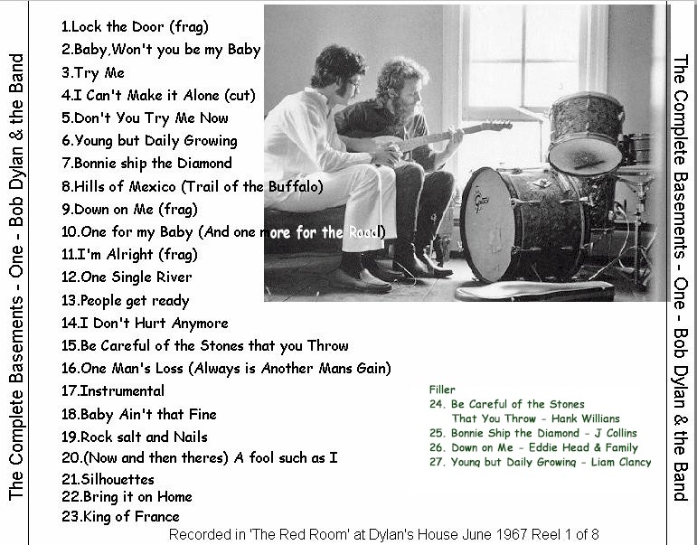
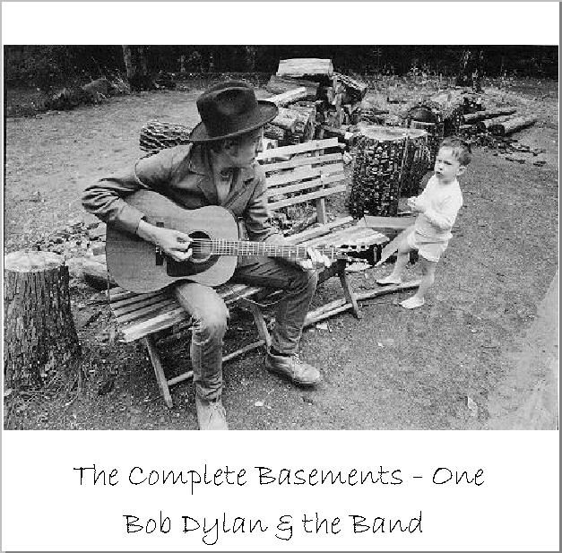
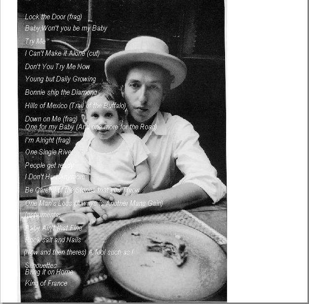
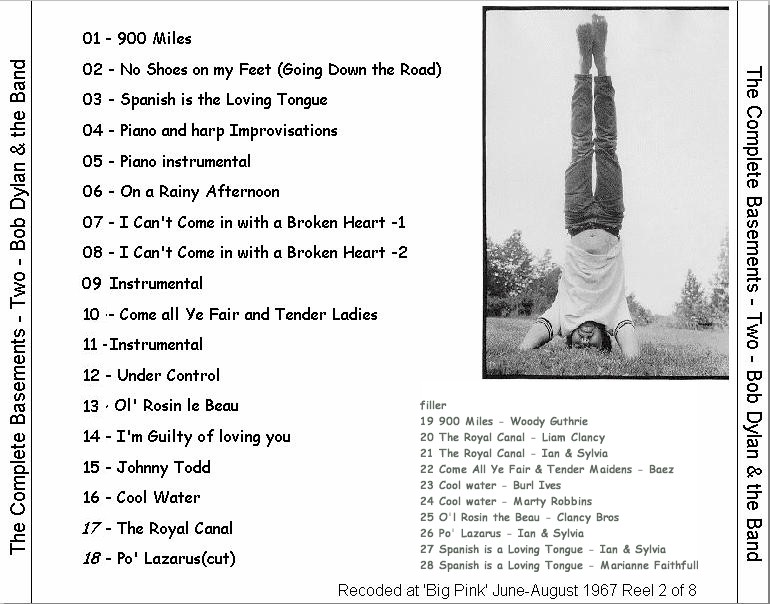
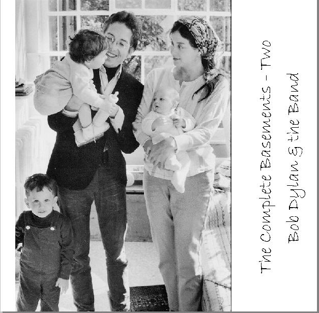

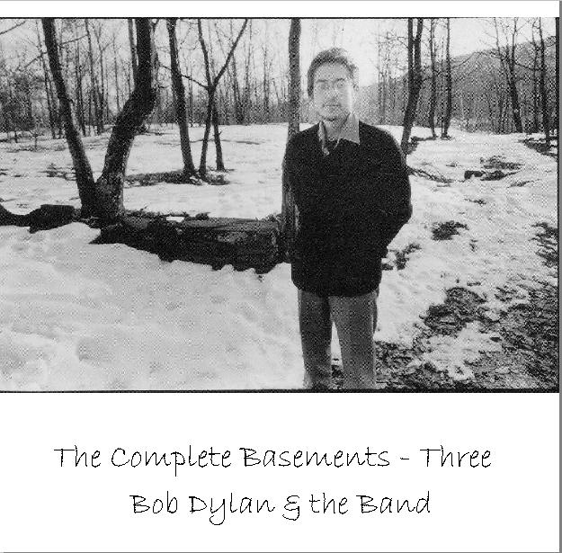
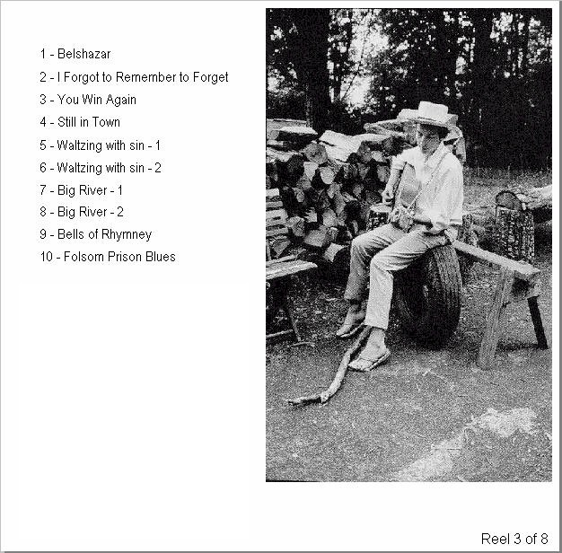
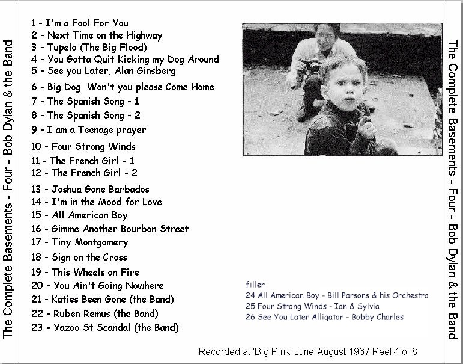
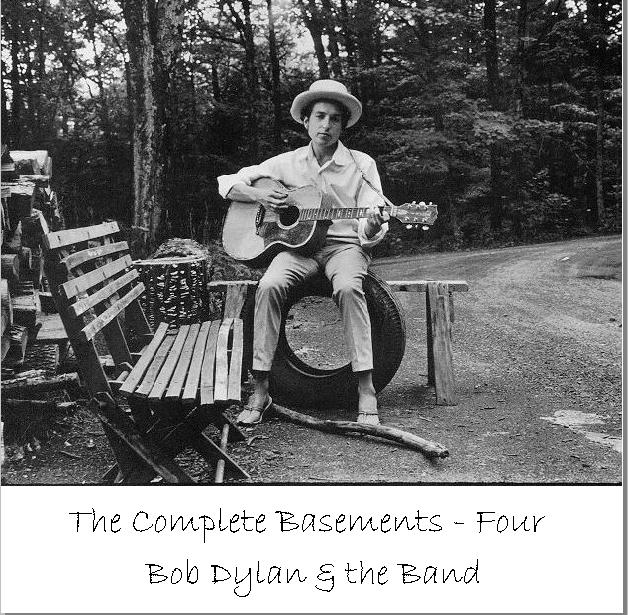

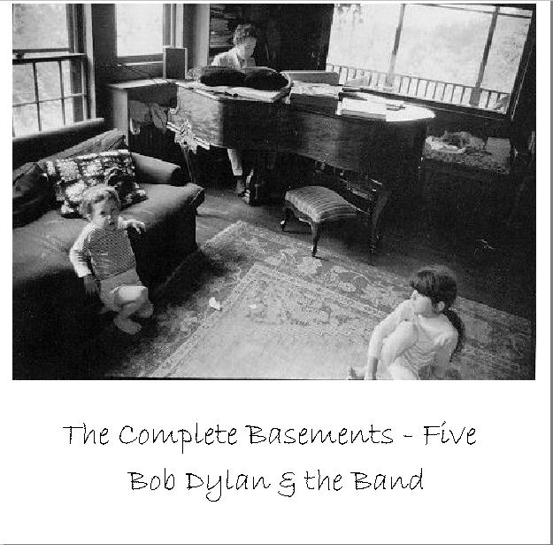
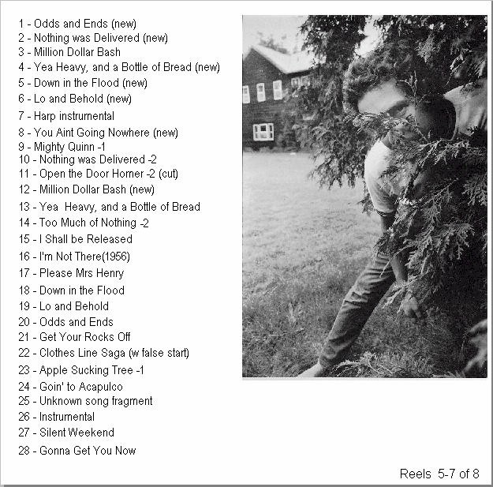
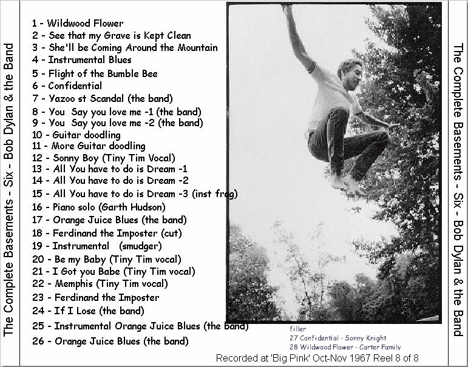
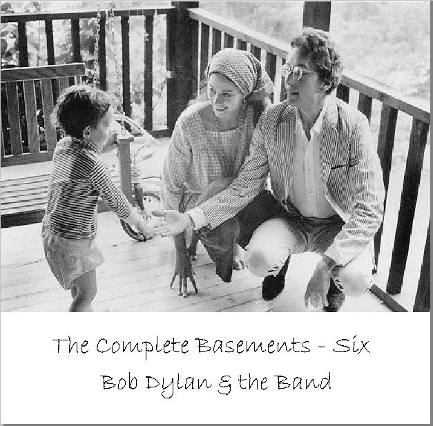
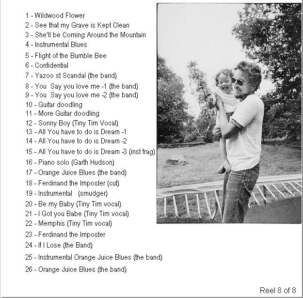

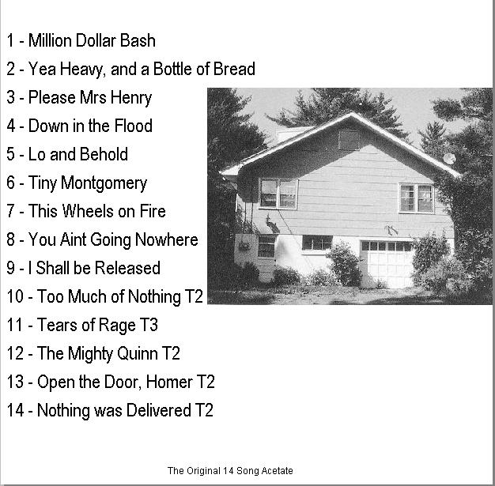
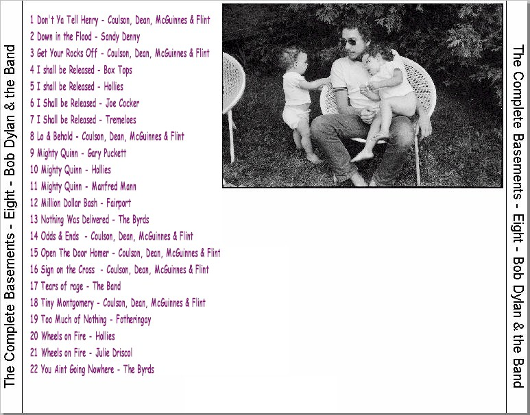
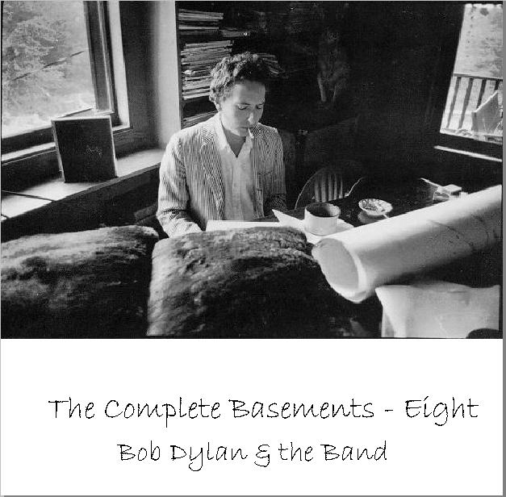
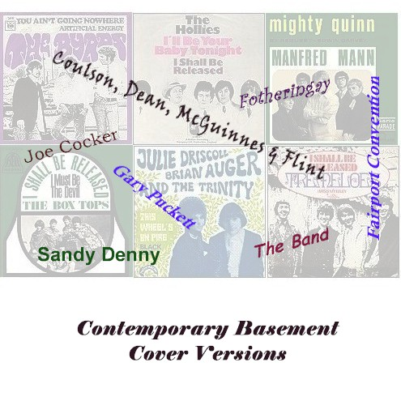
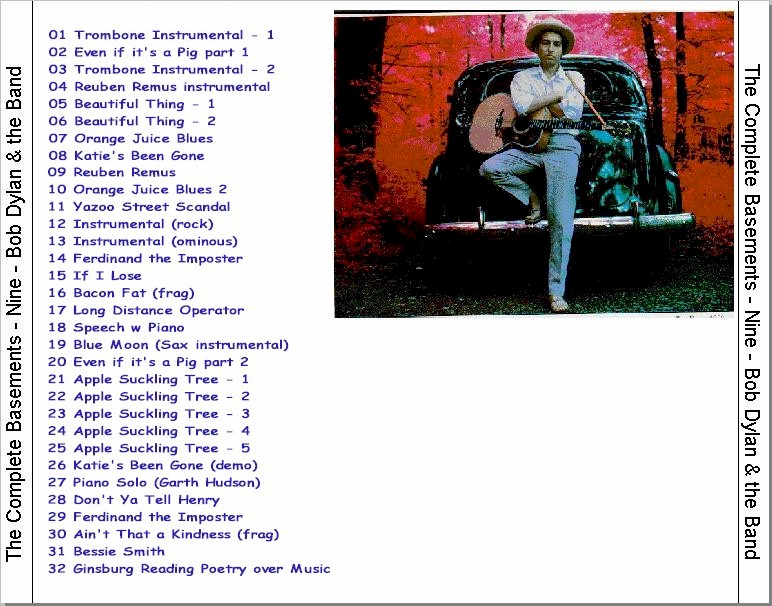
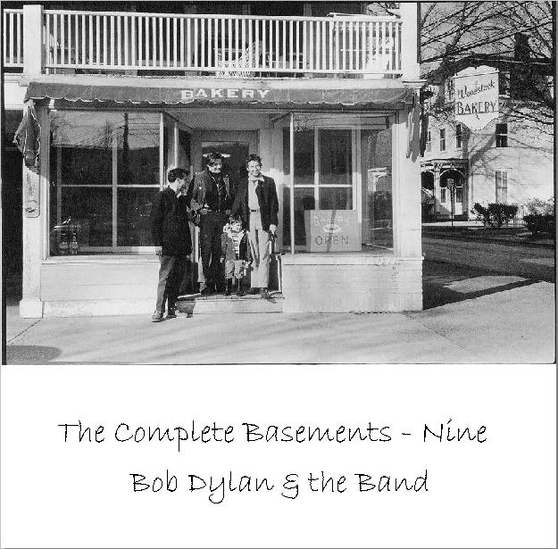

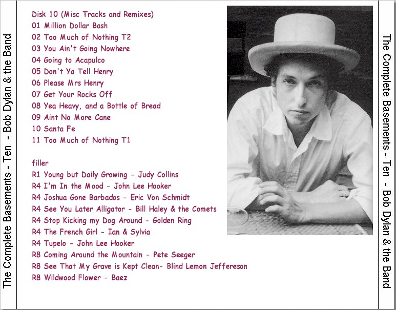

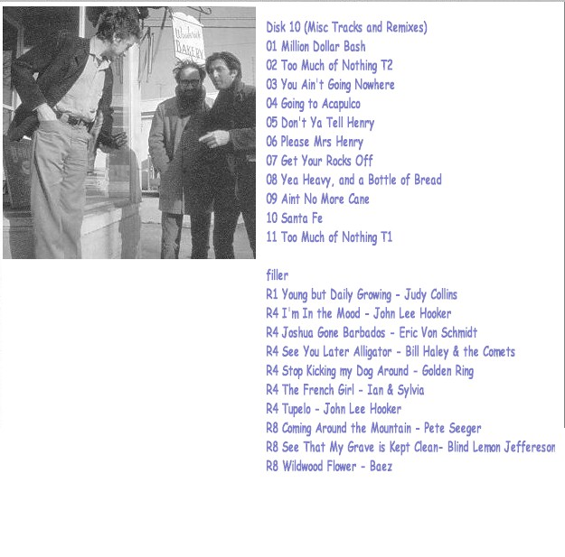
