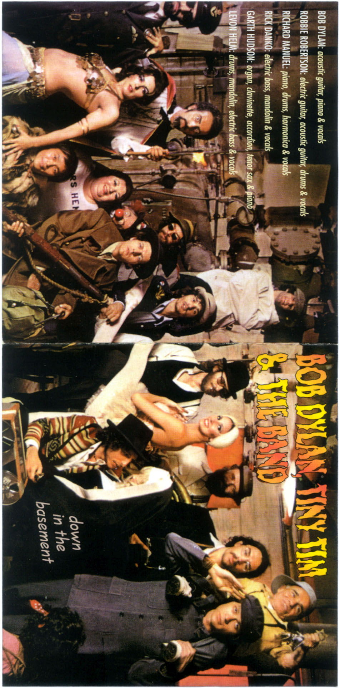
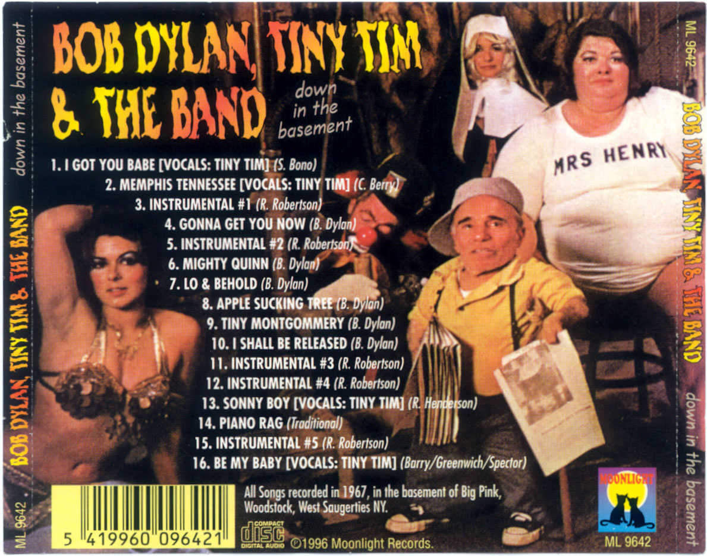

# `DITB` | _Down In The Basement_

{ #ditb }

[LosslessBob LB-06691](http://www.losslessbob.wonderingwhattochoose.com/detail/LB-06691.html)

## Description ([source](https://theband.hiof.no/albums/boot_down_in_the_basement.html))

The songs on this bootleg are mostly taken from Garth Hudson's legendary Basement Tapes, recorded in the Big Pink, Woodstock, West Saugerties, New York, April-October 1967. Also included are the four songs "I Got You Babe," "Memphis, TN," "Sonny Boy" and "Be My Baby", recorded with falsetto singer Tiny Tin backed by the Band/Hawks for the soundtrack of Peter Yarrow's movie You Are What You Eat. The album has 10 "proper" tunes and 6 instrumental "interludes". All of the instrumentals list Robbie Robertson as composer (except "Piano Rag" which is listed as traditional). The Tiny Tim recordings were generally available on the mid-80's bootleg Blind Boy Grunt and the Hawks Basement Tapes, a 4 LP set which was the first of the really great basement bootlegs.

## Tracklist (from original info file)

1. I Got You Babe (Tiny Tim)
2. Memphis, Tennessee (Tiny Tim)
3. Instrumental #1
4. Gonna Get You Now
5. Instrumental #2
6. Mighty Quinn
7. Lo & Behold
8. Apple Suckling Tree
9. Tiny Montgomery
10. I Shall Be Released
11. Instrumental #3
12. Instrumental #4
13. Sonny Boy (Tiny Tim)
14. Piano Rag
15. Instrumental #5
16. Be My Baby (Tiny Tim)

## Artwork

