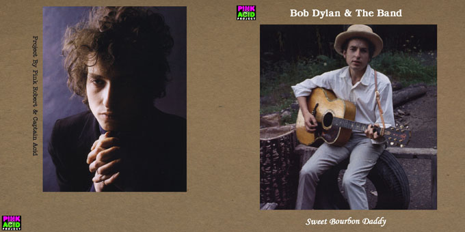
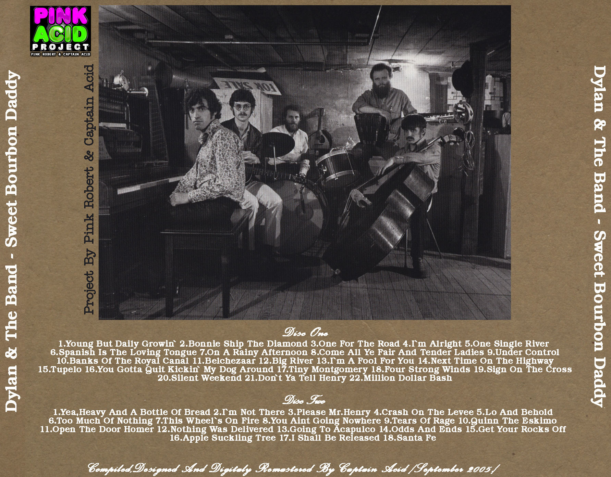

# `sbd` | Sweet Bourbon Daddy
{ #sbd }

## Description (from original info file)
Pink Acid project 
Remastered by Captain Acid

## Tracklist (from original info file)

CD 1: 1. Young But Daily Growin' 2. Bonnie Ship The Diamond 3. One For The Road 4. I'm Alright 5. One Single River 6. Spanish Is The Loving Tongue 7. On A Rainy Afternoon 8. Come All Ye Fair And Tender Ladies 9. Under Control 10. Banks Of The Royal Canal 11. Belchezaar 12. Big River 13. I'm A Fool For You 14. Next Time On The Highway 15. Tupelo 16. You Gotta Quit Kickin' My Dog Around 17. Tiny Montgomery 18. Four Strong Winds 19. Sign On The Cross 20. Silent Weekend 21. Don't Ya Tell Henry 22. Million Dollar Bash  CD 2: 1. Yea, Heavy And A Bottle Of Bread 2. I'm Not There 3. Please Mr. Henry 4. Crash On The Levee 5. Lo And Behold 6. Too Much Of Nothing 7. This Wheel's On Fire 8. You Ain't Going Nowhere 9. Tears Of Rage 10. Queen The Eskimo 11. Open The Door Homer 12. Nothing Was Delivered 13. Going To Acapulco 14. Odds And Ends 15. Get Your Rocks Off 16. Apple Suckling Tree 17. I Shall Be Released 18. Santa Fe

## Artwork

