# `tcb` | The Complete Basements

## Description (from original info file)
Well, here is it, my third attempt to cover the Basement Recordings. This attempt is more of an 'Anthology' than simply the 'Dylan Basement recordings'.
I've used filler from 'influences' or 'originals' of most of the songs covered in the first 4 reels. I could be wrong, but it seems reasonable to suppose that Dylan and the Band were listening to recordings of Ian & Sylvia, Hank Williams & Johnny Cash and others, so these songs have been added. For me these songs add depth to the early sessions.
I was unable to locate any versions of: Baby Ain't that Fine (Frazier), No Shoes on my Feet (trad) - Cisco Huston (as Going Down the Road), Johnny Todd (trad), One Man's Loss, One Single River(Tyson / Fricker), Silhouettes (Slay / Crew), The Spanish Song (aka Amelita, Luisa, Carmelita) & Waltzing with Sin (Hayes / Burns).
I want to thank Randy for helping me locate many of the originals I used.
For the Reels 5-7 disk I have swapped the channels on about half of the recordings to be consistent with the details in Helyin's book - The Recording Sessions.
For Disk 7, I've retained the original 14 track acetate as the main tape, and simply filled up that disk with the additional alternate takes and the additional Publishers Demos (Big Ben). These recordings are noticaly differently mixed to the Reel versions.
I've also added a full CD of contemporary cover versions (Disk 8). I felt that as this was how we first came to hear these songs, they deserved to have a CD in their own right.
There were others I remembered (such as PPM - Too Much of Nothing), that I didn't have room to add. There are various detailed accounts of how these 60s-70s groups and artists came to hear and learn these songs, that are worth checking out.
Using my source tape I have remastered the recordings used for Disk 9 again, to remove the effects of 'noise reduction' apparent on my original attempt.

## Tracklist (from original info file)

 Disk 1 (Reel 1)
 01 Lock The Door (frag)
 02 Baby, Won't you be my Baby
 03 Try Me
 04 I Can't make it Alone (cut)
 05 Don't You Try me Now
 06 Young but Daily Growing
 07 Bonnie Ship the Diamond
 08 Hills of Mexico (Trail of the Buffalo)
 09 Down on me (frag)
 10 One for My baby (and one more for the road)
 11 I'm alright (frag)
 12 One Single River
 13 People Get Ready
 14 I Don't Hurt Anymore
 15 Be Careful of Stones that you Throw
 16 One man's Loss (Always Another Man's Gain)
 17 Instrumental
 18 Baby Ain't That Fine
 19 Rock Salt and Nails
 20 (Now and Then Theres) A Fool Such as I
 21 Silhouettes
 22 Bring it on Home
 23 King of France

 filler
 24 Be Careful of Stones that you Throw - Hank Williams
 25 Bonnie Ship the Diamond - Judy Collins
 26 Down on Me - Eddie Head & Family
 27 Young but Daily Growing - Liam Clancy

 Disk 2 (Reel 2)
 01 900 Miles
 02 No Shoes on my feet (Going Down the Road)
 03 Spanish is the loving tongue
 04 Piano & Harp Improvisations
 05 Piano Instrumental
 06 On a Rainy Afternoon
 07 I Can't Come in with a Broken Heart 1
 08 I Can't Come in with a Broken Heart 2
 09 instrumental
 10 Come All Ye Fair & Tender Maidens
 11 instrumental
 12 Under Control
 13 O'l Rosin le Beau
 14 I'm Guilty of loving You
 15 Johnny Todd
 16 Cool Water
 17 The Royal Canal
 18 Po' Lazarus (cut)

 filler
 19 900 Miles - Woody Guthrie
 20 The Royal Canal - Liam Clancy
 21 The Royal Canal - Ian & Sylvia
 22 Come All Ye Fair & Tender Maidens - Baez
 23 Cool water - Burl Ives
 24 Cool water - Marty Robbins
 25 O'l Rosin the Beau - Clancy Bros
 26 Po' Lazarus - Ian & Sylvia
 27 Spanish is a Loving Tongue - Ian & Sylvia
 28 Spanish is a Loving Tongue - Marianne Faithfull

 Disk 3 (Reel 3)
 01 Belshazar
 02 I Forgot to Remember to Forget
 03 You Win Again
 04 Still in Town
 05 Waltzing with Sin 1
 06 Waltzing with Sin 2
 07 Big River 1
 08 Big River 2
 09 Bells of Rhymney
 10 Folsom Prison Blues

 filler
 11 Belshazar - Johnny Cash
 12 I Forgot to Remember to Forget - Elvis Presley
 13 I Forgot to Remember to Forget - Johnny Cash
 14 You Win Again - Hank Williams
 15 You Win again - Johnny Cash
 16 Still in Town - Johnny Cash
 17 Big River - Johnny Cash
 18 Bells of Rhymney - Pete Seeger
 18 Folsome Prison Blues - Johnny cash
 19 R1 (Now and Then Theres) A Fool Such as I - Hank Snow
 20 R1 Bring it on to Jerome - Bo Diddley (loosely related)
 21 R1 Hills of Mexico (Trail of the Buffalo) - Sid Selvidge
 22 R1 I Don't Hurt Anymore - Hank Snow
 23 R1 One For My Baby - Frank Sinatra (loosely related)
 24 R1 One Single River - Ian & Sylvia
 25 R1 People Get Ready - Curtis Mayfield
 26 R1 Rock Salt & Nails - Joan Baez

 Disk 4 (Reel 4)
 01 I'm a Fool for You
 02 Next Time on the Highway
 03 Tupelo (The Big Flood)
 04 You Gotta Quit Kicking my Dog Around
 05 See You Later, Alan Ginsberg
 06 Big Dog Won't you Please Come Home
 07 The Spanish Song 1
 08 The Spanish Song 2
 09 I am a Teenage Prayer
 10 Four Strong Winds
 11 The French Girl 1
 12 The French Girl 2
 13 Joshua Gone Barbados
 14 I'm in the Mood for Love
 15 All American boy
 16 Gimme Another Burbon Street
 17 Tiny Montgomery
 18 Sign on the Cross
 19 This Wheels on Fire
 20 You Ain't Going Nowhere
 21 Katies been Gone (The Band)
 22 Ruben Remus (The Band)
 23 Yazoo St Scandal (The Band)

 filler
 24 All American Boy - Bill Parsons & his Orchestra
 25 Four Strong Winds - Ian & Sylvia
 26 See You Later Alligator - Bobby Charles

 Disk 5 (Reels 5-7)
 01 Odds & Ends (new)
 02 Nothing was Delivered (new)
 03 Million Dollar Bash
 04 Yea Heavy, and a Bottle of Bread (new)
 05 Down in the Flood (new)
 06 Lo & Behold (new)
 07 Harp instrumental
 08 You Ain't Going Nowhere (new)
 09 Mighty Quinn - 1
 10 Nothing was Delivered - 2
 11 Open the Door Homer - 2 (cut)
 12 Million Dollar Bash (new)
 13 Yea Heavy, and a Bottle of Bread
 14 Too Much of Nothing - 2
 15 I Shall be Released (cut)
 16 I'm Not There (1956)
 17 Please Mrs Henry
 18 Down in the Flood
 19 Lo & Behold
 20 Odds & Ends
 21 Get Your Rocks Off
 22 Clothes Line Saga (w false start)
 23 Apple Suckling Tree - 1
 24 Goin' to Acalpulco
 25 Unknown song fragment
 26 Instrumental
 27 Silent Weekend
 28 Gonna Get You Now

 filler
 29 Silent Weekend - Tiny Band

 Disk 6 (Reel 8)
 01 Wildwood Flower
 02 See That My Grave is Kept Clean
 03 Coming Around the Mountain
 04 Instrumental Blues
 05 Flight of The Bumble Bee
 06 Confidential
 07 Yazoo St Scandal (the Band)
 08 You Say You Love Me  - 1 (the Band)
 09 You Say You Love Me  - 2 (the Band)
 10 Guitar Doodling
 11 More Guitar Doodling
 12 Sonny Boy (Tiny Tim Vocal)
 13 All You Have to Do is Dream - 1
 14 All You Have to Do is Dream - 2
 15 All You Have to Do is Dream - 3 (inst frag)
 16 Piano Solo (Garth Hudson)
 17 Orange Juice Blues (the Band)
 18 Ferdinand the Imposter (cut)
 19 Instrumental (Smudger)
 20 Be my Baby (Tiny Tim Vocal)
 21 I Got You Babe (Tiny Tim Vocal)
 22 Memphis (Tiny Tim Vocal)
 23 Ferdinand the Imposter (the Band)
 24 If I Lose (the Band)
 25 Orange Juice Blues (inst) (the Band)
 26 Orange Juice Blues (the Band)

 filler
 27 Confidential - Sonny Knight
 28 Wildwood Flower - Carter Family

 Disk 7 (The 14 Song Acetate, additional Takes & Publishers Demos)
 01 Million Dollar Bash
 02 Yea Heavy, and a Bottle of Bread
 03 Please Mrs Henry
 04 Down in the Flood
 05 Lo & Behold
 06 Tiny Montgomery
 07 This Wheels on Fire
 08 You Ain't Going Nowhere
 09 I Shall be Released
 10 Too Much of Nothing T2
 11 Tears of Rage  T3
 12 The Mighty Quinn T2
 13 Open the Door, Homer T2
 14 Nothing was Delivered T2

 Alternate takes
 15 Open the Door, Homer T3
 16 Open the Door, Homer T1
 17 Nothing was Delivered T1
 18 Tears of Rage T1
 19 Tears of Rage T2
 20 The Mighty Quinn T1

 Publishers demos
 21D Nothing was Delivered T1
 22D Apple Suckling Tree T1
 23D Clothes Line Saga
 24D I'm Not There (1956)
 25D Odds & Ends
 26D Get Your Rocks Off

 Disk 8 (Contemporary Covers)
 01 Don't Ya Tell Henry - Coulson, Dean, McGuinnes & Flint
 02 Down in the Flood - Sandy Denny
 03 Get Your Rocks Off - Coulson, Dean, McGuinnes & Flint
 04 I shall be Released - Box Tops
 05 I shall be Released - Hollies
 06 I Shall be Released - Joe Cocker
 07 I Shall be Released - Tremeloes
 08 Lo & Behold - Coulson, Dean, McGuinnes & Flint
 09 Mighty Quinn - Gary Puckett
 10 Mighty Quinn - Hollies
 11 Mighty Quinn - Manfred Mann
 12 Million Dollar Bash - Fairport
 13 Nothing Was Delivered - The Byrds
 14 Odds & Ends  - Coulson, Dean, McGuinnes & Flint
 15 Open The Door Homer - Coulson, Dean, McGuinnes & Flint
 16 Sign on the Cross  - Coulson, Dean, McGuinnes & Flint
 17 Tears of rage - The Band
 18 Tiny Montgomery - Coulson, Dean, McGuinnes & Flint
 19 Too Much of Nothing - Fotheringay
 20 Wheels on Fire - Hollies
 Wheels on Fire - Julie Driscol
 You Aint Going Nowhere - The Byrds

 Disk 9 (The Final Band Seessions)
 01 Trombone Instrumental - 1
 02 Even if it's a Pig part 1
 03 Trombone Instrumental - 2
 04 Reuben Remus instrumental
 05 Beautiful Thing - 1
 06 Beautiful Thing - 2
 07 Orange Juice Blues
 08 Katie's Been Gone
 09 Reuben Remus
 10 Orange Juice Blues 2
 11 Yazoo Street Scandal
 12 Instrumental (rock)
 13 Instrumental (ominous)
 14 Ferdinand the Imposter
 15 If I Lose
 16 Bacon Fat (frag)
 17 Long Distance Operator
 18 Speech w Piano
 19 Blue Moon (Sax instrumental)
 20 Even if it's a Pig part 2
 21 Apple Suckling Tree - 1
 22 Apple Suckling Tree - 2
 23 Apple Suckling Tree - 3
 24 Apple Suckling Tree - 4
 25 Apple Suckling Tree - 5
 26 Katie's Been Gone (demo)
 27 Piano Solo (Garth Hudson)
 28 Don't Ya Tell Henry
 29 Ferdinand the Imposter
 30 Ain't That a Kindness (frag)
 31 Bessie Smith
 32 Ginsburg Reading Poetry over Music

 Disk 10 (Misc Tracks and Remixes)
 01 Million Dollar Bash
 02 Too Much of Nothing T2
 03 You Ain't Going Nowhere
 04 Going to Acapulco
 05 Don't Ya Tell Henry
 06 Please Mrs Henry
 07 Get Your Rocks Off
 08 Yea Heavy, and a Bottle of Bread
 09 Aint No More Cane
 10 Santa Fe
 11 Too Much of Nothing T1

 filler
 R1 Young but Daily Growing - Judy Collins
 R4 I'm In the Mood - John Lee Hooker
 R4 Joshua Gone Barbados - Eric Von Schmidt
 R4 See You Later Alligator - Bill Haley & the Comets
 R4 Stop Kicking my Dog Around - Golden Ring
 R4 The French Girl - Ian & Sylvia
 R4 Tupelo - John Lee Hooker
 R8 Coming Around the Mountain - Pete Seeger
 R8 See That My Grave is Kept Clean- Blind Lemon Jeffereson
 R8 Wildwood Flower - Baez

## Artwork

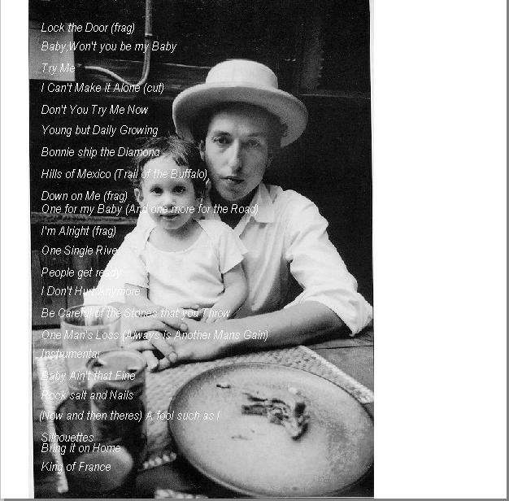

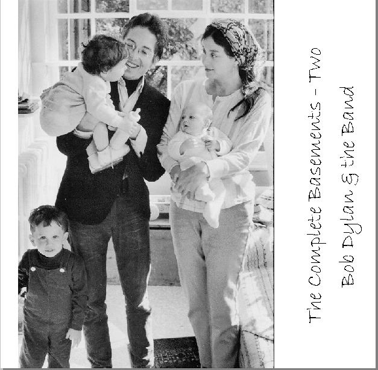
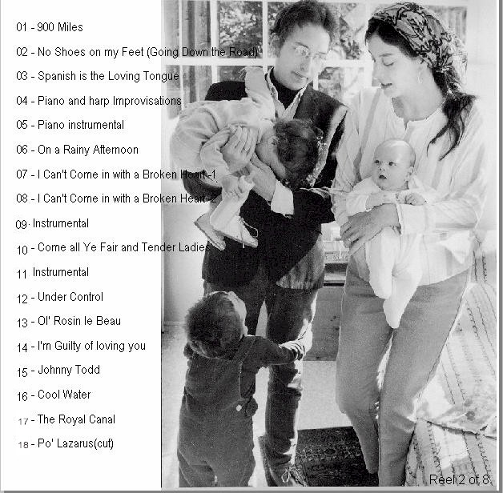
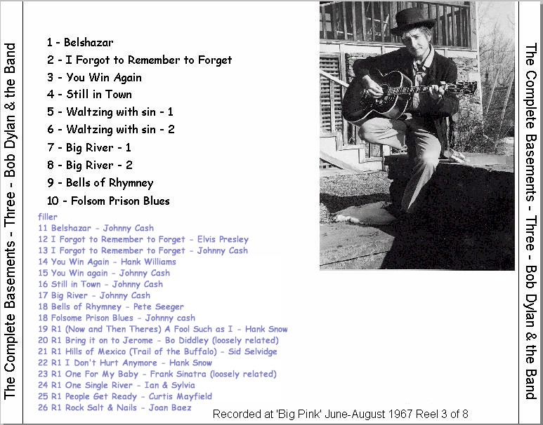
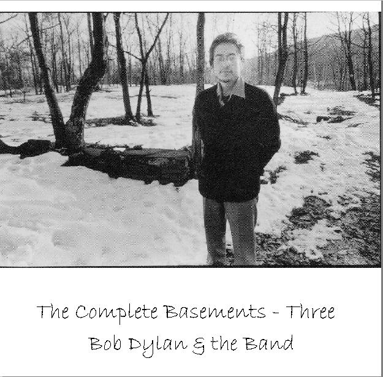
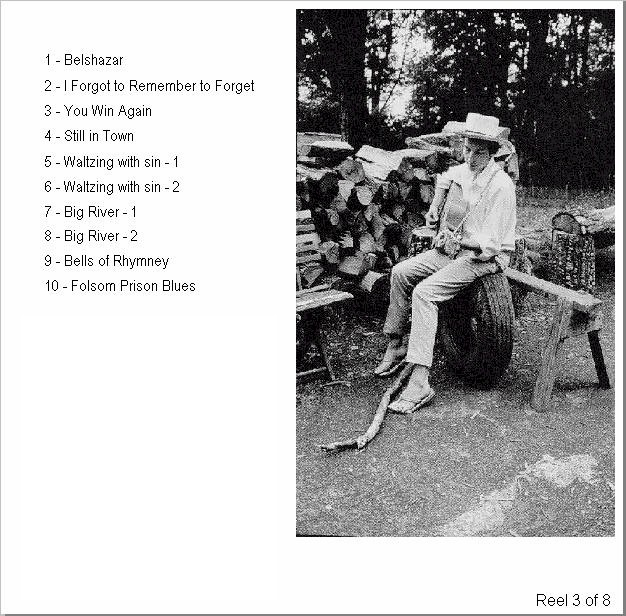

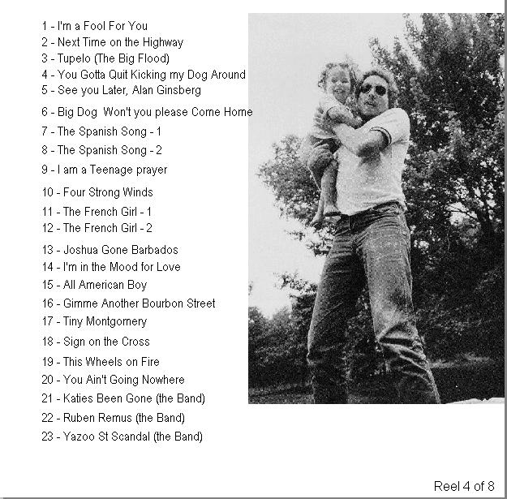
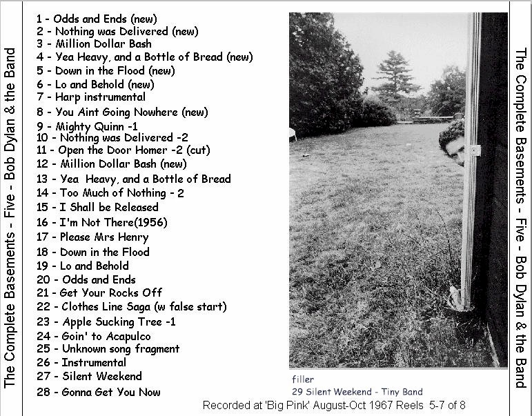
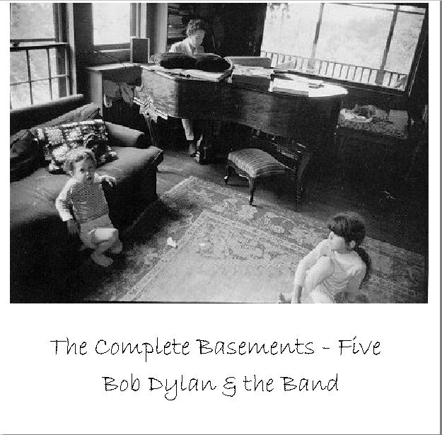
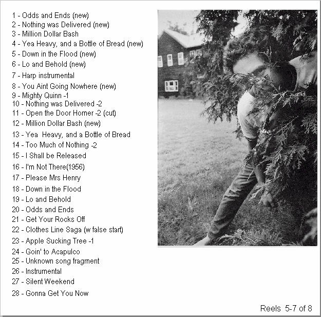

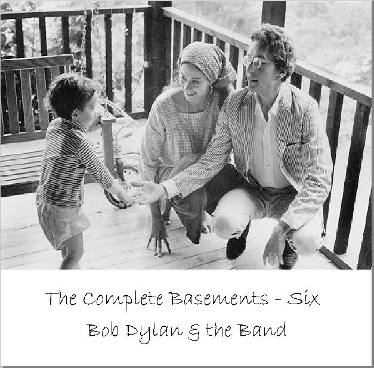

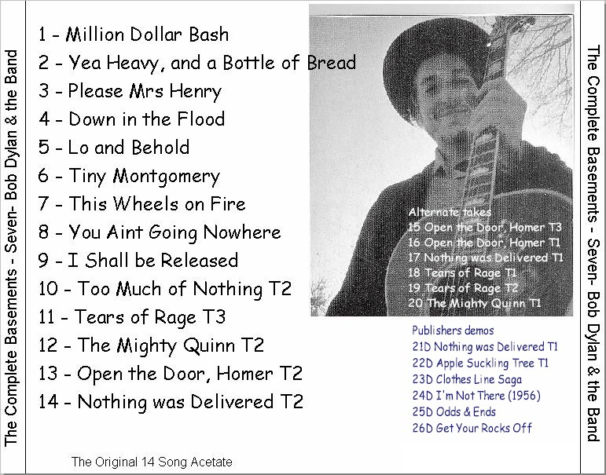
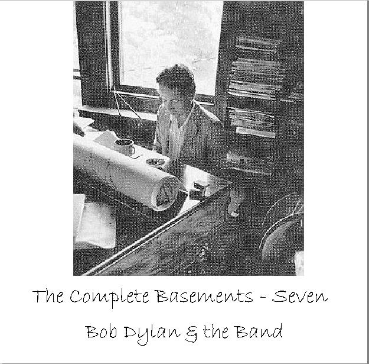
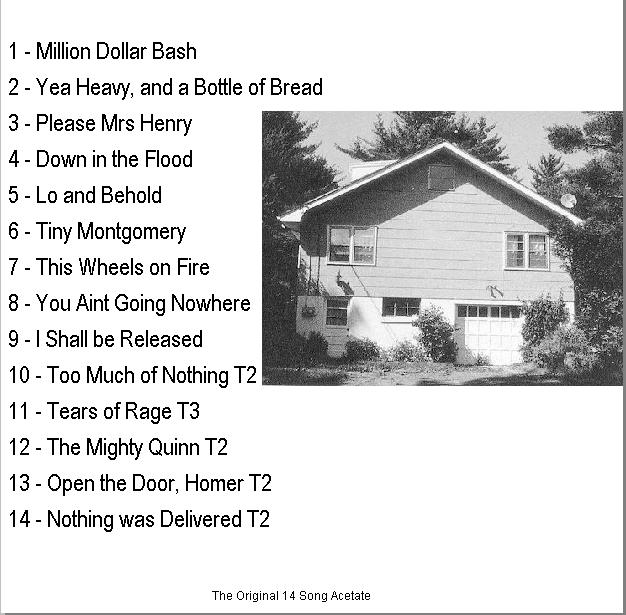
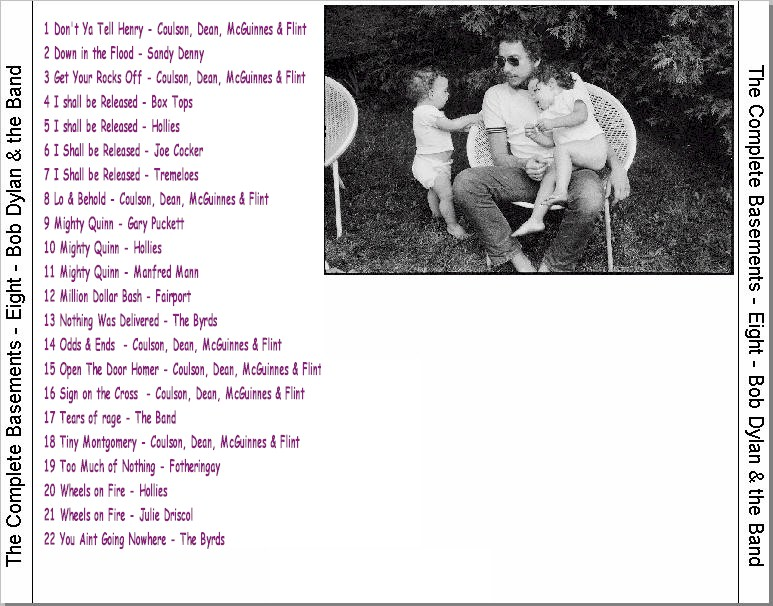
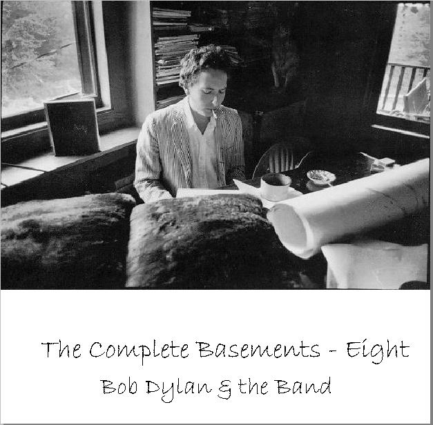

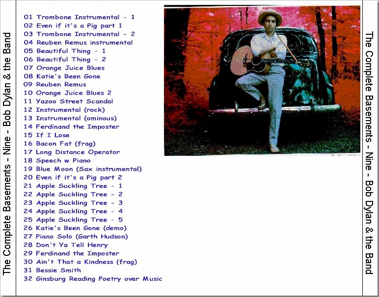
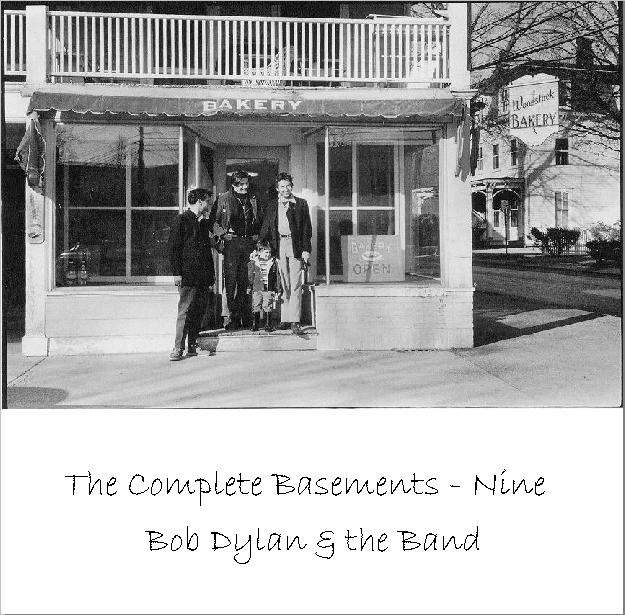
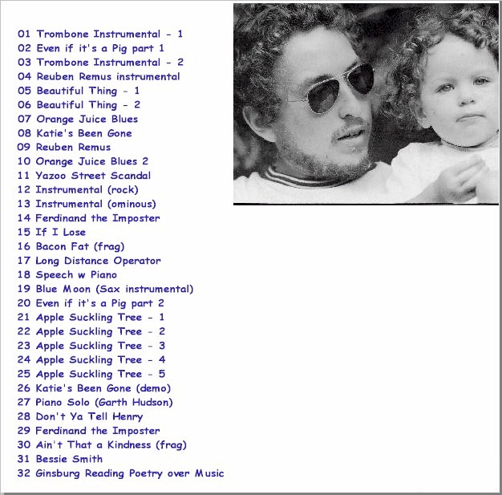

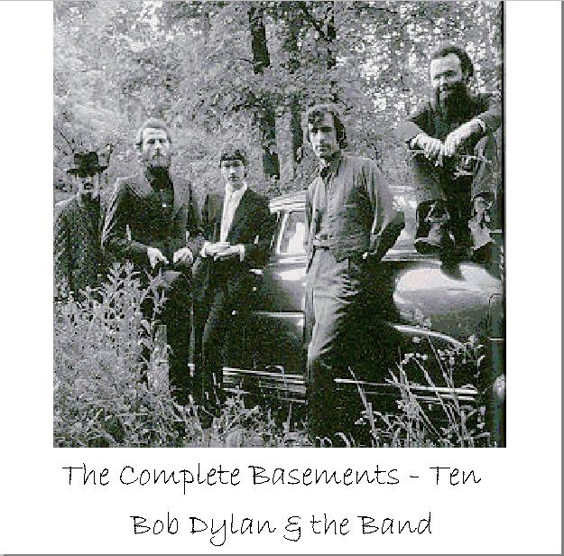
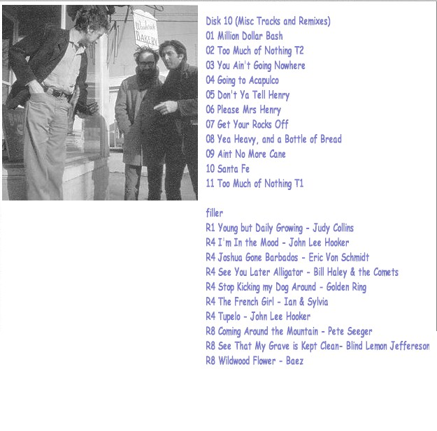
