# A Satisfied Mind

**(title taken from BS11)**

[](){ #asm }

## Details

| label   | orig_file                                        | md5                              |   disc |   track |   duration_sec | duration_fmt   |   loudness |   loudness_left |   loudness_right |   loudness_balance |      rms |   rms_left |   rms_right |   rms_balance |   lr_corr |   spectral_centroid |
|:--------|:-------------------------------------------------|:---------------------------------|-------:|--------:|---------------:|:---------------|-----------:|----------------:|-----------------:|-------------------:|---------:|-----------:|------------:|--------------:|----------:|--------------------:|
| BS11    | 03 - Bob Dylan & The Band - A Satisfied Mind.wav | 64bbce18657cd78f882922c8885d9d01 |      5 |       3 |        120.773 | 02:00:773      |   -18.3604 |        -18.3719 |         -17.9202 |          -0.451713 | 0.119003 |   0.123676 |    0.119125 |    0.00455087 |  0.902292 |             2033.03 |
| CAR     | 05-03-Bob_Dylan-A_Satisfied_Mind-SMR.flac        | 93c32cd74b6f7f610ae777f096f51878 |      5 |       3 |        120.774 | 02:00:774      |   -18.3571 |        -18.3721 |         -17.917  |          -0.455026 | 0.118997 |   0.12367  |    0.11912  |    0.00455026 |  0.902292 |             1879.44 |

## Plots
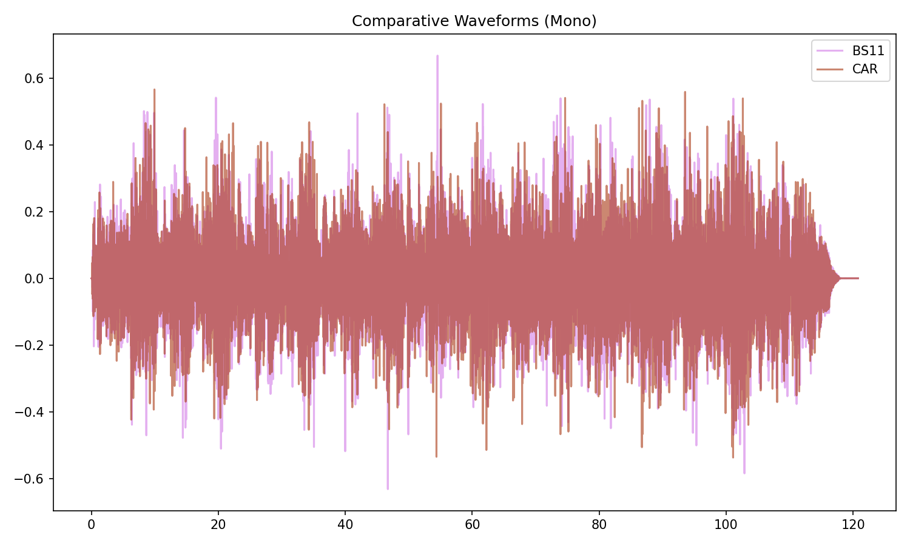

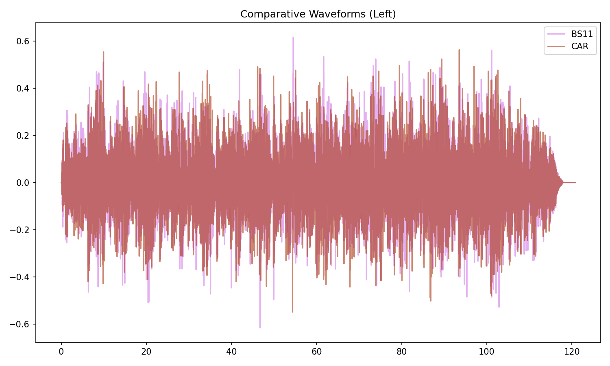

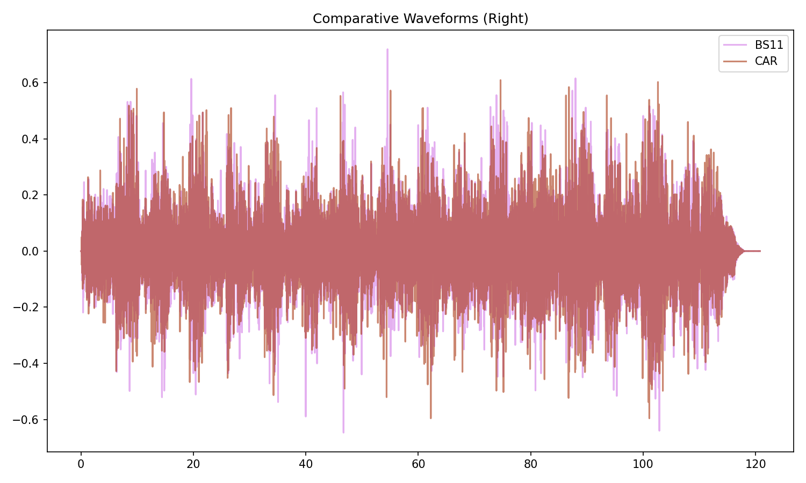

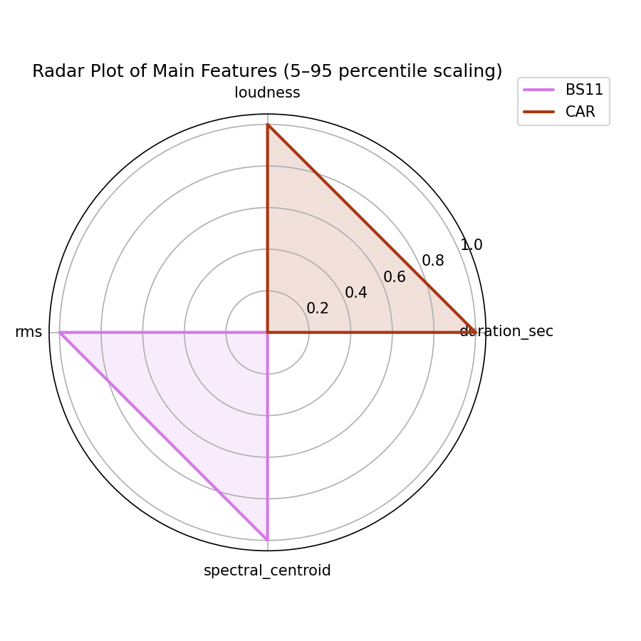

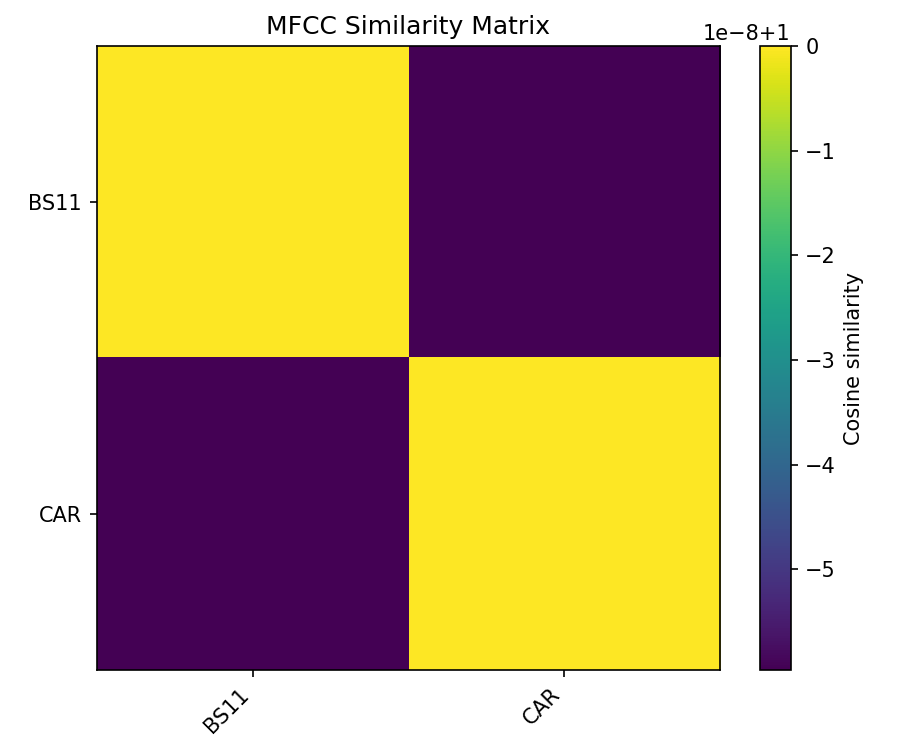

## Pitch & Speed Analysis (cents)

Reference version: **BS11**

| song_label   | ref_label   | cmp_label   | cmp_file                                         |   tuning_cents_cmp |   tuning_cents_ref |   delta_tuning_cents |   semitone_shift_vs_ref |   chroma_similarity |   speed_factor_from_pitch |   duration_ratio_ref_over_cmp |
|:-------------|:------------|:------------|:-------------------------------------------------|-------------------:|-------------------:|---------------------:|------------------------:|--------------------:|--------------------------:|------------------------------:|
| asm          | BS11        | BS11        | 03 - Bob Dylan & The Band - A Satisfied Mind.wav |                -23 |                -23 |                    0 |                       0 |            1        |                         1 |                      1        |
| asm          | BS11        | CAR         | 05-03-Bob_Dylan-A_Satisfied_Mind-SMR.flac        |                -24 |                -23 |                   -1 |                       0 |            0.999999 |                         1 |                      0.999997 |

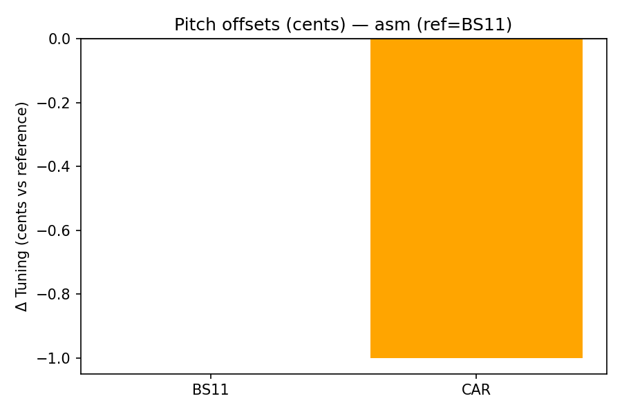

````text
Pitch/Speed analysis (reference = BS11)
============================================================

BS11 - 03 - Bob Dylan & The Band - A Satisfied Mind.wav: shift=0 st ; Δtuning=0.0 cents ; speed_from_pitch=1.0000 ; duration_ratio(ref/cmp)=1.0000
CAR - 05-03-Bob_Dylan-A_Satisfied_Mind-SMR.flac: shift=0 st ; Δtuning=-1.0 cents ; speed_from_pitch=1.0000 ; duration_ratio(ref/cmp)=1.0000

````

## Stereo Balance

### BS11

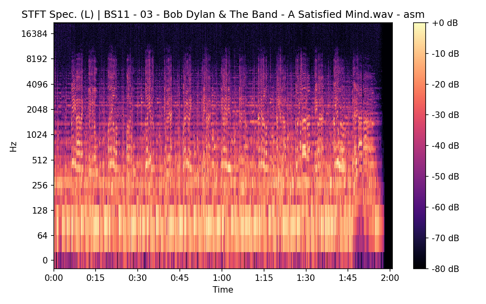


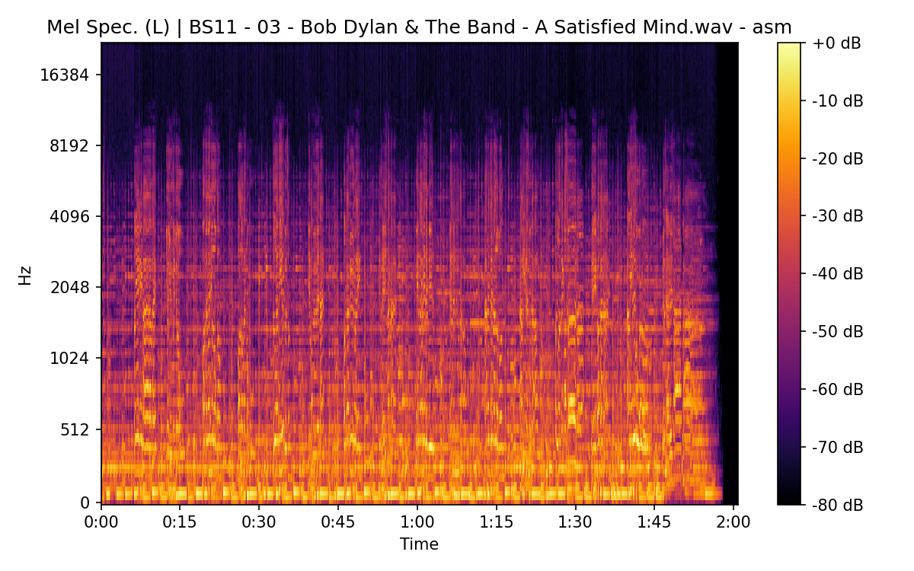

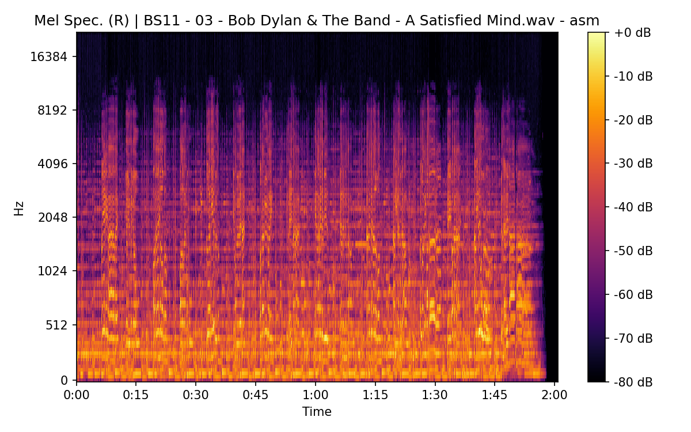

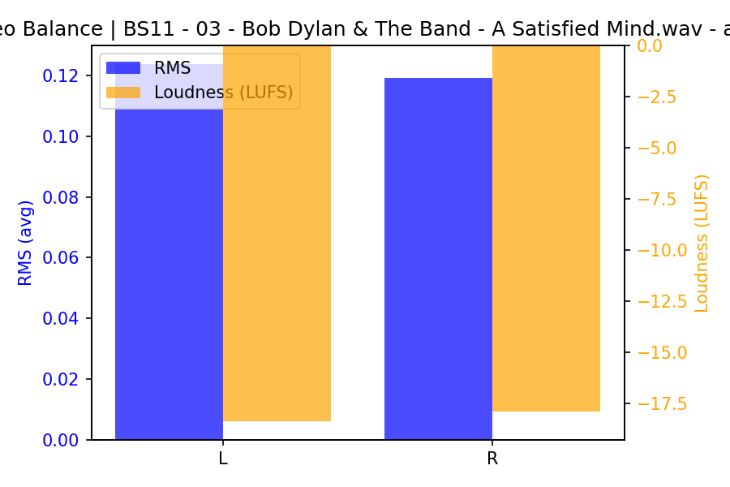

### CAR


## Spectrograms (Mono)

### BS11

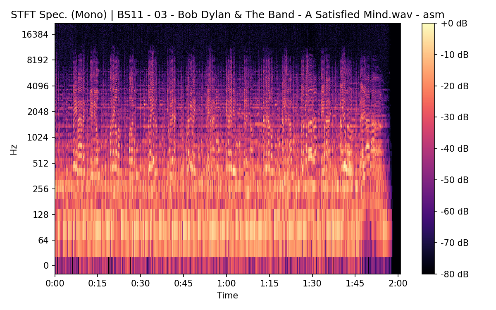


### CAR

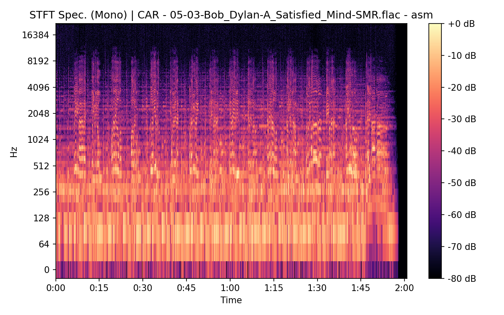

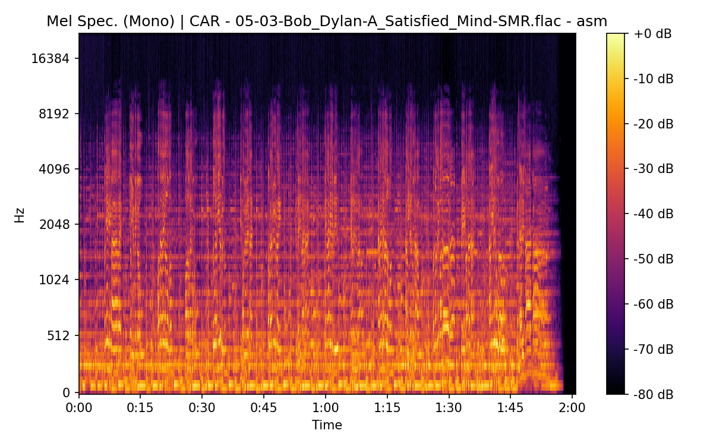

