# Apple Suckling Tree (Take 2, Fragment 1)

[](){ #ast_t2f1 }

## Notes

This is one of two fragments of ['ast_t2`][ast_t2]; neither fragment shows any difference from the complete take, beside the missing seconds.


## Details

| label | orig_file                       | md5                              | disc | track | duration_sec | duration_fmt | loudness | loudness_left | loudness_right | loudness_balance |       rms |  rms_left | rms_right | rms_balance |  lr_corr | spectral_centroid |
| :---- | :------------------------------ | :------------------------------- | ---: | ----: | -----------: | :----------- | -------: | ------------: | -------------: | ---------------: | --------: | --------: | --------: | ----------: | -------: | ----------------: |
| FTR   | 22. Apple Suckling Tree.flac    | 309a225b1ce7b4639106e6c6b0faed15 |   10 |    22 |        58.52 | 00:58:520    | -18.6077 |      -20.9084 |       -16.5769 |         -4.33154 | 0.0830633 | 0.0625261 |  0.104987 |  -0.0424609 |  0.96103 |           1270.11 |
| CB    | 22 Apple Suckling Tree - 2.flac | d53d1019b156aa84ed673999677fc469 |    9 |    24 |        64.44 | 01:04:440    | -19.7298 |      -22.0035 |       -17.8304 |         -4.17317 |  0.064166 | 0.0486818 | 0.0811475 |  -0.0324656 | 0.953778 |           1587.45 |

## Plots

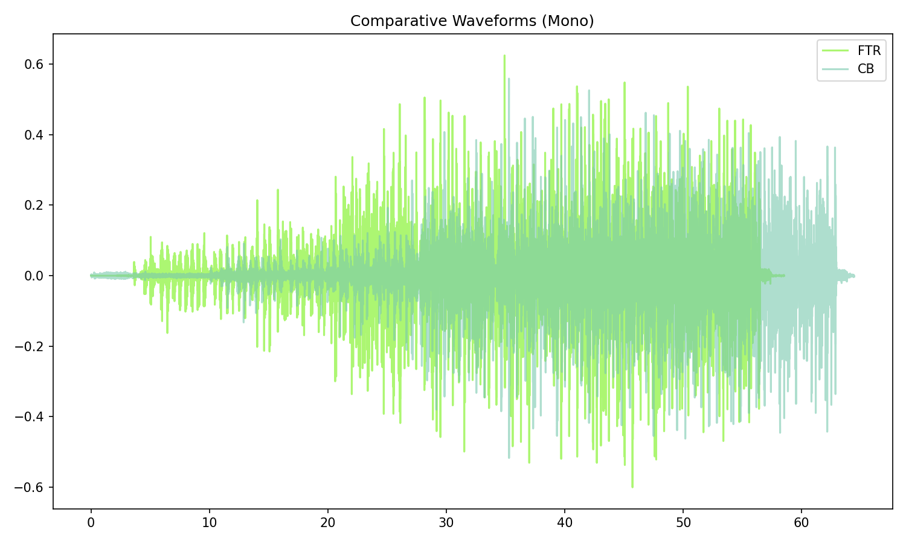

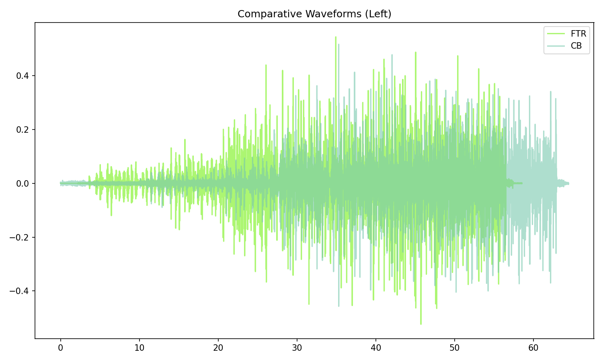

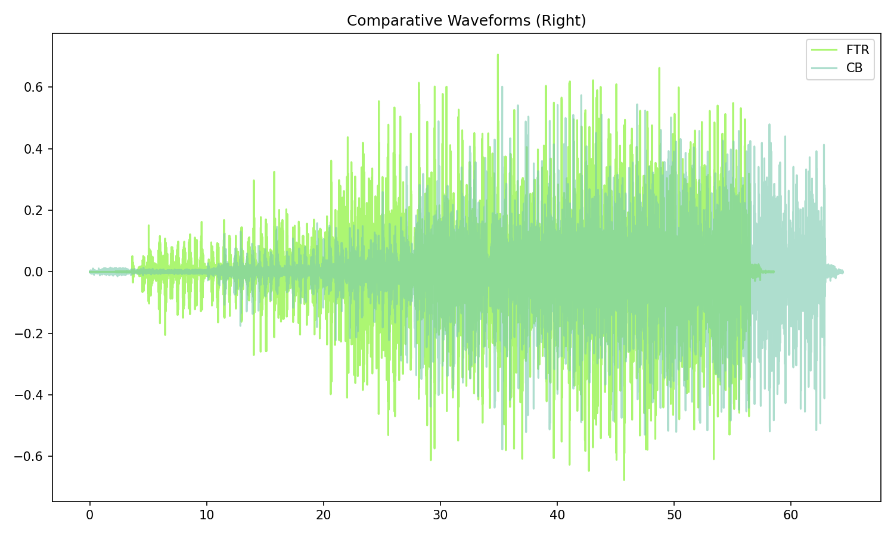


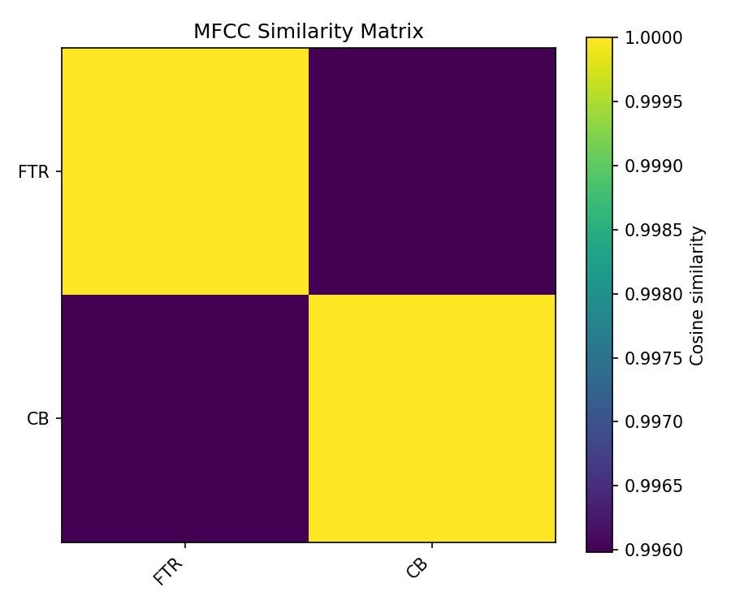

## Pitch & Speed Analysis (cents)

Reference version: **FTR**

| song_label | ref_label | cmp_label | cmp_file                        | tuning_cents_cmp | tuning_cents_ref | delta_tuning_cents | semitone_shift_vs_ref | chroma_similarity | speed_factor_from_pitch | duration_ratio_ref_over_cmp |
| :--------- | :-------- | :-------- | :------------------------------ | ---------------: | ---------------: | -----------------: | --------------------: | ----------------: | ----------------------: | --------------------------: |
| ast_t2f1   | FTR       | FTR       | 22. Apple Suckling Tree.flac    |                5 |                5 |                  0 |                     0 |                 1 |                       1 |                           1 |
| ast_t2f1   | FTR       | CB        | 22 Apple Suckling Tree - 2.flac |                2 |                5 |                 -3 |                     0 |          0.977147 |                       1 |                    0.908132 |

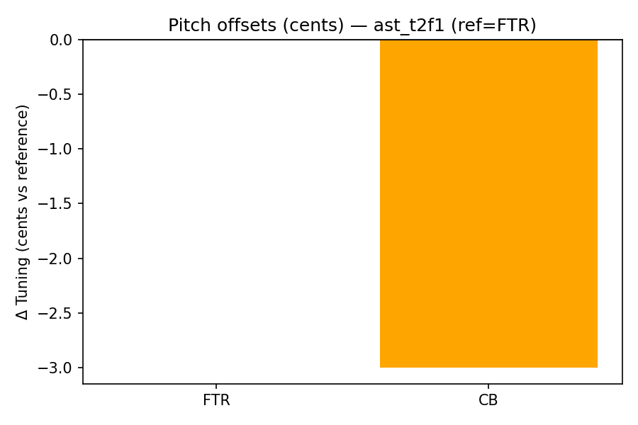

```text
Pitch/Speed analysis (reference = FTR)
============================================================

FTR - 22. Apple Suckling Tree.flac: shift=0 st ; Δtuning=0.0 cents ; speed_from_pitch=1.0000 ; duration_ratio(ref/cmp)=1.0000
CB - 22 Apple Suckling Tree - 2.flac: shift=0 st ; Δtuning=-3.0 cents ; speed_from_pitch=1.0000 ; duration_ratio(ref/cmp)=0.9081

```

## Stereo Balance

### FTR

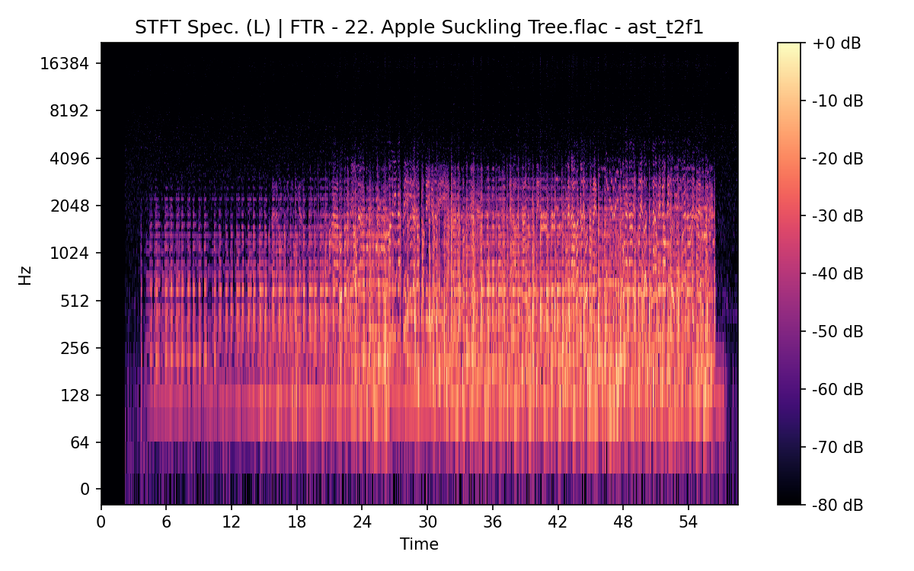

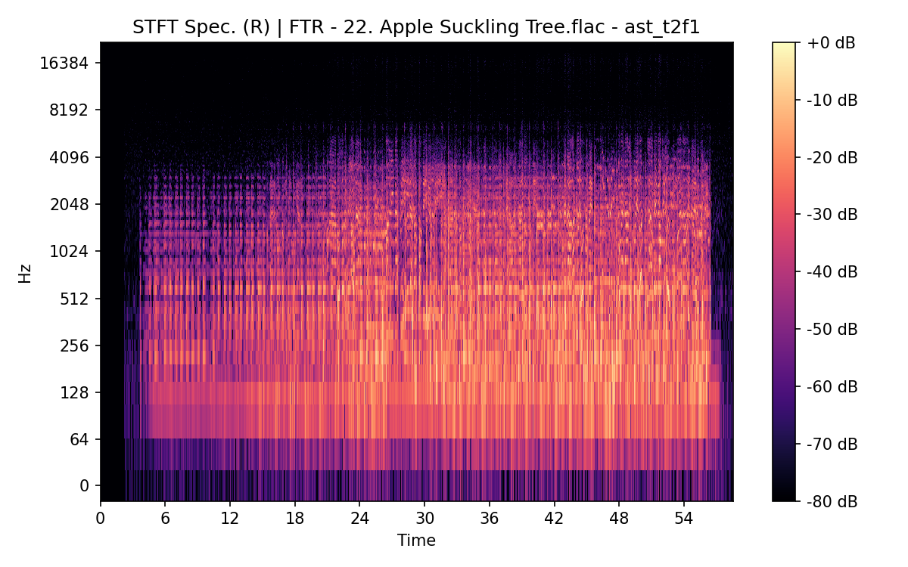

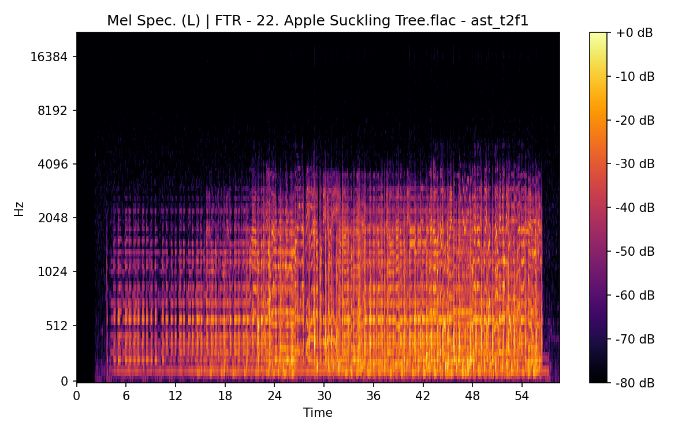

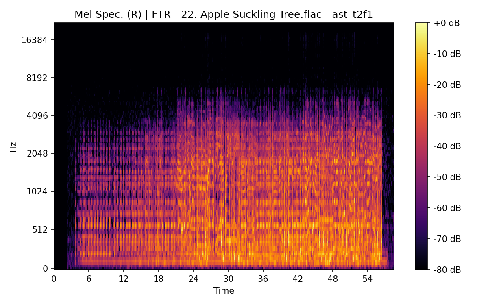

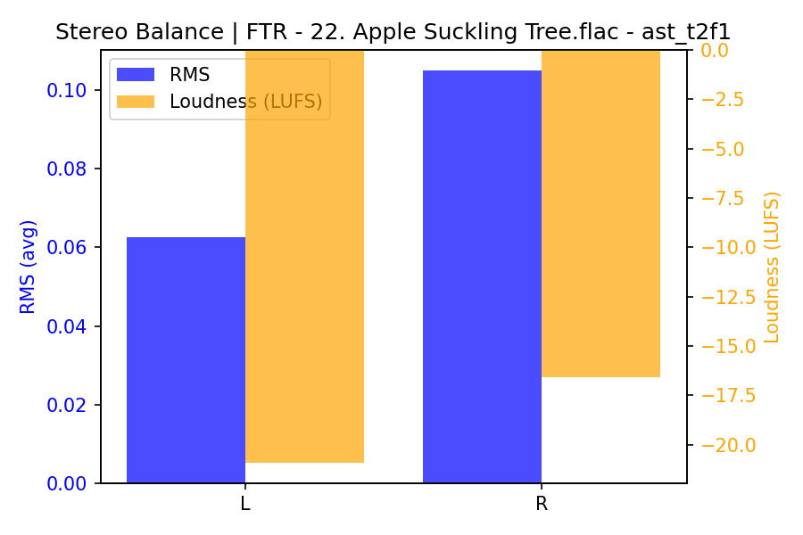

### CB

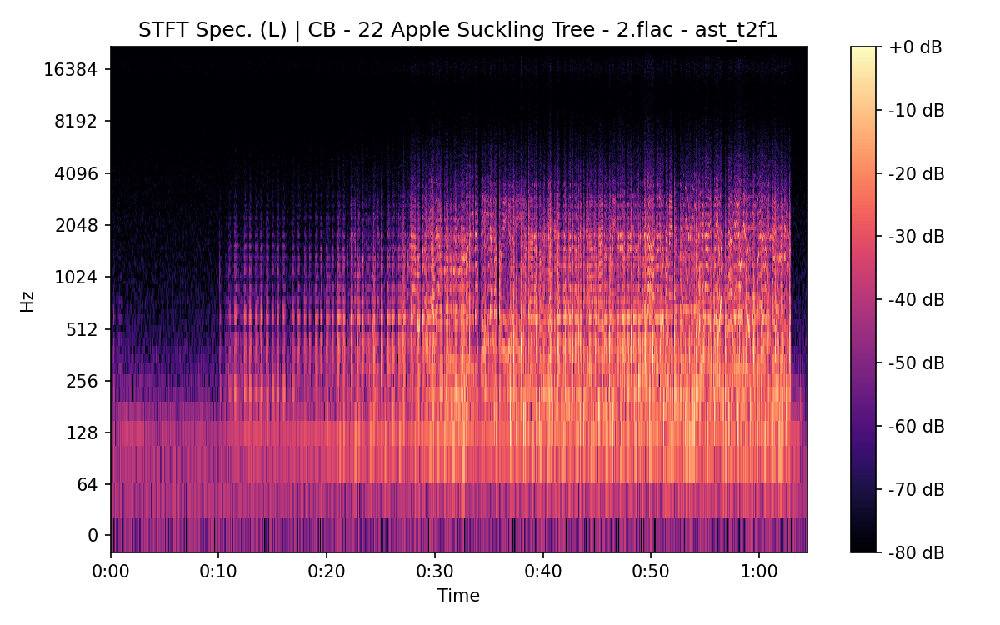

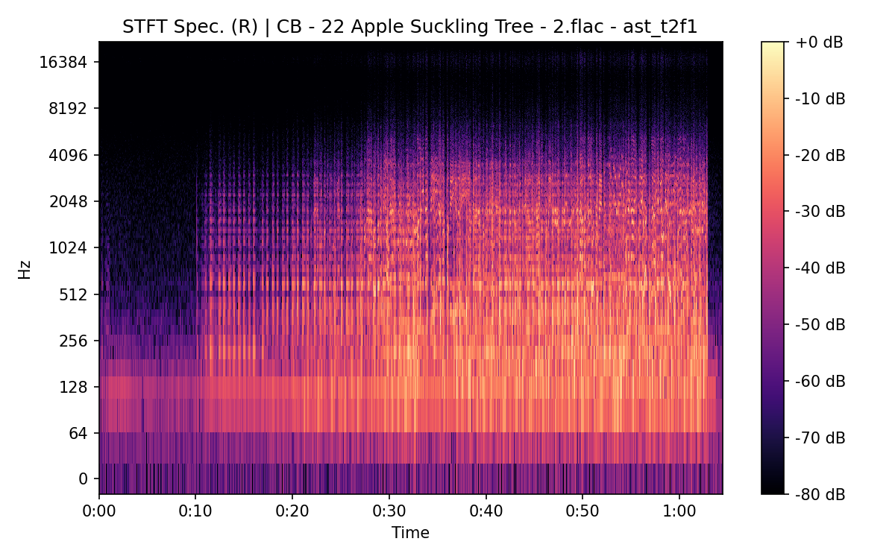

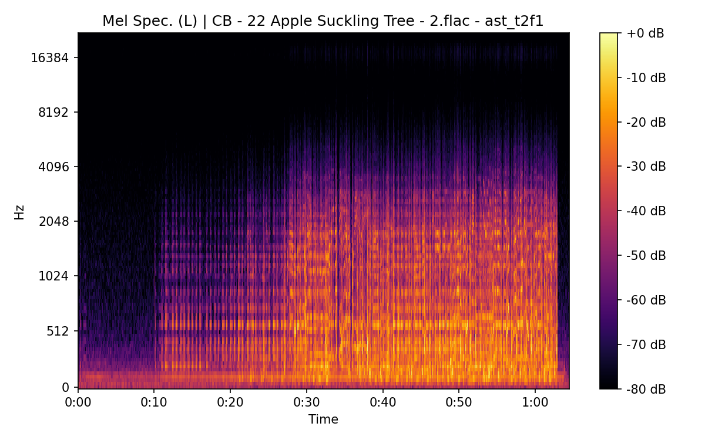

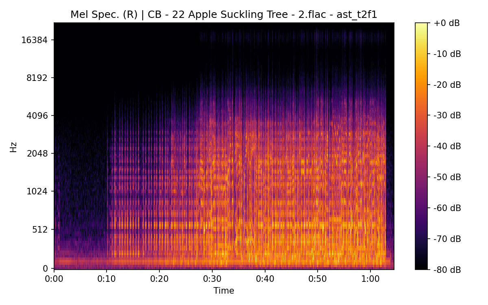

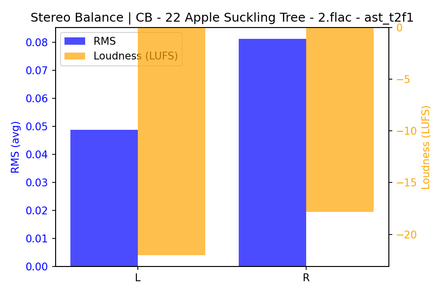

## Spectrograms (Mono)

### FTR

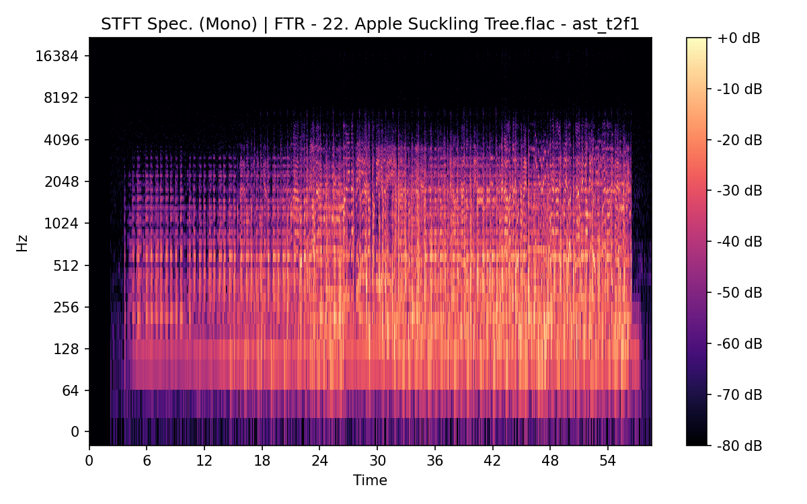


### CB

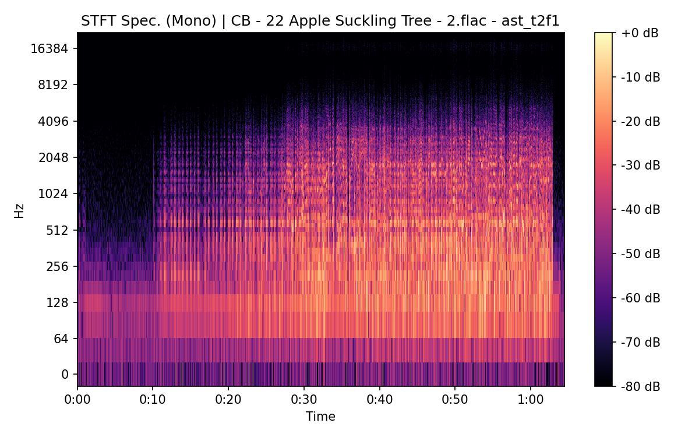

