# Ain’t That a Kindness

[](){ #atak }

## Details

| label   | orig_file                            | md5                              |   disc |   track |   duration_sec | duration_fmt   |   loudness |   loudness_left |   loudness_right |   loudness_balance |       rms |   rms_left |   rms_right |   rms_balance |   lr_corr |   spectral_centroid |
|:--------|:-------------------------------------|:---------------------------------|-------:|--------:|---------------:|:---------------|-----------:|----------------:|-----------------:|-------------------:|----------:|-----------:|------------:|--------------:|----------:|--------------------:|
| FTR     | 31. Ain't that a Kindness.flac       | b007041f9af1bd15c70778e8333b3121 |     10 |      31 |        59.5867 | 00:59:587      |   -21.2666 |        -23.1653 |         -19.4726 |           -3.69272 | 0.0822455 |  0.0664802 |   0.0996529 |    -0.0331726 |  0.956746 |             1987.97 |
| CB      | 30 Ain't That a Kindness (frag).flac | 2edf8dac88c8f126971c48598bf8000c |      9 |      32 |        59.7067 | 00:59:707      |   -21.2694 |        -23.1681 |         -19.4829 |           -3.68527 | 0.0820731 |  0.0663424 |   0.0994416 |    -0.0330992 |  0.956767 |             1991.93 |

## Plots
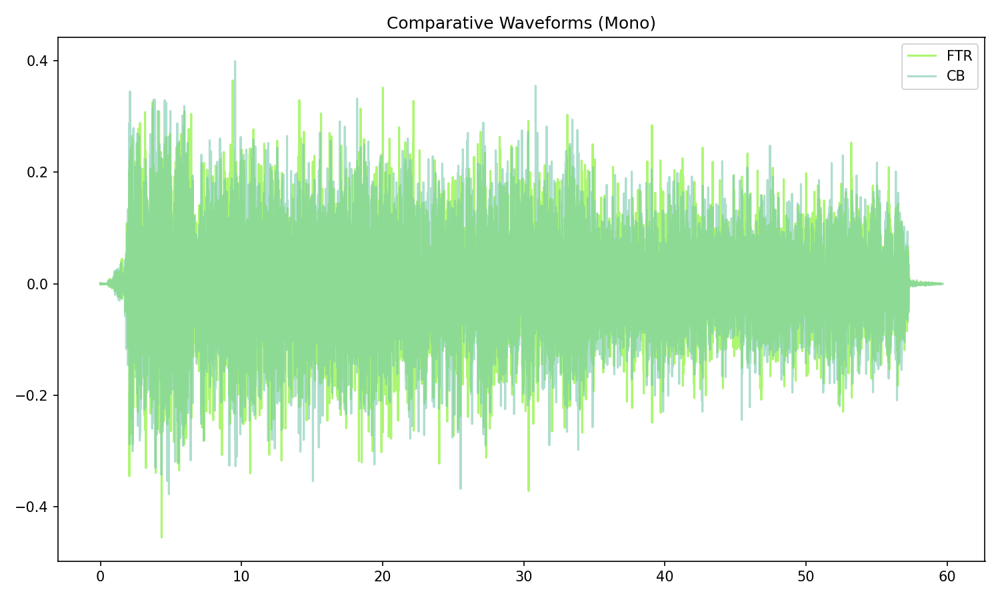

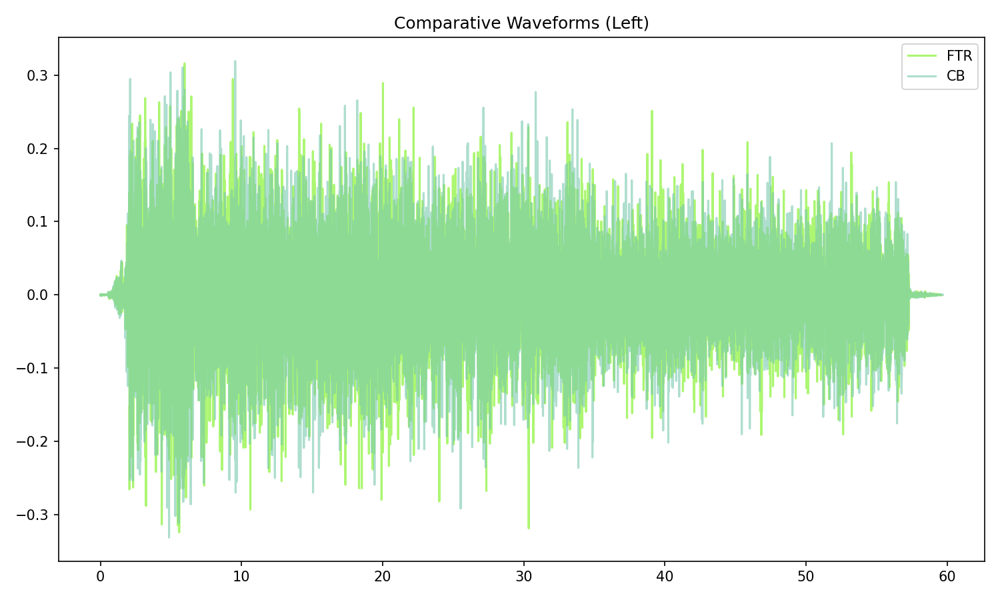

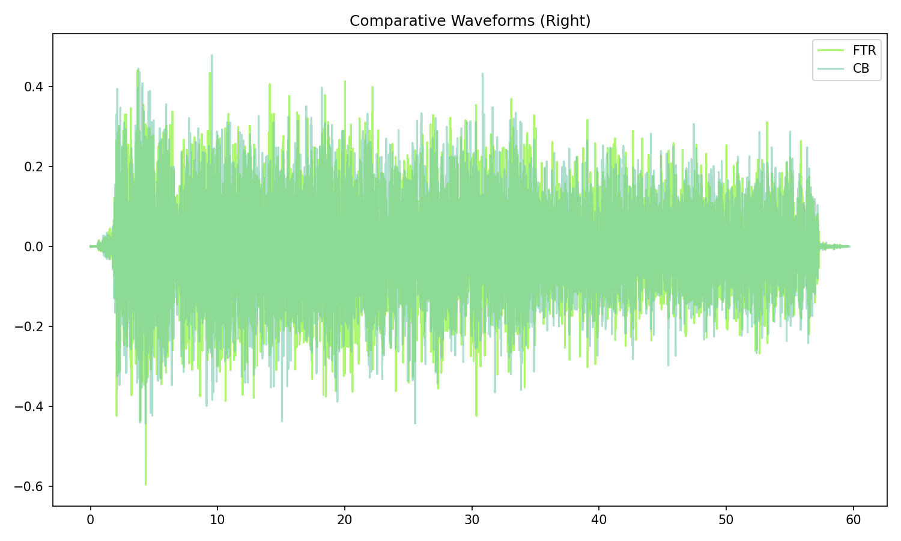

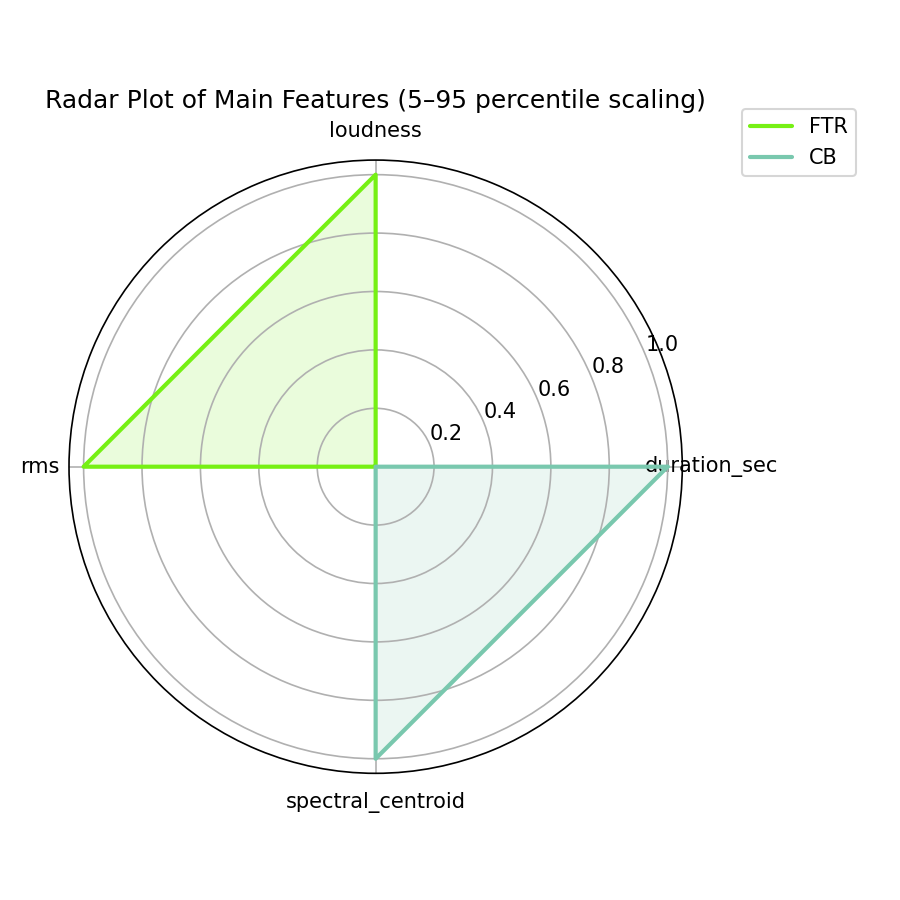

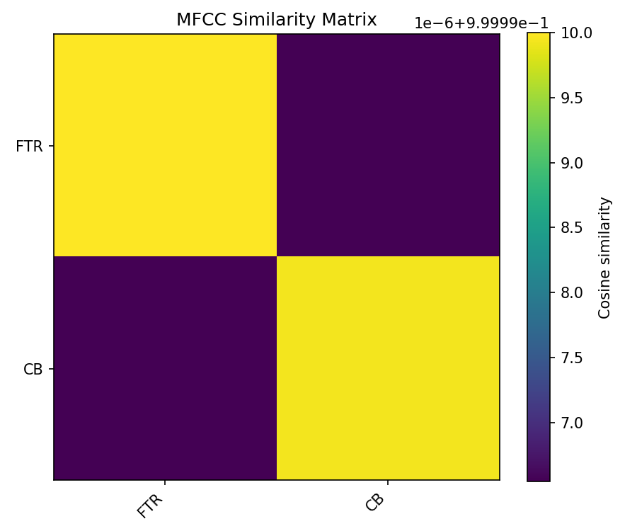

## Pitch & Speed Analysis (cents)

Reference version: **FTR**

| song_label   | ref_label   | cmp_label   | cmp_file                             |   tuning_cents_cmp |   tuning_cents_ref |   delta_tuning_cents |   semitone_shift_vs_ref |   chroma_similarity |   speed_factor_from_pitch |   duration_ratio_ref_over_cmp |
|:-------------|:------------|:------------|:-------------------------------------|-------------------:|-------------------:|---------------------:|------------------------:|--------------------:|--------------------------:|------------------------------:|
| atak         | FTR         | FTR         | 31. Ain't that a Kindness.flac       |                -43 |                -43 |                    0 |                       0 |            1        |                         1 |                       1       |
| atak         | FTR         | CB          | 30 Ain't That a Kindness (frag).flac |                -49 |                -43 |                   -6 |                       0 |            0.999948 |                         1 |                       0.99799 |

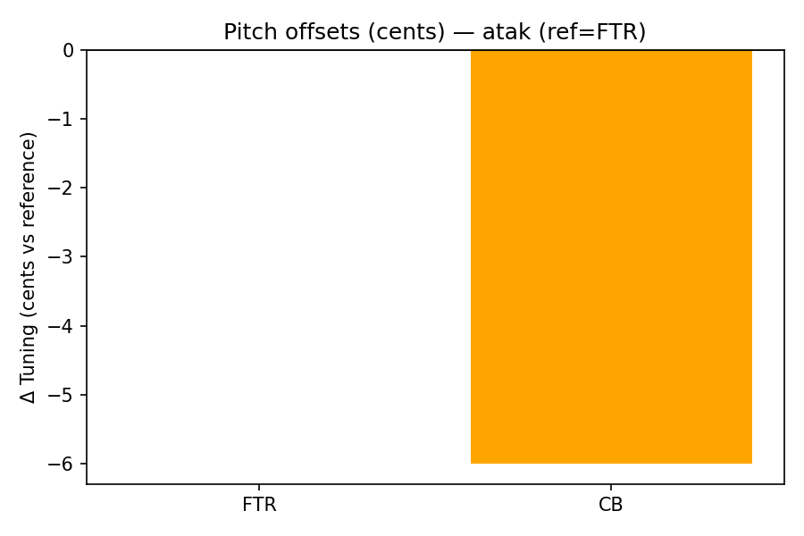

````text
Pitch/Speed analysis (reference = FTR)
============================================================

FTR - 31. Ain't that a Kindness.flac: shift=0 st ; Δtuning=0.0 cents ; speed_from_pitch=1.0000 ; duration_ratio(ref/cmp)=1.0000
CB - 30 Ain't That a Kindness (frag).flac: shift=0 st ; Δtuning=-6.0 cents ; speed_from_pitch=1.0000 ; duration_ratio(ref/cmp)=0.9980

````

## Stereo Balance

### FTR

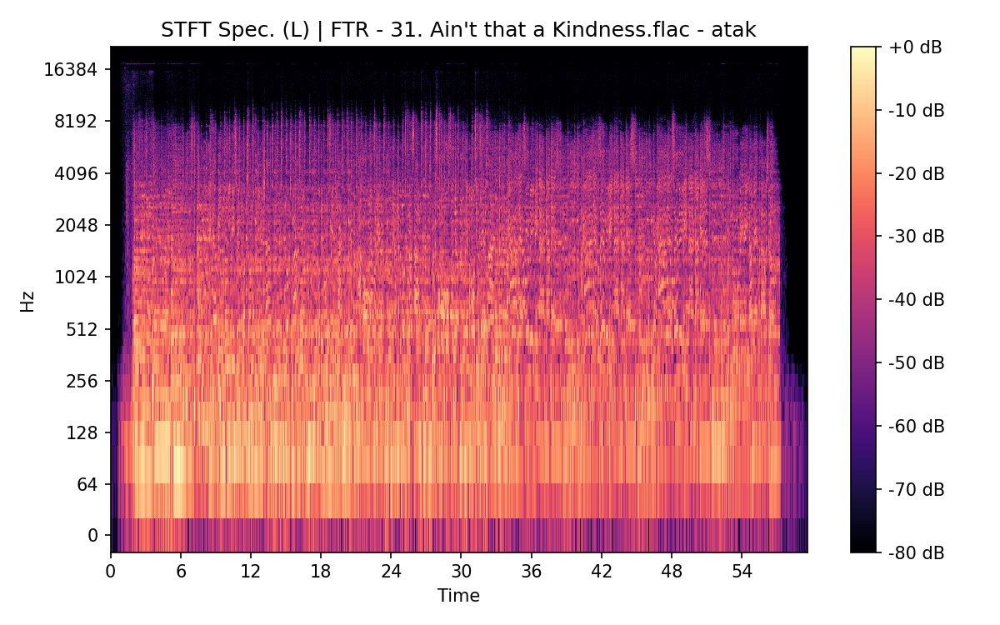


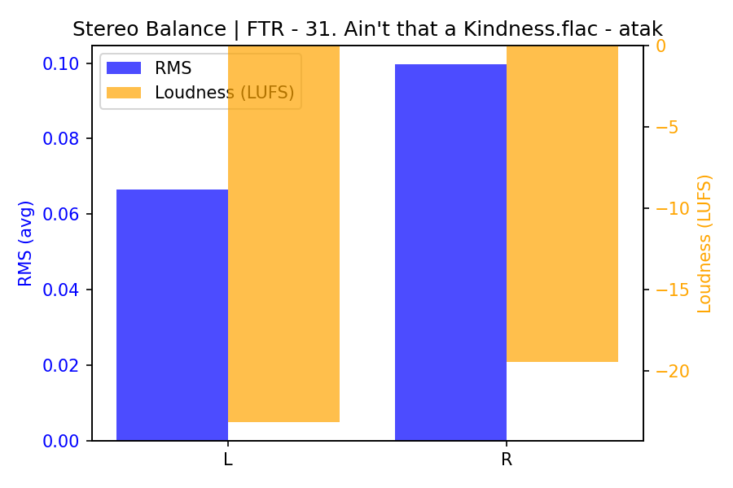

### CB

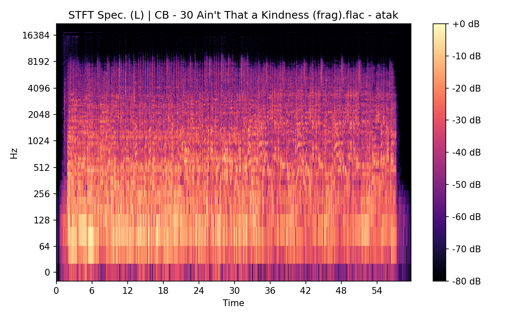

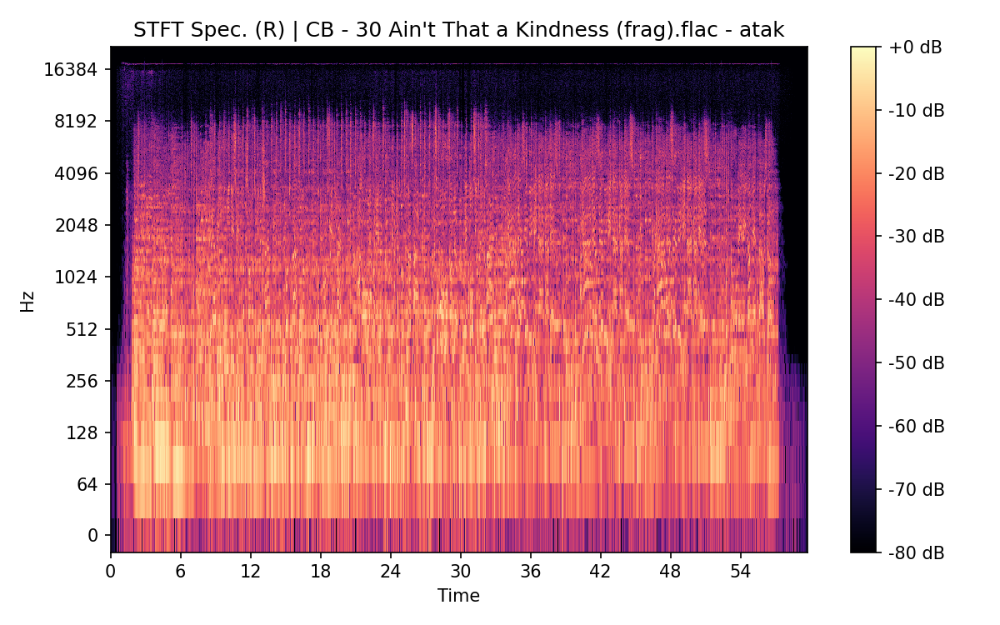


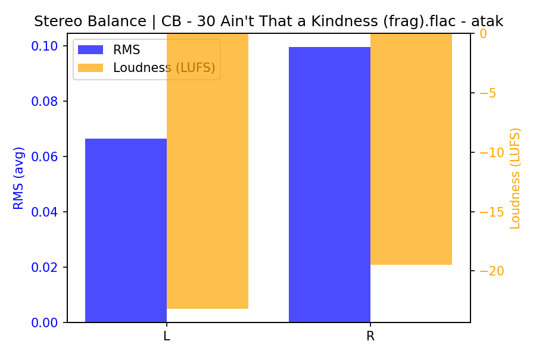

## Spectrograms (Mono)

### FTR


### CB


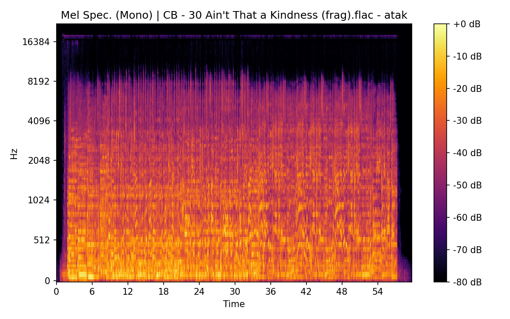

