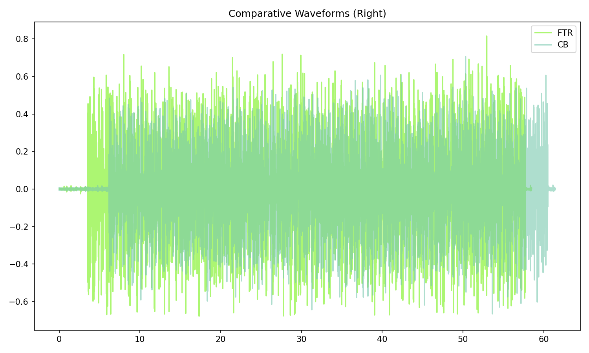

# Bacon Fat

[](){ #bacf }

## Details

| label   | orig_file                | md5                              |   disc |   track |   duration_sec | duration_fmt   |   loudness |   loudness_left |   loudness_right |   loudness_balance |      rms |   rms_left |   rms_right |   rms_balance |   lr_corr |   spectral_centroid |
|:--------|:-------------------------|:---------------------------------|-------:|--------:|---------------:|:---------------|-----------:|----------------:|-----------------:|-------------------:|---------:|-----------:|------------:|--------------:|----------:|--------------------:|
| FTR     | 16. Bacon Fat.flac       | 2eac892d5603e2b15ccbb57b684c5dcc |     10 |      16 |        58.4933 | 00:58:493      |   -14.9628 |        -14.0981 |         -14.1113 |          0.0131811 | 0.181621 |   0.19586  |    0.195455 |   0.000404447 |  0.722183 |             1162.01 |
| CB      | 16 Bacon Fat (frag).flac | e76f7e592725d12b16bfaef3406792fe |      9 |      17 |        61.44   | 01:01:440      |   -16.6798 |        -15.7507 |         -15.6625 |         -0.0882242 | 0.142437 |   0.154183 |    0.154526 |  -0.000342622 |  0.702616 |             1464.29 |

## Plots





## Pitch & Speed Analysis (cents)

Reference version: **FTR**

| song_label   | ref_label   | cmp_label   | cmp_file                 |   tuning_cents_cmp |   tuning_cents_ref |   delta_tuning_cents |   semitone_shift_vs_ref |   chroma_similarity |   speed_factor_from_pitch |   duration_ratio_ref_over_cmp |
|:-------------|:------------|:------------|:-------------------------|-------------------:|-------------------:|---------------------:|------------------------:|--------------------:|--------------------------:|------------------------------:|
| bacf         | FTR         | FTR         | 16. Bacon Fat.flac       |                  1 |                  1 |                    0 |                       0 |            1        |                         1 |                       1       |
| bacf         | FTR         | CB          | 16 Bacon Fat (frag).flac |                -15 |                  1 |                  -16 |                       0 |            0.998959 |                         1 |                       0.95204 |


````text
Pitch/Speed analysis (reference = FTR)
============================================================

FTR - 16. Bacon Fat.flac: shift=0 st ; Δtuning=0.0 cents ; speed_from_pitch=1.0000 ; duration_ratio(ref/cmp)=1.0000
CB - 16 Bacon Fat (frag).flac: shift=0 st ; Δtuning=-16.0 cents ; speed_from_pitch=1.0000 ; duration_ratio(ref/cmp)=0.9520

````

## Stereo Balance

### FTR


### CB


## Spectrograms (Mono)

### FTR


### CB


