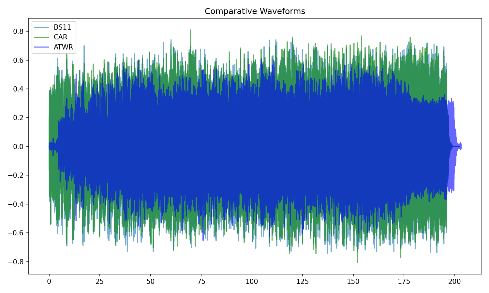
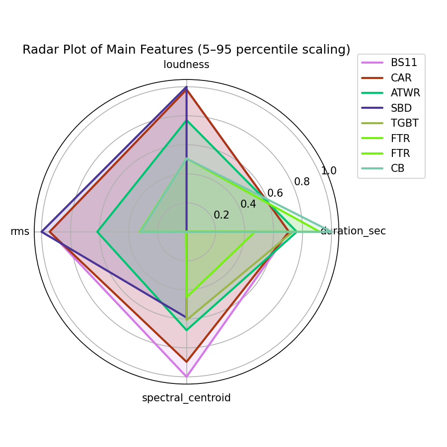
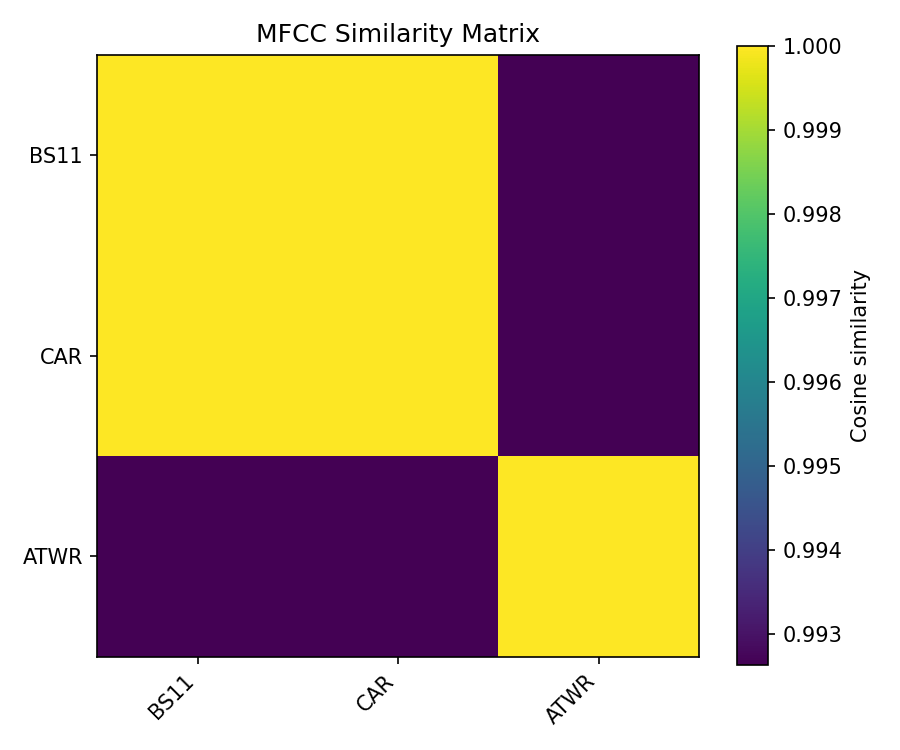
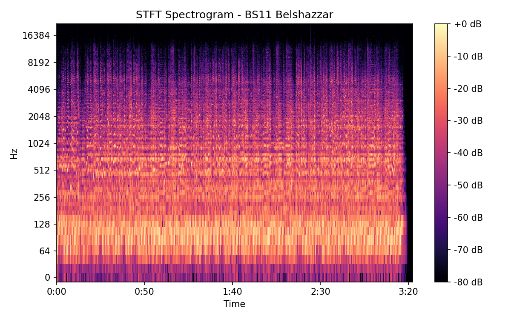
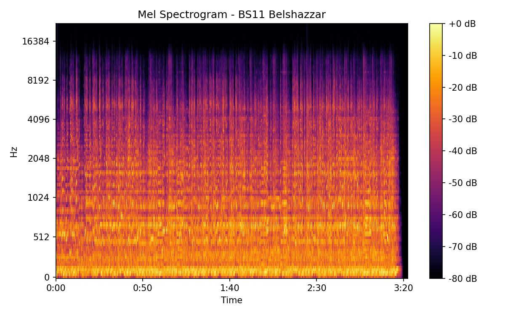
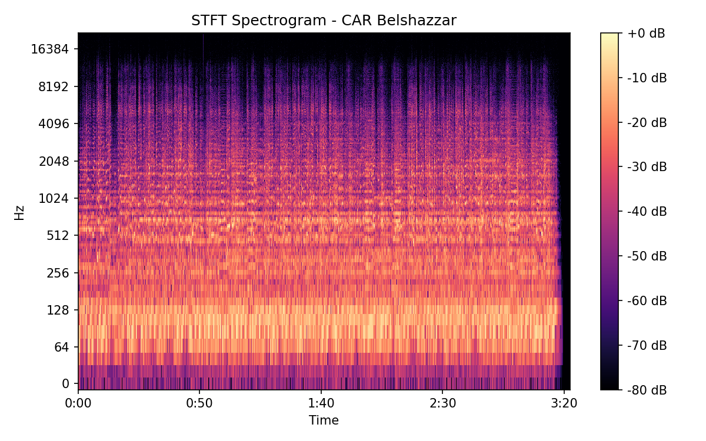
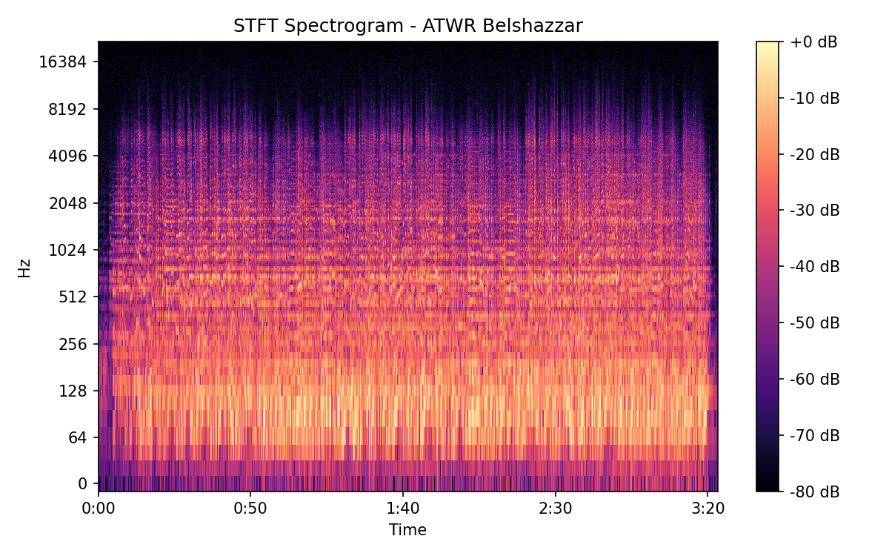
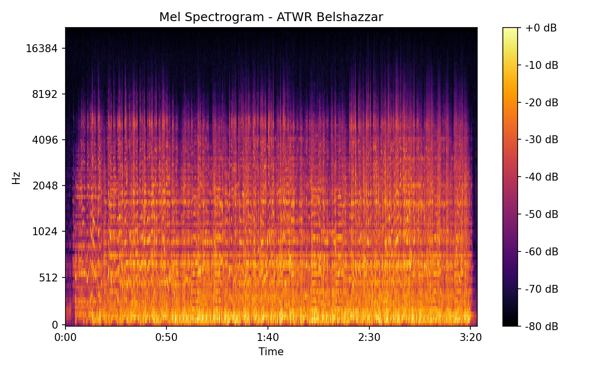

# Belshazzar

## Details

| label   | orig_file                                  | md5                              |   disc |   track |   duration_sec | duration_fmt   |   loudness |      rms |   spectral_centroid |
|:--------|:-------------------------------------------|:---------------------------------|-------:|--------:|---------------:|:---------------|-----------:|---------:|--------------------:|
| BS11    | 05 - Bob Dylan & The Band - Belshazzar.wav | eca2ab9fe9dd65c8dcb1795b05d9a7ee |      1 |       5 |        202.307 | 03:22:306      |   -16.6669 | 0.143152 |             1860.76 |
| CAR     | 01-05-Bob_Dylan-Belshazzar-SMR.flac        | cadaf4a8e94a563c05f377f10ebfc2a2 |      1 |       5 |        202.303 | 03:22:302      |   -16.6671 | 0.143157 |             1758.83 |
| ATWR    | 10 Belchazaar.flac                         | 0c9ad49d53574ad209ac8184455746d4 |      2 |      10 |        203.173 | 03:23:173      |   -19.3144 | 0.105636 |             1618.82 |

## Plots

## Spectrograms

### BS11

### CAR

### ATWR

