# Blowin' In The Wind

**(title taken from BS11)**

[](){ #bitw }

## Details

| label   | orig_file                                           | md5                              |   disc |   track |   duration_sec | duration_fmt   |   loudness |   loudness_left |   loudness_right |   loudness_balance |      rms |   rms_left |   rms_right |   rms_balance |   lr_corr |   spectral_centroid |
|:--------|:----------------------------------------------------|:---------------------------------|-------:|--------:|---------------:|:---------------|-----------:|----------------:|-----------------:|-------------------:|---------:|-----------:|------------:|--------------:|----------:|--------------------:|
| BS11    | 01 - Bob Dylan & The Band - Blowin' In The Wind.wav | b63cc5704d2cdbfcb558ae5550c926fd |      5 |       1 |        395.627 | 06:35:627      |   -15.7395 |        -15.7649 |         -15.365  |          -0.399891 | 0.166073 |   0.168743 |    0.169797 |   -0.00105408 |  0.914727 |             1710.87 |
| CAR     | 05-01-Bob_Dylan-Blowin_in_the_Wind-SMR.flac         | 4d80d562db12db0b2d2ab70387126a12 |      5 |       1 |        395.698 | 06:35:698      |   -15.7405 |        -15.7659 |         -15.3639 |          -0.401935 | 0.166041 |   0.16871  |    0.169764 |   -0.00105342 |  0.914727 |             1643.56 |

## Plots
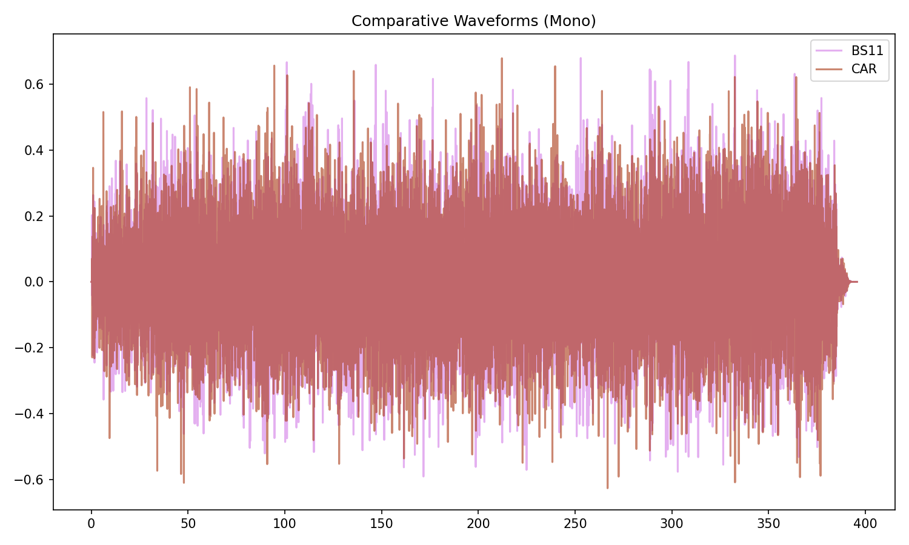

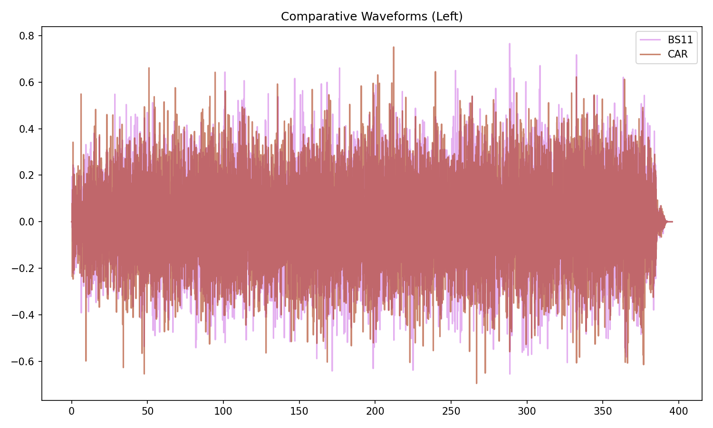

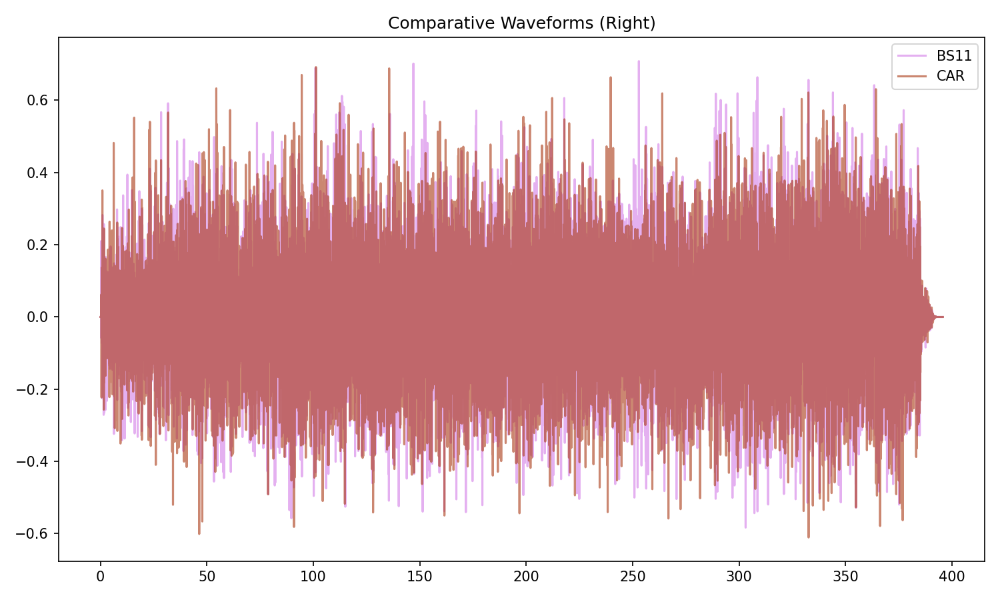

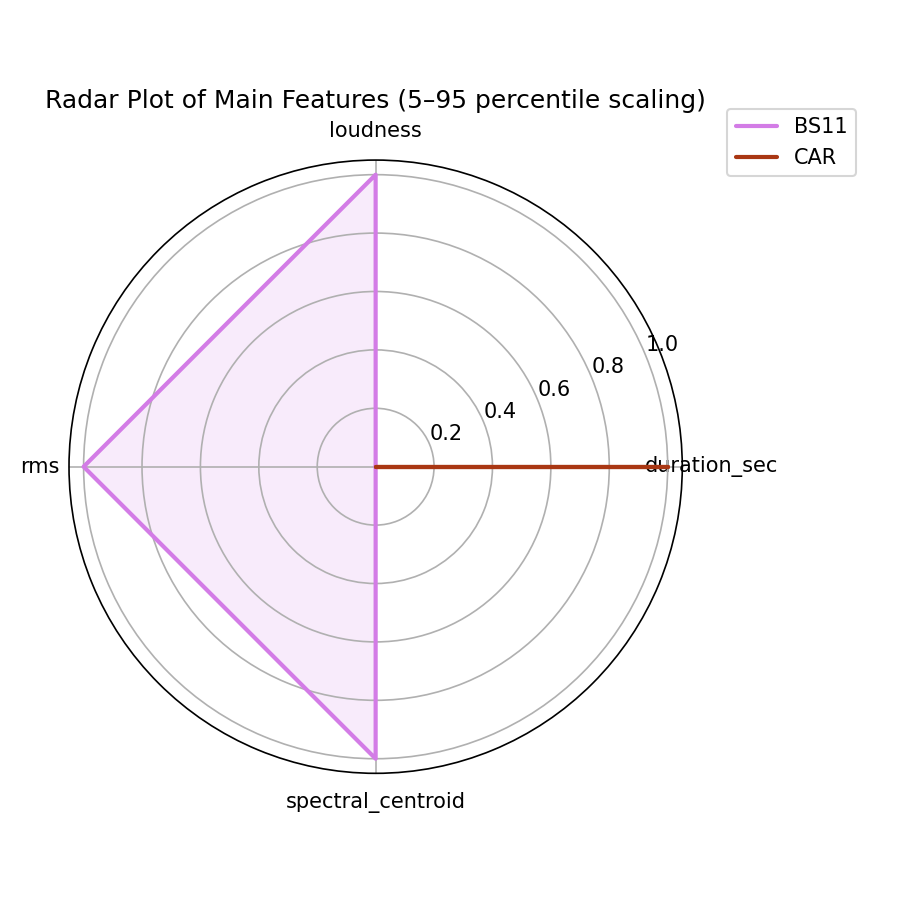

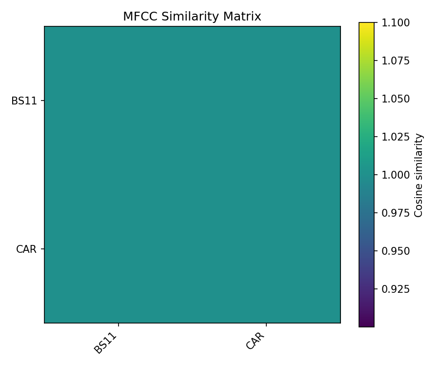

## Pitch & Speed Analysis (cents)

Reference version: **BS11**

| song_label   | ref_label   | cmp_label   | cmp_file                                            |   tuning_cents_cmp |   tuning_cents_ref |   delta_tuning_cents |   semitone_shift_vs_ref |   chroma_similarity |   speed_factor_from_pitch |   duration_ratio_ref_over_cmp |
|:-------------|:------------|:------------|:----------------------------------------------------|-------------------:|-------------------:|---------------------:|------------------------:|--------------------:|--------------------------:|------------------------------:|
| bitw         | BS11        | BS11        | 01 - Bob Dylan & The Band - Blowin' In The Wind.wav |                -31 |                -31 |                    0 |                       0 |            1        |                         1 |                       1       |
| bitw         | BS11        | CAR         | 05-01-Bob_Dylan-Blowin_in_the_Wind-SMR.flac         |                -30 |                -31 |                    1 |                       0 |            0.999992 |                         1 |                       0.99982 |

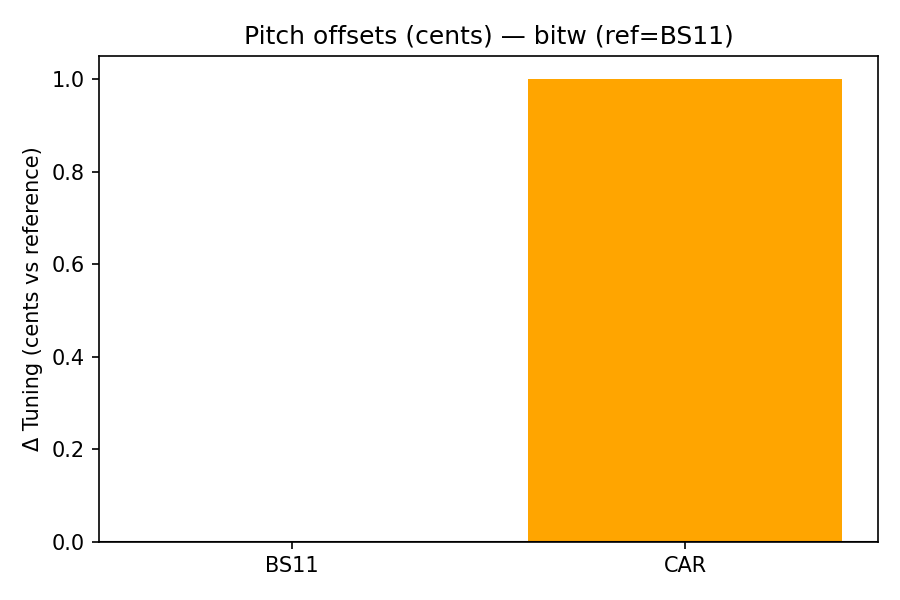

````text
Pitch/Speed analysis (reference = BS11)
============================================================

BS11 - 01 - Bob Dylan & The Band - Blowin' In The Wind.wav: shift=0 st ; Δtuning=0.0 cents ; speed_from_pitch=1.0000 ; duration_ratio(ref/cmp)=1.0000
CAR - 05-01-Bob_Dylan-Blowin_in_the_Wind-SMR.flac: shift=0 st ; Δtuning=1.0 cents ; speed_from_pitch=1.0000 ; duration_ratio(ref/cmp)=0.9998

````

## Stereo Balance

### BS11


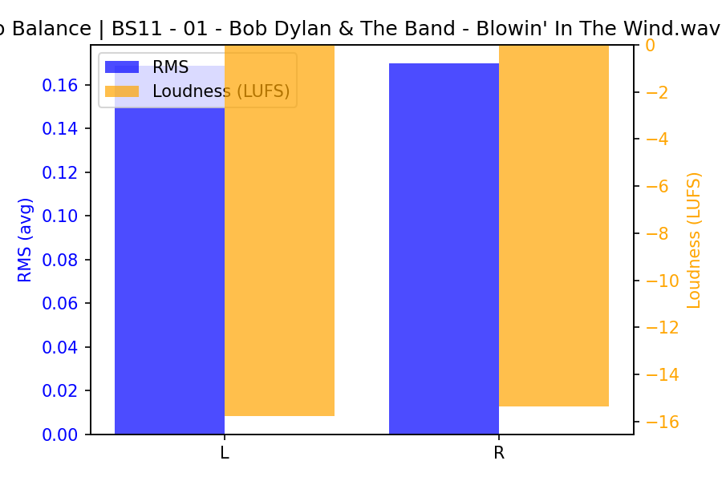

### CAR

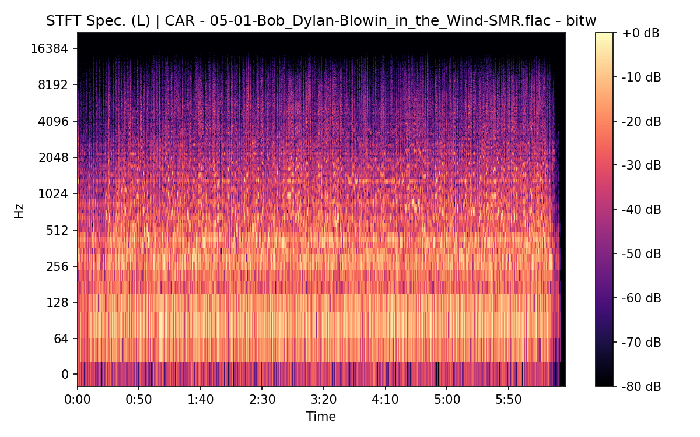


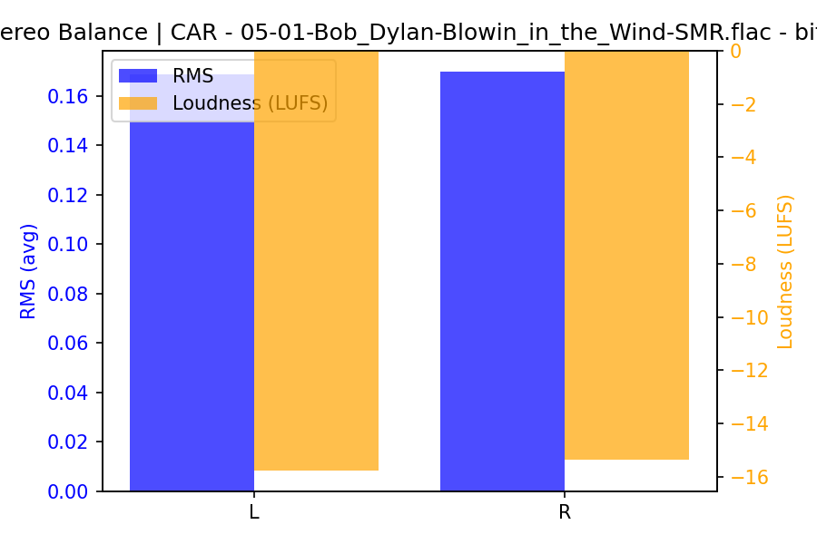

## Spectrograms (Mono)

### BS11


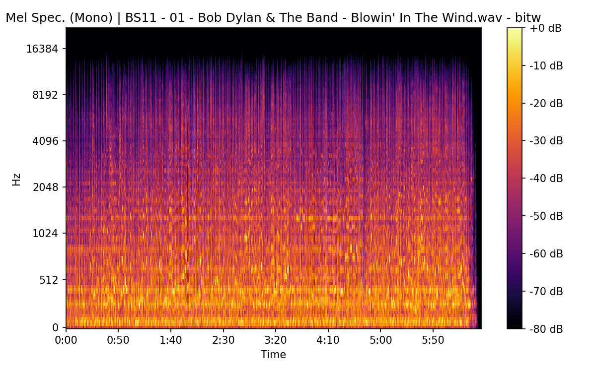

### CAR

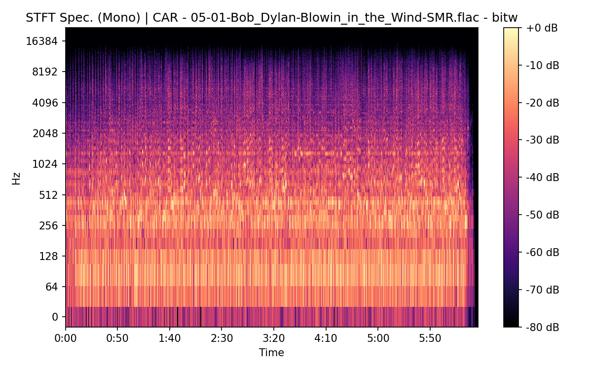

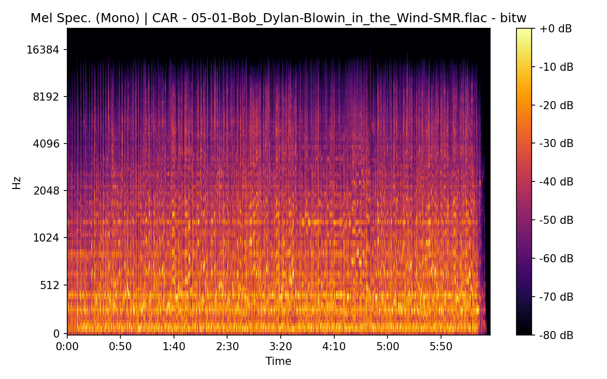

