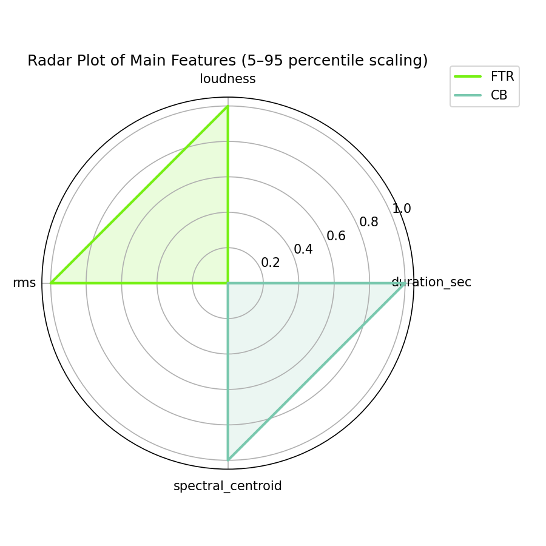

# Blue Moon

[](){ #blum_i }

## Details

| label   | orig_file                            | md5                              |   disc |   track |   duration_sec | duration_fmt   |   loudness |   loudness_left |   loudness_right |   loudness_balance |       rms |   rms_left |   rms_right |   rms_balance |     lr_corr |   spectral_centroid |
|:--------|:-------------------------------------|:---------------------------------|-------:|--------:|---------------:|:---------------|-----------:|----------------:|-----------------:|-------------------:|----------:|-----------:|------------:|--------------:|------------:|--------------------:|
| FTR     | 19. Blue Moon (Instrumental).flac    | fb0e1ac412b385f359d0e0b1de011042 |     10 |      19 |        123.4   | 02:03:400      |   -17.3682 |        -13.2811 |         -15.6183 |            2.33718 | 0.130376  |   0.203416 |    0.148227 |     0.055189  | -0.00699614 |             1369.98 |
| CB      | 19 Blue Moon (Sax instrumental).flac | 31183dd4439b94490f1c8b01a48ae2e1 |      9 |      20 |        132.333 | 02:12:333      |   -19.4006 |        -14.9932 |         -18.3192 |            3.32595 | 0.0981172 |   0.1603   |    0.101515 |     0.0587851 | -0.00615065 |             1574.82 |

## Plots





## Pitch & Speed Analysis (cents)

Reference version: **FTR**

| song_label   | ref_label   | cmp_label   | cmp_file                             |   tuning_cents_cmp |   tuning_cents_ref |   delta_tuning_cents |   semitone_shift_vs_ref |   chroma_similarity |   speed_factor_from_pitch |   duration_ratio_ref_over_cmp |
|:-------------|:------------|:------------|:-------------------------------------|-------------------:|-------------------:|---------------------:|------------------------:|--------------------:|--------------------------:|------------------------------:|
| blum_i       | FTR         | FTR         | 19. Blue Moon (Instrumental).flac    |                 24 |                 24 |                    0 |                       0 |            1        |                         1 |                      1        |
| blum_i       | FTR         | CB          | 19 Blue Moon (Sax instrumental).flac |                 25 |                 24 |                    1 |                       0 |            0.999392 |                         1 |                      0.932494 |


````text
Pitch/Speed analysis (reference = FTR)
============================================================

FTR - 19. Blue Moon (Instrumental).flac: shift=0 st ; Δtuning=0.0 cents ; speed_from_pitch=1.0000 ; duration_ratio(ref/cmp)=1.0000
CB - 19 Blue Moon (Sax instrumental).flac: shift=0 st ; Δtuning=1.0 cents ; speed_from_pitch=1.0000 ; duration_ratio(ref/cmp)=0.9325

````

## Stereo Balance

### FTR


### CB


## Spectrograms (Mono)

### FTR


### CB


