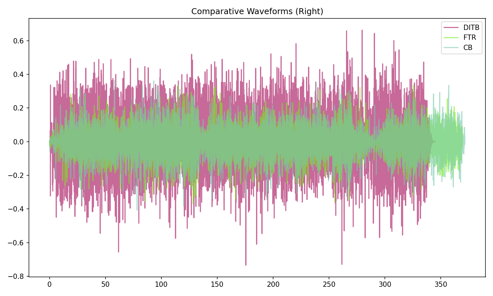
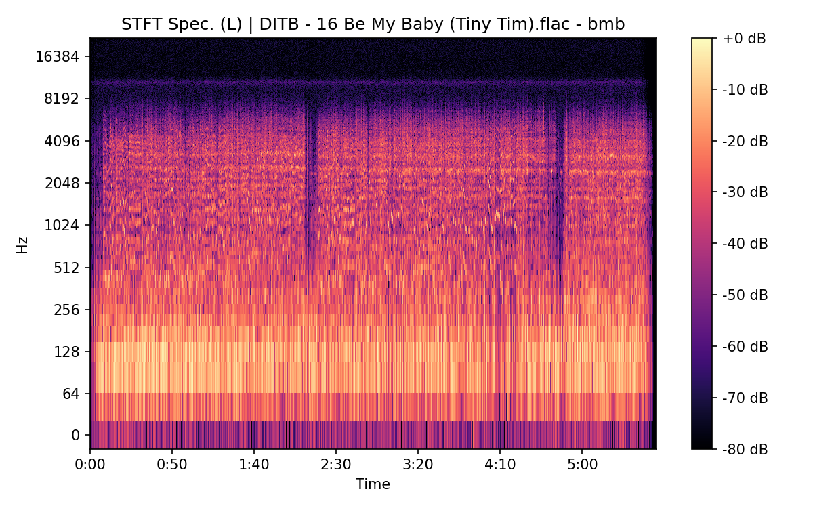
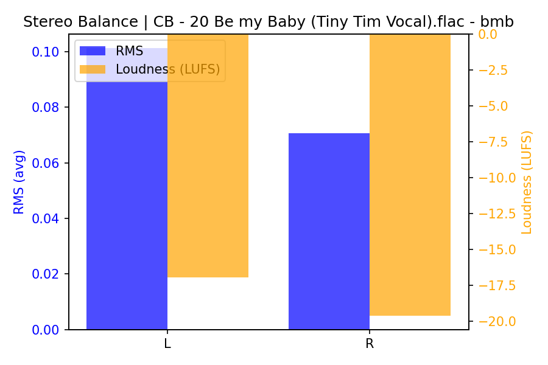
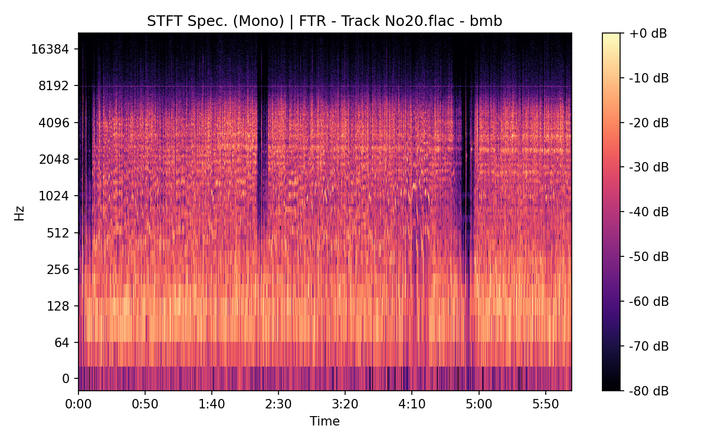

# Be My Baby

[](){ #bmb }

## Details

| label | orig_file                           | md5                              | disc | track | duration_sec | duration_fmt | loudness | loudness_left | loudness_right | loudness_balance |       rms | rms_left | rms_right | rms_balance |   lr_corr | spectral_centroid |
| :---- | :---------------------------------- | :------------------------------- | ---: | ----: | -----------: | :----------- | -------: | ------------: | -------------: | ---------------: | --------: | -------: | --------: | ----------: | --------: | ----------------: |
| DITB  | 16 Be My Baby (Tiny Tim).flac       | 77cb650fefff255f8f10048a95b22d4e |    1 |    16 |       345.08 | 05:45:080    | -18.0319 |      -15.6589 |        -15.913 |         0.254138 |  0.132364 | 0.156025 |  0.152597 |    0.003428 |  0.519683 |           1635.73 |
| FTR   | Track No20.flac                     | f3a05268adebfb28cdde38b9158c2173 |    6 |    20 |       369.36 | 06:09:360    | -22.4717 |      -16.9266 |       -19.6026 |          2.67602 | 0.0593101 | 0.101451 | 0.0708988 |   0.0305521 | -0.111429 |              2401 |
| CB    | 20 Be my Baby (Tiny Tim Vocal).flac | b5b05cd88b23ae2a5b13ab4df5c23cc2 |    6 |    20 |      371.427 | 06:11:427    | -22.4857 |      -16.9513 |       -19.6147 |          2.66331 | 0.0591953 | 0.101195 | 0.0706797 |   0.0305158 | -0.110619 |           2399.11 |

## Plots





## Pitch & Speed Analysis (cents)

Reference version: **DITB**

| song_label | ref_label | cmp_label | cmp_file                            | tuning_cents_cmp | tuning_cents_ref | delta_tuning_cents | semitone_shift_vs_ref | chroma_similarity | speed_factor_from_pitch | duration_ratio_ref_over_cmp |
| :--------- | :-------- | :-------- | :---------------------------------- | ---------------: | ---------------: | -----------------: | --------------------: | ----------------: | ----------------------: | --------------------------: |
| bmb        | DITB      | DITB      | 16 Be My Baby (Tiny Tim).flac       |              -26 |              -26 |                  0 |                     0 |                 1 |                       1 |                           1 |
| bmb        | DITB      | FTR       | Track No20.flac                     |               28 |              -26 |                 54 |                     0 |          0.998649 |                       1 |                    0.934265 |
| bmb        | DITB      | CB        | 20 Be my Baby (Tiny Tim Vocal).flac |               49 |              -26 |                 75 |                     0 |          0.998557 |                       1 |                    0.929066 |


```text
Pitch/Speed analysis (reference = DITB)
============================================================

DITB - 16 Be My Baby (Tiny Tim).flac: shift=0 st ; Δtuning=0.0 cents ; speed_from_pitch=1.0000 ; duration_ratio(ref/cmp)=1.0000
FTR - Track No20.flac: shift=0 st ; Δtuning=54.0 cents ; speed_from_pitch=1.0000 ; duration_ratio(ref/cmp)=0.9343
CB - 20 Be my Baby (Tiny Tim Vocal).flac: shift=0 st ; Δtuning=75.0 cents ; speed_from_pitch=1.0000 ; duration_ratio(ref/cmp)=0.9291

```

## Stereo Balance

### DITB




### FTR


### CB




## Spectrograms (Mono)

### DITB


### FTR




### CB


