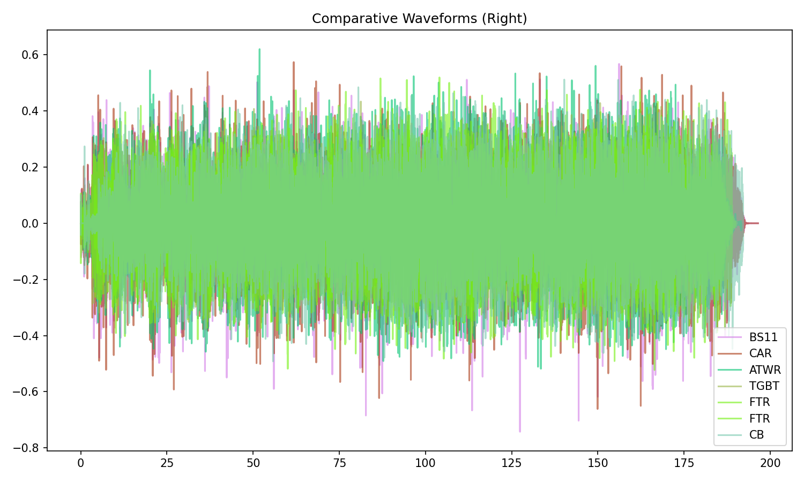
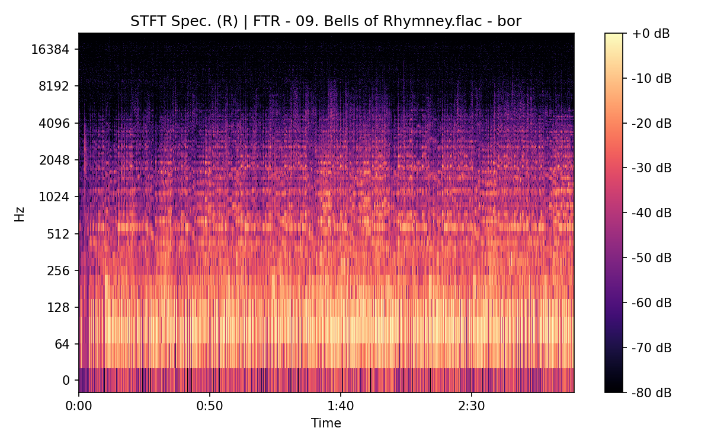

# Bells Of Rhymney

**(title taken from BS11)**

[](){ #bor }

## Details

| label   | orig_file                                        | md5                              |   disc |   track |   duration_sec | duration_fmt   |   loudness |   loudness_left |   loudness_right |   loudness_balance |      rms |   rms_left |   rms_right |   rms_balance |    lr_corr |   spectral_centroid |
|:--------|:-------------------------------------------------|:---------------------------------|-------:|--------:|---------------:|:---------------|-----------:|----------------:|-----------------:|-------------------:|---------:|-----------:|------------:|--------------:|-----------:|--------------------:|
| BS11    | 13 - Bob Dylan & The Band - Bells Of Rhymney.wav | 9b313f3f8b02d839161f1d9f61945fac |      1 |      13 |        196.467 | 03:16:467      |   -16.91   |        -16.5728 |         -16.8339 |           0.261106 | 0.144688 |   0.15454  |    0.140736 |    0.0138042  |  0.908559  |             1768.54 |
| CAR     | 01-13-Bob_Dylan-Bells_of_Rhymney-SMR.flac        | a0f98d183f85b43f6f769b0901072a31 |      1 |      13 |        196.477 | 03:16:477      |   -16.9141 |        -16.5769 |         -16.8318 |           0.254901 | 0.144677 |   0.154527 |    0.140725 |    0.0138015  |  0.908558  |             1665.74 |
| ATWR    | 18 Bells of Rhymney.flac                         | f10fe5124bb59692384c86478d8a0882 |      2 |      18 |        191.613 | 03:11:613      |   -19.329  |        -16.2375 |         -15.8476 |          -0.389845 | 0.113625 |   0.16607  |    0.157423 |    0.00864707 | -0.07867   |             1390.02 |
| TGBT    | 10 Bells Of Rhymney.flac                         | b95f01d4242cf2d1b5b39101e2e033ce |      5 |      10 |        190.333 | 03:10:333      |   -19.1309 |        -15.0766 |         -17.1915 |           2.11491  | 0.118768 |   0.193619 |    0.135403 |    0.0582163  | -0.039066  |             1341.29 |
| FTR     | 09. Bells of Rhymney.flac                        | 5e4068686f0bc1a7b5cc2b679f087062 |      3 |       9 |        188.96  | 03:08:960      |   -18.1264 |        -13.1794 |         -18.1322 |           4.95279  | 0.124816 |   0.211804 |    0.13611  |    0.075693   | -0.0562758 |             1528.66 |
| FTR     | 26. Bells Of Rhymney.flac                        | 00087c529a528f8180e4cbc62af9a930 |      3 |      26 |        189.893 | 03:09:893      |   -19.1351 |        -15.0723 |         -17.1915 |           2.11918  | 0.119017 |   0.194024 |    0.135695 |    0.0583285  | -0.0390743 |             1334.69 |
| CB      | 09 Bells of Rhymney.flac                         | 361bd6d646223c2df6a63d2f9aee332b |      3 |       9 |        192.173 | 03:12:173      |   -18.1438 |        -13.2002 |         -18.1595 |           4.95925  | 0.123506 |   0.209266 |    0.135046 |    0.07422    | -0.0560478 |             1516.59 |

## Plots





## Pitch & Speed Analysis (cents)

Reference version: **BS11**

| song_label   | ref_label   | cmp_label   | cmp_file                                         |   tuning_cents_cmp |   tuning_cents_ref |   delta_tuning_cents |   semitone_shift_vs_ref |   chroma_similarity |   speed_factor_from_pitch |   duration_ratio_ref_over_cmp |
|:-------------|:------------|:------------|:-------------------------------------------------|-------------------:|-------------------:|---------------------:|------------------------:|--------------------:|--------------------------:|------------------------------:|
| bor          | BS11        | BS11        | 13 - Bob Dylan & The Band - Bells Of Rhymney.wav |                -27 |                -27 |                    0 |                       0 |            1        |                         1 |                      1        |
| bor          | BS11        | CAR         | 01-13-Bob_Dylan-Bells_of_Rhymney-SMR.flac        |                -27 |                -27 |                    0 |                       0 |            0.999994 |                         1 |                      0.999949 |
| bor          | BS11        | ATWR        | 18 Bells of Rhymney.flac                         |                 -6 |                -27 |                   21 |                       0 |            0.972024 |                         1 |                      1.02533  |
| bor          | BS11        | TGBT        | 10 Bells Of Rhymney.flac                         |                 -2 |                -27 |                   25 |                       0 |            0.9683   |                         1 |                      1.03222  |
| bor          | BS11        | FTR         | 09. Bells of Rhymney.flac                        |                -27 |                -27 |                    0 |                       0 |            0.997782 |                         1 |                      1.03973  |
| bor          | BS11        | FTR         | 26. Bells Of Rhymney.flac                        |                 -1 |                -27 |                   26 |                       0 |            0.970534 |                         1 |                      1.03462  |
| bor          | BS11        | CB          | 09 Bells of Rhymney.flac                         |                -27 |                -27 |                    0 |                       0 |            0.997737 |                         1 |                      1.02234  |


````text
Pitch/Speed analysis (reference = BS11)
============================================================

BS11 - 13 - Bob Dylan & The Band - Bells Of Rhymney.wav: shift=0 st ; Δtuning=0.0 cents ; speed_from_pitch=1.0000 ; duration_ratio(ref/cmp)=1.0000
CAR - 01-13-Bob_Dylan-Bells_of_Rhymney-SMR.flac: shift=0 st ; Δtuning=0.0 cents ; speed_from_pitch=1.0000 ; duration_ratio(ref/cmp)=0.9999
ATWR - 18 Bells of Rhymney.flac: shift=0 st ; Δtuning=21.0 cents ; speed_from_pitch=1.0000 ; duration_ratio(ref/cmp)=1.0253
TGBT - 10 Bells Of Rhymney.flac: shift=0 st ; Δtuning=25.0 cents ; speed_from_pitch=1.0000 ; duration_ratio(ref/cmp)=1.0322
FTR - 09. Bells of Rhymney.flac: shift=0 st ; Δtuning=0.0 cents ; speed_from_pitch=1.0000 ; duration_ratio(ref/cmp)=1.0397
FTR - 26. Bells Of Rhymney.flac: shift=0 st ; Δtuning=26.0 cents ; speed_from_pitch=1.0000 ; duration_ratio(ref/cmp)=1.0346
CB - 09 Bells of Rhymney.flac: shift=0 st ; Δtuning=0.0 cents ; speed_from_pitch=1.0000 ; duration_ratio(ref/cmp)=1.0223

````

## Stereo Balance

### BS11


### CAR


### ATWR


### TGBT


### FTR





### FTR

.png)

.png)

.png)

.png)

.png)

### CB


## Spectrograms (Mono)

### BS11


### CAR


### ATWR


### TGBT


### FTR


### FTR

.png)

.png)

### CB


