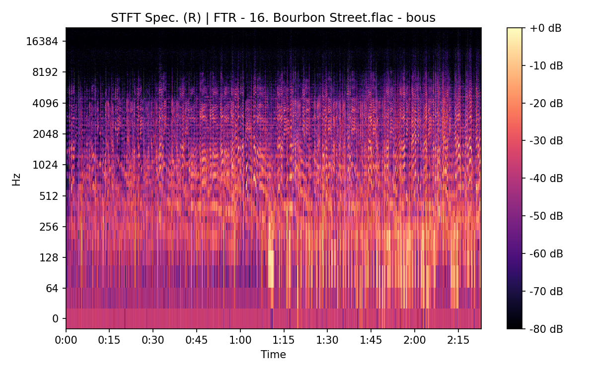

# Bourbon Street

**(title taken from BS11)**

[](){ #bous }

## Notes

All bootleg versions are cut.  
[`TGBT`][tgbt] d04t02 and [`CB`][cb] d04t06 both have an unrelated fragment at the beginning of the track (~2 seconds).


## Details

| label   | orig_file                                      | md5                              |   disc |   track |   duration_sec | duration_fmt   |   loudness |   loudness_left |   loudness_right |   loudness_balance |       rms |   rms_left |   rms_right |   rms_balance |   lr_corr |   spectral_centroid |
|:--------|:-----------------------------------------------|:---------------------------------|-------:|--------:|---------------:|:---------------|-----------:|----------------:|-----------------:|-------------------:|----------:|-----------:|------------:|--------------:|----------:|--------------------:|
| BS11    | 21 - Bob Dylan & The Band - Bourbon Street.wav | fda9e30a4bcf47b547e82e32eca8a442 |      4 |      21 |        304.827 | 05:04:827      |   -17.3688 |        -17.1948 |         -16.9927 |          -0.202078 | 0.126756  |  0.131153  |   0.129138  |    0.00201513 |  0.882044 |             2473.17 |
| CAR     | 04-21-Bob_Dylan-Bourbon_Street-SMR.flac        | 03b0c776e09bd6f079765b95fb3b2d64 |      4 |      21 |        304.635 | 05:04:635      |   -17.3701 |        -17.1948 |         -16.9927 |          -0.202101 | 0.126827  |  0.131227  |   0.129211  |    0.00201571 |  0.88204  |             2470.96 |
| ATWR    | 11 Bourbon Street.flac                         | f46890e76d728866630eecf2b37f9ab8 |      3 |      11 |        147.08  | 02:27:080      |   -20.2489 |        -19.5492 |         -20.857  |           1.30783  | 0.0775656 |  0.0856429 |   0.070612  |    0.0150309  |  0.965319 |             2302.75 |
| TGBT    | 4-02 Bourbon Street.flac                       | 2633ef612d673d2bc158971d6ef16134 |      4 |       2 |        145.173 | 02:25:173      |   -21.4898 |        -22.145  |         -20.5679 |          -1.57714  | 0.0704565 |  0.0657336 |   0.0771996 |   -0.011466   |  0.941923 |             1630.96 |
| FTR     | 16. Bourbon Street.flac                        | 1f66424ff1178a421c4c390ef1bea11d |      4 |      16 |        142.827 | 02:22:827      |   -26.3624 |        -27.0781 |         -24.4704 |          -2.60773  | 0.0403676 |  0.0372803 |   0.0481541 |   -0.0108738  |  0.801546 |             1556.93 |
| CB      | 16 Gimme Another Burbon Street.flac            | ddf14c3ef653309045bebea59585a6d7 |      4 |      16 |        144.147 | 02:24:147      |   -26.3511 |        -27.0625 |         -24.4863 |          -2.57627  | 0.0403317 |  0.0372728 |   0.0480578 |   -0.010785   |  0.803173 |             1563.68 |

## Plots


## Pitch & Speed Analysis (cents)

Reference version: **BS11**

| song_label   | ref_label   | cmp_label   | cmp_file                                       |   tuning_cents_cmp |   tuning_cents_ref |   delta_tuning_cents |   semitone_shift_vs_ref |   chroma_similarity |   speed_factor_from_pitch |   duration_ratio_ref_over_cmp |
|:-------------|:------------|:------------|:-----------------------------------------------|-------------------:|-------------------:|---------------------:|------------------------:|--------------------:|--------------------------:|------------------------------:|
| bous         | BS11        | BS11        | 21 - Bob Dylan & The Band - Bourbon Street.wav |                -40 |                -40 |                    0 |                       0 |            1        |                         1 |                       1       |
| bous         | BS11        | CAR         | 04-21-Bob_Dylan-Bourbon_Street-SMR.flac        |                -40 |                -40 |                    0 |                       0 |            0.999987 |                         1 |                       1.00063 |
| bous         | BS11        | ATWR        | 11 Bourbon Street.flac                         |                -30 |                -40 |                   10 |                       0 |            0.991917 |                         1 |                       2.07252 |
| bous         | BS11        | TGBT        | 4-02 Bourbon Street.flac                       |                 -4 |                -40 |                   36 |                       0 |            0.989831 |                         1 |                       2.09974 |
| bous         | BS11        | FTR         | 16. Bourbon Street.flac                        |                -17 |                -40 |                   23 |                       0 |            0.99126  |                         1 |                       2.13424 |
| bous         | BS11        | CB          | 16 Gimme Another Burbon Street.flac            |                -16 |                -40 |                   24 |                       0 |            0.990863 |                         1 |                       2.1147  |


````text
Pitch/Speed analysis (reference = BS11)
============================================================

BS11 - 21 - Bob Dylan & The Band - Bourbon Street.wav: shift=0 st ; Δtuning=0.0 cents ; speed_from_pitch=1.0000 ; duration_ratio(ref/cmp)=1.0000
CAR - 04-21-Bob_Dylan-Bourbon_Street-SMR.flac: shift=0 st ; Δtuning=0.0 cents ; speed_from_pitch=1.0000 ; duration_ratio(ref/cmp)=1.0006
ATWR - 11 Bourbon Street.flac: shift=0 st ; Δtuning=10.0 cents ; speed_from_pitch=1.0000 ; duration_ratio(ref/cmp)=2.0725
TGBT - 4-02 Bourbon Street.flac: shift=0 st ; Δtuning=36.0 cents ; speed_from_pitch=1.0000 ; duration_ratio(ref/cmp)=2.0997
FTR - 16. Bourbon Street.flac: shift=0 st ; Δtuning=23.0 cents ; speed_from_pitch=1.0000 ; duration_ratio(ref/cmp)=2.1342
CB - 16 Gimme Another Burbon Street.flac: shift=0 st ; Δtuning=24.0 cents ; speed_from_pitch=1.0000 ; duration_ratio(ref/cmp)=2.1147

````

## Stereo Balance

### BS11


### CAR


### ATWR


### TGBT


### FTR





### CB


## Spectrograms (Mono)

### BS11


### CAR


### ATWR


### TGBT


### FTR


### CB


