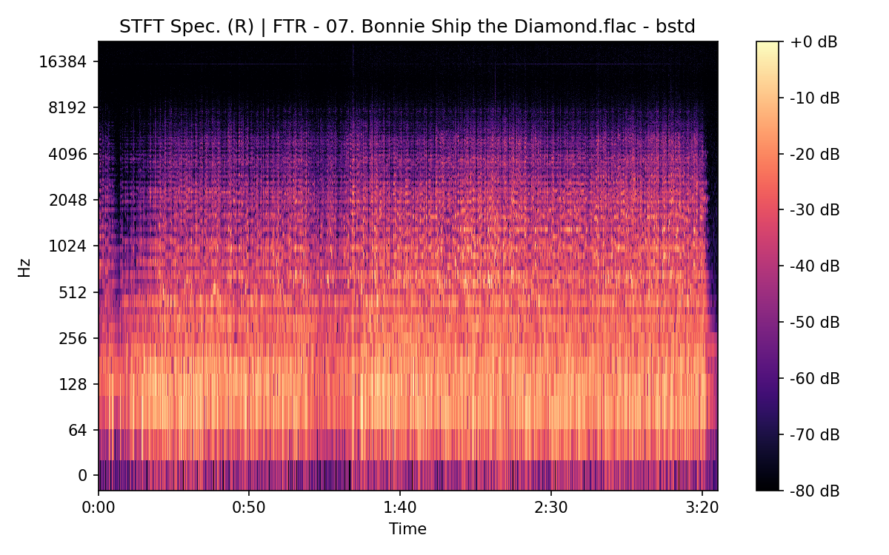
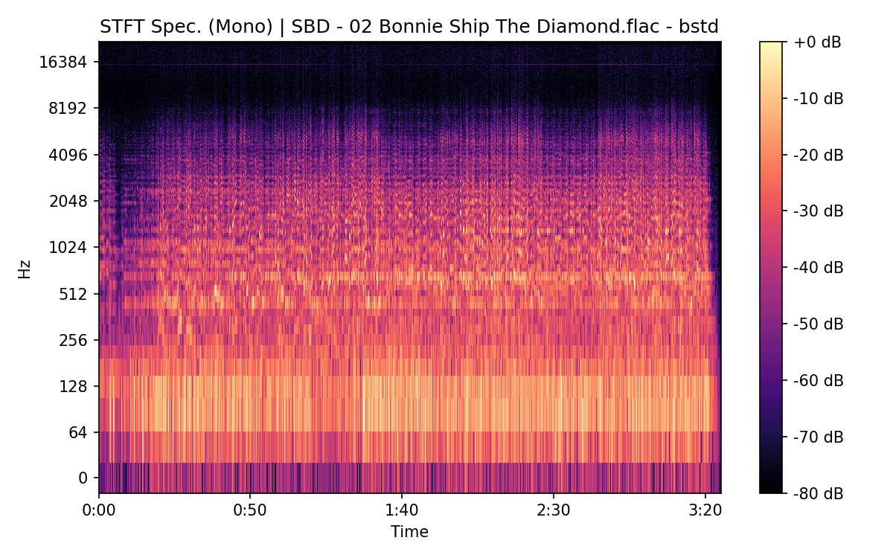
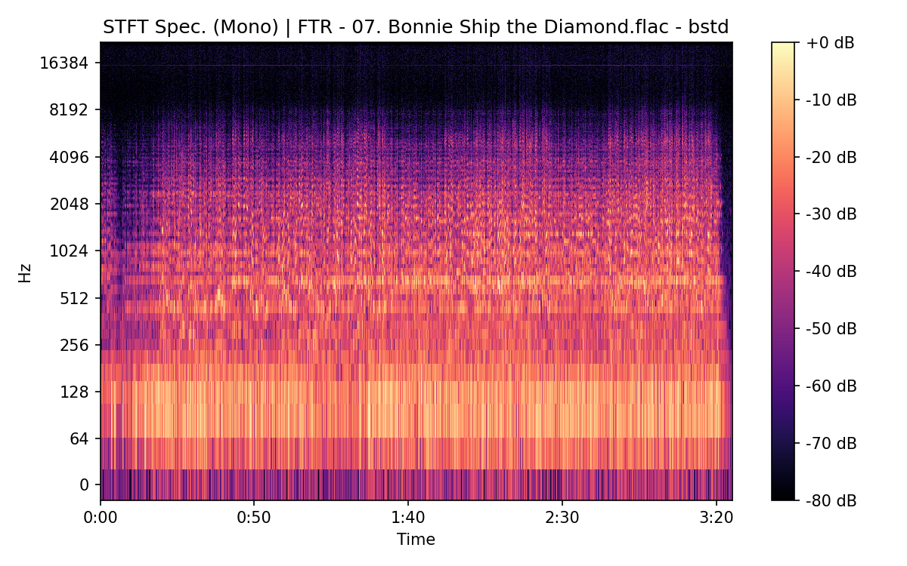

# Bonnie Ship The Diamond

**(title taken from BS11)**

[](){ #bstd }

## Notes

All bootlegs contain a guitar intro (~7 seconds), absent from [`BS11`][bs11].


## Details

| label   | orig_file                                        | md5                              |   disc |   track |   duration_sec | duration_fmt   |   loudness |   loudness_left |   loudness_right |   loudness_balance |       rms |   rms_left |   rms_right |   rms_balance |   lr_corr |   spectral_centroid |
|:--------|:-------------------------------------------------|:---------------------------------|-------:|--------:|---------------:|:---------------|-----------:|----------------:|-----------------:|-------------------:|----------:|-----------:|------------:|--------------:|----------:|--------------------:|
| BS11    | 02 - Bob Dylan - Bonnie Ship The Diamond.wav     | 7241686c947ae56ff2bb47634fcf4139 |      3 |       2 |        201.107 | 03:21:107      |   -16.9175 |        -16.2189 |         -17.0671 |          0.848137  | 0.141327  |   0.156893 |   0.133584  |    0.0233093  |  0.885173 |             1916.43 |
| CAR     | 03-02-Bob_Dylan-Bonnie_Ship_the_Diamond-SMR.flac | ca28c5e6ea9e29a80d326b39336e97a8 |      3 |       2 |        201.111 | 03:21:111      |   -16.9197 |        -16.2171 |         -17.0672 |          0.850039  | 0.141316  |   0.156881 |   0.133572  |    0.0233092  |  0.88517  |             1827.47 |
| ATWR    | 05 Bonnie Ship The Diamond.flac                  | 074340d5ee8225ca882b6614bccf8cd7 |      1 |       5 |        205.293 | 03:25:293      |   -21.7345 |        -18.0996 |         -18.0318 |         -0.0678202 | 0.0737768 |   0.111357 |   0.120994  |   -0.00963725 | -0.193699 |             1597.55 |
| SBD     | 02 Bonnie Ship The Diamond.flac                  | 9d4d824b263074329ad5f3376889b961 |      1 |       2 |        205.133 | 03:25:133      |   -18.8702 |        -15.2351 |         -15.1584 |         -0.0766846 | 0.102932  |   0.155266 |   0.169008  |   -0.0137416  | -0.194655 |             1697.54 |
| TGBT    | 04 Bonnie Ship The Diamond.flac                  | 47d1449194164fd307bd81bbb678f509 |      1 |       4 |        205.093 | 03:25:093      |   -23.1299 |        -17.4721 |         -23.5144 |          6.04225   | 0.0645645 |   0.121111 |   0.0674569 |    0.053654   | -0.167766 |             1717.4  |
| FTR     | 07. Bonnie Ship the Diamond.flac                 | 0467883e5865c4f29d3661156d8ad401 |      1 |       7 |        205.027 | 03:25:027      |   -22.3351 |        -18.7004 |         -18.6228 |         -0.0776608 | 0.0690917 |   0.104202 |   0.113459  |   -0.00925662 | -0.194544 |             1689.96 |
| CB      | 07 Bonnie Ship the Diamond.flac                  | 99c8b52157c5c92e555366d7a690ddc4 |      1 |       7 |        205.027 | 03:25:027      |   -22.329  |        -18.7025 |         -18.6207 |         -0.0818612 | 0.069088  |   0.104197 |   0.113452  |   -0.00925456 | -0.194543 |             1690.84 |

## Plots


## Pitch & Speed Analysis (cents)

Reference version: **BS11**

| song_label   | ref_label   | cmp_label   | cmp_file                                         |   tuning_cents_cmp |   tuning_cents_ref |   delta_tuning_cents |   semitone_shift_vs_ref |   chroma_similarity |   speed_factor_from_pitch |   duration_ratio_ref_over_cmp |
|:-------------|:------------|:------------|:-------------------------------------------------|-------------------:|-------------------:|---------------------:|------------------------:|--------------------:|--------------------------:|------------------------------:|
| bstd         | BS11        | BS11        | 02 - Bob Dylan - Bonnie Ship The Diamond.wav     |                -26 |                -26 |                    0 |                       0 |            1        |                  1        |                      1        |
| bstd         | BS11        | CAR         | 03-02-Bob_Dylan-Bonnie_Ship_the_Diamond-SMR.flac |                -27 |                -26 |                   -1 |                       0 |            0.999959 |                  1        |                      0.999977 |
| bstd         | BS11        | ATWR        | 05 Bonnie Ship The Diamond.flac                  |                  4 |                -26 |                   30 |                       0 |            0.988185 |                  1        |                      0.979606 |
| bstd         | BS11        | SBD         | 02 Bonnie Ship The Diamond.flac                  |                  5 |                -26 |                   31 |                       0 |            0.988434 |                  1        |                      0.98037  |
| bstd         | BS11        | TGBT        | 04 Bonnie Ship The Diamond.flac                  |                -19 |                -26 |                    7 |                      -1 |            0.99251  |                  0.943874 |                      0.980562 |
| bstd         | BS11        | FTR         | 07. Bonnie Ship the Diamond.flac                 |                  6 |                -26 |                   32 |                       0 |            0.988707 |                  1        |                      0.980881 |
| bstd         | BS11        | CB          | 07 Bonnie Ship the Diamond.flac                  |                  6 |                -26 |                   32 |                       0 |            0.988713 |                  1        |                      0.980881 |


````text
Pitch/Speed analysis (reference = BS11)
============================================================

BS11 - 02 - Bob Dylan - Bonnie Ship The Diamond.wav: shift=0 st ; Δtuning=0.0 cents ; speed_from_pitch=1.0000 ; duration_ratio(ref/cmp)=1.0000
CAR - 03-02-Bob_Dylan-Bonnie_Ship_the_Diamond-SMR.flac: shift=0 st ; Δtuning=-1.0 cents ; speed_from_pitch=1.0000 ; duration_ratio(ref/cmp)=1.0000
ATWR - 05 Bonnie Ship The Diamond.flac: shift=0 st ; Δtuning=30.0 cents ; speed_from_pitch=1.0000 ; duration_ratio(ref/cmp)=0.9796
SBD - 02 Bonnie Ship The Diamond.flac: shift=0 st ; Δtuning=31.0 cents ; speed_from_pitch=1.0000 ; duration_ratio(ref/cmp)=0.9804
TGBT - 04 Bonnie Ship The Diamond.flac: shift=-1 st ; Δtuning=7.0 cents ; speed_from_pitch=0.9439 ; duration_ratio(ref/cmp)=0.9806
FTR - 07. Bonnie Ship the Diamond.flac: shift=0 st ; Δtuning=32.0 cents ; speed_from_pitch=1.0000 ; duration_ratio(ref/cmp)=0.9809
CB - 07 Bonnie Ship the Diamond.flac: shift=0 st ; Δtuning=32.0 cents ; speed_from_pitch=1.0000 ; duration_ratio(ref/cmp)=0.9809

````

## Stereo Balance

### BS11


### CAR


### ATWR


### SBD


### TGBT


### FTR





### CB


## Spectrograms (Mono)

### BS11


### CAR


### ATWR


### SBD




### TGBT


### FTR




### CB


