# Confidential (Take 2)

**(title taken from BS11)**

[](){ #conf_t2 }

## Details

| label   | orig_file                                               | md5                              |   disc |   track |   duration_sec | duration_fmt   |   loudness |   loudness_left |   loudness_right |   loudness_balance |      rms |   rms_left |   rms_right |   rms_balance |   lr_corr |   spectral_centroid |
|:--------|:--------------------------------------------------------|:---------------------------------|-------:|--------:|---------------:|:---------------|-----------:|----------------:|-----------------:|-------------------:|---------:|-----------:|------------:|--------------:|----------:|--------------------:|
| BS11    | 22 - Bob Dylan & The Band - Confidential.wav            | e57ba4d2bc1d3c4d6764b3bbe869df54 |      6 |      22 |        146.68  | 02:26:680      |   -18.8471 |        -18.4387 |         -18.8192 |           0.380523 | 0.101303 |   0.10597  |    0.100123 |    0.00584687 |  0.916188 |             2453.66 |
| CAR     | 06-22-Bob_Dylan-900_Miles_from_My_Home_Confide-SMR.flac | c851a5f6f14076134bc555a7db038ff1 |      6 |      22 |        146.489 | 02:26:489      |   -18.847  |        -18.4415 |         -18.8191 |           0.377609 | 0.10143  |   0.106102 |    0.100249 |    0.00585379 |  0.916188 |             2293.25 |

## Plots
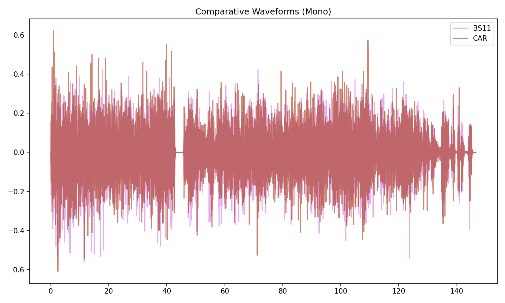

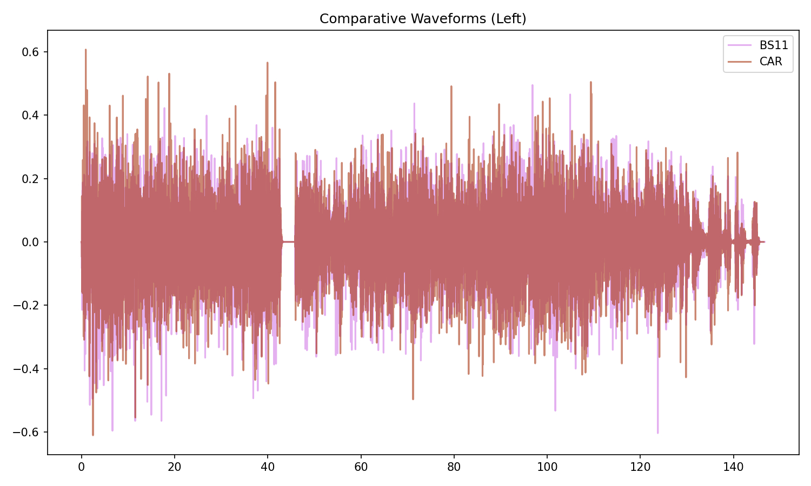

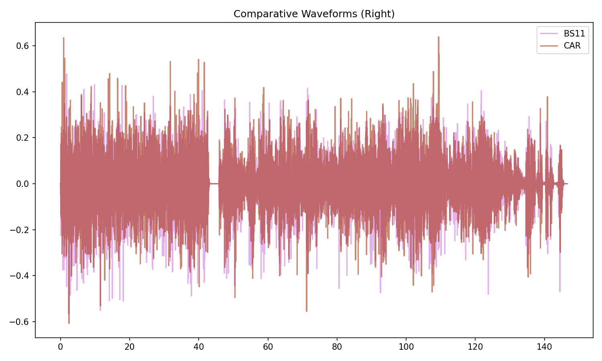

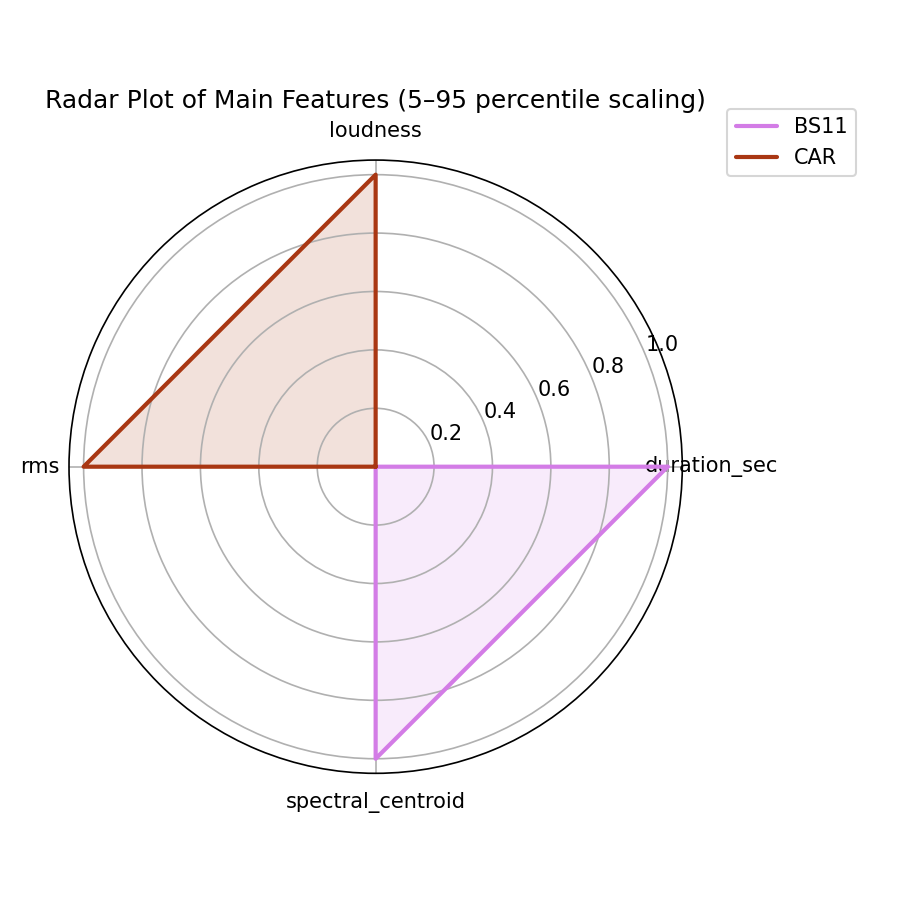

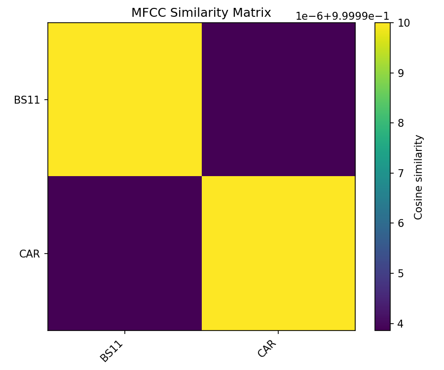

## Pitch & Speed Analysis (cents)

Reference version: **BS11**

| song_label   | ref_label   | cmp_label   | cmp_file                                                |   tuning_cents_cmp |   tuning_cents_ref |   delta_tuning_cents |   semitone_shift_vs_ref |   chroma_similarity |   speed_factor_from_pitch |   duration_ratio_ref_over_cmp |
|:-------------|:------------|:------------|:--------------------------------------------------------|-------------------:|-------------------:|---------------------:|------------------------:|--------------------:|--------------------------:|------------------------------:|
| conf_t2      | BS11        | BS11        | 22 - Bob Dylan & The Band - Confidential.wav            |                 18 |                 18 |                    0 |                       0 |            1        |                         1 |                        1      |
| conf_t2      | BS11        | CAR         | 06-22-Bob_Dylan-900_Miles_from_My_Home_Confide-SMR.flac |                 17 |                 18 |                   -1 |                       0 |            0.999937 |                         1 |                        1.0013 |

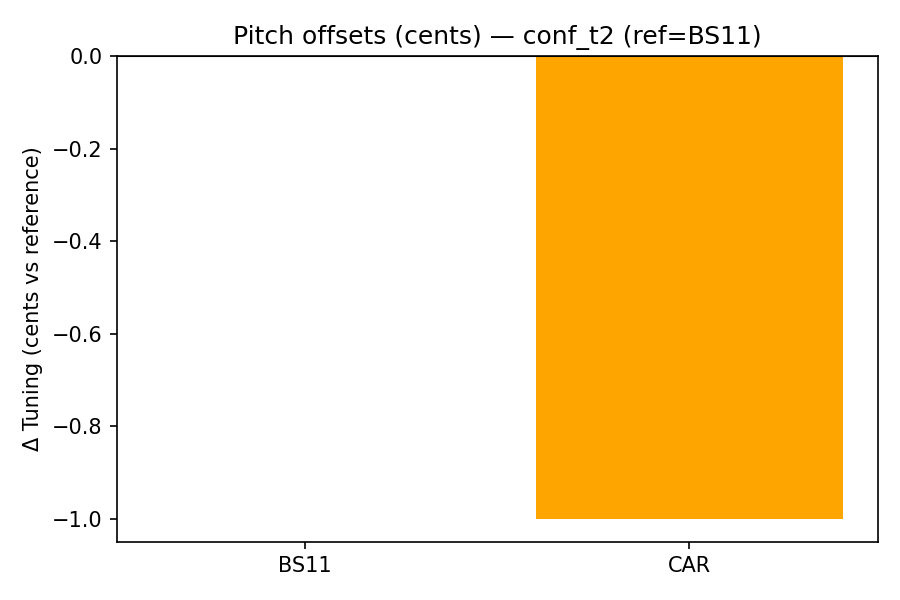

````text
Pitch/Speed analysis (reference = BS11)
============================================================

BS11 - 22 - Bob Dylan & The Band - Confidential.wav: shift=0 st ; Δtuning=0.0 cents ; speed_from_pitch=1.0000 ; duration_ratio(ref/cmp)=1.0000
CAR - 06-22-Bob_Dylan-900_Miles_from_My_Home_Confide-SMR.flac: shift=0 st ; Δtuning=-1.0 cents ; speed_from_pitch=1.0000 ; duration_ratio(ref/cmp)=1.0013

````

## Stereo Balance

### BS11

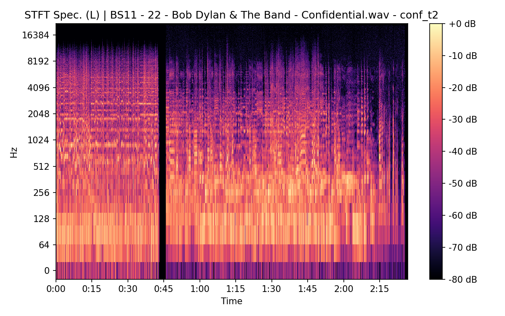

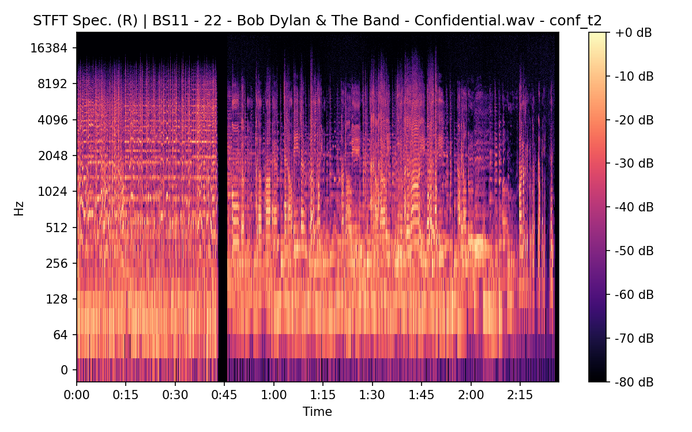


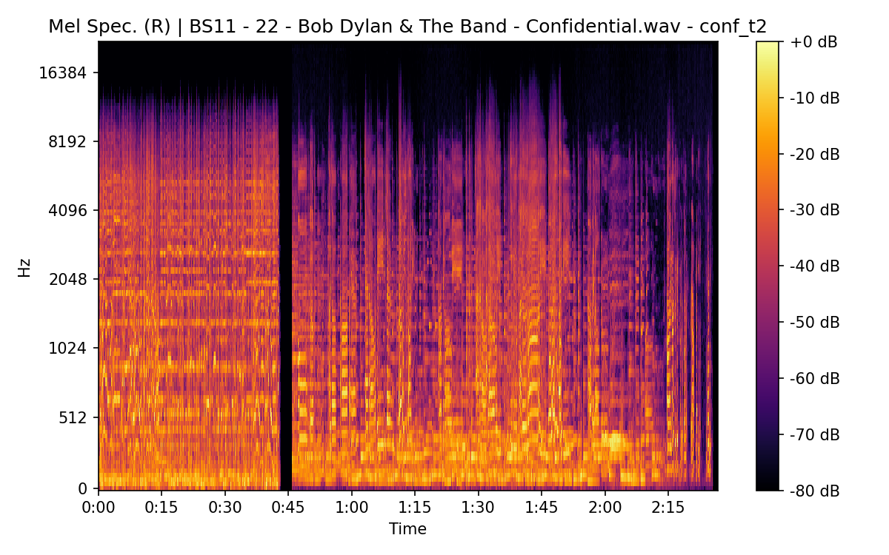

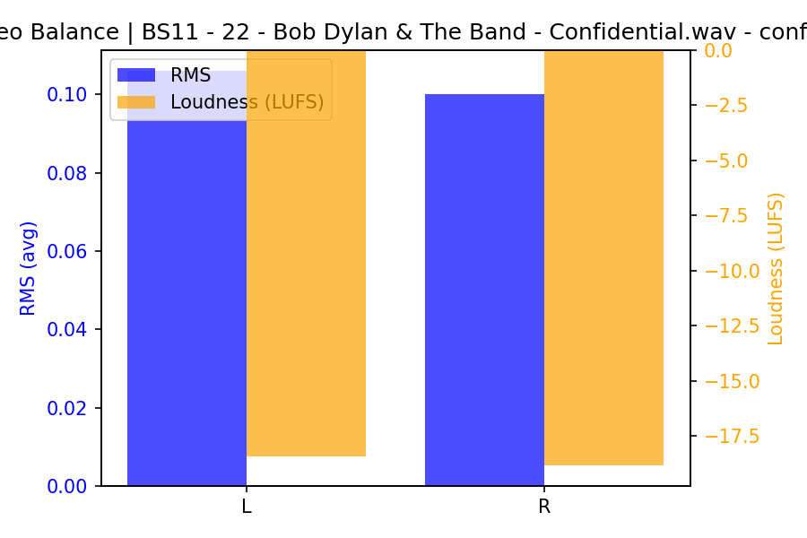

### CAR

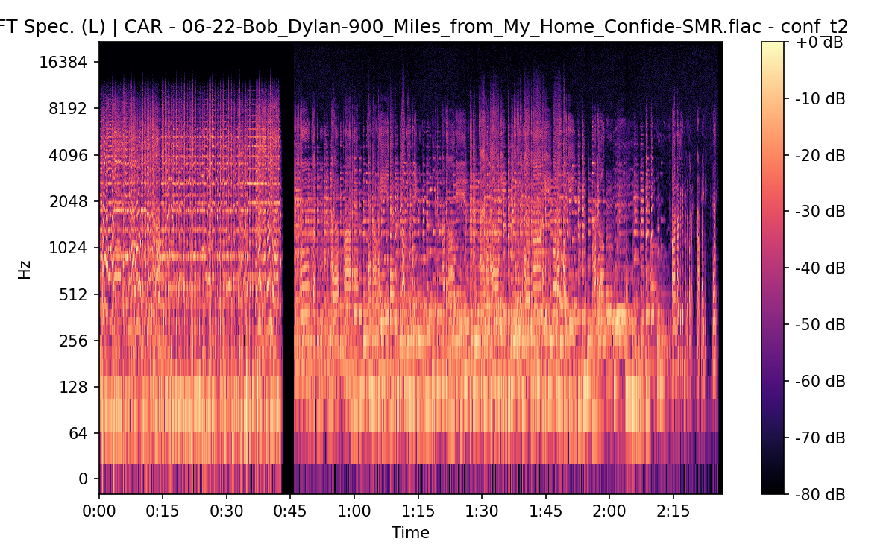

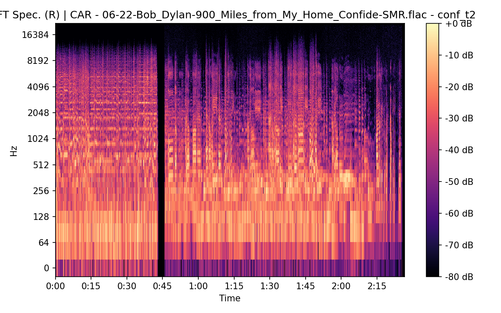


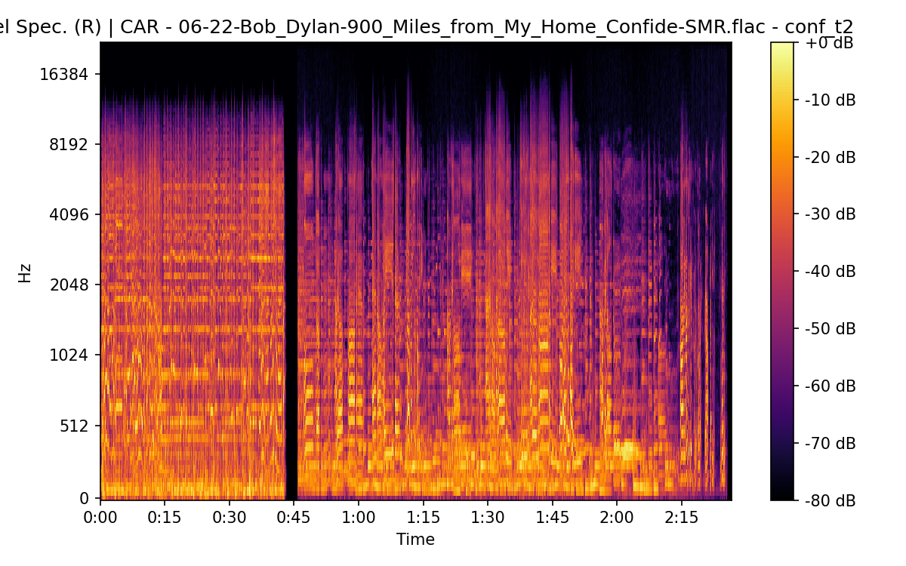


## Spectrograms (Mono)

### BS11

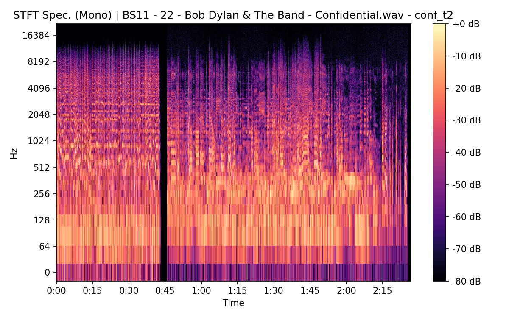

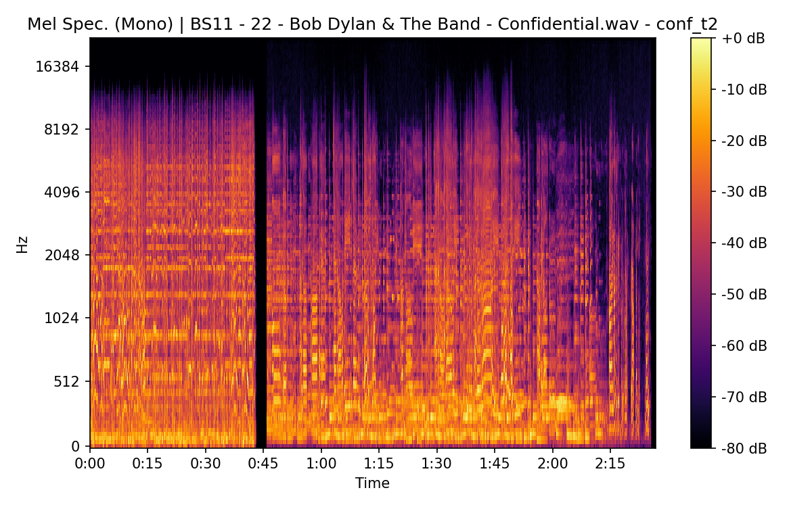

### CAR


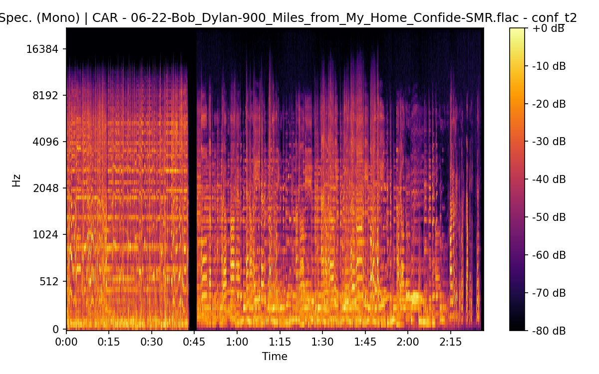

