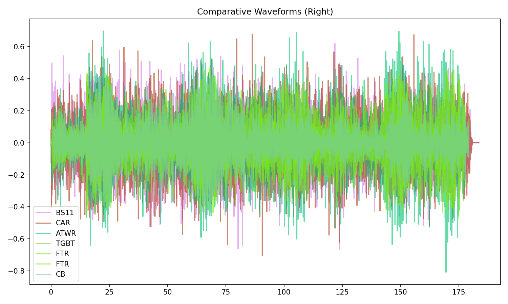
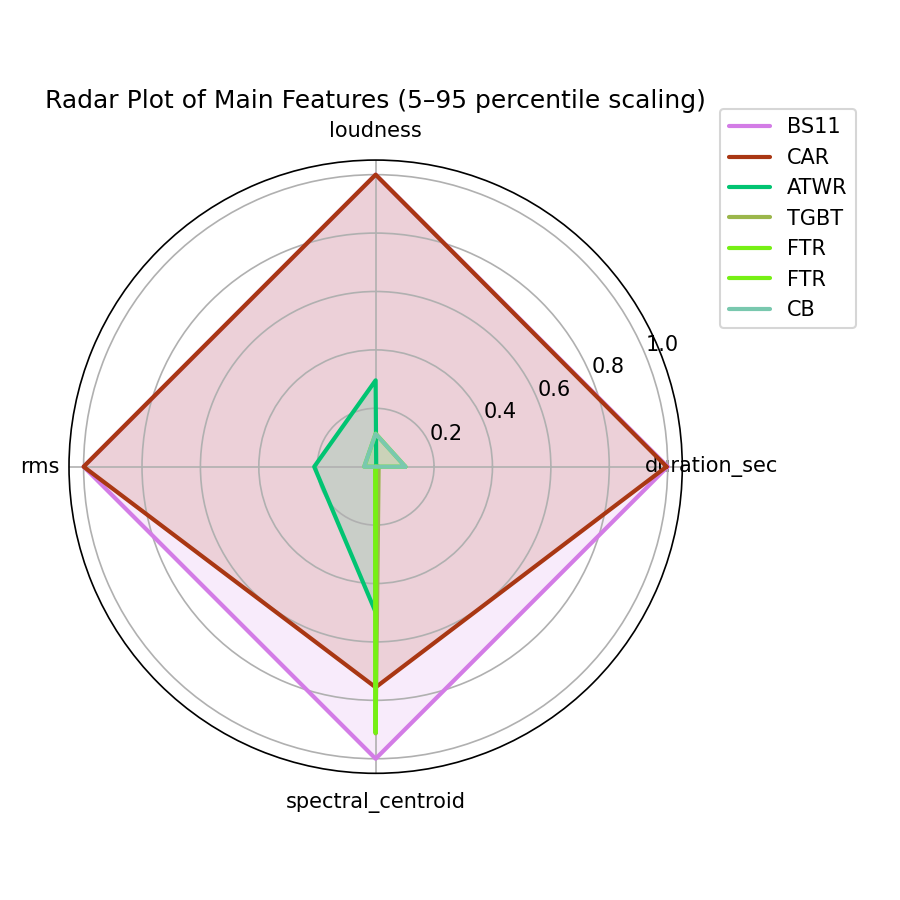
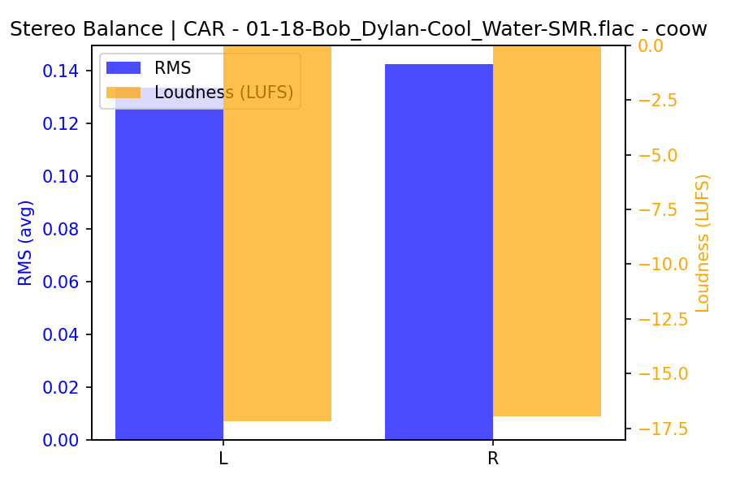

# Cool Water

**(title taken from BS11)**

[](){ #coow }

## Details

| label   | orig_file                                  | md5                              |   disc |   track |   duration_sec | duration_fmt   |   loudness |   loudness_left |   loudness_right |   loudness_balance |       rms |   rms_left |   rms_right |   rms_balance |   lr_corr |   spectral_centroid |
|:--------|:-------------------------------------------|:---------------------------------|-------:|--------:|---------------:|:---------------|-----------:|----------------:|-----------------:|-------------------:|----------:|-----------:|------------:|--------------:|----------:|--------------------:|
| BS11    | 18 - Bob Dylan & The Band - Cool Water.wav | d0081006d45e14a38c07bde769fbd79c |      1 |      18 |        183.667 | 03:03:667      |   -17.366  |        -17.1765 |         -16.9696 |          -0.206929 | 0.134523  |  0.133417  |   0.142274  |   -0.00885704 |  0.898709 |             1976.22 |
| CAR     | 01-18-Bob_Dylan-Cool_Water-SMR.flac        | 91109d8b048f534591a0476827758a71 |      1 |      18 |        183.641 | 03:03:641      |   -17.3657 |        -17.1759 |         -16.9693 |          -0.206558 | 0.134538  |  0.133432  |   0.142291  |   -0.00885898 |  0.898709 |             1879.7  |
| ATWR    | 08 Cool Water.flac                         | 974249858a108a44d95ad480b5cd4aee |      2 |       8 |        178.867 | 02:58:867      |   -21.6766 |        -17.7943 |         -15.6898 |          -2.10447  | 0.0717058 |  0.117367  |   0.137834  |   -0.0204665  | -0.414085 |             1791.52 |
| TGBT    | 20 Cool Water.flac                         | 35c682ed105cc365653dddb1d5a298bf |      5 |      20 |        178.907 | 02:58:907      |   -23.4888 |        -19.1898 |         -18.3217 |          -0.868047 | 0.0549654 |  0.0986754 |   0.0968094 |    0.00186605 | -0.407268 |             1933.83 |
| FTR     | 14. Cool Water.flac                        | f120a630bb0bc93e31e7ee74270b9a54 |      2 |      14 |        179.347 | 02:59:347      |   -22.7936 |        -16.3667 |         -20.8236 |           4.45688  | 0.058076  |  0.122425  |   0.0771595 |    0.0452655  | -0.423597 |             1620.78 |
| FTR     | 22. Cool Water.flac                        | 9f713be40574027dfff19c6409663795 |      2 |      22 |        178.853 | 02:58:853      |   -23.4842 |        -19.2057 |         -18.3284 |          -0.877219 | 0.0549774 |  0.0986985 |   0.0968297 |    0.00186882 | -0.407267 |             1933.17 |
| CB      | 16 Cool Water.flac                         | e8053b345275ff14dd49f756ec68c749 |      2 |      16 |        179.347 | 02:59:347      |   -22.7986 |        -16.3674 |         -20.8256 |           4.45819  | 0.0580922 |  0.122462  |   0.0771723 |    0.0452899  | -0.42358  |             1620.75 |

## Plots







## Pitch & Speed Analysis (cents)

Reference version: **BS11**

| song_label   | ref_label   | cmp_label   | cmp_file                                   |   tuning_cents_cmp |   tuning_cents_ref |   delta_tuning_cents |   semitone_shift_vs_ref |   chroma_similarity |   speed_factor_from_pitch |   duration_ratio_ref_over_cmp |
|:-------------|:------------|:------------|:-------------------------------------------|-------------------:|-------------------:|---------------------:|------------------------:|--------------------:|--------------------------:|------------------------------:|
| coow         | BS11        | BS11        | 18 - Bob Dylan & The Band - Cool Water.wav |                  3 |                  3 |                    0 |                       0 |            1        |                         1 |                       1       |
| coow         | BS11        | CAR         | 01-18-Bob_Dylan-Cool_Water-SMR.flac        |                  4 |                  3 |                    1 |                       0 |            0.999999 |                         1 |                       1.00014 |
| coow         | BS11        | ATWR        | 08 Cool Water.flac                         |                 27 |                  3 |                   24 |                       0 |            0.983963 |                         1 |                       1.02684 |
| coow         | BS11        | TGBT        | 20 Cool Water.flac                         |                 24 |                  3 |                   21 |                       0 |            0.987555 |                         1 |                       1.02661 |
| coow         | BS11        | FTR         | 14. Cool Water.flac                        |                  4 |                  3 |                    1 |                       0 |            0.996942 |                         1 |                       1.02409 |
| coow         | BS11        | FTR         | 22. Cool Water.flac                        |                 23 |                  3 |                   20 |                       0 |            0.98612  |                         1 |                       1.02691 |
| coow         | BS11        | CB          | 16 Cool Water.flac                         |                  4 |                  3 |                    1 |                       0 |            0.996843 |                         1 |                       1.02409 |


````text
Pitch/Speed analysis (reference = BS11)
============================================================

BS11 - 18 - Bob Dylan & The Band - Cool Water.wav: shift=0 st ; Δtuning=0.0 cents ; speed_from_pitch=1.0000 ; duration_ratio(ref/cmp)=1.0000
CAR - 01-18-Bob_Dylan-Cool_Water-SMR.flac: shift=0 st ; Δtuning=1.0 cents ; speed_from_pitch=1.0000 ; duration_ratio(ref/cmp)=1.0001
ATWR - 08 Cool Water.flac: shift=0 st ; Δtuning=24.0 cents ; speed_from_pitch=1.0000 ; duration_ratio(ref/cmp)=1.0268
TGBT - 20 Cool Water.flac: shift=0 st ; Δtuning=21.0 cents ; speed_from_pitch=1.0000 ; duration_ratio(ref/cmp)=1.0266
FTR - 14. Cool Water.flac: shift=0 st ; Δtuning=1.0 cents ; speed_from_pitch=1.0000 ; duration_ratio(ref/cmp)=1.0241
FTR - 22. Cool Water.flac: shift=0 st ; Δtuning=20.0 cents ; speed_from_pitch=1.0000 ; duration_ratio(ref/cmp)=1.0269
CB - 16 Cool Water.flac: shift=0 st ; Δtuning=1.0 cents ; speed_from_pitch=1.0000 ; duration_ratio(ref/cmp)=1.0241

````

## Stereo Balance

### BS11


### CAR




### ATWR


### TGBT


### FTR


### FTR

.png)

.png)

.png)

.png)

.png)

### CB


## Spectrograms (Mono)

### BS11


### CAR


### ATWR


### TGBT


### FTR


### FTR

.png)

.png)

### CB


