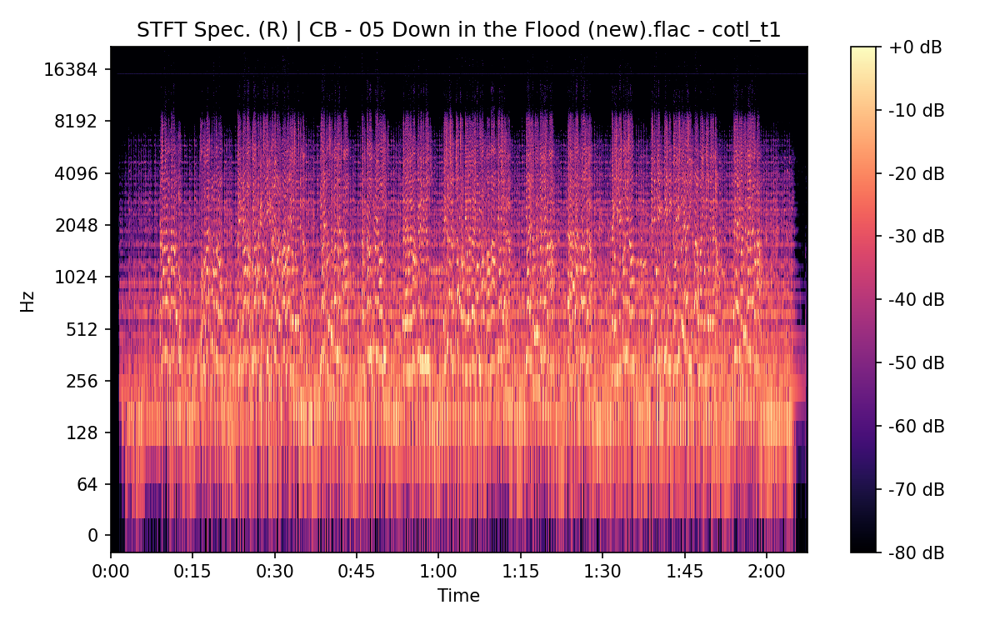

# Crash On The Levee (Take 1)

**(title taken from BS11)**

[](){ #cotl_t1 }

## Details

| label   | orig_file                                          | md5                              |   disc |   track |   duration_sec | duration_fmt   |   loudness |   loudness_left |   loudness_right |   loudness_balance |       rms |   rms_left |   rms_right |   rms_balance |   lr_corr |   spectral_centroid |
|:--------|:---------------------------------------------------|:---------------------------------|-------:|--------:|---------------:|:---------------|-----------:|----------------:|-----------------:|-------------------:|----------:|-----------:|------------:|--------------:|----------:|--------------------:|
| BS11    | 13 - Bob Dylan - Crash On The Levee (Take 1).wav   | b311f286756384349a93e280c22d6707 |      3 |      13 |        130.507 | 02:10:507      |   -16.776  |        -16.9703 |         -16.2805 |         -0.689826  | 0.133381  |  0.139148  |    0.1301   |    0.00904797 | 0.940866  |             2037.58 |
| CAR     | 03-13-Bob_Dylan-Crash_on_the_Levee_Take_1-SMR.flac | 541b04c4b8750a7b5a5a84c38d6bf5d5 |      3 |      13 |        130.512 | 02:10:512      |   -16.7698 |        -16.9734 |         -16.2901 |         -0.683304  | 0.133353  |  0.139117  |    0.130076 |    0.00904121 | 0.940861  |             1895.57 |
| ATWR    | 18 Crash On The Levee - Take 1.flac                | 97b38608596f46036d3a6c4d0d3d6fd6 |      3 |      18 |        130.867 | 02:10:867      |   -16.9571 |        -15.972  |         -17.7121 |          1.7401    | 0.121869  |  0.144091  |    0.102865 |    0.0412259  | 0.916223  |             1741.67 |
| SBD     | 04 Crash On The Levee.flac                         | 09ee96617bc692e8789b01a2b9071e72 |      2 |       4 |        127.2   | 02:07:200      |   -14.8256 |        -13.6    |         -15.855  |          2.25499   | 0.161197  |  0.195243  |    0.131344 |    0.0638988  | 0.9157    |             1589.68 |
| TGBT    | 06 Crash On The Levee (Version 1).flac             | a174df50042f54cc7603ee8e587164d6 |      3 |       6 |        131.933 | 02:11:933      |   -14.8997 |        -14.9201 |         -14.874  |         -0.0461271 | 0.159567  |  0.158614  |    0.160557 |   -0.00194302 | 0.999487  |             2286.36 |
| FTR     | 05. Crash on the Levee.flac                        | ca6730c49a66f72d89460546e589618f |      5 |       5 |        127.347 | 02:07:347      |   -21.8571 |        -20.8494 |         -17.5927 |         -3.25671   | 0.0771434 |  0.0913157 |    0.114575 |   -0.0232591  | 0.0121155 |             1422.55 |
| CB      | 05 Down in the Flood (new).flac                    | 488549be4eacd3a428f6db0a4dd394d8 |      5 |       5 |        127.347 | 02:07:347      |   -21.8639 |        -20.8394 |         -17.5928 |         -3.24659   | 0.0771482 |  0.091316  |    0.114576 |   -0.0232604  | 0.0121151 |             1422.04 |

## Plots


## Pitch & Speed Analysis (cents)

Reference version: **BS11**

| song_label   | ref_label   | cmp_label   | cmp_file                                           |   tuning_cents_cmp |   tuning_cents_ref |   delta_tuning_cents |   semitone_shift_vs_ref |   chroma_similarity |   speed_factor_from_pitch |   duration_ratio_ref_over_cmp |
|:-------------|:------------|:------------|:---------------------------------------------------|-------------------:|-------------------:|---------------------:|------------------------:|--------------------:|--------------------------:|------------------------------:|
| cotl_t1      | BS11        | BS11        | 13 - Bob Dylan - Crash On The Levee (Take 1).wav   |                -18 |                -18 |                    0 |                       0 |            1        |                         1 |                      1        |
| cotl_t1      | BS11        | CAR         | 03-13-Bob_Dylan-Crash_on_the_Levee_Take_1-SMR.flac |                -18 |                -18 |                    0 |                       0 |            0.990678 |                         1 |                      0.999961 |
| cotl_t1      | BS11        | ATWR        | 18 Crash On The Levee - Take 1.flac                |                 -3 |                -18 |                   15 |                       0 |            0.999507 |                         1 |                      0.997249 |
| cotl_t1      | BS11        | SBD         | 04 Crash On The Levee.flac                         |                  1 |                -18 |                   19 |                       0 |            0.999706 |                         1 |                      1.026    |
| cotl_t1      | BS11        | TGBT        | 06 Crash On The Levee (Version 1).flac             |                 -7 |                -18 |                   11 |                       0 |            0.998731 |                         1 |                      0.989186 |
| cotl_t1      | BS11        | FTR         | 05. Crash on the Levee.flac                        |                 11 |                -18 |                   29 |                       0 |            0.998268 |                         1 |                      1.02481  |
| cotl_t1      | BS11        | CB          | 05 Down in the Flood (new).flac                    |                 13 |                -18 |                   31 |                       0 |            0.998219 |                         1 |                      1.02481  |


````text
Pitch/Speed analysis (reference = BS11)
============================================================

BS11 - 13 - Bob Dylan - Crash On The Levee (Take 1).wav: shift=0 st ; Δtuning=0.0 cents ; speed_from_pitch=1.0000 ; duration_ratio(ref/cmp)=1.0000
CAR - 03-13-Bob_Dylan-Crash_on_the_Levee_Take_1-SMR.flac: shift=0 st ; Δtuning=0.0 cents ; speed_from_pitch=1.0000 ; duration_ratio(ref/cmp)=1.0000
ATWR - 18 Crash On The Levee - Take 1.flac: shift=0 st ; Δtuning=15.0 cents ; speed_from_pitch=1.0000 ; duration_ratio(ref/cmp)=0.9972
SBD - 04 Crash On The Levee.flac: shift=0 st ; Δtuning=19.0 cents ; speed_from_pitch=1.0000 ; duration_ratio(ref/cmp)=1.0260
TGBT - 06 Crash On The Levee (Version 1).flac: shift=0 st ; Δtuning=11.0 cents ; speed_from_pitch=1.0000 ; duration_ratio(ref/cmp)=0.9892
FTR - 05. Crash on the Levee.flac: shift=0 st ; Δtuning=29.0 cents ; speed_from_pitch=1.0000 ; duration_ratio(ref/cmp)=1.0248
CB - 05 Down in the Flood (new).flac: shift=0 st ; Δtuning=31.0 cents ; speed_from_pitch=1.0000 ; duration_ratio(ref/cmp)=1.0248

````

## Stereo Balance

### BS11


### CAR


### ATWR


### SBD


### TGBT


### FTR


### CB





## Spectrograms (Mono)

### BS11


### CAR


### ATWR


### SBD


### TGBT


### FTR


### CB


