# Dress It up, Better Have It All

**(title taken from BS11)**

[](){ #diubhia }

## Details

| label   | orig_file                                                       | md5                              |   disc |   track |   duration_sec | duration_fmt   |   loudness |   loudness_left |   loudness_right |   loudness_balance |      rms |   rms_left |   rms_right |   rms_balance |   lr_corr |   spectral_centroid |
|:--------|:----------------------------------------------------------------|:---------------------------------|-------:|--------:|---------------:|:---------------|-----------:|----------------:|-----------------:|-------------------:|---------:|-----------:|------------:|--------------:|----------:|--------------------:|
| BS11    | 10 - Bob Dylan & The Band - Dress It up, Better Have It All.wav | 1fb49455c7143664023af1479cb31486 |      5 |      10 |        173.28  | 02:53:280      |   -16.4919 |        -15.7417 |         -16.4916 |           0.749914 | 0.144438 |   0.162627 |    0.138905 |     0.0237224 |  0.816561 |             1868.76 |
| CAR     | 05-10-Bob_Dylan-Dress_It_up_Better_Have_it_All-SMR.flac         | 65e6081dc21200e68bfb3c202b757d77 |      5 |      10 |        173.279 | 02:53:279      |   -16.4968 |        -15.7443 |         -16.4894 |           0.745121 | 0.144452 |   0.162642 |    0.13892  |     0.0237225 |  0.816561 |             1757.9  |

## Plots
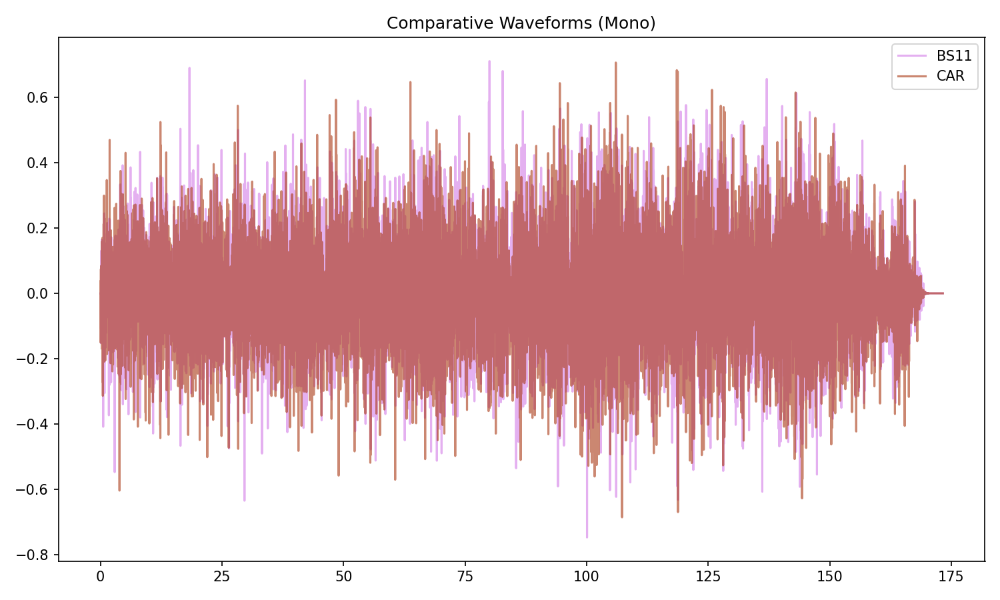

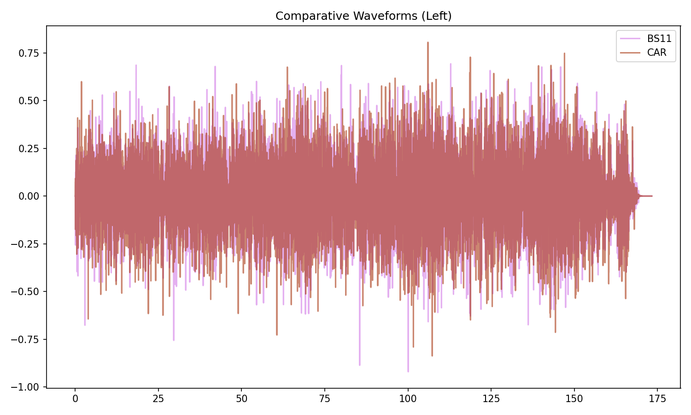

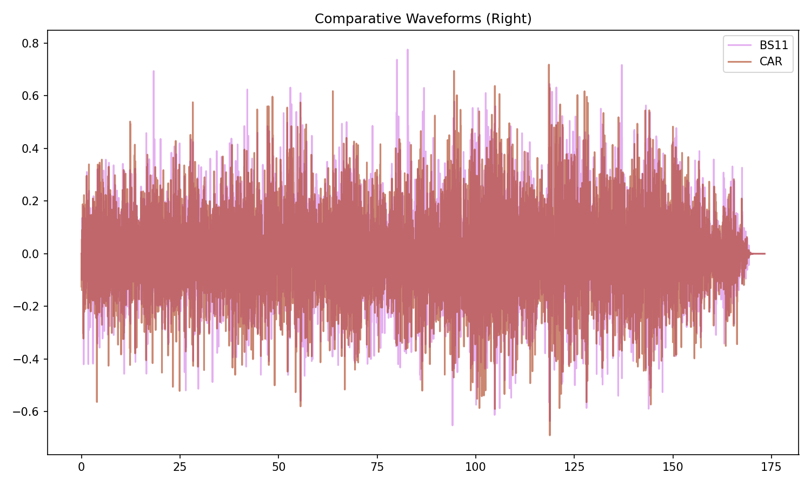

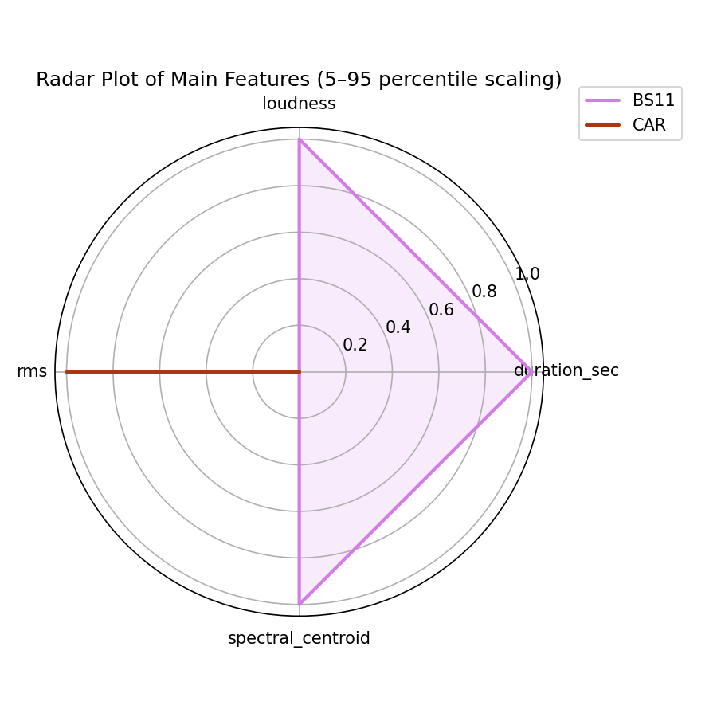

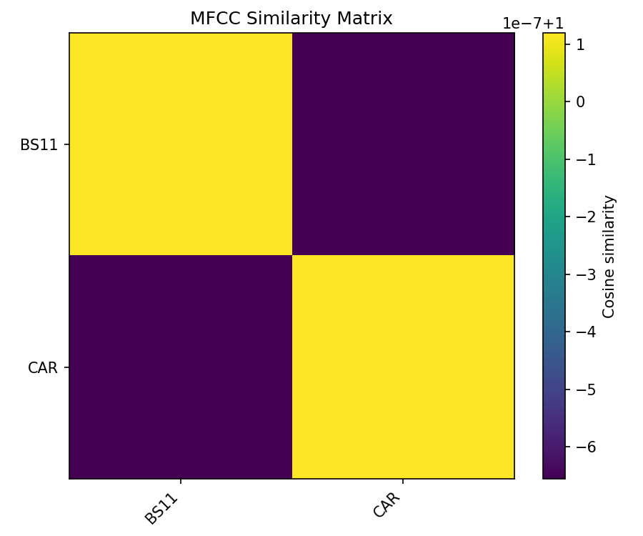

## Pitch & Speed Analysis (cents)

Reference version: **BS11**

| song_label   | ref_label   | cmp_label   | cmp_file                                                        |   tuning_cents_cmp |   tuning_cents_ref |   delta_tuning_cents |   semitone_shift_vs_ref |   chroma_similarity |   speed_factor_from_pitch |   duration_ratio_ref_over_cmp |
|:-------------|:------------|:------------|:----------------------------------------------------------------|-------------------:|-------------------:|---------------------:|------------------------:|--------------------:|--------------------------:|------------------------------:|
| diubhia      | BS11        | BS11        | 10 - Bob Dylan & The Band - Dress It up, Better Have It All.wav |                -15 |                -15 |                    0 |                       0 |            1        |                         1 |                       1       |
| diubhia      | BS11        | CAR         | 05-10-Bob_Dylan-Dress_It_up_Better_Have_it_All-SMR.flac         |                -14 |                -15 |                    1 |                       0 |            0.999996 |                         1 |                       1.00001 |

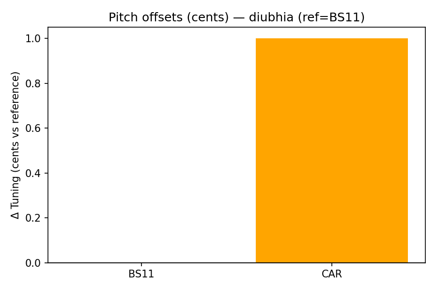

````text
Pitch/Speed analysis (reference = BS11)
============================================================

BS11 - 10 - Bob Dylan & The Band - Dress It up, Better Have It All.wav: shift=0 st ; Δtuning=0.0 cents ; speed_from_pitch=1.0000 ; duration_ratio(ref/cmp)=1.0000
CAR - 05-10-Bob_Dylan-Dress_It_up_Better_Have_it_All-SMR.flac: shift=0 st ; Δtuning=1.0 cents ; speed_from_pitch=1.0000 ; duration_ratio(ref/cmp)=1.0000

````

## Stereo Balance

### BS11

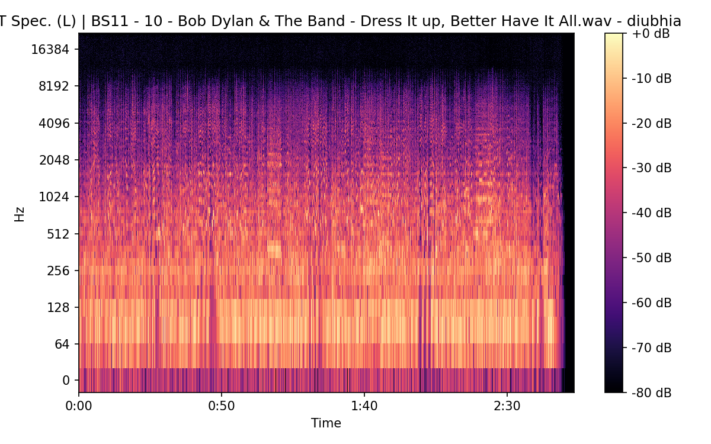


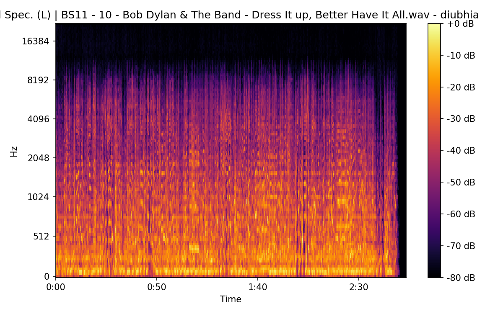

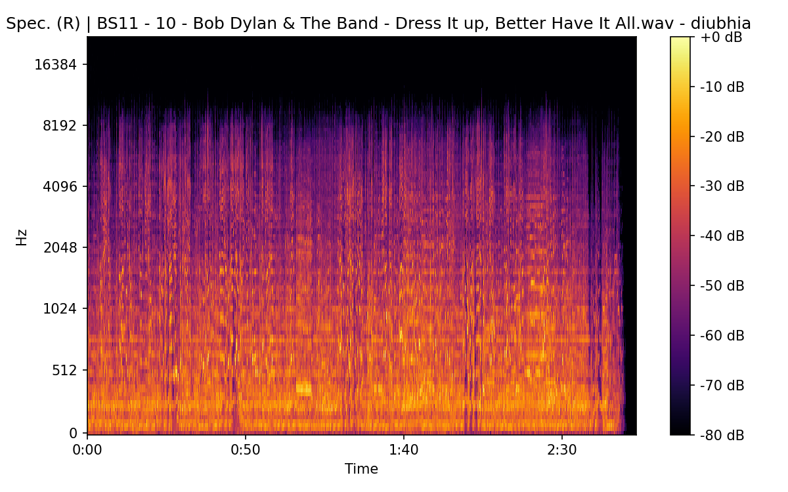

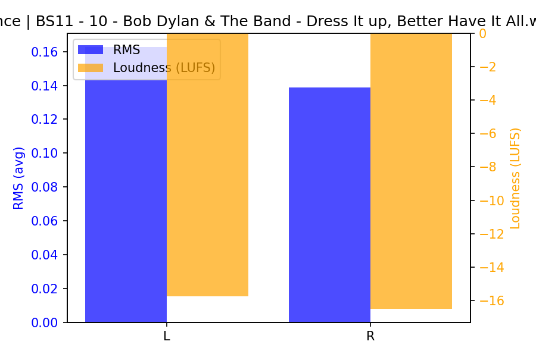

### CAR


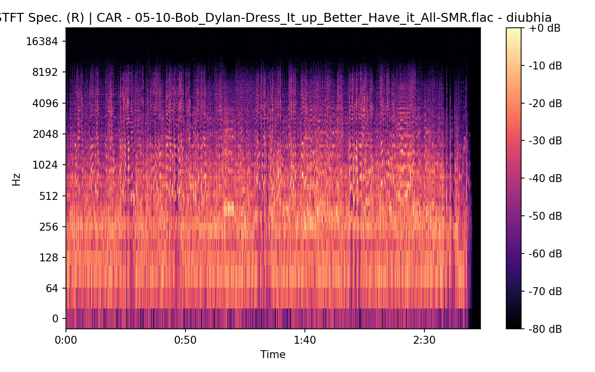

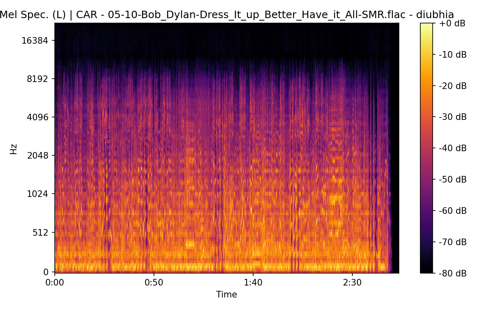


## Spectrograms (Mono)

### BS11


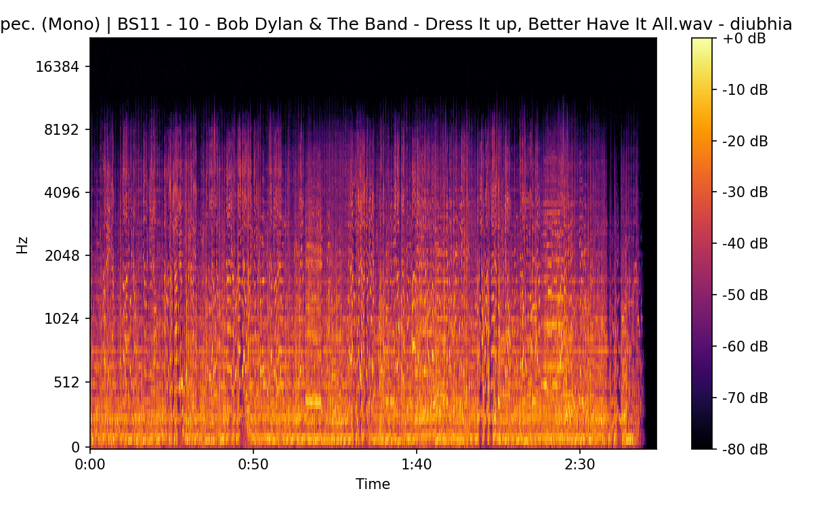

### CAR

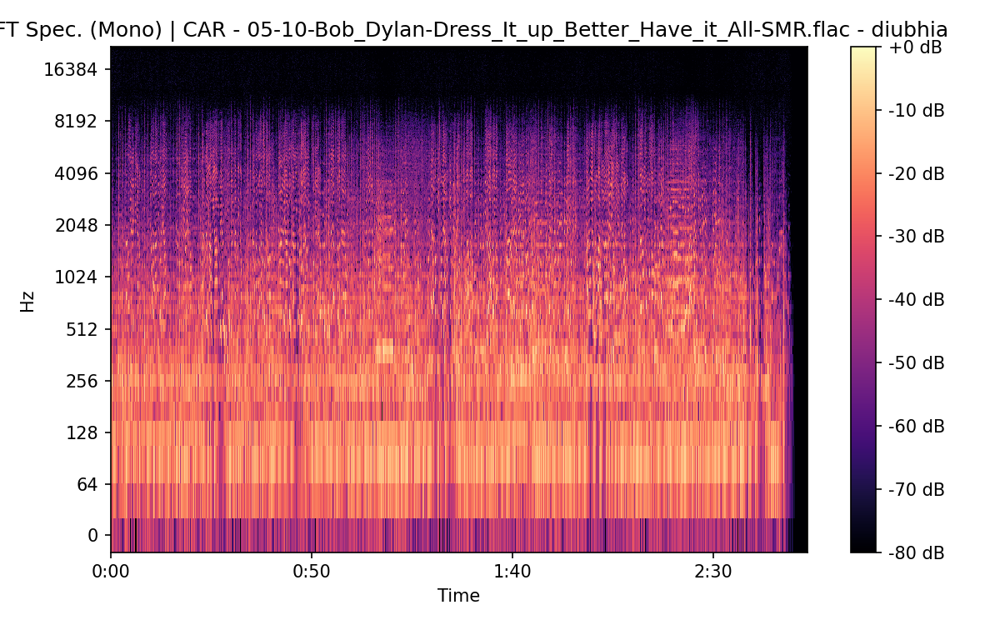

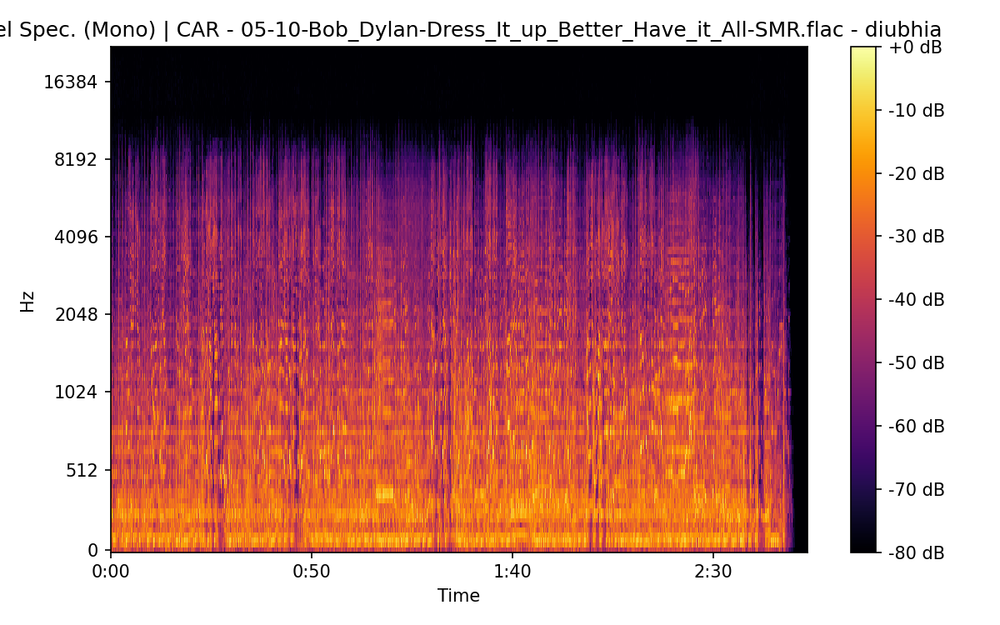

