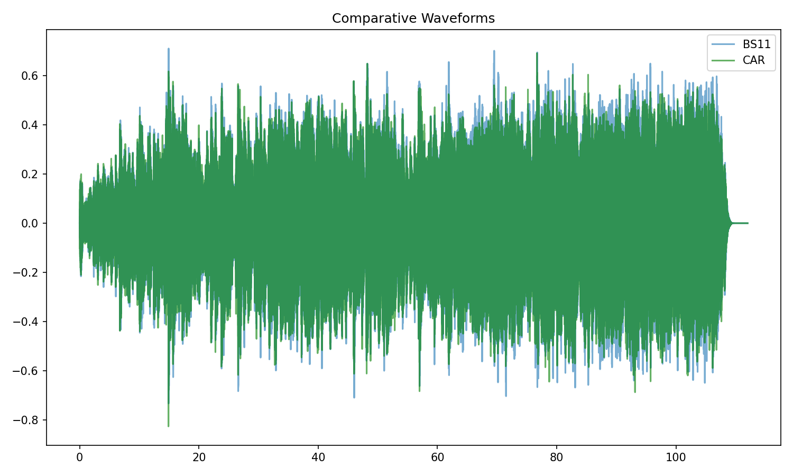
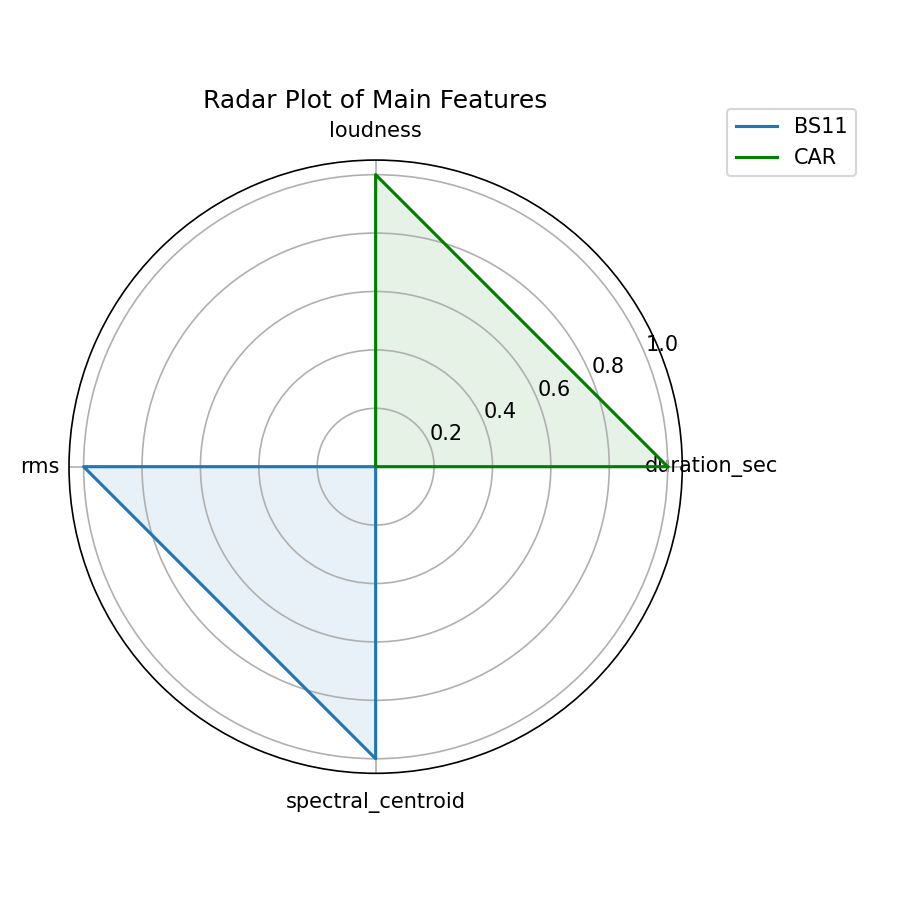
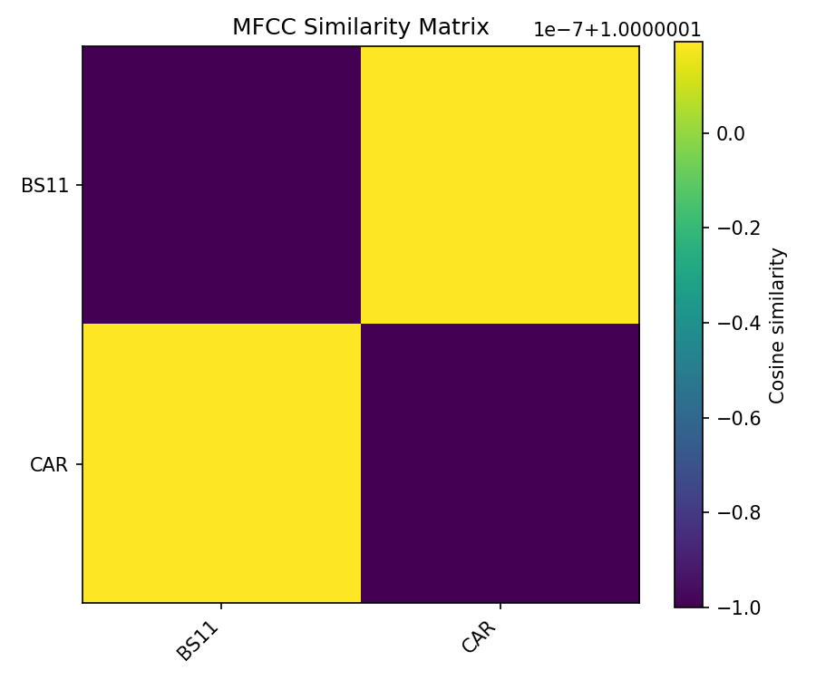
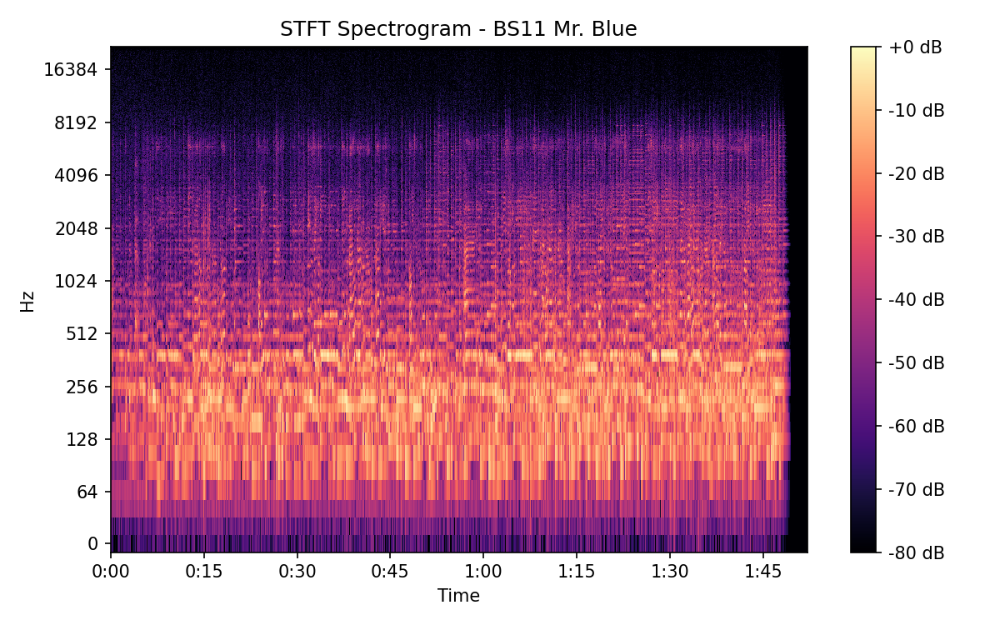
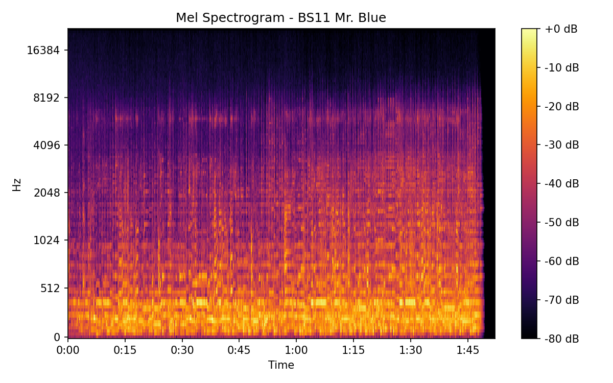
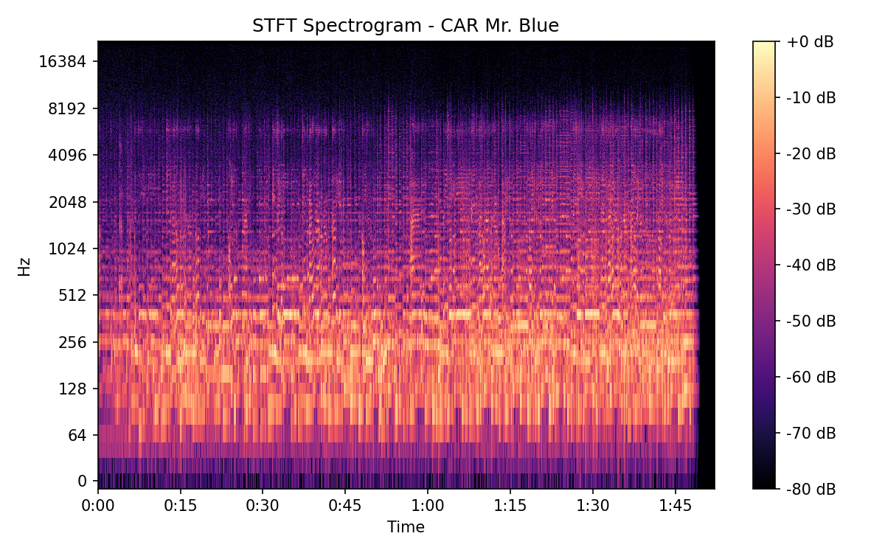
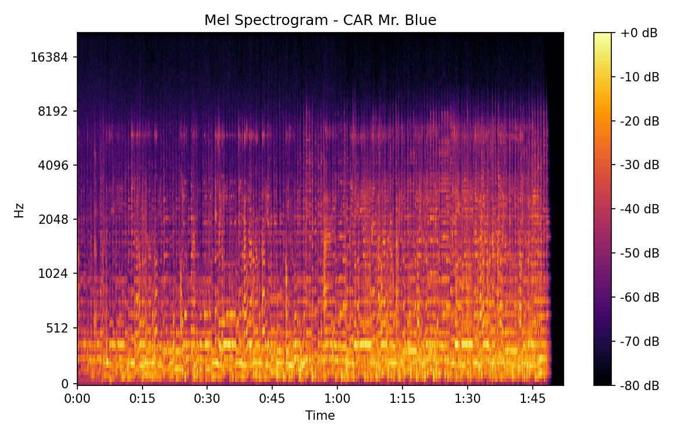

# Mr. Blue

## Details

| label   | orig_file                                | md5                              |   disc |   track |   duration_sec | duration_fmt   |   loudness |      rms |   spectral_centroid |
|:--------|:-----------------------------------------|:---------------------------------|-------:|--------:|---------------:|:---------------|-----------:|---------:|--------------------:|
| BS11    | 04 - Bob Dylan & The Band - Mr. Blue.wav | b085207d587f87e9707a8c75dab60e40 |      1 |       4 |        112.013 | 01:52:013      |   -17.637  | 0.131141 |             1846.68 |
| CAR     | 01-04-Bob_Dylan-Mr_Blue-SMR.flac         | 898aec7e313903bef60813d3ea259926 |      1 |       4 |        112.029 | 01:52:028      |   -17.6334 | 0.131121 |             1690.05 |

## Plots

## Spectrograms

### BS11

### CAR

