# Orange Juice Blues (Instrumental) (title taken from FTR)

## Details

| label   | orig_file       | md5                              |   disc |   track |   duration_sec | duration_fmt   |   loudness |   loudness_left |   loudness_right |   loudness_balance |       rms |   rms_left |   rms_right |   rms_balance |    lr_corr |   spectral_centroid |
|:--------|:----------------|:---------------------------------|-------:|--------:|---------------:|:---------------|-----------:|----------------:|-----------------:|-------------------:|----------:|-----------:|------------:|--------------:|-----------:|--------------------:|
| FTR     | Track No17.flac | 79078a954b8ae89f846a6c99172ed43b |      6 |      17 |        192.693 | 03:12:693      |   -23.5771 |        -17.2698 |         -22.0258 |            4.75604 | 0.0616754 |   0.10637  |   0.0619207 |     0.0444496 | -0.0468442 |             2250.26 |
| FTR     | Track No25.flac | 3ea0ad3b53d377b132a2131b3b2049e1 |      6 |      25 |        194.093 | 03:14:093      |   -27.6976 |        -28.8    |         -24.7901 |           -4.00993 | 0.0419166 |   0.034209 |   0.0564667 |    -0.0222577 |  0.686711  |             1331.67 |

## Plots
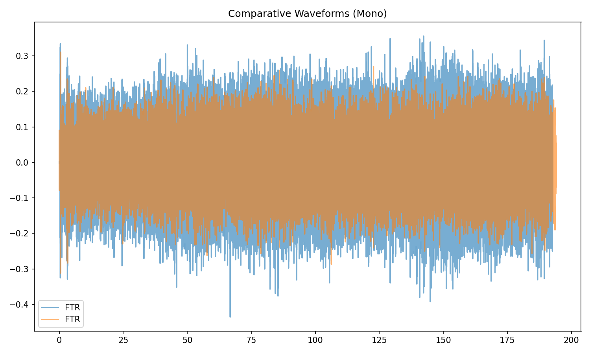

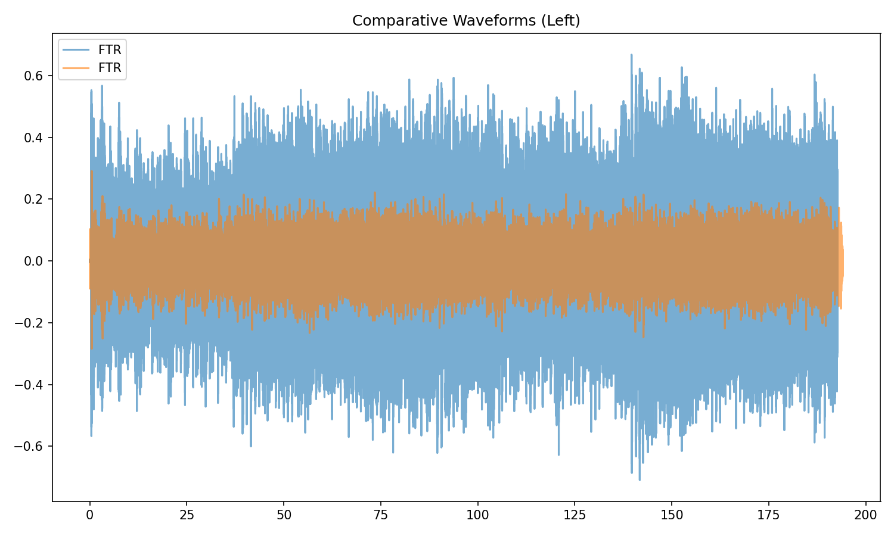

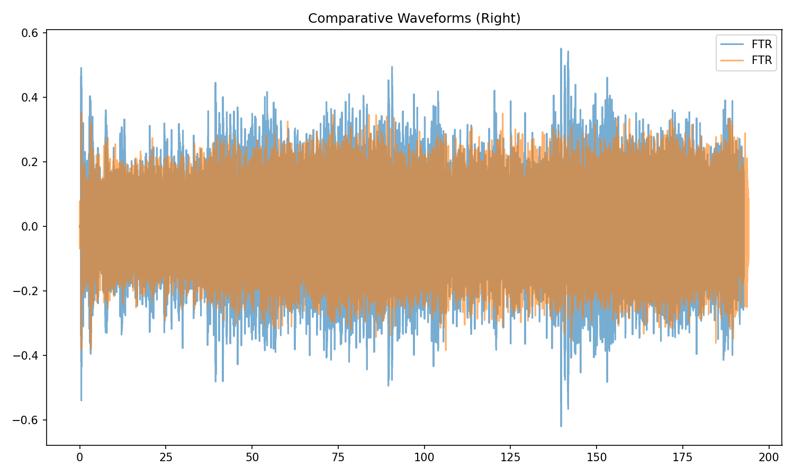

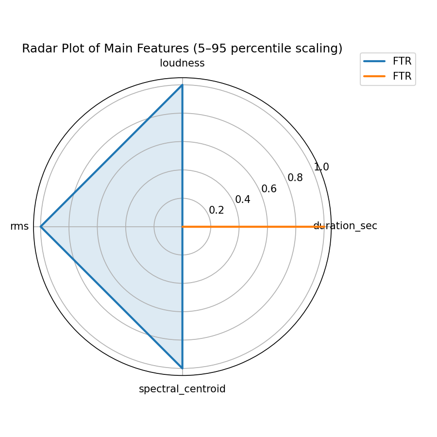

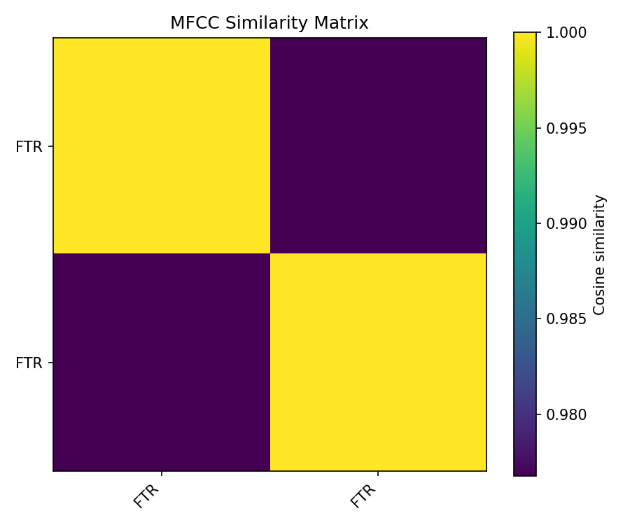

## Stereo Balance

### FTR

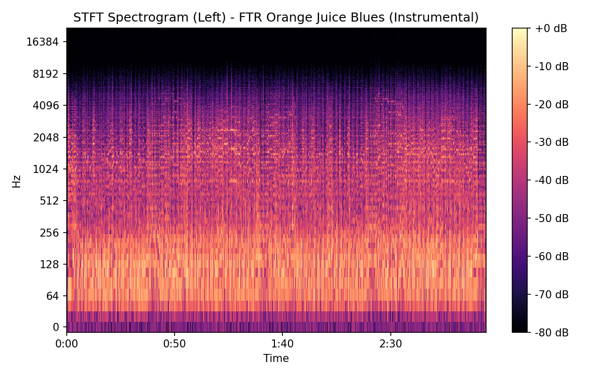


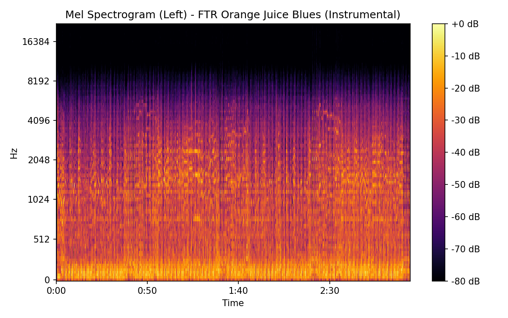

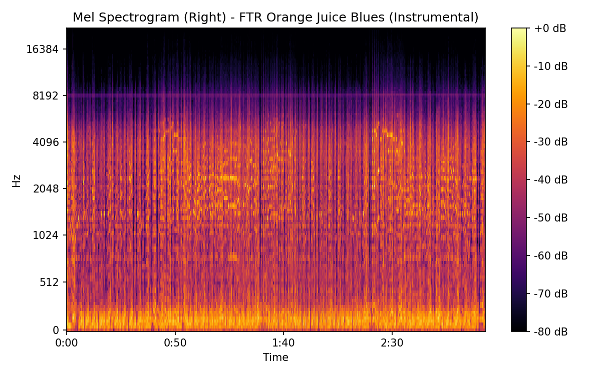

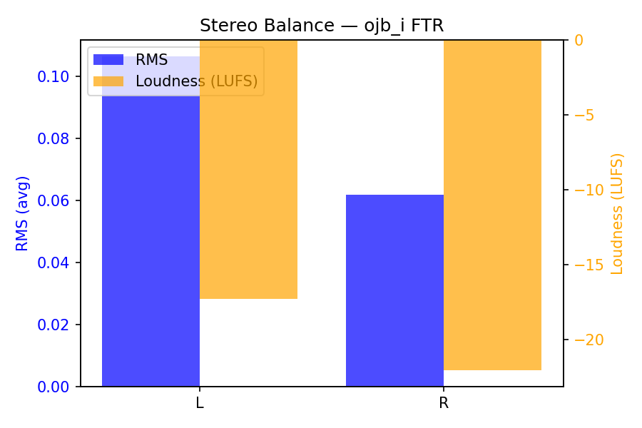

### FTR

.png)

.png)

.png)

.png)

.png)

## Spectrograms (Mono)

### FTR

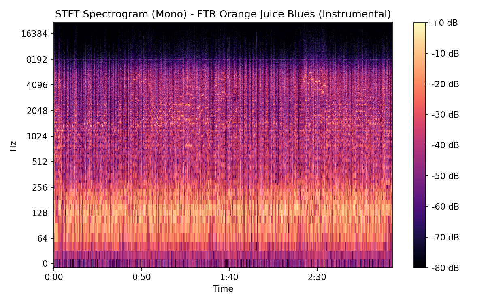

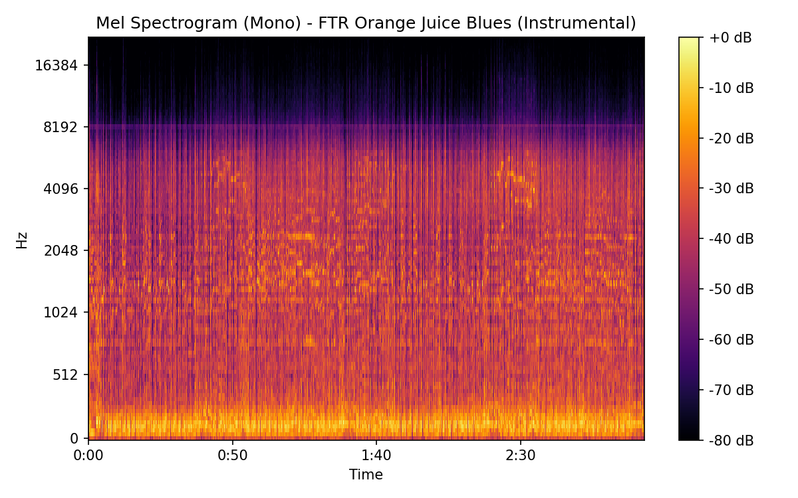

### FTR

.png)

.png)

## Pitch & Speed Analysis (cents)

Reference version: **FTR**

| song_label   | ref_label   | cmp_label   |   tuning_cents_cmp |   tuning_cents_ref |   delta_tuning_cents |   semitone_shift_vs_ref |   chroma_similarity |   speed_factor_from_pitch |   duration_ratio_ref_over_cmp |
|:-------------|:------------|:------------|-------------------:|-------------------:|---------------------:|------------------------:|--------------------:|--------------------------:|------------------------------:|
| ojb_i        | FTR         | FTR         |                 25 |                 25 |                    0 |                       0 |            1        |                         1 |                      1        |
| ojb_i        | FTR         | FTR         |                 11 |                 25 |                  -14 |                       0 |            0.995957 |                         1 |                      0.992787 |

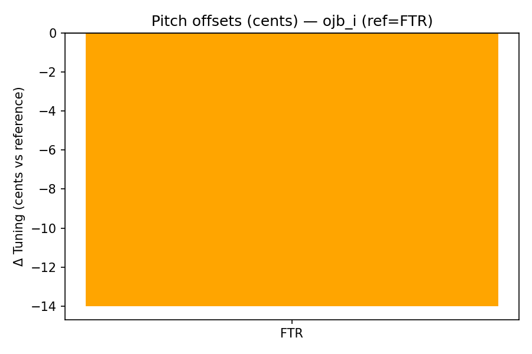

````text
Pitch/Speed analysis (reference = FTR)
============================================================

FTR: shift=0 st ; Δtuning=0.0 cents ; speed_from_pitch=1.0000 ; duration_ratio(ref/cmp)=1.0000
FTR: shift=0 st ; Δtuning=-14.0 cents ; speed_from_pitch=1.0000 ; duration_ratio(ref/cmp)=0.9928

````

