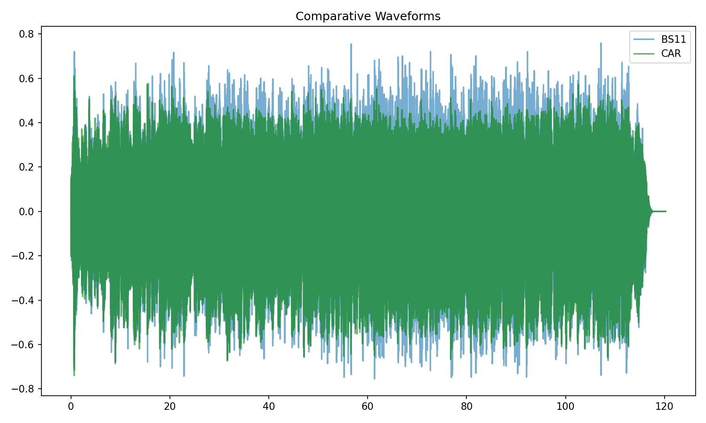
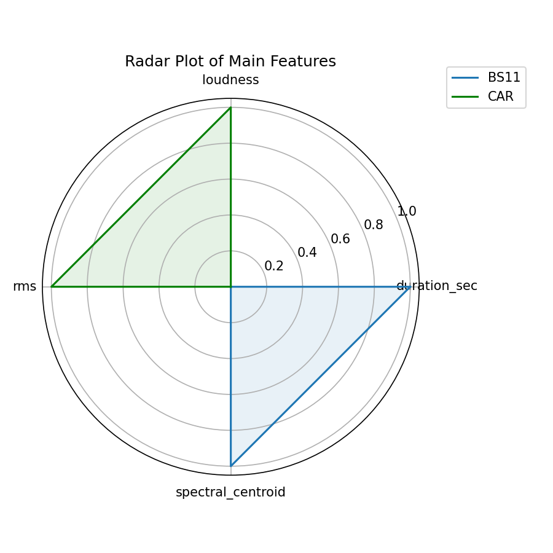
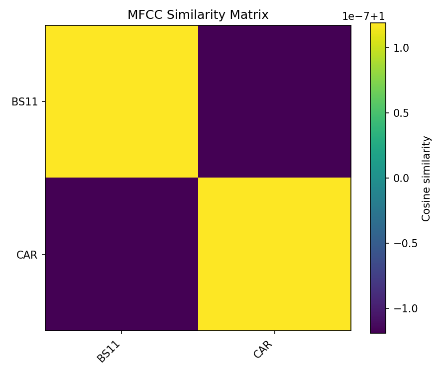
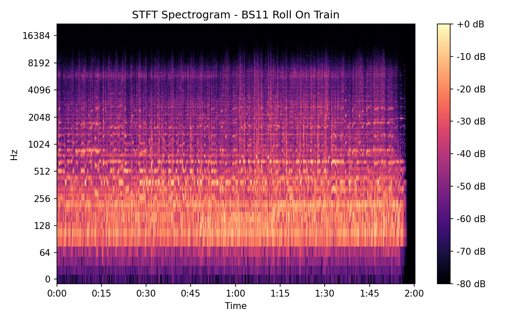
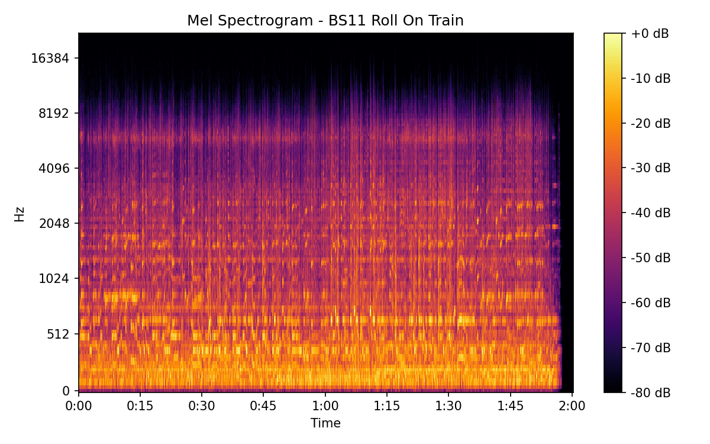

# Roll On Train

## Details

| label   | orig_file                                     | md5                              |   disc |   track |   duration_sec | duration_fmt   |   loudness |      rms |   spectral_centroid |
|:--------|:----------------------------------------------|:---------------------------------|-------:|--------:|---------------:|:---------------|-----------:|---------:|--------------------:|
| BS11    | 03 - Bob Dylan & The Band - Roll On Train.wav | 1bd4b8504493725f086f8bf3e6f6857e |      1 |       3 |        120.24  | 02:00:239      |   -16.0795 | 0.154585 |             1933.52 |
| CAR     | 01-03-Bob_Dylan-Roll_on_Train-SMR.flac        | dc76fd4ab33f750f8f83d6b5430b1e89 |      1 |       3 |        120.204 | 02:00:203      |   -16.0763 | 0.154626 |             1780.91 |

## Plots

## Spectrograms

### BS11

### CAR

