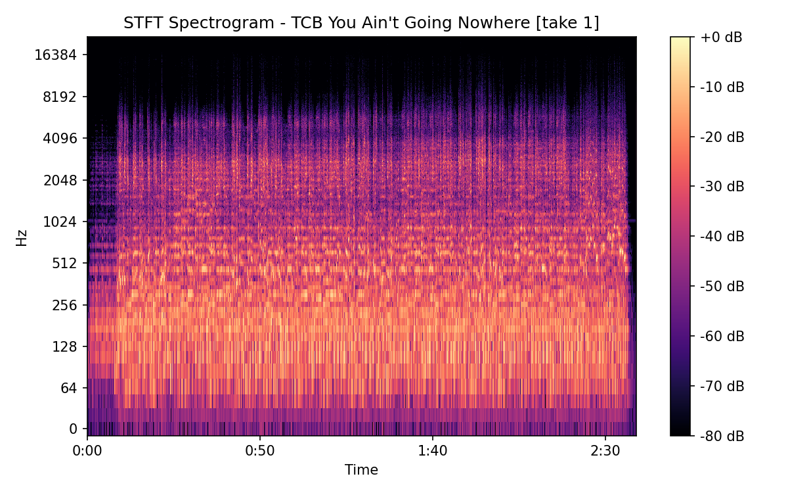
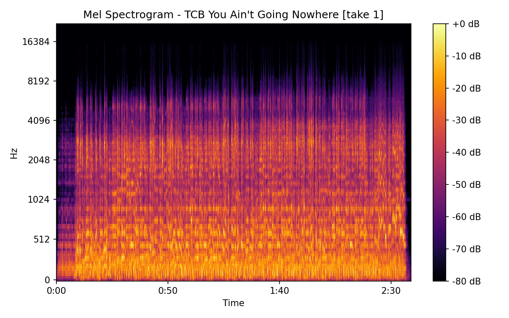
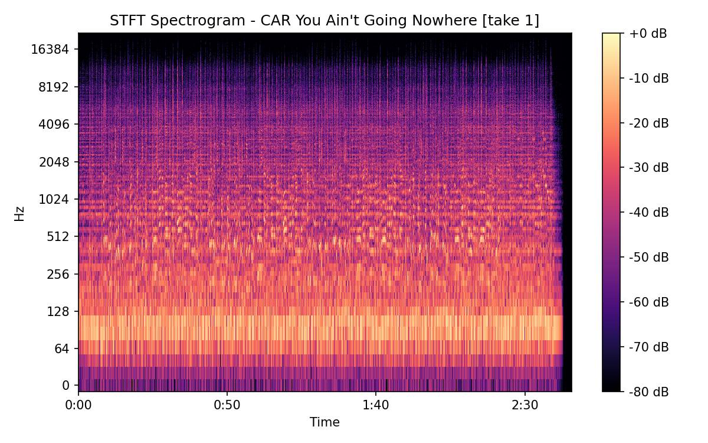
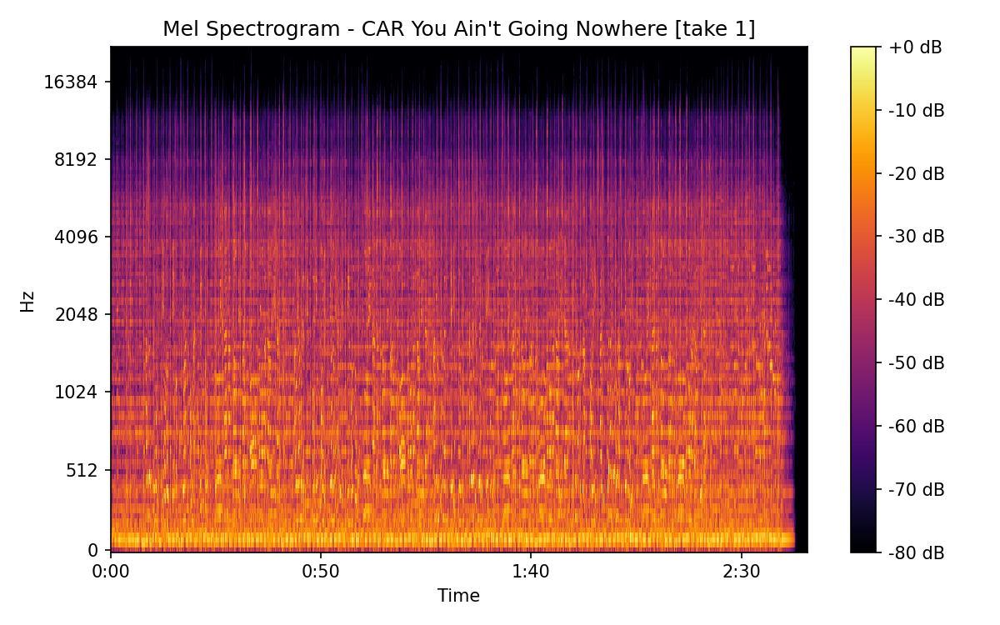
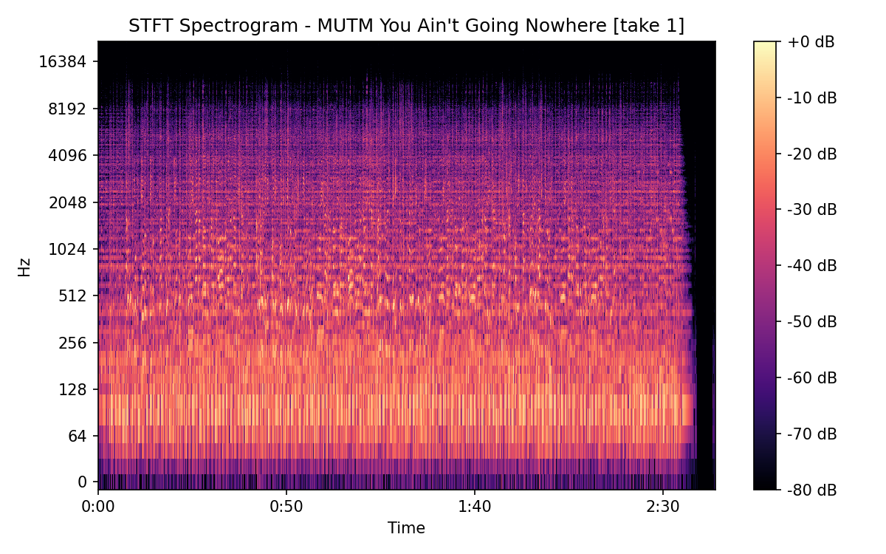
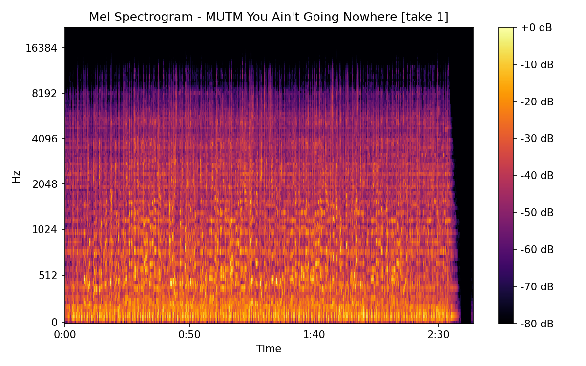
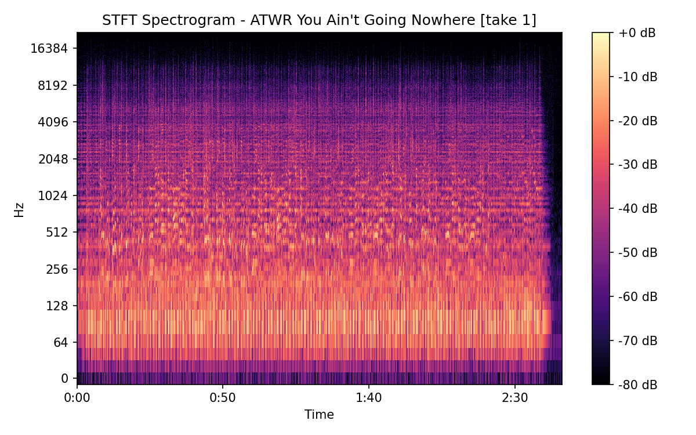

# You Ain't Going Nowhere [take 1]

## Details

| label   | orig_file                                              | md5                              |   disc |   track |   duration_sec | duration_fmt   |   loudness |       rms |   spectral_centroid |
|:--------|:-------------------------------------------------------|:---------------------------------|-------:|--------:|---------------:|:---------------|-----------:|----------:|--------------------:|
| TCB     | 03 You Ain't Going Nowhere.flac                        | 2c4c2435d5dff0f7cfee15aec4afb08c |      1 |       8 |        158.907 | 02:38:906      |   -22.6638 | 0.066491  |             1301.44 |
| CAR     | 03-18-Bob_Dylan-You_Ain_t_Goin_Nowhere_Take_2-SMR.flac | a2e0474b1f4a6b1ca8c560b613d243dc |      1 |       8 |        165.586 | 02:45:586      |   -18.0316 | 0.125645  |             2214.41 |
| MUTM    | 08 You Ain't Going Nowhere.flac                        | 1979579aad01620fedb490bbfed5a243 |      1 |       8 |        163.853 | 02:43:853      |   -18.372  | 0.111866  |             2135.98 |
| ATWR    | 25 You Ain't Going Nowhere - Take 2.flac               | 6ea00dd92a20550b24e171e5344258f3 |      4 |      20 |        166.093 | 02:46:093      |   -22.2106 | 0.0733092 |             2264.23 |

## Plots

## Spectrograms

### TCB

### CAR

### MUTM

### ATWR

