# 2 Dollars And 99 Cents

**(title taken from BS11)**

[](){ #2da9c }

## Details

| label   | orig_file                                              | md5                              |   disc |   track |   duration_sec | duration_fmt   |   loudness |   loudness_left |   loudness_right |   loudness_balance |      rms |   rms_left |   rms_right |   rms_balance |   lr_corr |   spectral_centroid |
|:--------|:-------------------------------------------------------|:---------------------------------|-------:|--------:|---------------:|:---------------|-----------:|----------------:|-----------------:|-------------------:|---------:|-----------:|------------:|--------------:|----------:|--------------------:|
| BS11    | 01 - Bob Dylan & The Band - 2 Dollars And 99 Cents.wav | 4cc82db345da2b2b646676144151e6a6 |      6 |       1 |        155.107 | 02:35:107      |   -18.2823 |        -19.1311 |         -17.2584 |           -1.87271 | 0.107931 |  0.096046  |    0.122713 |    -0.0266673 |  0.941298 |             2236.3  |
| CAR     | 06-01-Bob_Dylan-2_Dollars_and_99_Cents-SMR.flac        | 60def4ced3a66524d94baf559c184146 |      6 |       1 |        155.253 | 02:35:253      |   -18.2876 |        -19.1283 |         -17.2583 |           -1.87002 | 0.107825 |  0.0959526 |    0.122592 |    -0.0266392 |  0.941298 |             2106.05 |

## Plots
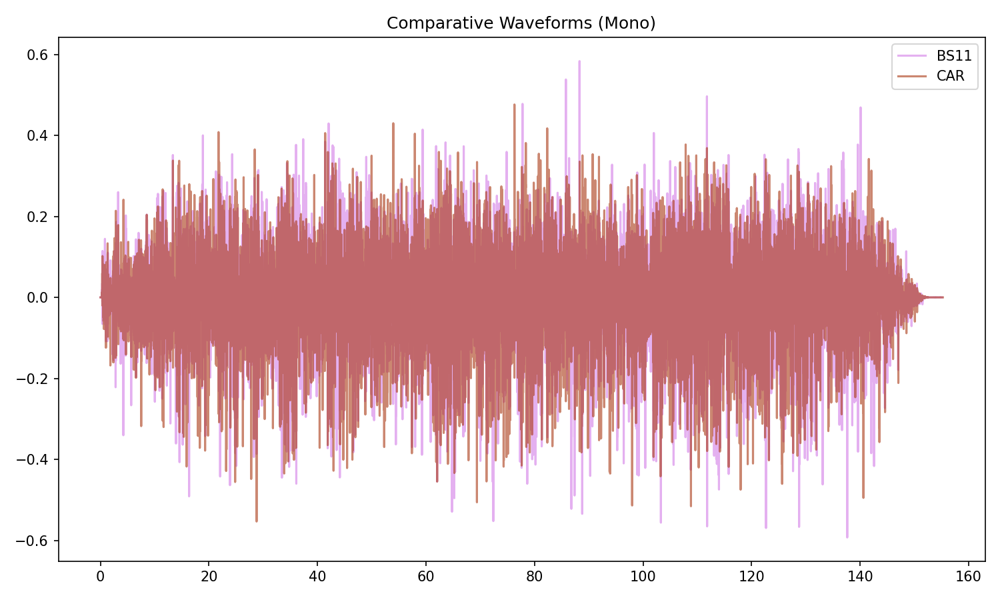

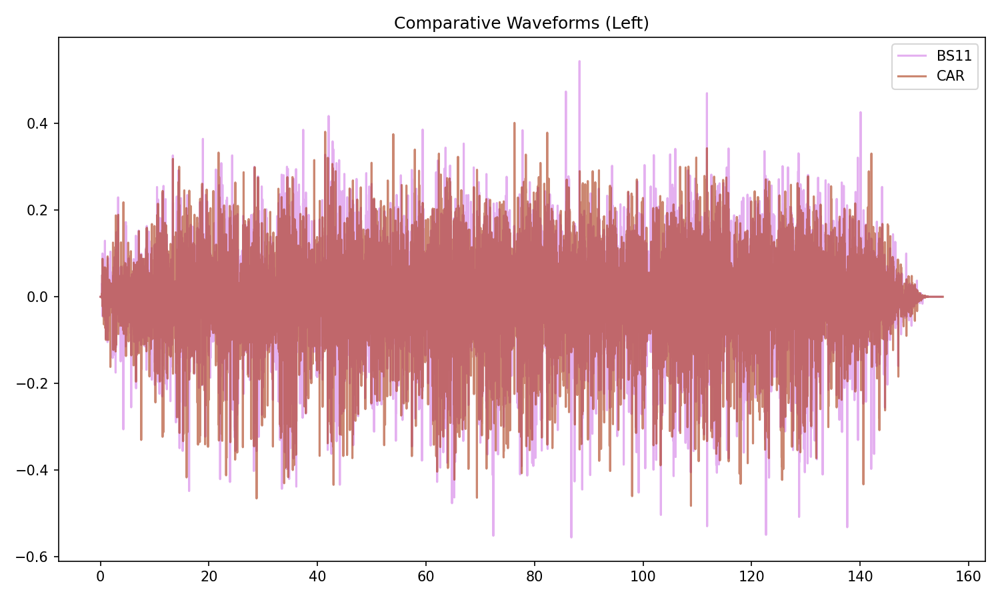

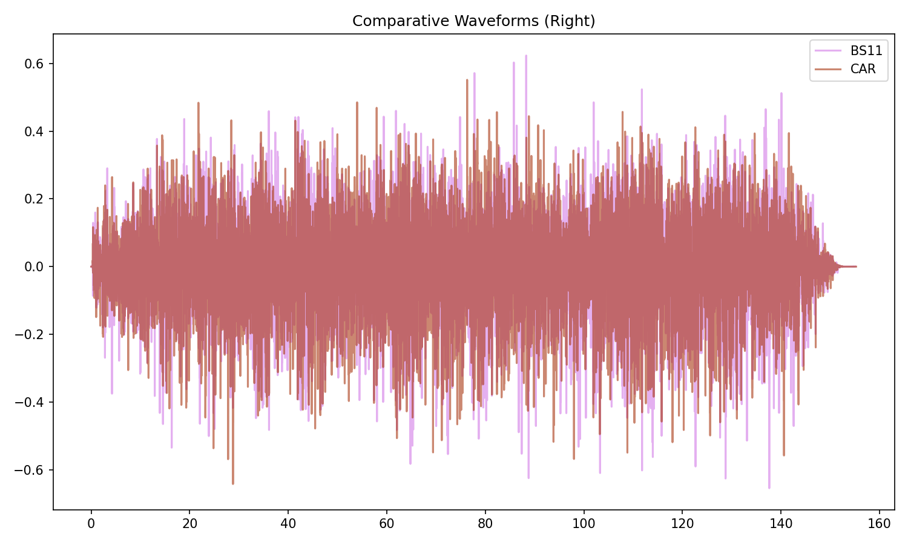

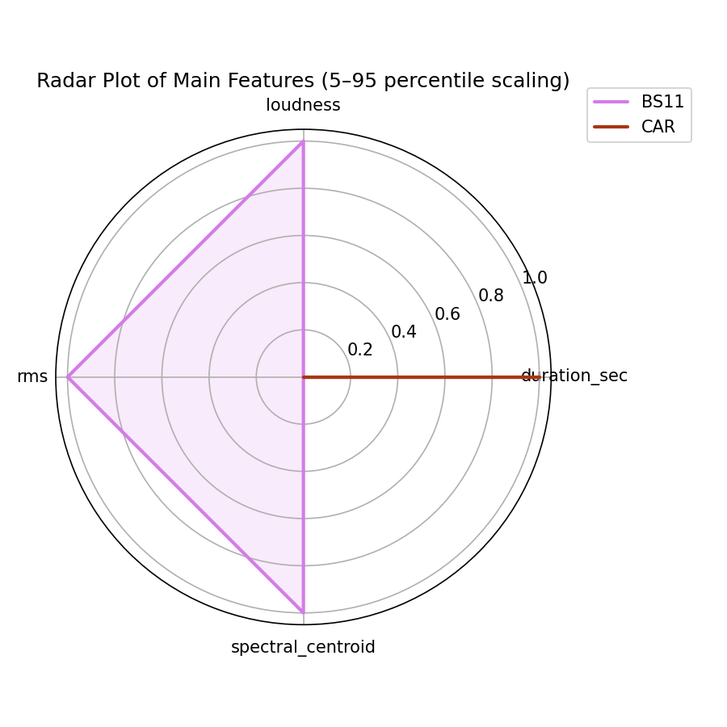

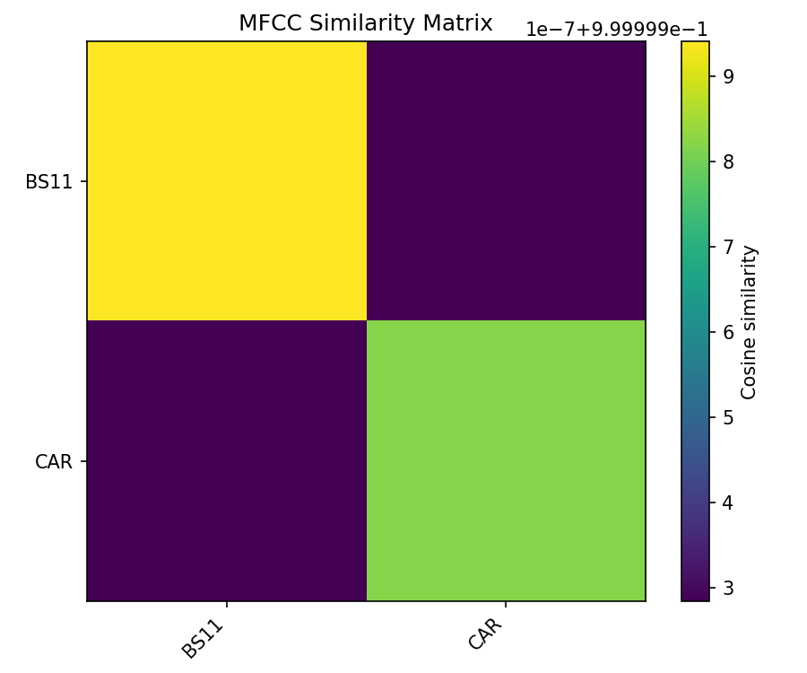

## Pitch & Speed Analysis (cents)

Reference version: **BS11**

| song_label   | ref_label   | cmp_label   | cmp_file                                               |   tuning_cents_cmp |   tuning_cents_ref |   delta_tuning_cents |   semitone_shift_vs_ref |   chroma_similarity |   speed_factor_from_pitch |   duration_ratio_ref_over_cmp |
|:-------------|:------------|:------------|:-------------------------------------------------------|-------------------:|-------------------:|---------------------:|------------------------:|--------------------:|--------------------------:|------------------------------:|
| 2da9c        | BS11        | BS11        | 01 - Bob Dylan & The Band - 2 Dollars And 99 Cents.wav |                -37 |                -37 |                    0 |                       0 |            1        |                         1 |                      1        |
| 2da9c        | BS11        | CAR         | 06-01-Bob_Dylan-2_Dollars_and_99_Cents-SMR.flac        |                -37 |                -37 |                    0 |                       0 |            0.999933 |                         1 |                      0.999055 |

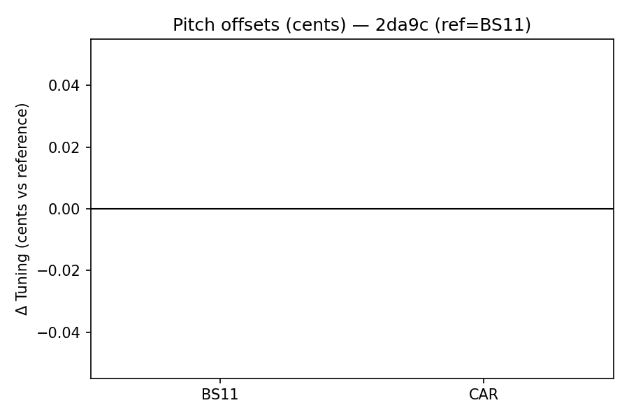

````text
Pitch/Speed analysis (reference = BS11)
============================================================

BS11 - 01 - Bob Dylan & The Band - 2 Dollars And 99 Cents.wav: shift=0 st ; Δtuning=0.0 cents ; speed_from_pitch=1.0000 ; duration_ratio(ref/cmp)=1.0000
CAR - 06-01-Bob_Dylan-2_Dollars_and_99_Cents-SMR.flac: shift=0 st ; Δtuning=0.0 cents ; speed_from_pitch=1.0000 ; duration_ratio(ref/cmp)=0.9991

````

## Stereo Balance

### BS11


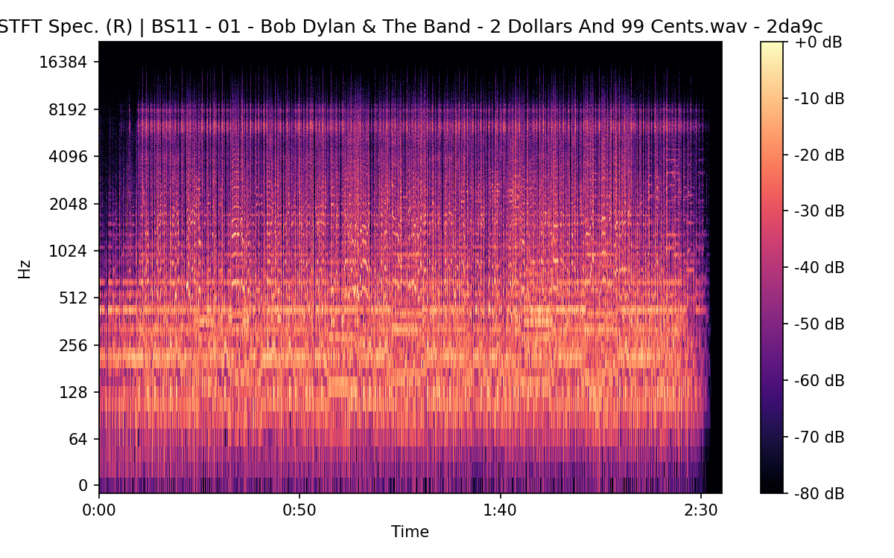

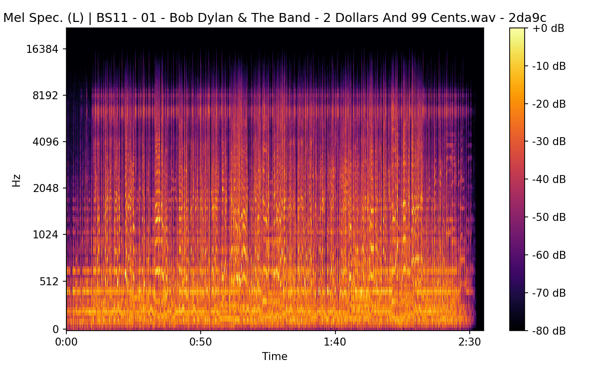


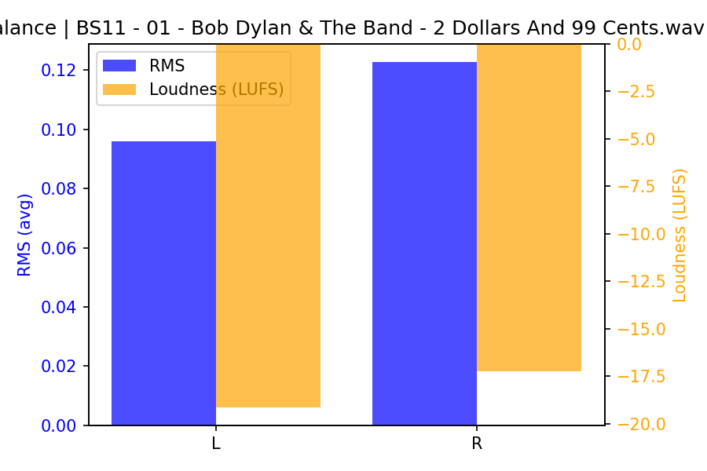

### CAR


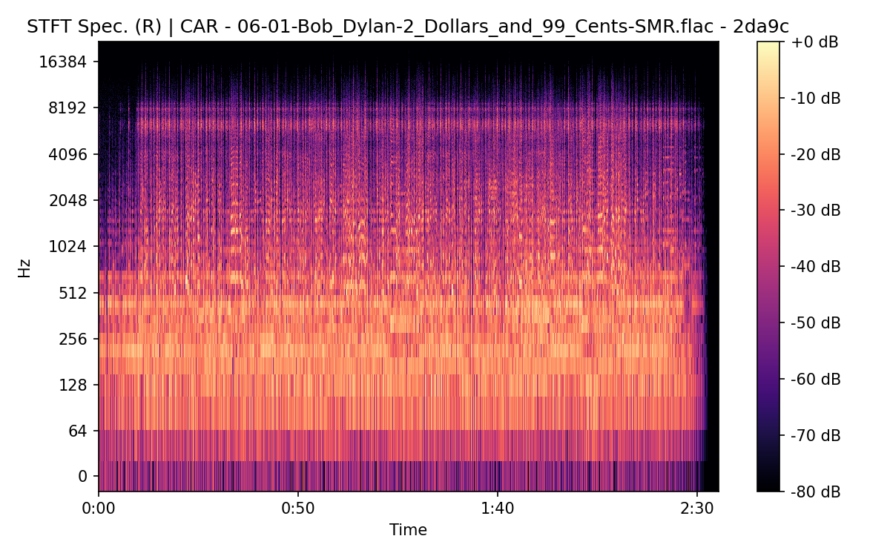

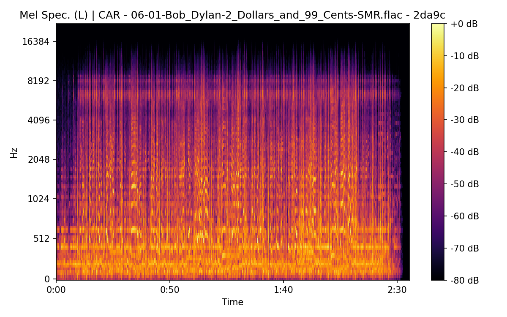

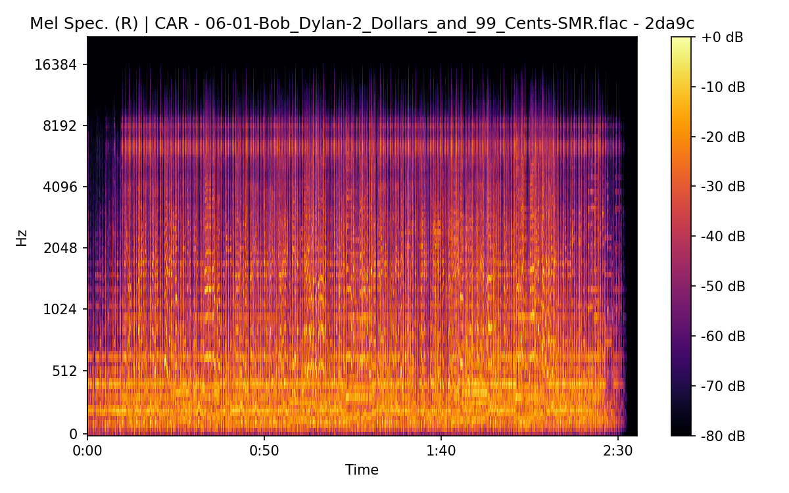

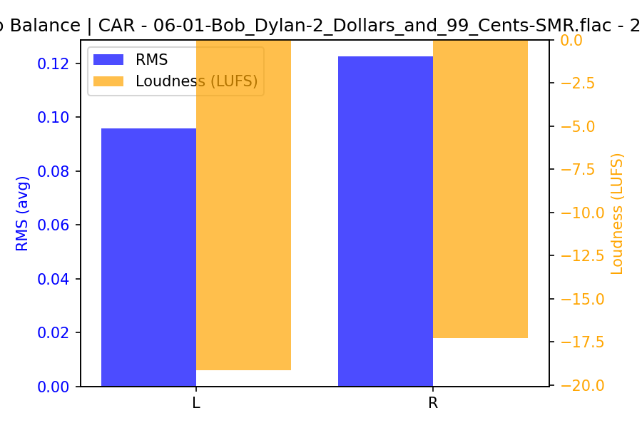

## Spectrograms (Mono)

### BS11


### CAR


