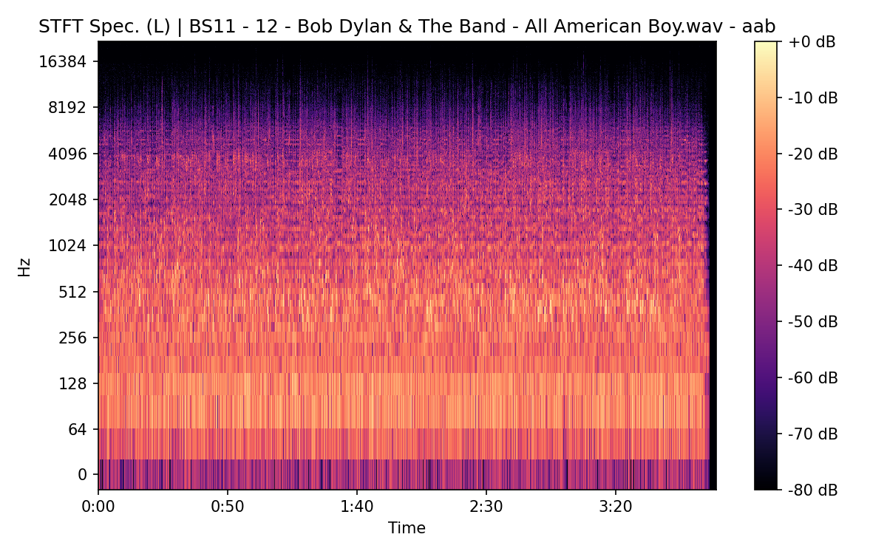
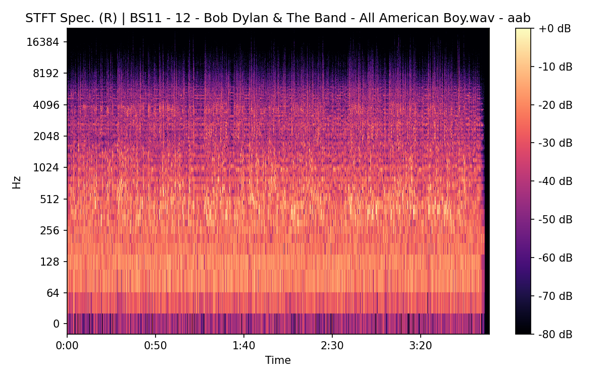
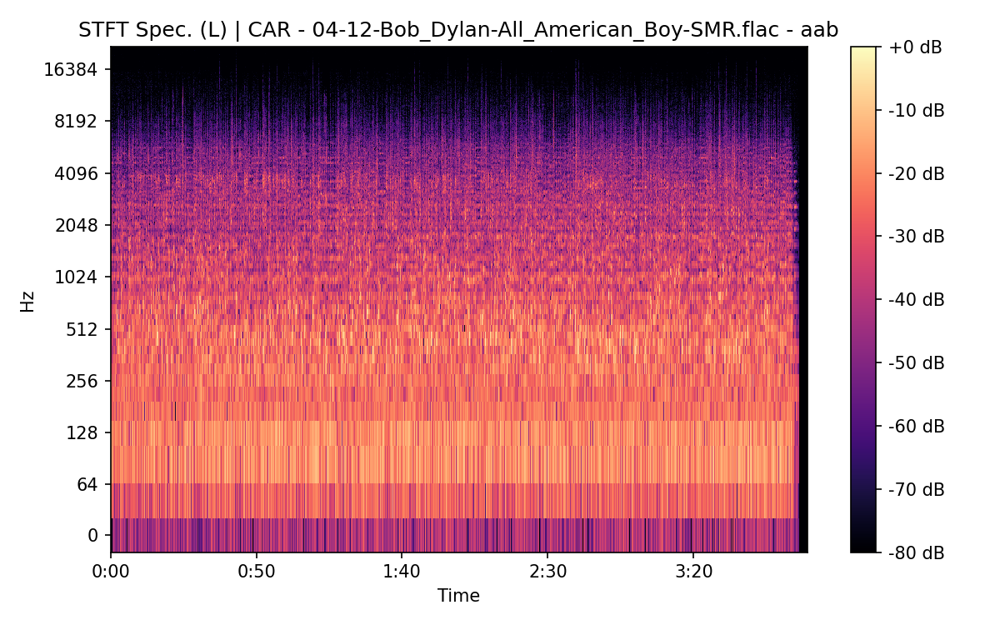
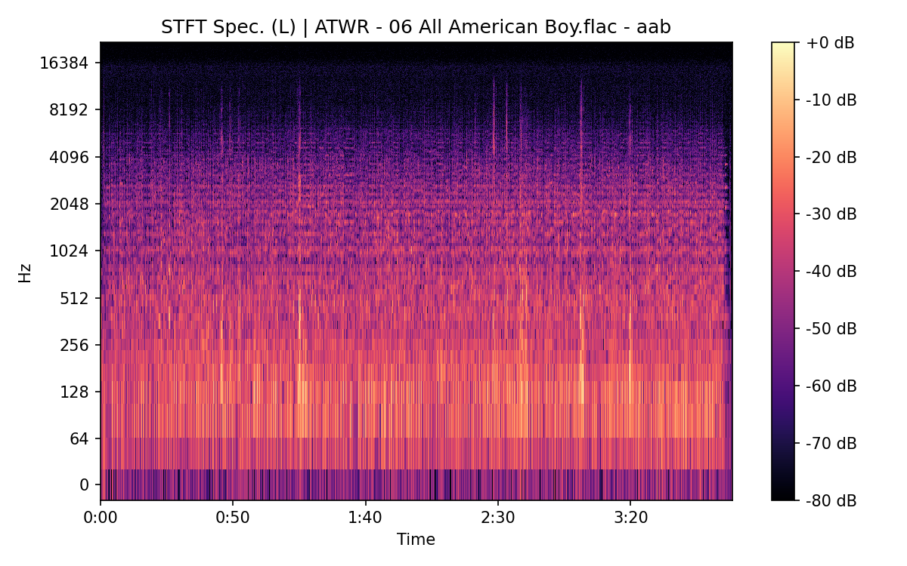
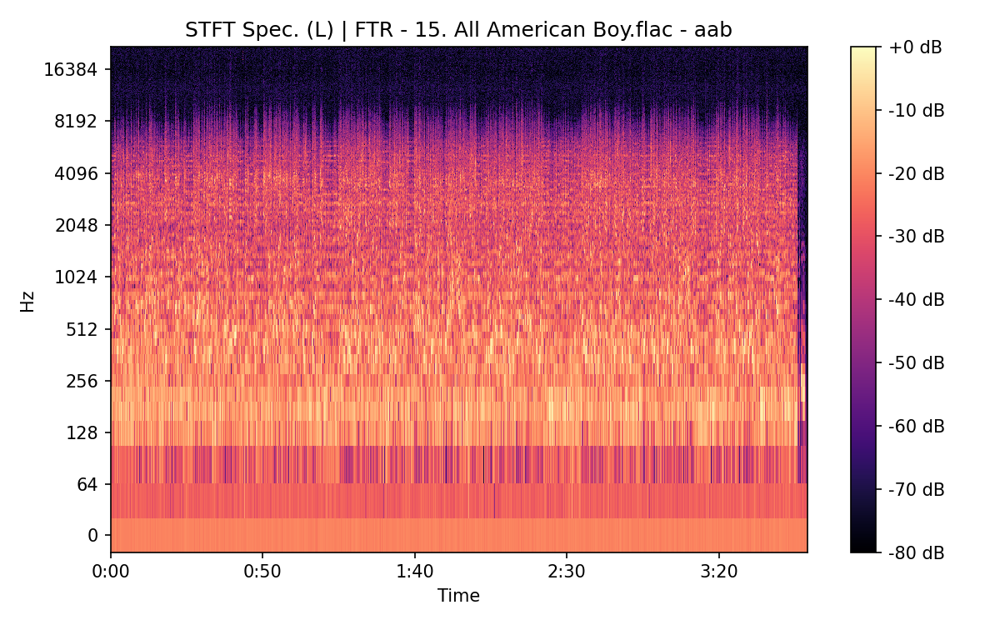
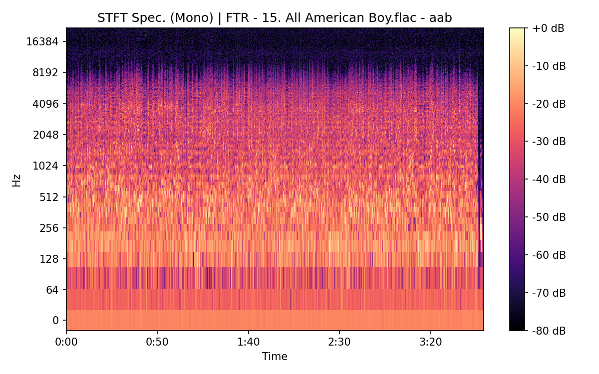

# All American Boy

**(title taken from BS11)**

[](){ #aab }

## Details

| label   | orig_file                                        | md5                              |   disc |   track |   duration_sec | duration_fmt   |   loudness |   loudness_left |   loudness_right |   loudness_balance |       rms |   rms_left |   rms_right |   rms_balance |    lr_corr |   spectral_centroid |
|:--------|:-------------------------------------------------|:---------------------------------|-------:|--------:|---------------:|:---------------|-----------:|----------------:|-----------------:|-------------------:|----------:|-----------:|------------:|--------------:|-----------:|--------------------:|
| BS11    | 12 - Bob Dylan & The Band - All American Boy.wav | 66d04c49572829ec104a64b477d2c55e |      4 |      12 |        238.827 | 03:58:827      |   -16.978  |        -16.8137 |         -16.8252 |          0.0115246 | 0.13623   |  0.141099  |   0.135552  |    0.00554702 |  0.933092  |             1938.15 |
| CAR     | 04-12-Bob_Dylan-All_American_Boy-SMR.flac        | 5cd20b98afc64fbf150f777b5b898fd3 |      4 |      12 |        238.938 | 03:58:938      |   -16.978  |        -16.8137 |         -16.8252 |          0.0115291 | 0.136164  |  0.141031  |   0.135486  |    0.00554472 |  0.933092  |             1871.35 |
| ATWR    | 06 All American Boy.flac                         | c7154579f2c28525d4175523adaa942e |      3 |       6 |        238.2   | 03:58:200      |   -20.4562 |        -23.2499 |         -15.0122 |         -8.23772   | 0.0846518 |  0.0616947 |   0.156137  |   -0.0944423  | -0.0115081 |             2238.7  |
| TGBT    | 4-03 All American Boy.flac                       | 4d676ab57fa533ecb1d8aee7934ebe55 |      4 |       3 |        236.8   | 03:56:800      |   -18.0144 |        -25.3717 |         -12.17   |        -13.2016    | 0.110333  |  0.0479483 |   0.215285  |   -0.167337   | -0.0141554 |             2152.91 |
| FTR     | 15. All American Boy.flac                        | 9645c50ed3b3a4a6a8c7365e02986173 |      4 |      15 |        228.933 | 03:48:933      |   -29.1336 |        -23.6118 |         -34.0426 |         10.4308    | 0.0322892 |  0.0604685 |   0.0177493 |    0.0427192  |  0.0531938 |             2301.09 |
| FTR     | 24. All American Boy.flac                        | 6fa98b25e33b51c2f4d1098b2716b4fc |      4 |      24 |        235.893 | 03:55:893      |   -17.5171 |        -25.0967 |         -11.6967 |        -13.4001    | 0.118757  |  0.0499205 |   0.231161  |   -0.18124    | -0.0024905 |             2167.47 |
| CB      | 15 All American boy.flac                         | 0b6550d9e3d3910a789779e7165632c5 |      4 |      15 |        233.08  | 03:53:080      |   -29.1387 |        -23.61   |         -34.0425 |         10.4325    | 0.0317153 |  0.059394  |   0.0174333 |    0.0419607  |  0.0533698 |             2261.52 |

## Plots
.png)

.png)

.png)


## Pitch & Speed Analysis (cents)

Reference version: **BS11**

| song_label   | ref_label   | cmp_label   | cmp_file                                         |   tuning_cents_cmp |   tuning_cents_ref |   delta_tuning_cents |   semitone_shift_vs_ref |   chroma_similarity |   speed_factor_from_pitch |   duration_ratio_ref_over_cmp |
|:-------------|:------------|:------------|:-------------------------------------------------|-------------------:|-------------------:|---------------------:|------------------------:|--------------------:|--------------------------:|------------------------------:|
| aab          | BS11        | BS11        | 12 - Bob Dylan & The Band - All American Boy.wav |                -16 |                -16 |                    0 |                       0 |            1        |                  1        |                      1        |
| aab          | BS11        | CAR         | 04-12-Bob_Dylan-All_American_Boy-SMR.flac        |                -10 |                -16 |                    6 |                       0 |            0.998186 |                  1        |                      0.999534 |
| aab          | BS11        | ATWR        | 06 All American Boy.flac                         |                 19 |                -16 |                   35 |                       0 |            0.997901 |                  1        |                      1.00263  |
| aab          | BS11        | TGBT        | 4-03 All American Boy.flac                       |                 35 |                -16 |                   51 |                       0 |            0.997155 |                  1        |                      1.00856  |
| aab          | BS11        | FTR         | 15. All American Boy.flac                        |                -40 |                -16 |                  -24 |                      -1 |            0.990135 |                  0.943874 |                      1.04321  |
| aab          | BS11        | FTR         | 24. All American Boy.flac                        |                 22 |                -16 |                   38 |                       0 |            0.997557 |                  1        |                      1.01243  |
| aab          | BS11        | CB          | 15 All American boy.flac                         |                -44 |                -16 |                  -28 |                      -1 |            0.989971 |                  0.943874 |                      1.02466  |


````text
Pitch/Speed analysis (reference = BS11)
============================================================

BS11 - 12 - Bob Dylan & The Band - All American Boy.wav: shift=0 st ; Δtuning=0.0 cents ; speed_from_pitch=1.0000 ; duration_ratio(ref/cmp)=1.0000
CAR - 04-12-Bob_Dylan-All_American_Boy-SMR.flac: shift=0 st ; Δtuning=6.0 cents ; speed_from_pitch=1.0000 ; duration_ratio(ref/cmp)=0.9995
ATWR - 06 All American Boy.flac: shift=0 st ; Δtuning=35.0 cents ; speed_from_pitch=1.0000 ; duration_ratio(ref/cmp)=1.0026
TGBT - 4-03 All American Boy.flac: shift=0 st ; Δtuning=51.0 cents ; speed_from_pitch=1.0000 ; duration_ratio(ref/cmp)=1.0086
FTR - 15. All American Boy.flac: shift=-1 st ; Δtuning=-24.0 cents ; speed_from_pitch=0.9439 ; duration_ratio(ref/cmp)=1.0432
FTR - 24. All American Boy.flac: shift=0 st ; Δtuning=38.0 cents ; speed_from_pitch=1.0000 ; duration_ratio(ref/cmp)=1.0124
CB - 15 All American boy.flac: shift=-1 st ; Δtuning=-28.0 cents ; speed_from_pitch=0.9439 ; duration_ratio(ref/cmp)=1.0247

````

## Stereo Balance

### BS11






### CAR




### ATWR




### TGBT


### FTR




### FTR

.png)

.png)

.png)

.png)

.png)

### CB


## Spectrograms (Mono)

### BS11


### CAR


### ATWR


### TGBT


### FTR




### FTR

.png)

.png)

### CB


