# Ain't No More Cane (Take 1)

**(title taken from BS11)**

[](){ #anmc_t1 }

## Details

| label   | orig_file                                                   | md5                              |   disc |   track |   duration_sec | duration_fmt   |   loudness |   loudness_left |   loudness_right |   loudness_balance |      rms |   rms_left |   rms_right |   rms_balance |   lr_corr |   spectral_centroid |
|:--------|:------------------------------------------------------------|:---------------------------------|-------:|--------:|---------------:|:---------------|-----------:|----------------:|-----------------:|-------------------:|---------:|-----------:|------------:|--------------:|----------:|--------------------:|
| BS11    | 05 - Bob Dylan & The Band - Ain't No More Cane (Take 1).wav | fc5602b17d10ae44bcd720449b18987f |      5 |       5 |        161.16  | 02:41:160      |   -18.1003 |        -18.5076 |         -17.5802 |          -0.9274   | 0.115651 |   0.111994 |    0.120663 |   -0.00866883 |  0.971149 |             1682.71 |
| CAR     | 05-05-Bob_Dylan-Ain_t_No_More_Cane_Take_1-SMR.flac          | 51a6f319345be746715c211199e958f5 |      5 |       5 |        161.165 | 02:41:165      |   -18.0978 |        -18.5181 |         -17.5749 |          -0.943206 | 0.115652 |   0.111995 |    0.120664 |   -0.00866875 |  0.97115  |             1546.59 |

## Plots
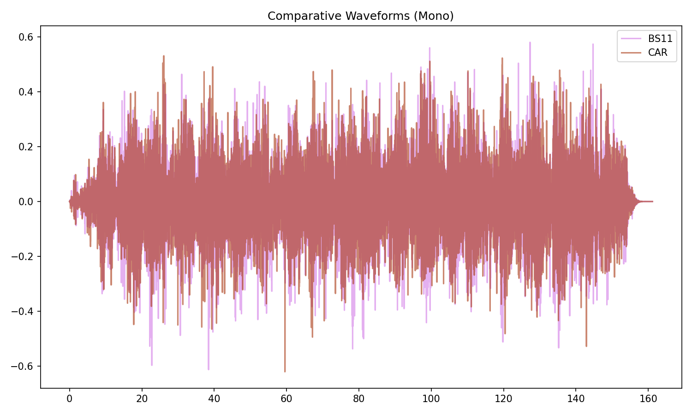

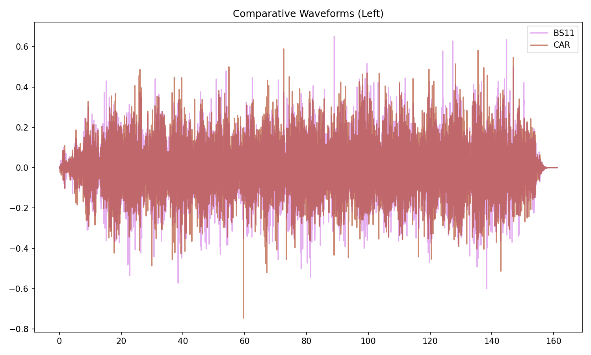

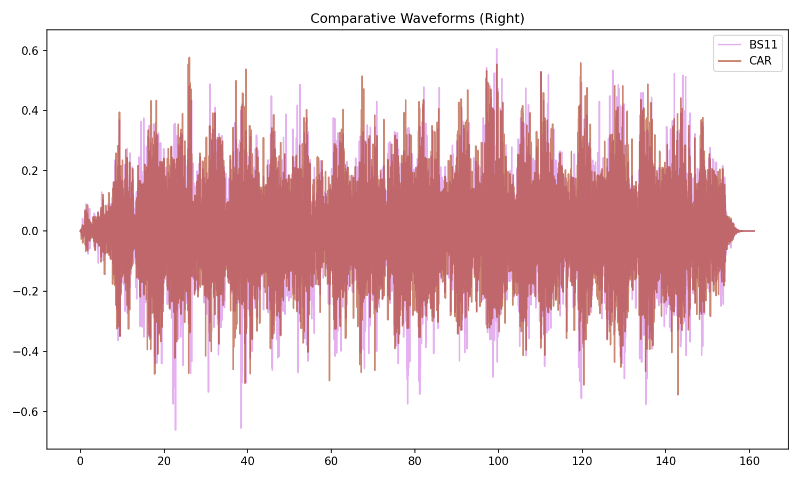

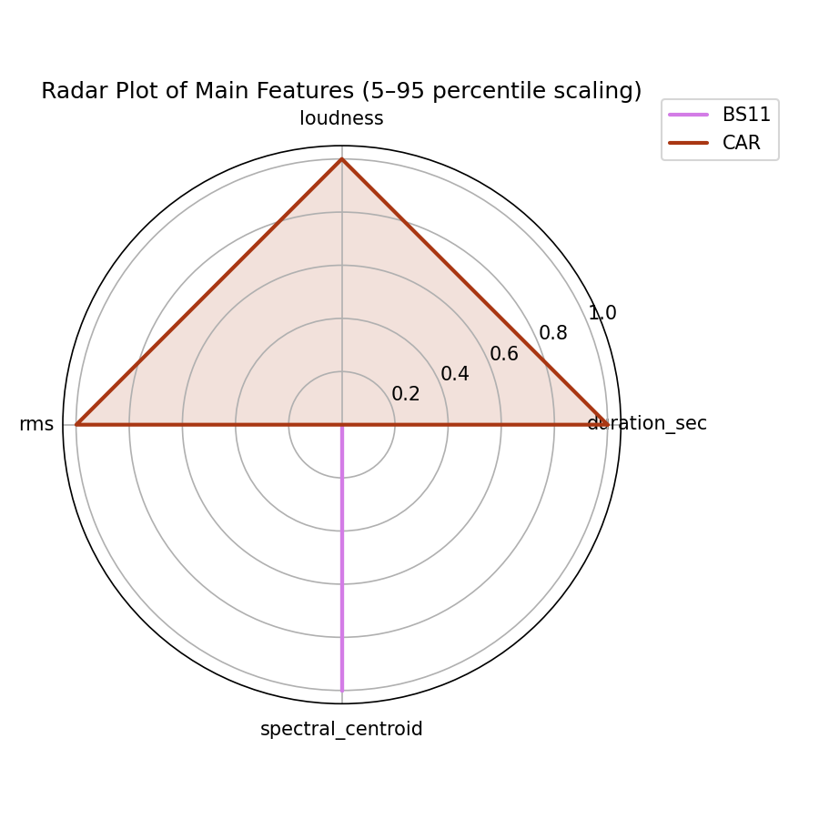

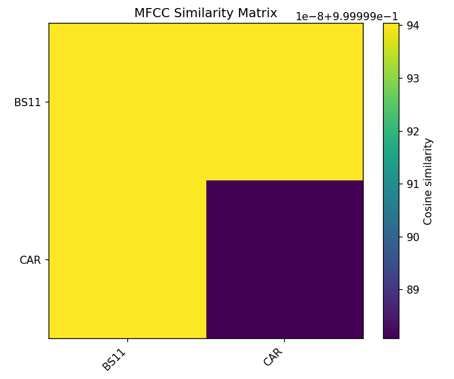

## Pitch & Speed Analysis (cents)

Reference version: **BS11**

| song_label   | ref_label   | cmp_label   | cmp_file                                                    |   tuning_cents_cmp |   tuning_cents_ref |   delta_tuning_cents |   semitone_shift_vs_ref |   chroma_similarity |   speed_factor_from_pitch |   duration_ratio_ref_over_cmp |
|:-------------|:------------|:------------|:------------------------------------------------------------|-------------------:|-------------------:|---------------------:|------------------------:|--------------------:|--------------------------:|------------------------------:|
| anmc_t1      | BS11        | BS11        | 05 - Bob Dylan & The Band - Ain't No More Cane (Take 1).wav |                -14 |                -14 |                    0 |                       0 |                   1 |                         1 |                      1        |
| anmc_t1      | BS11        | CAR         | 05-05-Bob_Dylan-Ain_t_No_More_Cane_Take_1-SMR.flac          |                -16 |                -14 |                   -2 |                       0 |                   1 |                         1 |                      0.999967 |

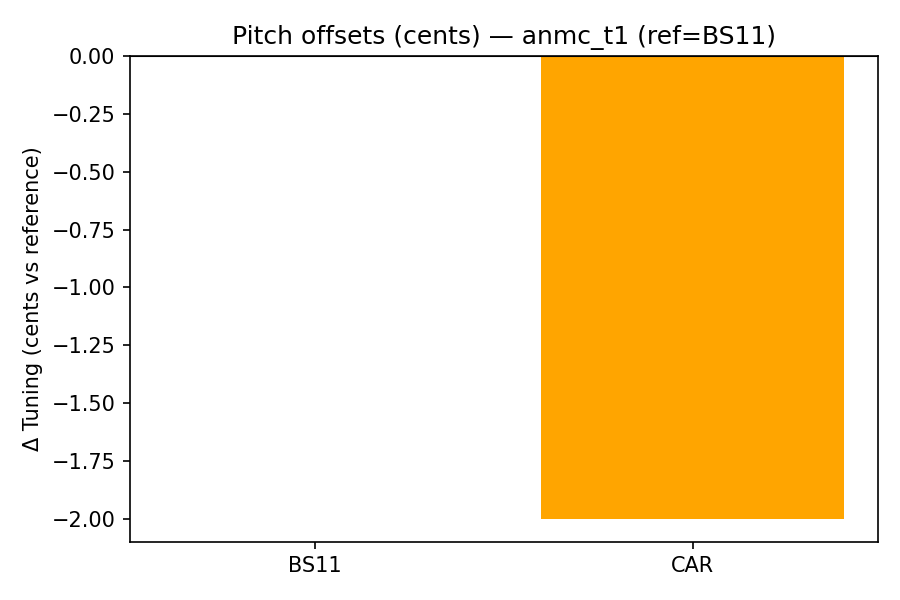

````text
Pitch/Speed analysis (reference = BS11)
============================================================

BS11 - 05 - Bob Dylan & The Band - Ain't No More Cane (Take 1).wav: shift=0 st ; Δtuning=0.0 cents ; speed_from_pitch=1.0000 ; duration_ratio(ref/cmp)=1.0000
CAR - 05-05-Bob_Dylan-Ain_t_No_More_Cane_Take_1-SMR.flac: shift=0 st ; Δtuning=-2.0 cents ; speed_from_pitch=1.0000 ; duration_ratio(ref/cmp)=1.0000

````

## Stereo Balance

### BS11

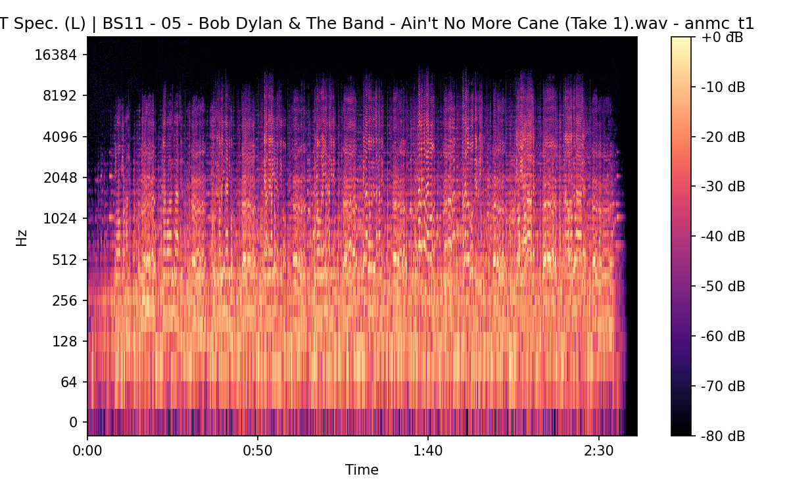


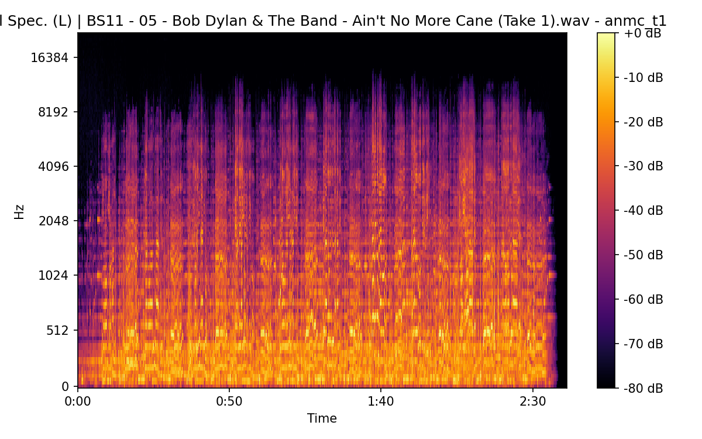

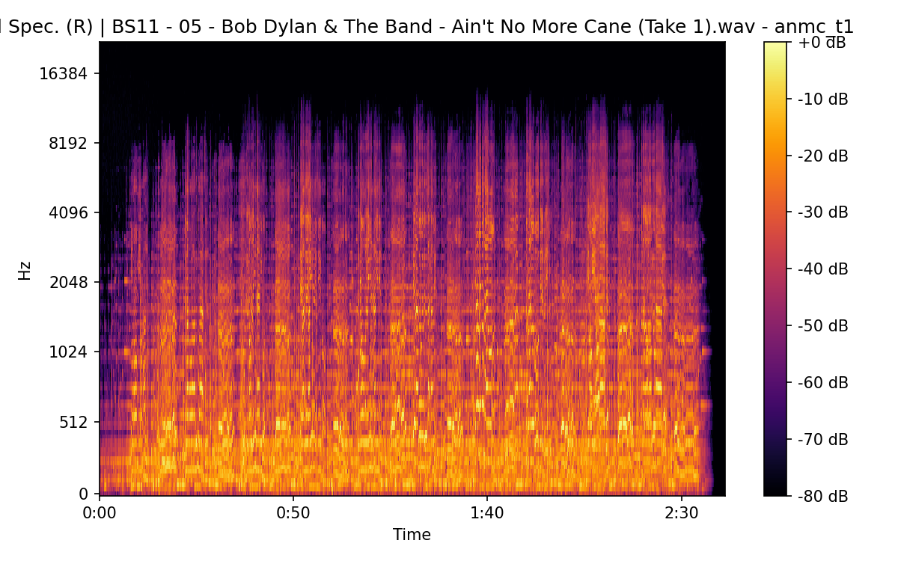


### CAR

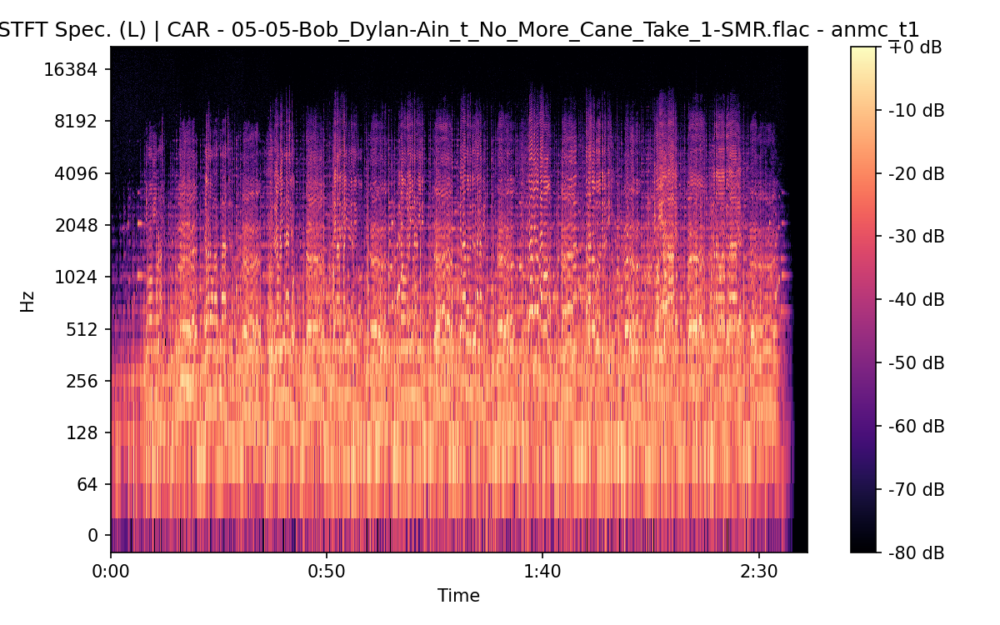


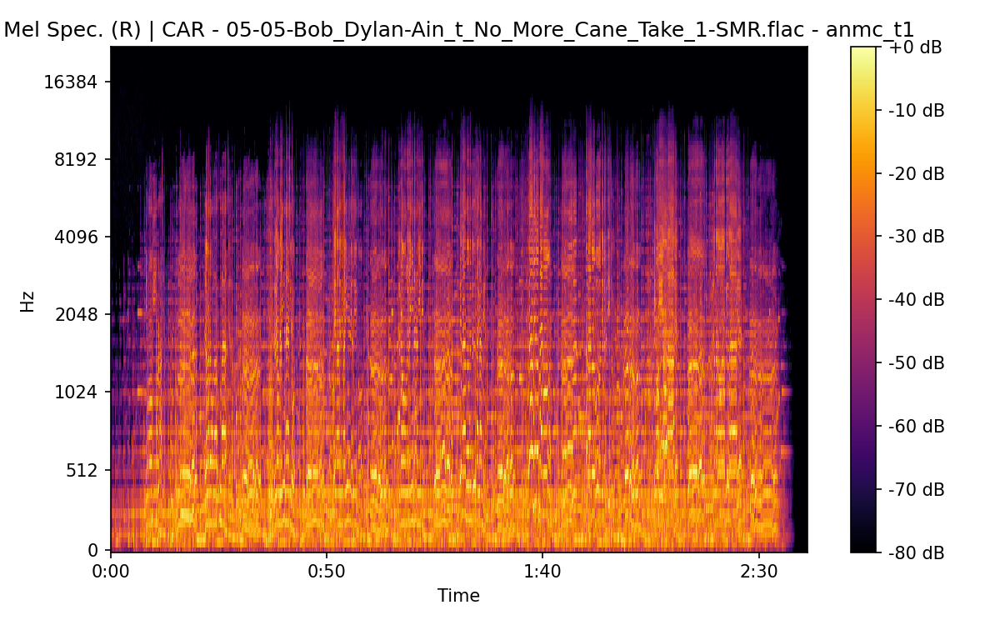

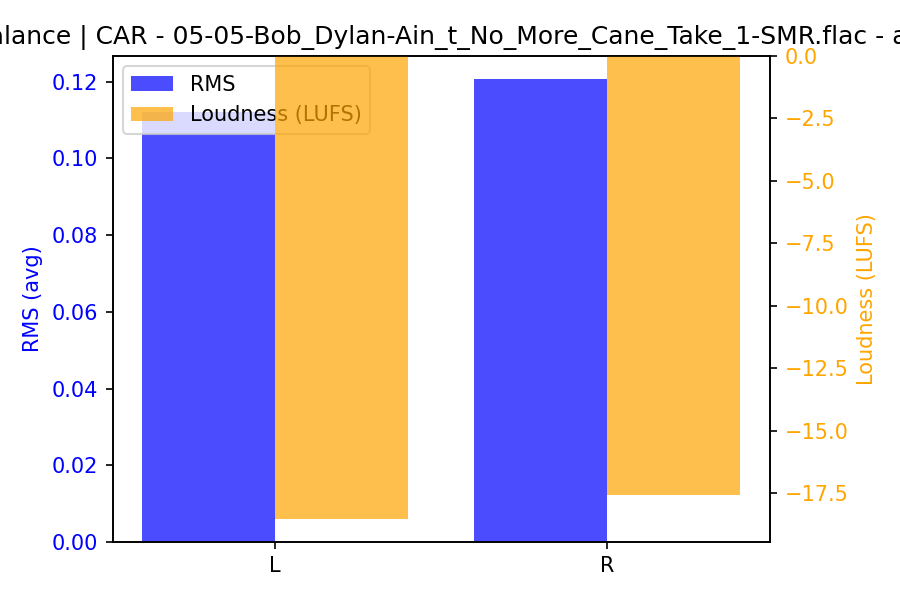

## Spectrograms (Mono)

### BS11

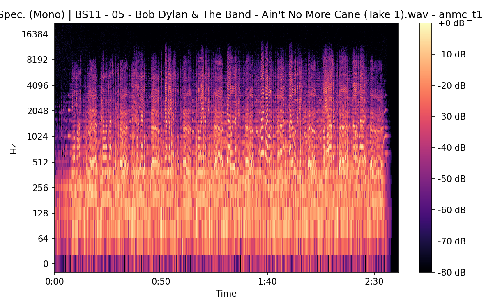


### CAR


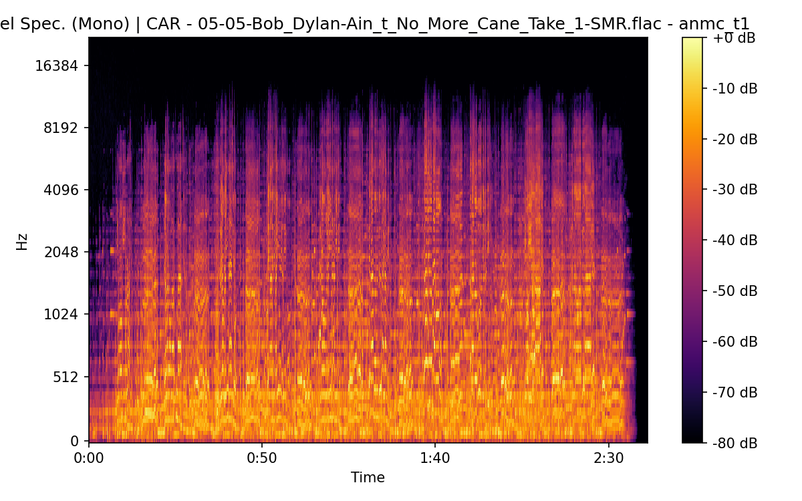

