# Ain't No More Cane (Take 2)

**(title taken from BS11)**

[](){ #anmc_t2 }

## Details

| label   | orig_file                                                   | md5                              |   disc |   track |   duration_sec | duration_fmt   |   loudness |   loudness_left |   loudness_right |   loudness_balance |      rms |   rms_left |   rms_right |   rms_balance |   lr_corr |   spectral_centroid |
|:--------|:------------------------------------------------------------|:---------------------------------|-------:|--------:|---------------:|:---------------|-----------:|----------------:|-----------------:|-------------------:|---------:|-----------:|------------:|--------------:|----------:|--------------------:|
| BS11    | 06 - Bob Dylan & The Band - Ain't No More Cane (Take 2).wav | f922f49afc28edd8e4142d78eca58114 |      5 |       6 |        117.907 | 01:57:907      |   -18.6355 |        -17.7102 |         -18.6876 |           0.977379 | 0.114459 |   0.135688 |    0.101147 |     0.0345409 |  0.803117 |             1872.87 |
| CAR     | 05-06-Bob_Dylan-Ain_t_No_More_Cane_Alternate_V-SMR.flac     | a98c9181f64573e0976e8376c8745383 |      5 |       6 |        117.887 | 01:57:887      |   -18.6354 |        -17.7071 |         -18.6841 |           0.977031 | 0.114481 |   0.135711 |    0.101167 |     0.0345441 |  0.803117 |             1721.3  |

## Plots
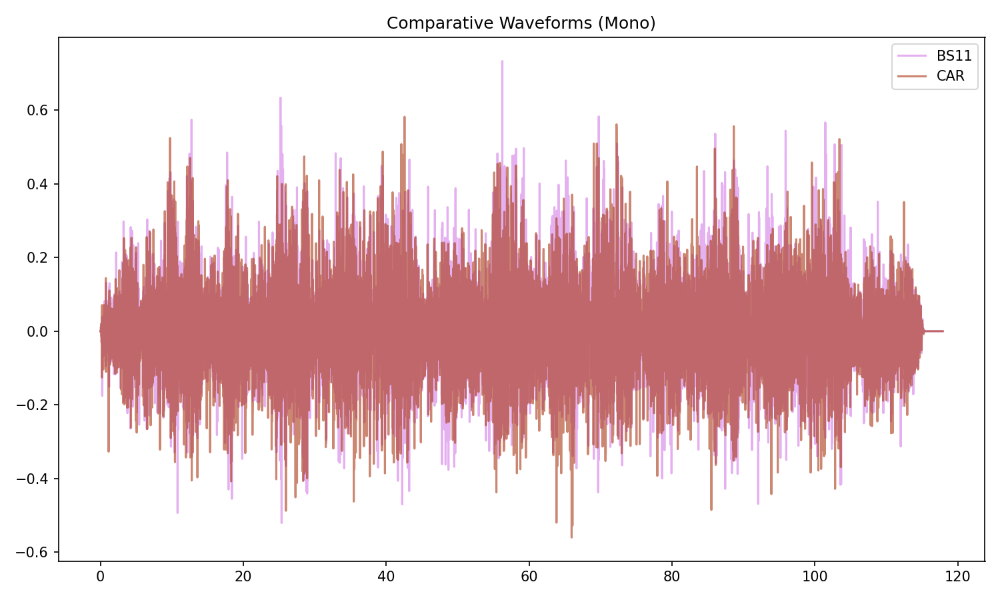

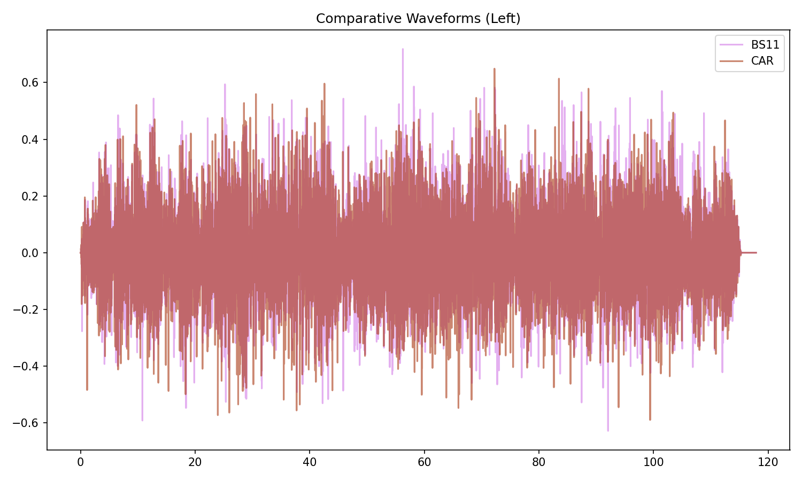

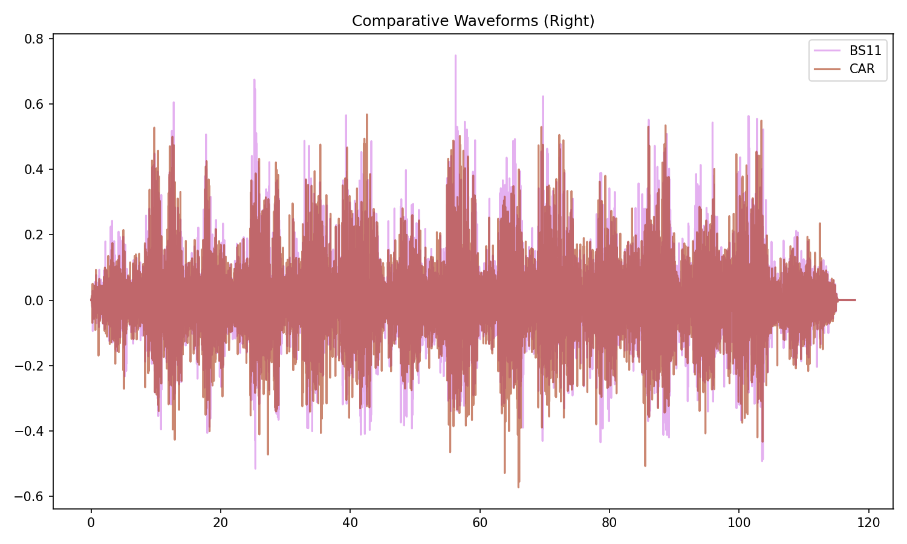

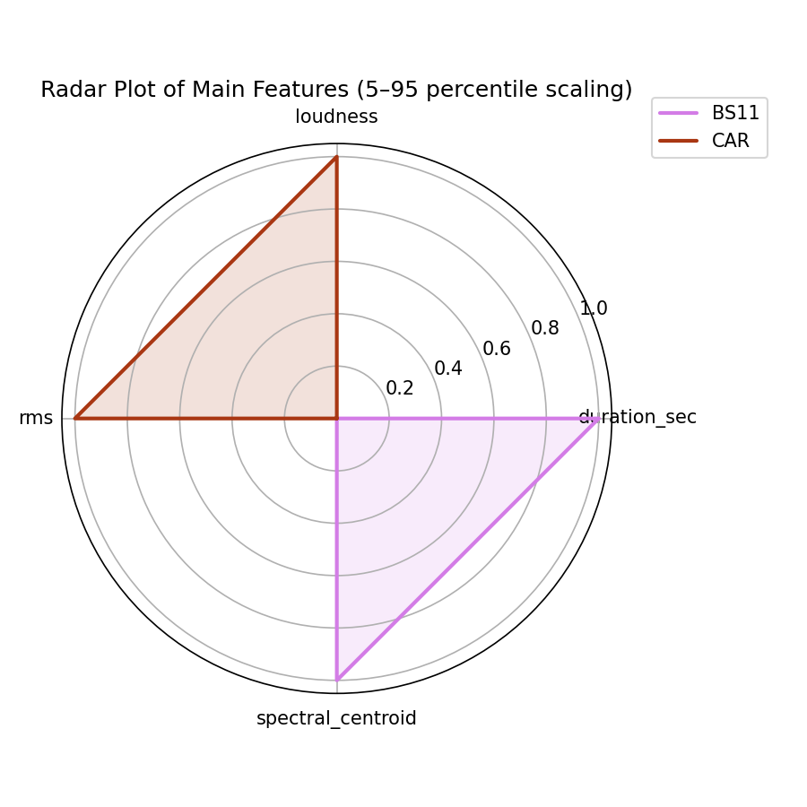

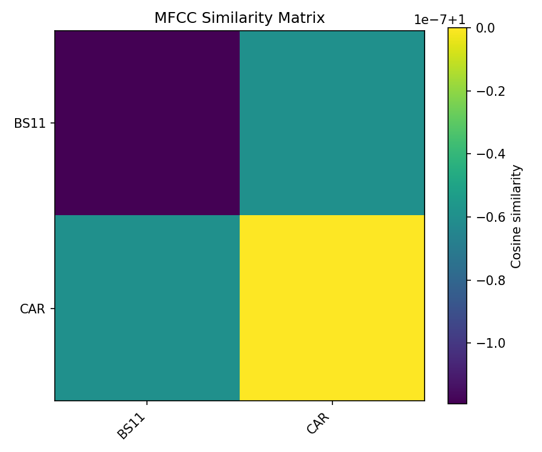

## Pitch & Speed Analysis (cents)

Reference version: **BS11**

| song_label   | ref_label   | cmp_label   | cmp_file                                                    |   tuning_cents_cmp |   tuning_cents_ref |   delta_tuning_cents |   semitone_shift_vs_ref |   chroma_similarity |   speed_factor_from_pitch |   duration_ratio_ref_over_cmp |
|:-------------|:------------|:------------|:------------------------------------------------------------|-------------------:|-------------------:|---------------------:|------------------------:|--------------------:|--------------------------:|------------------------------:|
| anmc_t2      | BS11        | BS11        | 06 - Bob Dylan & The Band - Ain't No More Cane (Take 2).wav |                -20 |                -20 |                    0 |                       0 |             1       |                         1 |                       1       |
| anmc_t2      | BS11        | CAR         | 05-06-Bob_Dylan-Ain_t_No_More_Cane_Alternate_V-SMR.flac     |                -19 |                -20 |                    1 |                       0 |             0.99986 |                         1 |                       1.00017 |

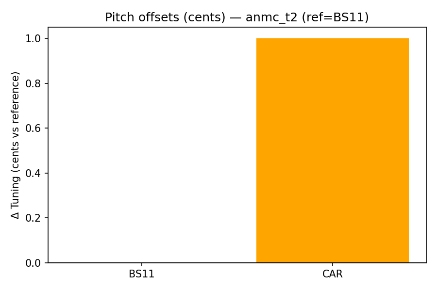

````text
Pitch/Speed analysis (reference = BS11)
============================================================

BS11 - 06 - Bob Dylan & The Band - Ain't No More Cane (Take 2).wav: shift=0 st ; Δtuning=0.0 cents ; speed_from_pitch=1.0000 ; duration_ratio(ref/cmp)=1.0000
CAR - 05-06-Bob_Dylan-Ain_t_No_More_Cane_Alternate_V-SMR.flac: shift=0 st ; Δtuning=1.0 cents ; speed_from_pitch=1.0000 ; duration_ratio(ref/cmp)=1.0002

````

## Stereo Balance

### BS11

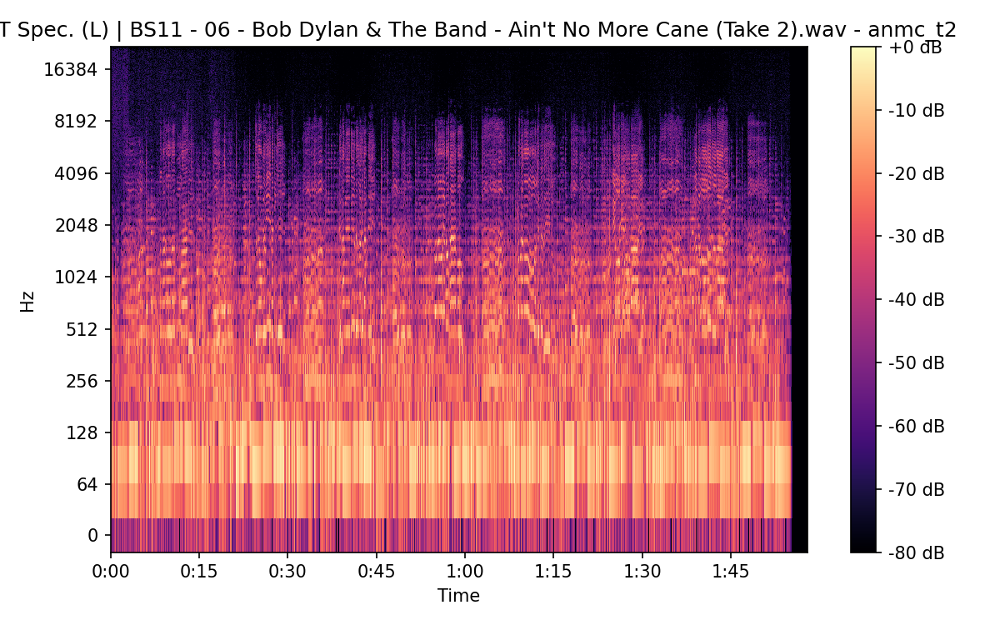

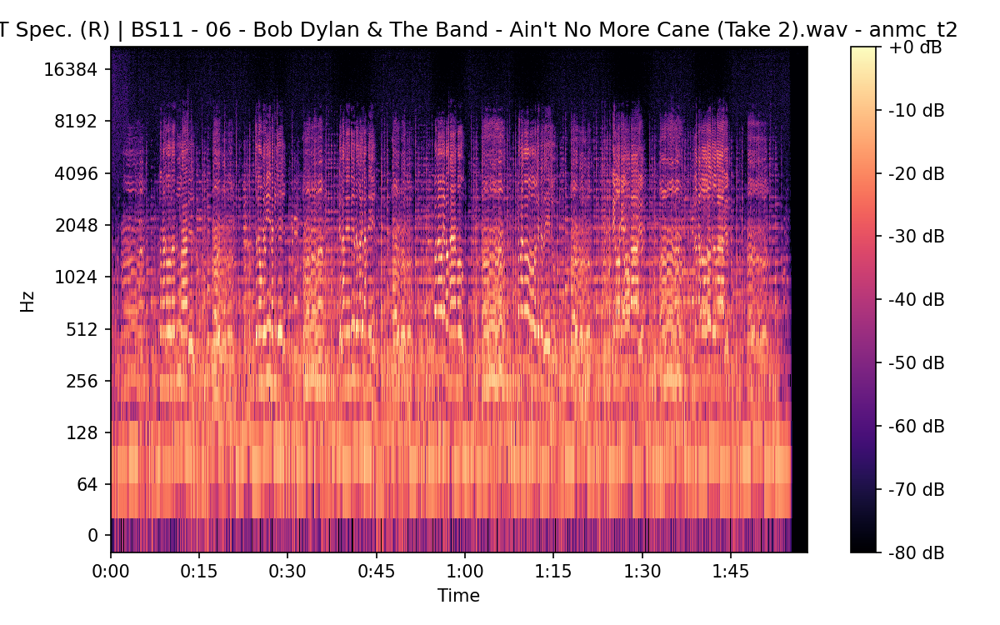

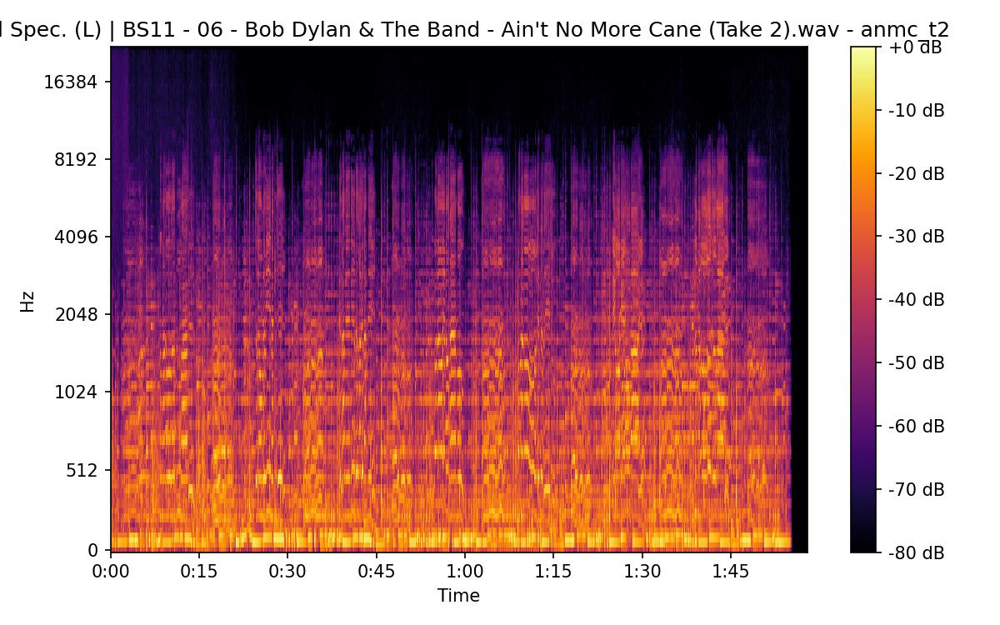

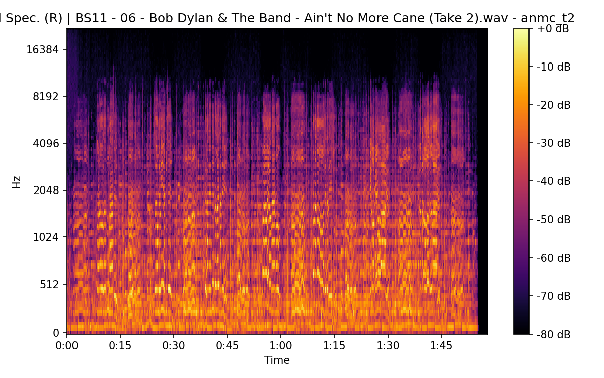


### CAR


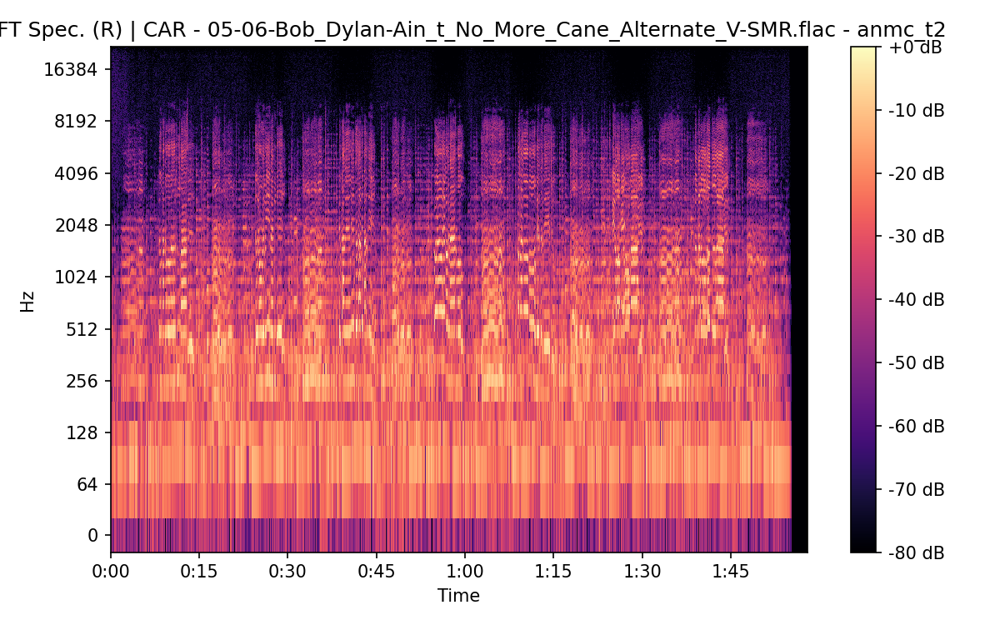


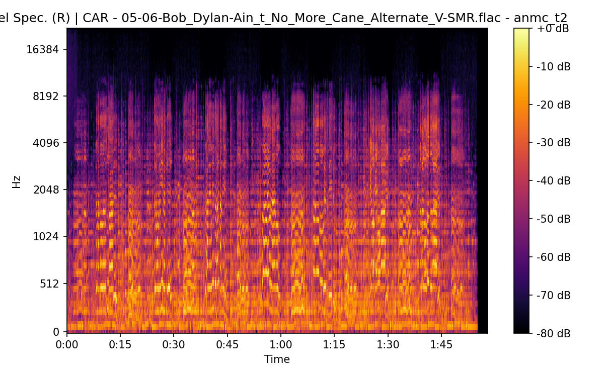

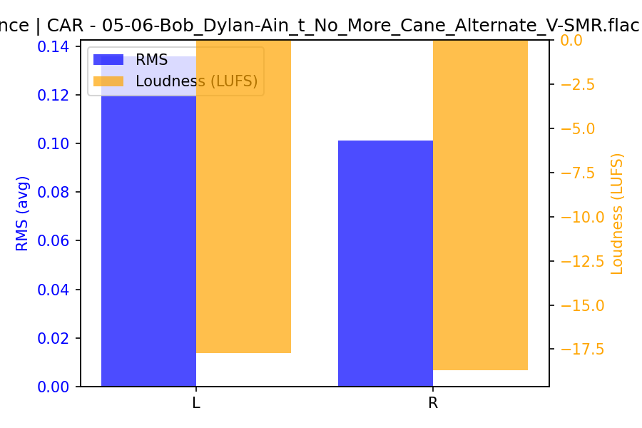

## Spectrograms (Mono)

### BS11

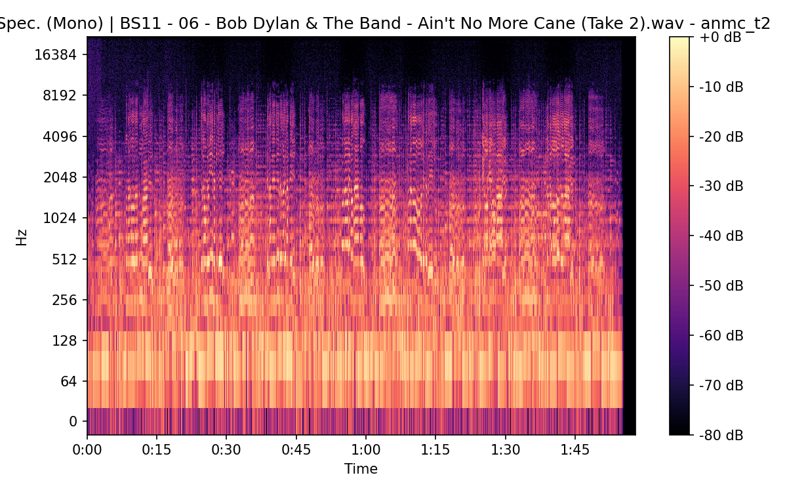

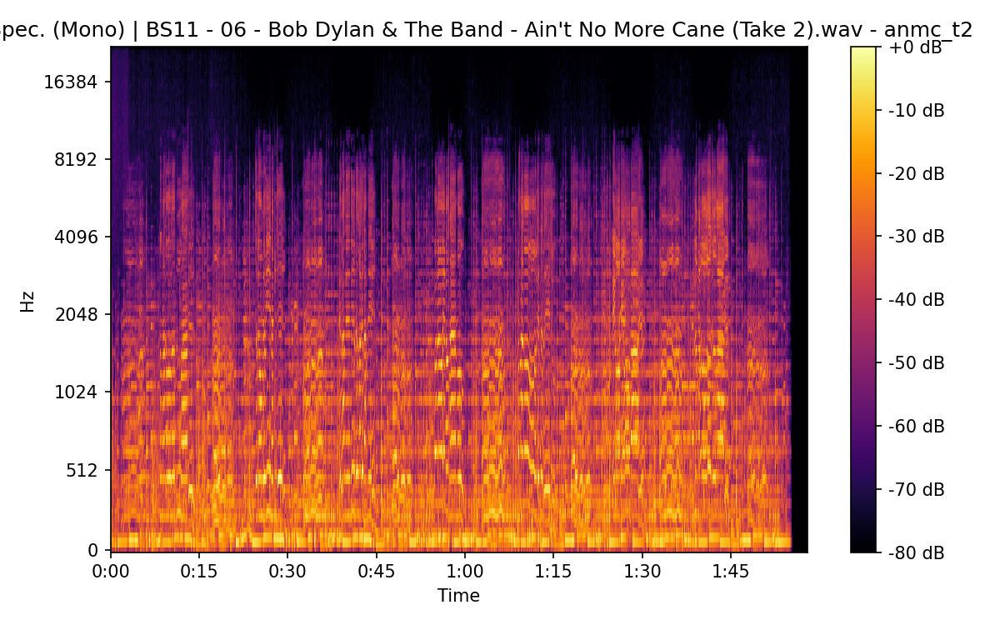

### CAR


