# Ain't No More Cane (The Band)

[](){ #anmc_t3 }

## Details

| label | orig_file                   | md5                              | disc | track | duration_sec | duration_fmt | loudness | loudness_left | loudness_right | loudness_balance |      rms | rms_left | rms_right | rms_balance |  lr_corr | spectral_centroid |
| :---- | :-------------------------- | :------------------------------- | ---: | ----: | -----------: | :----------- | -------: | ------------: | -------------: | ---------------: | -------: | -------: | --------: | ----------: | -------: | ----------------: |
| FTR   | 08. Ain't No More Cane.flac | f3d470bb37b6dc13e05991efecac26e2 |   11 |     8 |      238.827 | 03:58:827    |  -17.964 |       -17.781 |       -17.9328 |         0.151775 | 0.119724 | 0.122193 |   0.11998 |   0.0022134 | 0.952947 |           2037.63 |
| CB    | 09 Aint No More Cane.flac   | 026150019442082e7d9bc15f40c31cf9 |   10 |     9 |      238.827 | 03:58:827    | -17.9624 |      -17.7793 |       -17.9311 |         0.151787 | 0.119724 | 0.122194 |   0.11998 |  0.00221377 | 0.952947 |           2044.44 |

## Plots

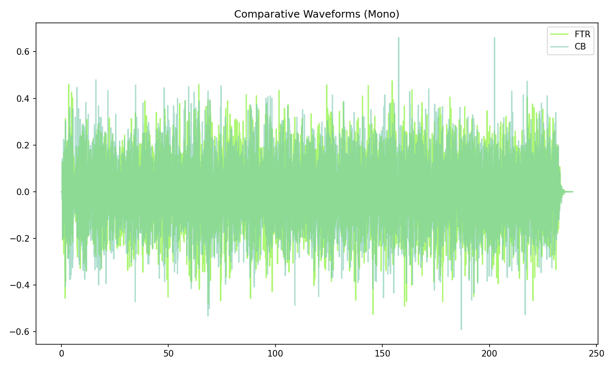

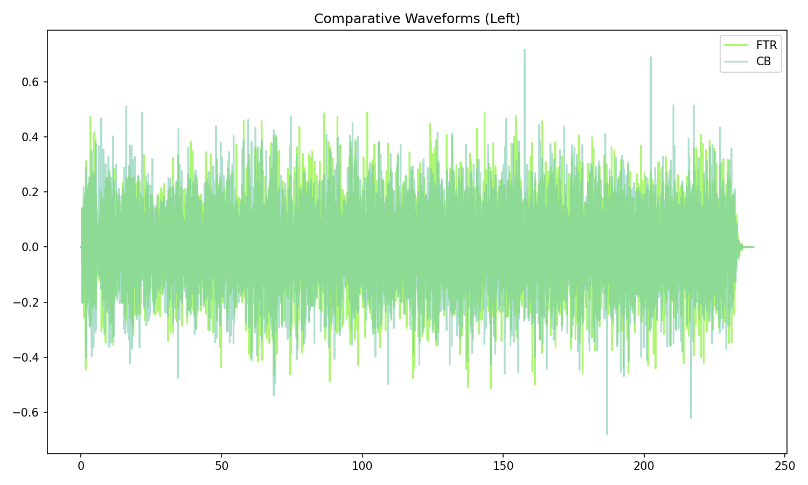

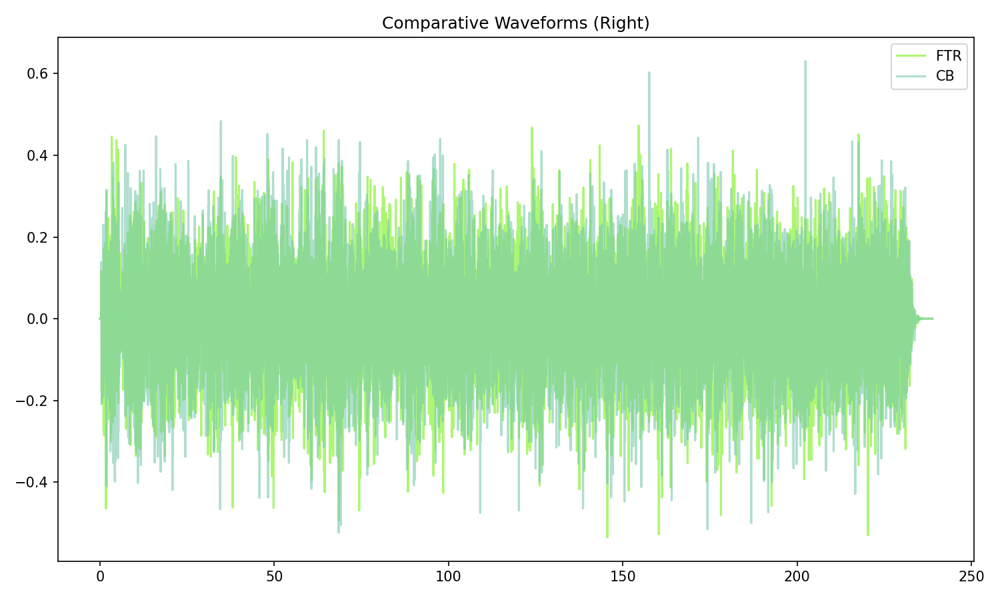

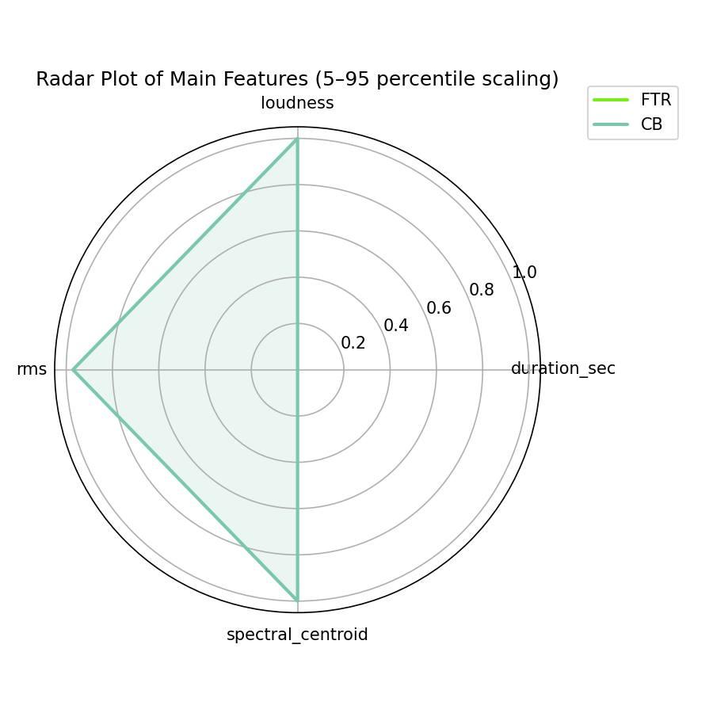

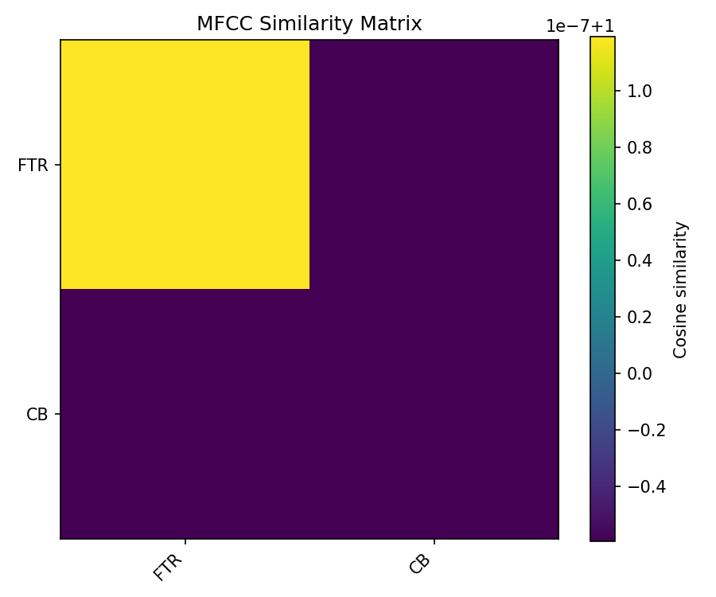

## Pitch & Speed Analysis (cents)

Reference version: **FTR**

| song_label | ref_label | cmp_label | cmp_file                    | tuning_cents_cmp | tuning_cents_ref | delta_tuning_cents | semitone_shift_vs_ref | chroma_similarity | speed_factor_from_pitch | duration_ratio_ref_over_cmp |
| :--------- | :-------- | :-------- | :-------------------------- | ---------------: | ---------------: | -----------------: | --------------------: | ----------------: | ----------------------: | --------------------------: |
| anmc_t3    | FTR       | FTR       | 08. Ain't No More Cane.flac |               12 |               12 |                  0 |                     0 |                 1 |                       1 |                           1 |
| anmc_t3    | FTR       | CB        | 09 Aint No More Cane.flac   |               12 |               12 |                  0 |                     0 |          0.999966 |                       1 |                           1 |

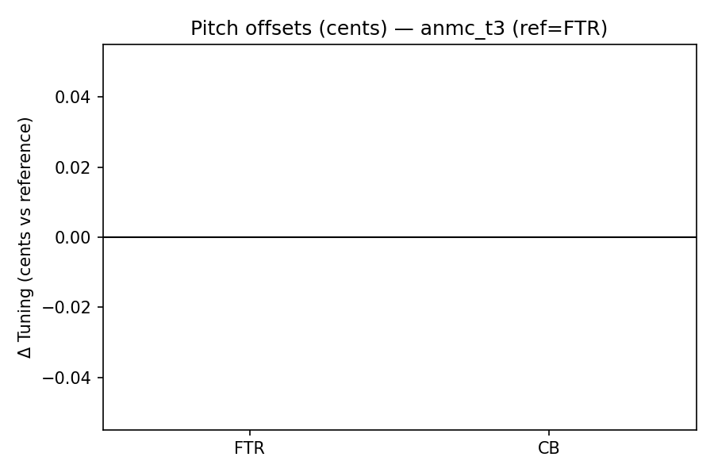

```text
Pitch/Speed analysis (reference = FTR)
============================================================

FTR - 08. Ain't No More Cane.flac: shift=0 st ; Δtuning=0.0 cents ; speed_from_pitch=1.0000 ; duration_ratio(ref/cmp)=1.0000
CB - 09 Aint No More Cane.flac: shift=0 st ; Δtuning=0.0 cents ; speed_from_pitch=1.0000 ; duration_ratio(ref/cmp)=1.0000

```

## Stereo Balance

### FTR


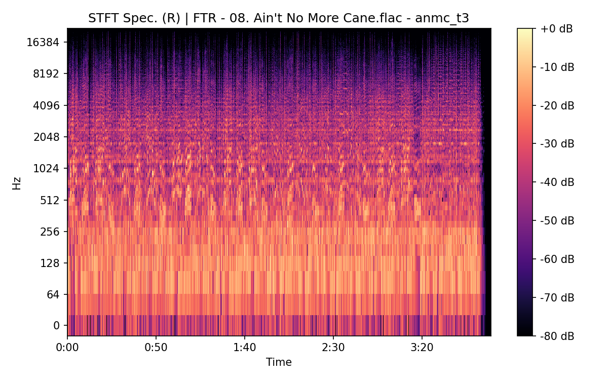


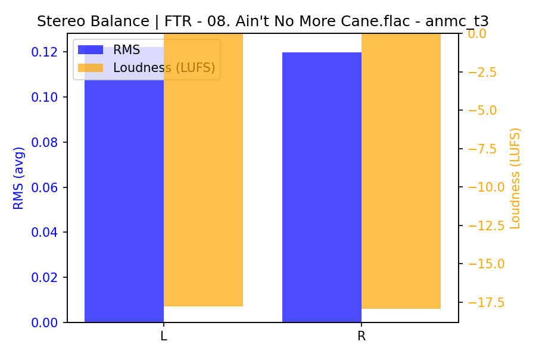

### CB


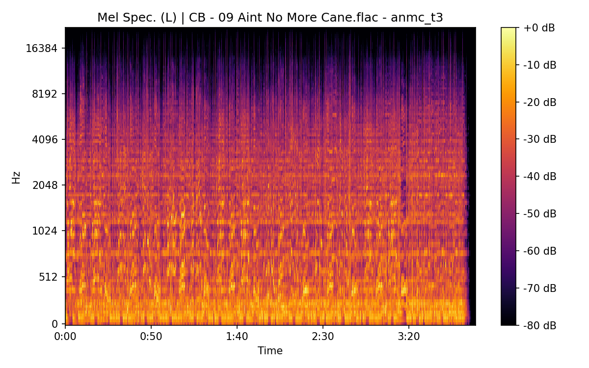

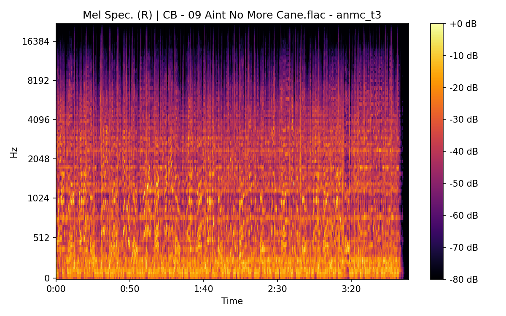

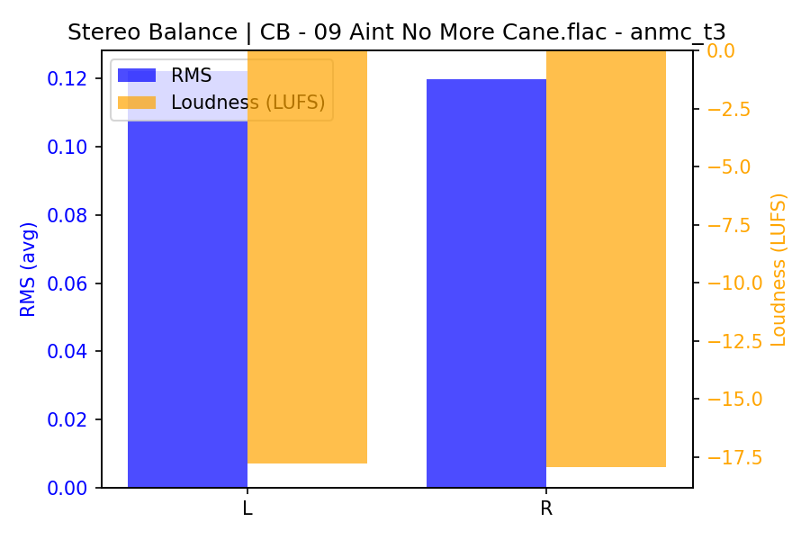

## Spectrograms (Mono)

### FTR


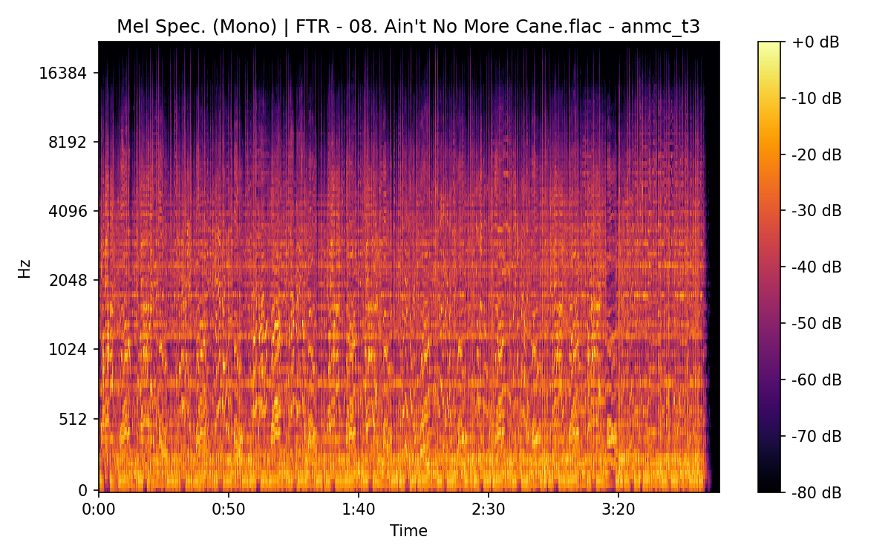

### CB


