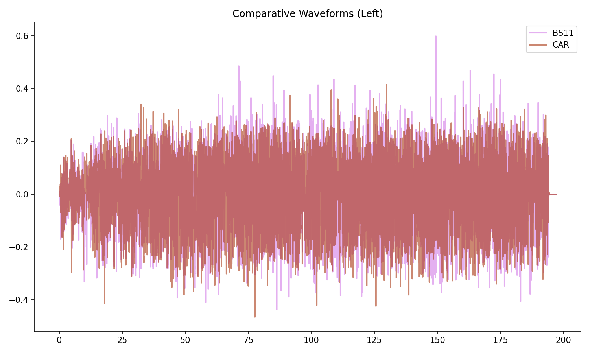
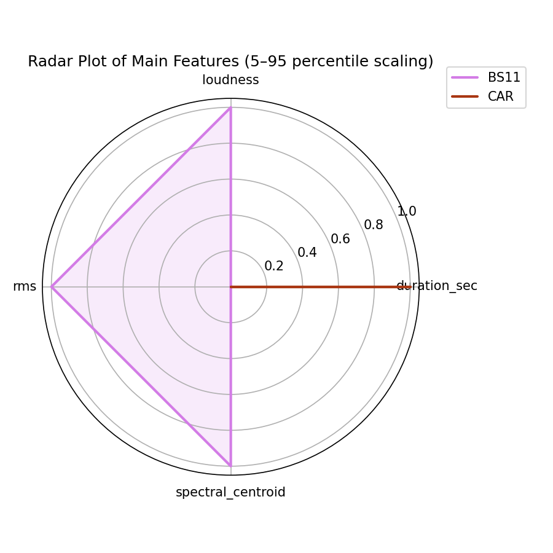
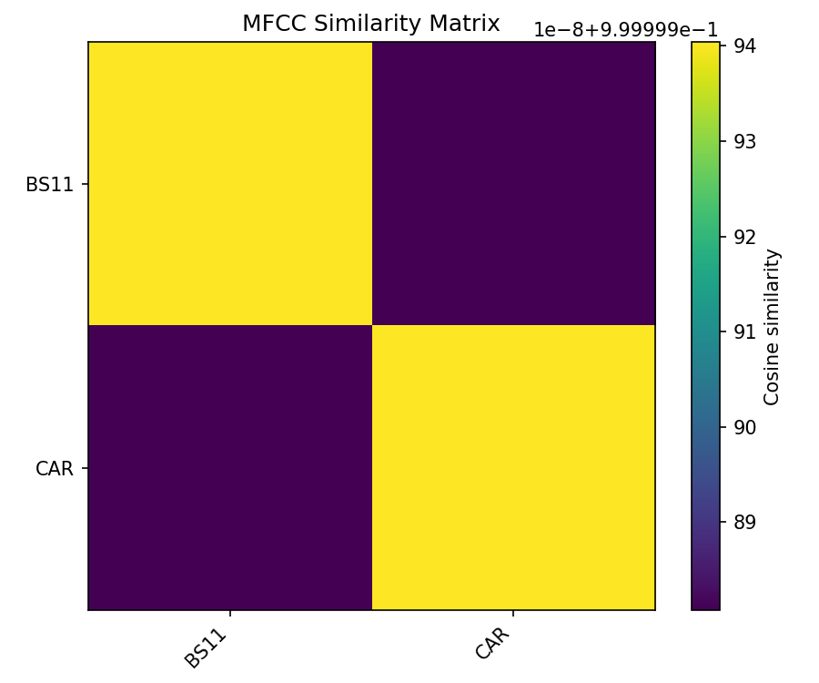
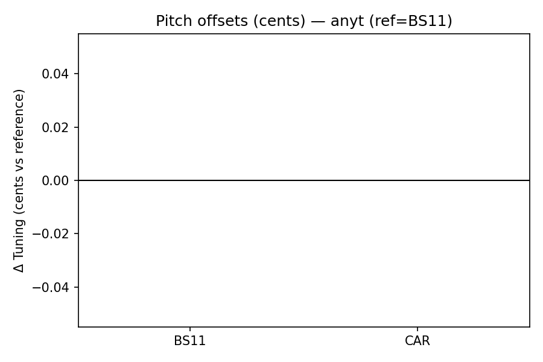
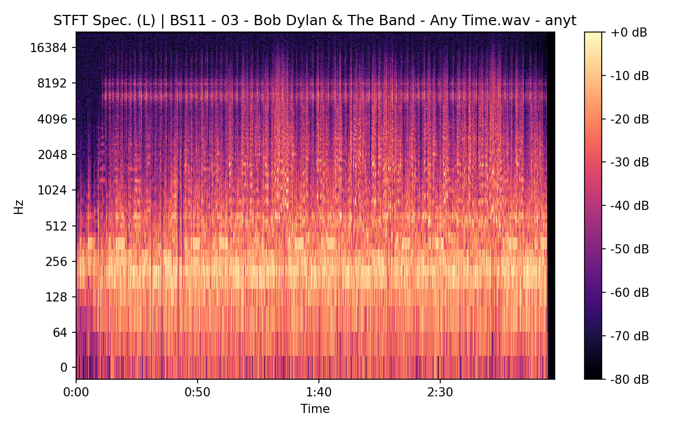
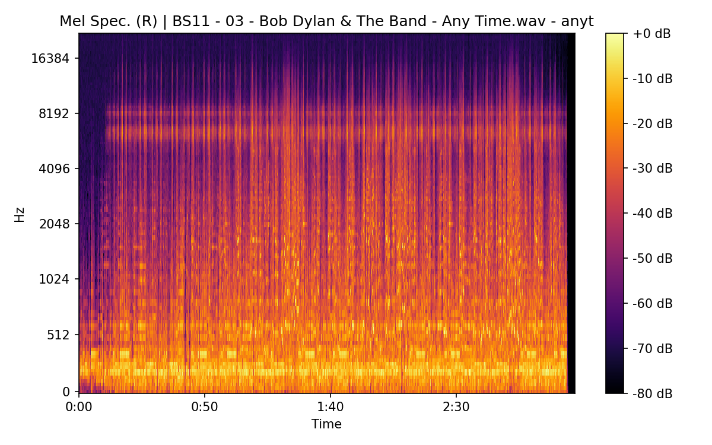
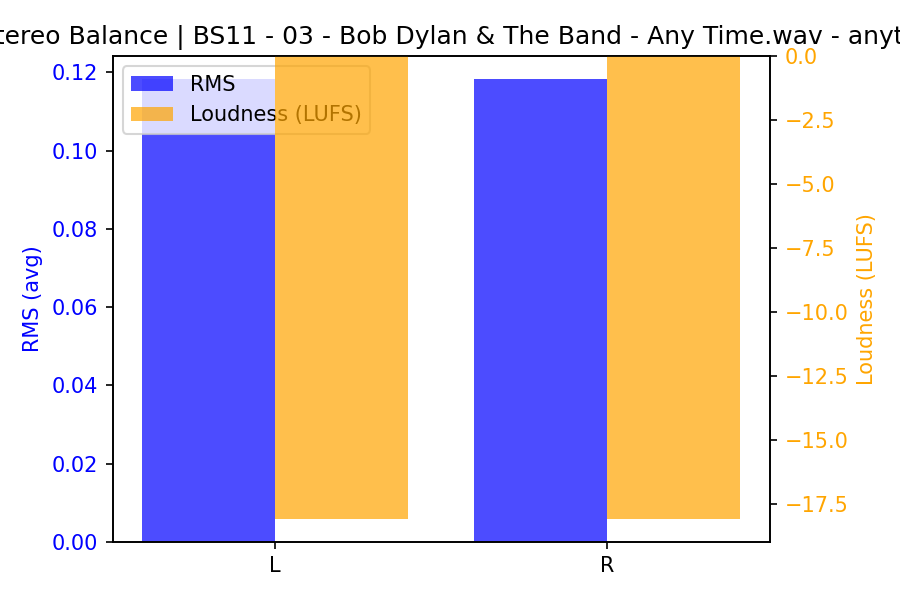
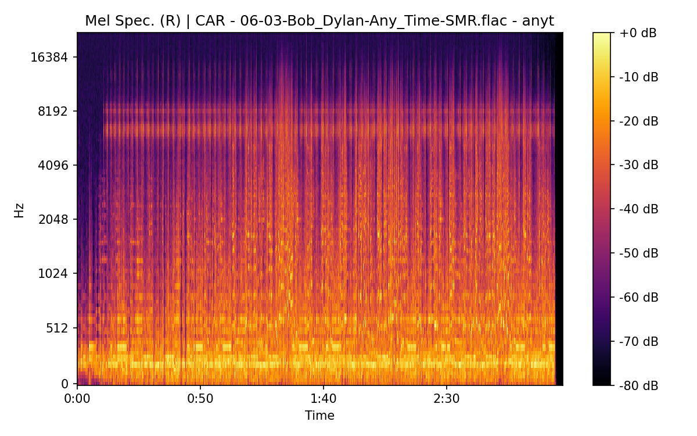
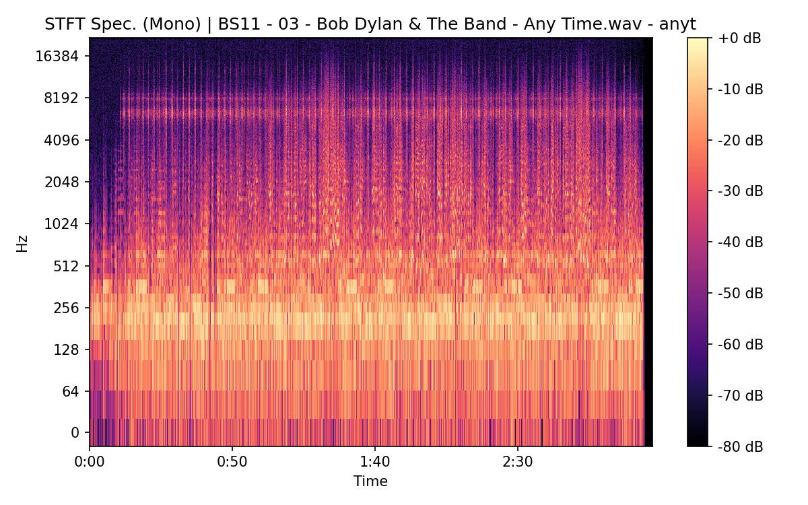
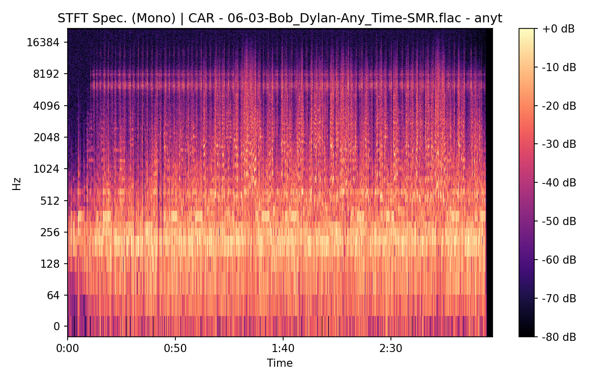

# Any Time

**(title taken from BS11)**

[](){ #anyt }

## Details

| label   | orig_file                                | md5                              |   disc |   track |   duration_sec | duration_fmt   |   loudness |   loudness_left |   loudness_right |   loudness_balance |      rms |   rms_left |   rms_right |   rms_balance |   lr_corr |   spectral_centroid |
|:--------|:-----------------------------------------|:---------------------------------|-------:|--------:|---------------:|:---------------|-----------:|----------------:|-----------------:|-------------------:|---------:|-----------:|------------:|--------------:|----------:|--------------------:|
| BS11    | 03 - Bob Dylan & The Band - Any Time.wav | 8e9997d93f6e924eea12cf9d22175297 |      6 |       3 |        197.147 | 03:17:147      |    -18.078 |        -18.0777 |         -18.0783 |        0.000654076 | 0.118248 |   0.118255 |    0.118241 |   1.38432e-05 |  0.999999 |             2715.2  |
| CAR     | 06-03-Bob_Dylan-Any_Time-SMR.flac        | e51d9cda943b0b2c4260637d44663e4b |      6 |       3 |        197.15  | 03:17:150      |    -18.078 |        -18.0777 |         -18.0783 |        0.000654065 | 0.11823  |   0.118237 |    0.118223 |   1.32993e-05 |  1        |             2627.72 |

## Plots









## Pitch & Speed Analysis (cents)

Reference version: **BS11**

| song_label   | ref_label   | cmp_label   | cmp_file                                 |   tuning_cents_cmp |   tuning_cents_ref |   delta_tuning_cents |   semitone_shift_vs_ref |   chroma_similarity |   speed_factor_from_pitch |   duration_ratio_ref_over_cmp |
|:-------------|:------------|:------------|:-----------------------------------------|-------------------:|-------------------:|---------------------:|------------------------:|--------------------:|--------------------------:|------------------------------:|
| anyt         | BS11        | BS11        | 03 - Bob Dylan & The Band - Any Time.wav |                -28 |                -28 |                    0 |                       0 |            1        |                         1 |                      1        |
| anyt         | BS11        | CAR         | 06-03-Bob_Dylan-Any_Time-SMR.flac        |                -28 |                -28 |                    0 |                       0 |            0.999998 |                         1 |                      0.999983 |



````text
Pitch/Speed analysis (reference = BS11)
============================================================

BS11 - 03 - Bob Dylan & The Band - Any Time.wav: shift=0 st ; Δtuning=0.0 cents ; speed_from_pitch=1.0000 ; duration_ratio(ref/cmp)=1.0000
CAR - 06-03-Bob_Dylan-Any_Time-SMR.flac: shift=0 st ; Δtuning=0.0 cents ; speed_from_pitch=1.0000 ; duration_ratio(ref/cmp)=1.0000

````

## Stereo Balance

### BS11








### CAR





## Spectrograms (Mono)

### BS11




### CAR




