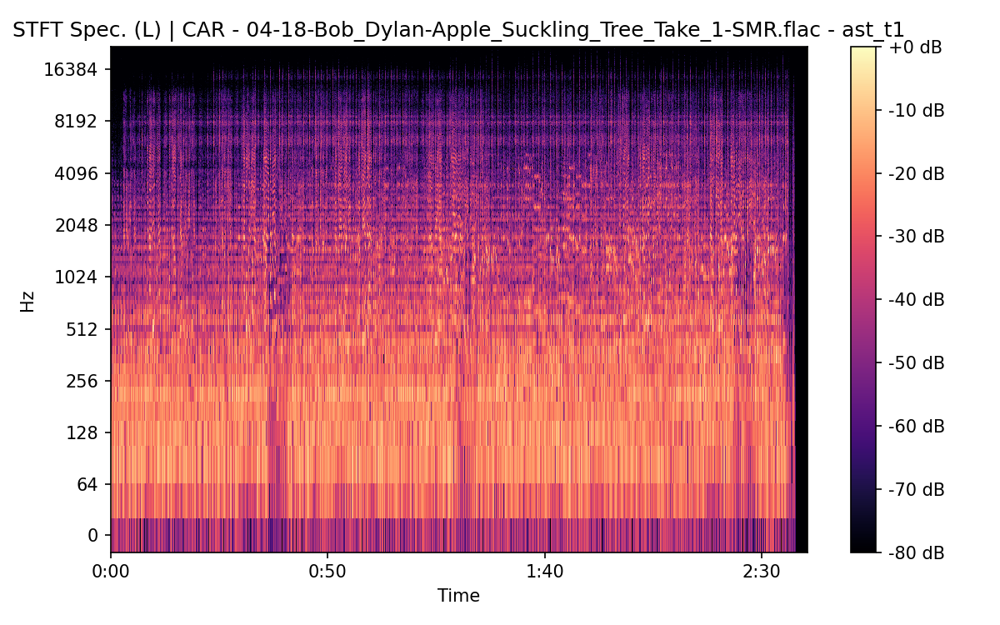
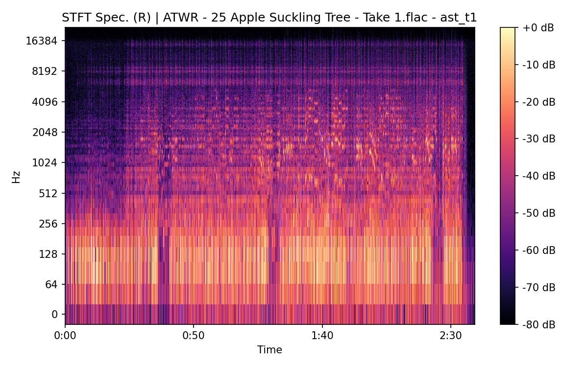
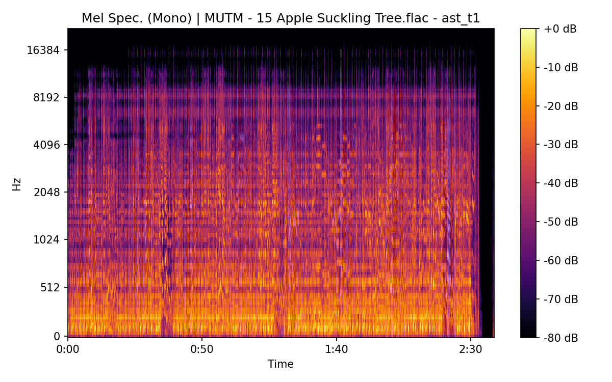

# Apple Suckling Tree (Take 1)

**(title taken from BS11)**

[](){ #ast_t1 }

## Details

| label   | orig_file                                                    | md5                              |   disc |   track |   duration_sec | duration_fmt   |   loudness |   loudness_left |   loudness_right |   loudness_balance |       rms |   rms_left |   rms_right |   rms_balance |   lr_corr |   spectral_centroid |
|:--------|:-------------------------------------------------------------|:---------------------------------|-------:|--------:|---------------:|:---------------|-----------:|----------------:|-----------------:|-------------------:|----------:|-----------:|------------:|--------------:|----------:|--------------------:|
| BS11    | 18 - Bob Dylan & The Band - Apple Suckling Tree (Take 1).wav | d7cc4a23ff0245f96cbde907957caead |      4 |      18 |        160.547 | 02:40:547      |   -17.8471 |        -17.9826 |         -17.3086 |          -0.673967 | 0.119005  |  0.118073  |   0.125297  |   -0.00722315 | 0.907601  |             2312.09 |
| CAR     | 04-18-Bob_Dylan-Apple_Suckling_Tree_Take_1-SMR.flac          | ec8401e9da37015e91c5cef2186f87eb |      4 |      18 |        160.4   | 02:40:400      |   -17.8426 |        -17.9782 |         -17.304  |          -0.67427  | 0.119117  |  0.118183  |   0.125416  |   -0.00723328 | 0.907601  |             2187.97 |
| ATWR    | 25 Apple Suckling Tree - Take 1.flac                         | 1355e15cee3bc91c1a08059663dea803 |      4 |      25 |        159.227 | 02:39:227      |   -18.2109 |        -13.8449 |         -18.741  |           4.89615  | 0.11875   |  0.197495  |   0.0999104 |    0.0975847  | 0.173463  |             2463.71 |
| MUTM    | 15 Apple Suckling Tree.flac                                  | fea7ed58a1843432a7af4589b4c1c6e8 |      1 |      15 |        158.613 | 02:38:613      |   -17.9262 |        -13.2973 |         -18.742  |           5.44463  | 0.115811  |  0.198037  |   0.0921118 |    0.105925   | 0.128412  |             2340.11 |
| TGBT    | 2-06 Apple Suckling Tree (Version 1).flac                    | 354cc20f68d81b34db50802e2adc55d3 |      2 |       6 |        161.493 | 02:41:493      |   -17.1983 |        -12.5641 |         -18.4856 |           5.92148  | 0.13326   |  0.229106  |   0.100297  |    0.128809   | 0.172483  |             2415.51 |
| CBST    | Dylan & Band - Safety Tape_Track15.flac                      | d875cffc34b7ba5c529d705cd9cad70d |      1 |      15 |        159.04  | 02:39:040      |   -18.0896 |        -13.5766 |         -18.5705 |           4.99382  | 0.115433  |  0.194995  |   0.0955234 |    0.0994717  | 0.129946  |             2006.36 |
| DITB    | 08 Apple Suckling Tree.flac                                  | 4b5dade86fa06b0b46cb4943b4a103a2 |      1 |       8 |        157.667 | 02:37:667      |   -19.0184 |        -16.5134 |         -17.3592 |           0.845778 | 0.104973  |  0.144096  |   0.11992   |    0.0241763  | 0.279733  |             1760.04 |
| FTR     | 23. Apple Suckling Tree.flac                                 | 0d63392ffa06cc03f322152d61ed1364 |      5 |      23 |        159.267 | 02:39:267      |   -21.9199 |        -17.903  |         -20.0603 |           2.15731  | 0.060371  |  0.0931051 |   0.0575223 |    0.0355828  | 0.0945103 |             2109.44 |
| FTR     | 11. Apple Suckling Tree.flac                                 | 92ae564ba876ddd4826975c7f89e7d6f |      9 |      11 |        152.12  | 02:32:120      |   -21.2679 |        -22.3074 |         -20.2956 |          -2.01187  | 0.0818894 |  0.0725785 |   0.091476  |   -0.0188975  | 0.994517  |             1357.79 |
| FTR     | 21. Apple Suckling Tree.flac                                 | f34d04b14dbff3ca6b00b32dd53d4f61 |     10 |      21 |        128.92  | 02:08:920      |   -16.9156 |        -19.0898 |         -15.0268 |          -4.063    | 0.128459  |  0.0995118 |   0.159184  |   -0.0596725  | 0.966815  |             1072.65 |
| FTR     | 24. Apple Suckling Tree.flac                                 | 4d3d027a96dd4c33ebfe4cd6e3d57f42 |     10 |      24 |        151.773 | 02:31:773      |   -17.0387 |        -19.3504 |         -15.0284 |          -4.32203  | 0.140282  |  0.108413  |   0.174478  |   -0.0660651  | 0.961666  |             1258.21 |
| CB      | 23 Apple Suckling Tree - 1.flac                              | 10a98889f9f00210db3364cfac6345d5 |      5 |      23 |        159.267 | 02:39:267      |   -21.9197 |        -20.0443 |         -17.8977 |          -2.14653  | 0.0603691 |  0.0575157 |   0.0931057 |   -0.0355899  | 0.0945096 |             2108.62 |
| CB      | 22D Apple Suckling Tree T1.flac                              | 98934af68d8332741e68a2add074d282 |      7 |      24 |        152.12  | 02:32:120      |   -21.2708 |        -22.313  |         -20.2957 |          -2.01728  | 0.0818914 |  0.0725803 |   0.0914783 |   -0.018898   | 0.994517  |             1357.68 |
| CB      | 21 Apple Suckling Tree - 1.flac                              | afa03a090cc8e38b08cc3e4b8c0a4403 |      9 |      25 |        131.147 | 02:11:147      |   -18.2552 |        -20.2436 |         -16.4483 |          -3.79523  | 0.107677  |  0.0850796 |   0.132104  |   -0.0470248  | 0.961197  |             1271.25 |
| CB      | 24 Apple Suckling Tree - 4.flac                              | 1b2c53e2f25a3e48e4ab7bd65cd390c5 |      9 |      26 |        151.347 | 02:31:347      |   -18.2139 |        -20.4254 |         -16.2136 |          -4.21181  | 0.122086  |  0.0959171 |   0.150593  |   -0.0546757  | 0.955712  |             1352.49 |

## Plots


## Pitch & Speed Analysis (cents)

Reference version: **BS11**

| song_label   | ref_label   | cmp_label   | cmp_file                                                     |   tuning_cents_cmp |   tuning_cents_ref |   delta_tuning_cents |   semitone_shift_vs_ref |   chroma_similarity |   speed_factor_from_pitch |   duration_ratio_ref_over_cmp |
|:-------------|:------------|:------------|:-------------------------------------------------------------|-------------------:|-------------------:|---------------------:|------------------------:|--------------------:|--------------------------:|------------------------------:|
| ast_t1       | BS11        | BS11        | 18 - Bob Dylan & The Band - Apple Suckling Tree (Take 1).wav |                -22 |                -22 |                    0 |                       0 |            1        |                  1        |                      1        |
| ast_t1       | BS11        | CAR         | 04-18-Bob_Dylan-Apple_Suckling_Tree_Take_1-SMR.flac          |                -21 |                -22 |                    1 |                       0 |            0.999991 |                  1        |                      1.00092  |
| ast_t1       | BS11        | ATWR        | 25 Apple Suckling Tree - Take 1.flac                         |                 -7 |                -22 |                   15 |                       0 |            0.976731 |                  1        |                      1.00829  |
| ast_t1       | BS11        | MUTM        | 15 Apple Suckling Tree.flac                                  |                 19 |                -22 |                   41 |                       0 |            0.965527 |                  1        |                      1.01219  |
| ast_t1       | BS11        | TGBT        | 2-06 Apple Suckling Tree (Version 1).flac                    |                -20 |                -22 |                    2 |                       0 |            0.99083  |                  1        |                      0.994138 |
| ast_t1       | BS11        | CBST        | Dylan & Band - Safety Tape_Track15.flac                      |                -25 |                -22 |                   -3 |                       0 |            0.98826  |                  1        |                      1.00947  |
| ast_t1       | BS11        | DITB        | 08 Apple Suckling Tree.flac                                  |                  0 |                -22 |                   22 |                       0 |            0.973065 |                  1        |                      1.01827  |
| ast_t1       | BS11        | FTR         | 23. Apple Suckling Tree.flac                                 |                  6 |                -22 |                   28 |                       0 |            0.975024 |                  1        |                      1.00804  |
| ast_t1       | BS11        | FTR         | 11. Apple Suckling Tree.flac                                 |                 46 |                -22 |                   68 |                      -1 |            0.983323 |                  0.943874 |                      1.05539  |
| ast_t1       | BS11        | FTR         | 21. Apple Suckling Tree.flac                                 |                -16 |                -22 |                    6 |                       0 |            0.965385 |                  1        |                      1.24532  |
| ast_t1       | BS11        | FTR         | 24. Apple Suckling Tree.flac                                 |                 20 |                -22 |                   42 |                      -1 |            0.965681 |                  0.943874 |                      1.05781  |
| ast_t1       | BS11        | CB          | 23 Apple Suckling Tree - 1.flac                              |                  5 |                -22 |                   27 |                       0 |            0.973043 |                  1        |                      1.00804  |
| ast_t1       | BS11        | CB          | 22D Apple Suckling Tree T1.flac                              |                 47 |                -22 |                   69 |                      -1 |            0.982983 |                  0.943874 |                      1.05539  |
| ast_t1       | BS11        | CB          | 21 Apple Suckling Tree - 1.flac                              |                -14 |                -22 |                    8 |                       0 |            0.96444  |                  1        |                      1.22418  |
| ast_t1       | BS11        | CB          | 24 Apple Suckling Tree - 4.flac                              |                 19 |                -22 |                   41 |                       0 |            0.967701 |                  1        |                      1.06079  |


````text
Pitch/Speed analysis (reference = BS11)
============================================================

BS11 - 18 - Bob Dylan & The Band - Apple Suckling Tree (Take 1).wav: shift=0 st ; Δtuning=0.0 cents ; speed_from_pitch=1.0000 ; duration_ratio(ref/cmp)=1.0000
CAR - 04-18-Bob_Dylan-Apple_Suckling_Tree_Take_1-SMR.flac: shift=0 st ; Δtuning=1.0 cents ; speed_from_pitch=1.0000 ; duration_ratio(ref/cmp)=1.0009
ATWR - 25 Apple Suckling Tree - Take 1.flac: shift=0 st ; Δtuning=15.0 cents ; speed_from_pitch=1.0000 ; duration_ratio(ref/cmp)=1.0083
MUTM - 15 Apple Suckling Tree.flac: shift=0 st ; Δtuning=41.0 cents ; speed_from_pitch=1.0000 ; duration_ratio(ref/cmp)=1.0122
TGBT - 2-06 Apple Suckling Tree (Version 1).flac: shift=0 st ; Δtuning=2.0 cents ; speed_from_pitch=1.0000 ; duration_ratio(ref/cmp)=0.9941
CBST - Dylan & Band - Safety Tape_Track15.flac: shift=0 st ; Δtuning=-3.0 cents ; speed_from_pitch=1.0000 ; duration_ratio(ref/cmp)=1.0095
DITB - 08 Apple Suckling Tree.flac: shift=0 st ; Δtuning=22.0 cents ; speed_from_pitch=1.0000 ; duration_ratio(ref/cmp)=1.0183
FTR - 23. Apple Suckling Tree.flac: shift=0 st ; Δtuning=28.0 cents ; speed_from_pitch=1.0000 ; duration_ratio(ref/cmp)=1.0080
FTR - 11. Apple Suckling Tree.flac: shift=-1 st ; Δtuning=68.0 cents ; speed_from_pitch=0.9439 ; duration_ratio(ref/cmp)=1.0554
FTR - 21. Apple Suckling Tree.flac: shift=0 st ; Δtuning=6.0 cents ; speed_from_pitch=1.0000 ; duration_ratio(ref/cmp)=1.2453
FTR - 24. Apple Suckling Tree.flac: shift=-1 st ; Δtuning=42.0 cents ; speed_from_pitch=0.9439 ; duration_ratio(ref/cmp)=1.0578
CB - 23 Apple Suckling Tree - 1.flac: shift=0 st ; Δtuning=27.0 cents ; speed_from_pitch=1.0000 ; duration_ratio(ref/cmp)=1.0080
CB - 22D Apple Suckling Tree T1.flac: shift=-1 st ; Δtuning=69.0 cents ; speed_from_pitch=0.9439 ; duration_ratio(ref/cmp)=1.0554
CB - 21 Apple Suckling Tree - 1.flac: shift=0 st ; Δtuning=8.0 cents ; speed_from_pitch=1.0000 ; duration_ratio(ref/cmp)=1.2242
CB - 24 Apple Suckling Tree - 4.flac: shift=0 st ; Δtuning=41.0 cents ; speed_from_pitch=1.0000 ; duration_ratio(ref/cmp)=1.0608

````

## Stereo Balance

### BS11


### CAR




### ATWR





### MUTM


### TGBT


### CBST


### DITB


### FTR


### FTR

.png)

.png)

.png)

.png)

.png)

### FTR

.png)

.png)

.png)

.png)

.png)

### FTR

.png)

.png)

.png)

.png)

.png)

### CB


### CB

.png)

.png)

.png)

.png)

.png)

### CB

.png)

.png)

.png)

.png)

.png)

### CB

.png)

.png)

.png)

.png)

.png)

## Spectrograms (Mono)

### BS11


### CAR


### ATWR


### MUTM




### TGBT


### CBST


### DITB


### FTR


### FTR

.png)

.png)

### FTR

.png)

.png)

### FTR

.png)

.png)

### CB


### CB

.png)

.png)

### CB

.png)

.png)

### CB

.png)

.png)

