# Apple Suckling Tree (Take 2, Fragment 2)

[](){ #ast_t2f2 }

## Details

| label | orig_file                       | md5                              | disc | track | duration_sec | duration_fmt | loudness | loudness_left | loudness_right | loudness_balance |      rms |  rms_left | rms_right | rms_balance |  lr_corr | spectral_centroid |
| :---- | :------------------------------ | :------------------------------- | ---: | ----: | -----------: | :----------- | -------: | ------------: | -------------: | ---------------: | -------: | --------: | --------: | ----------: | -------: | ----------------: |
| FTR   | 23. Apple Suckling Tree.flac    | e0253f6f84154d006787e670ad9861d1 |   10 |    23 |        45.24 | 00:45:240    | -17.0599 |        -19.15 |       -15.2152 |         -3.93483 |  0.13147 |  0.103079 |  0.161712 |  -0.0586328 | 0.969296 |           1096.43 |
| CB    | 23 Apple Suckling Tree - 3.flac | fbf0184ed2de598c453f611bb92ed8f5 |    9 |    25 |        45.44 | 00:45:440    | -18.3869 |      -20.3748 |       -16.6005 |         -3.77426 | 0.112065 | 0.0892941 |  0.136739 |  -0.0474453 | 0.965254 |           1218.04 |

## Plots

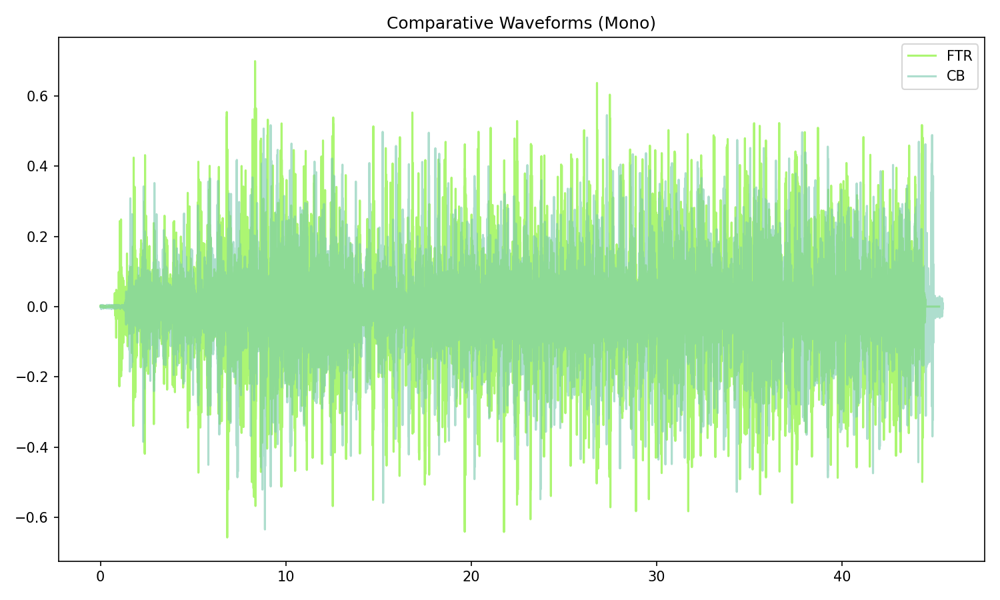

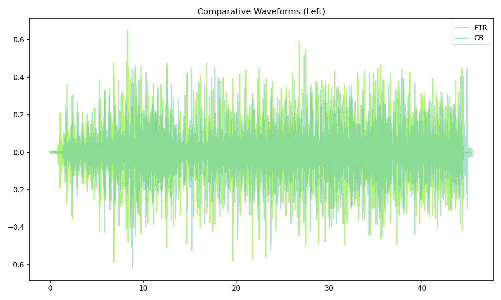

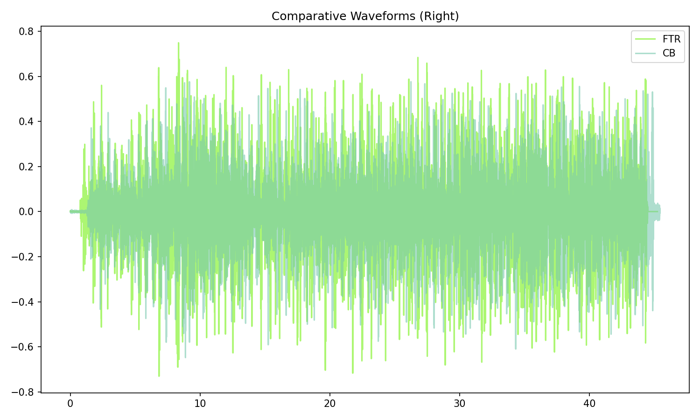


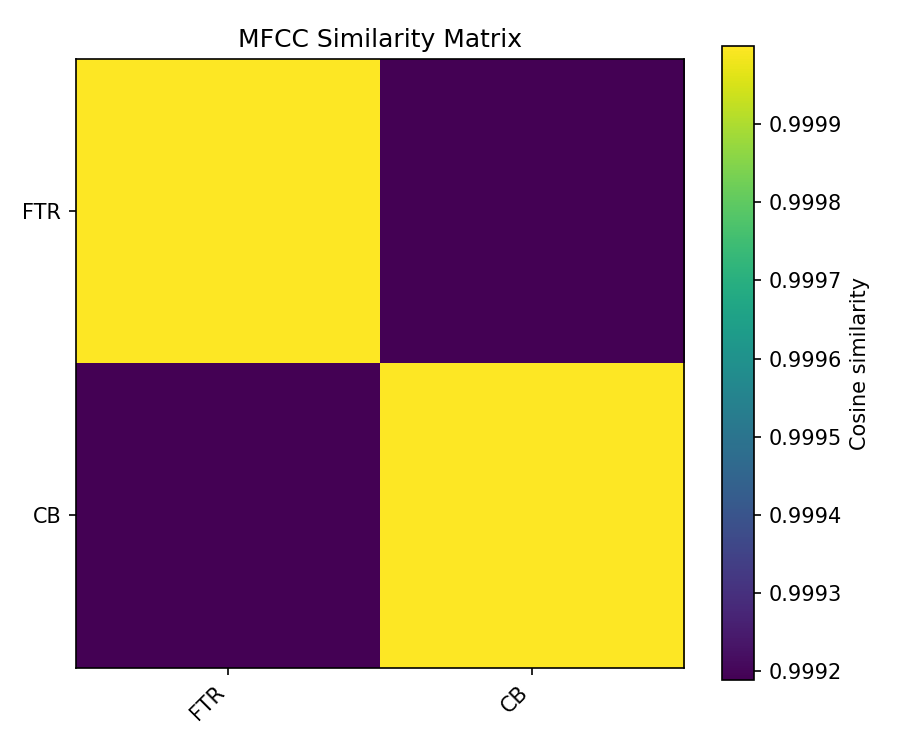

## Pitch & Speed Analysis (cents)

Reference version: **FTR**

| song_label | ref_label | cmp_label | cmp_file                        | tuning_cents_cmp | tuning_cents_ref | delta_tuning_cents | semitone_shift_vs_ref | chroma_similarity | speed_factor_from_pitch | duration_ratio_ref_over_cmp |
| :--------- | :-------- | :-------- | :------------------------------ | ---------------: | ---------------: | -----------------: | --------------------: | ----------------: | ----------------------: | --------------------------: |
| ast_t2f2   | FTR       | FTR       | 23. Apple Suckling Tree.flac    |               25 |               25 |                  0 |                     0 |                 1 |                       1 |                           1 |
| ast_t2f2   | FTR       | CB        | 23 Apple Suckling Tree - 3.flac |               24 |               25 |                 -1 |                     0 |           0.99968 |                       1 |                    0.995599 |

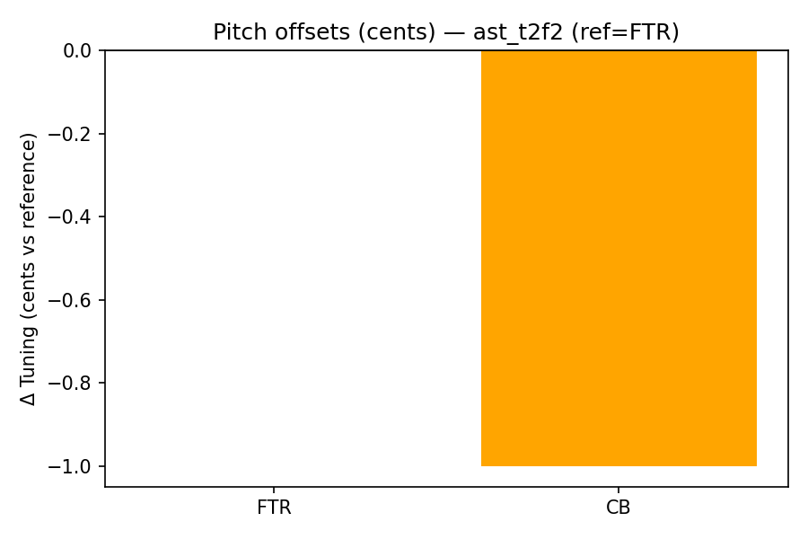

```text
Pitch/Speed analysis (reference = FTR)
============================================================

FTR - 23. Apple Suckling Tree.flac: shift=0 st ; Δtuning=0.0 cents ; speed_from_pitch=1.0000 ; duration_ratio(ref/cmp)=1.0000
CB - 23 Apple Suckling Tree - 3.flac: shift=0 st ; Δtuning=-1.0 cents ; speed_from_pitch=1.0000 ; duration_ratio(ref/cmp)=0.9956

```

## Stereo Balance

### FTR

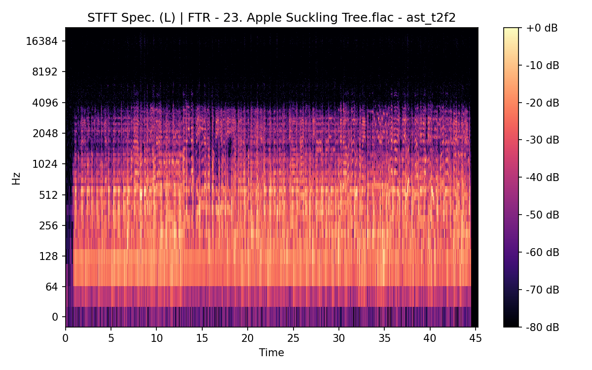


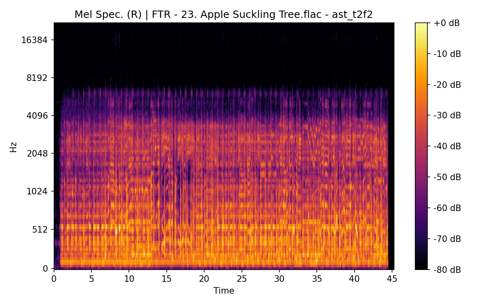

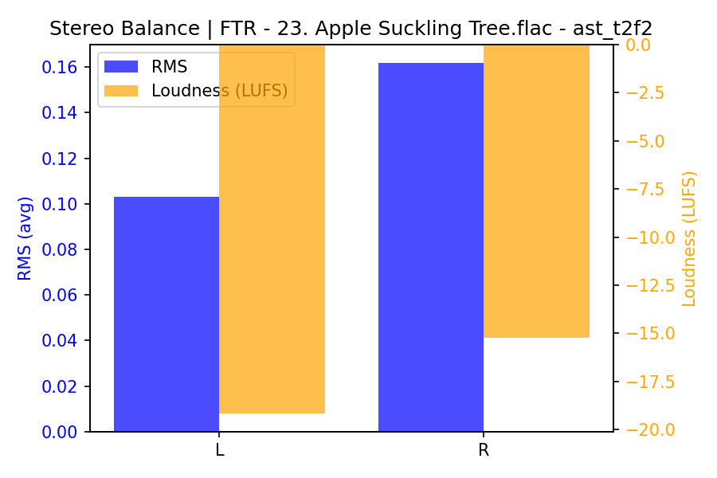

### CB


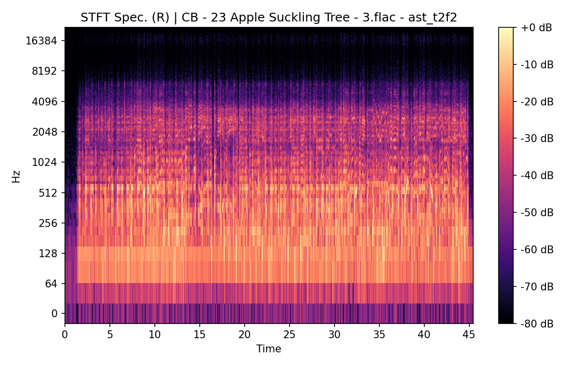

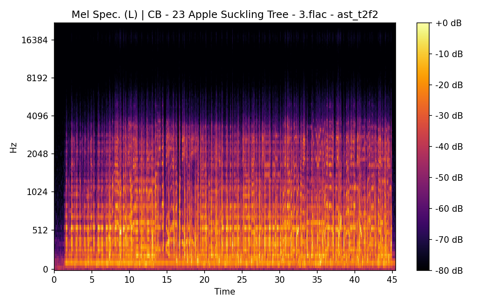


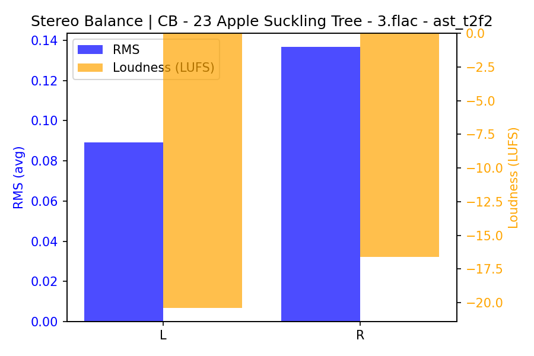

## Spectrograms (Mono)

### FTR


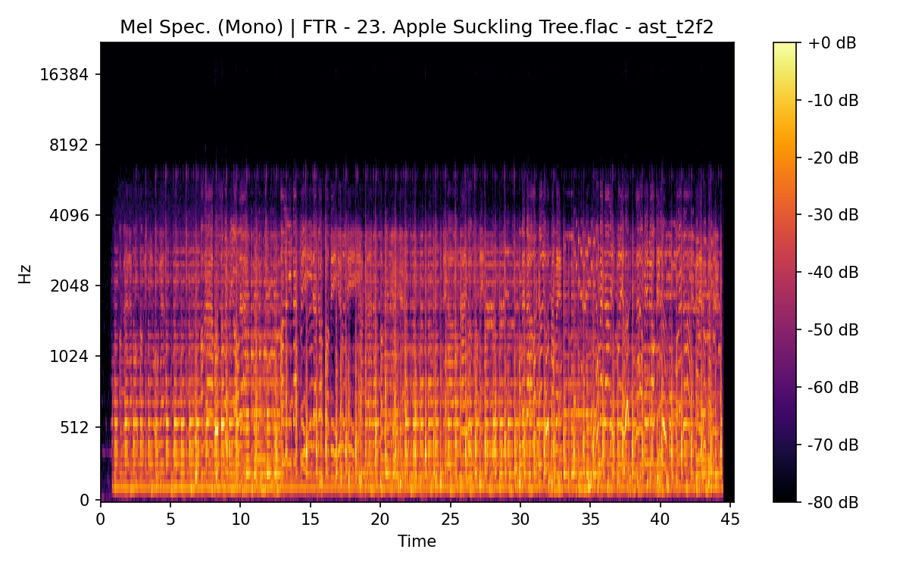

### CB

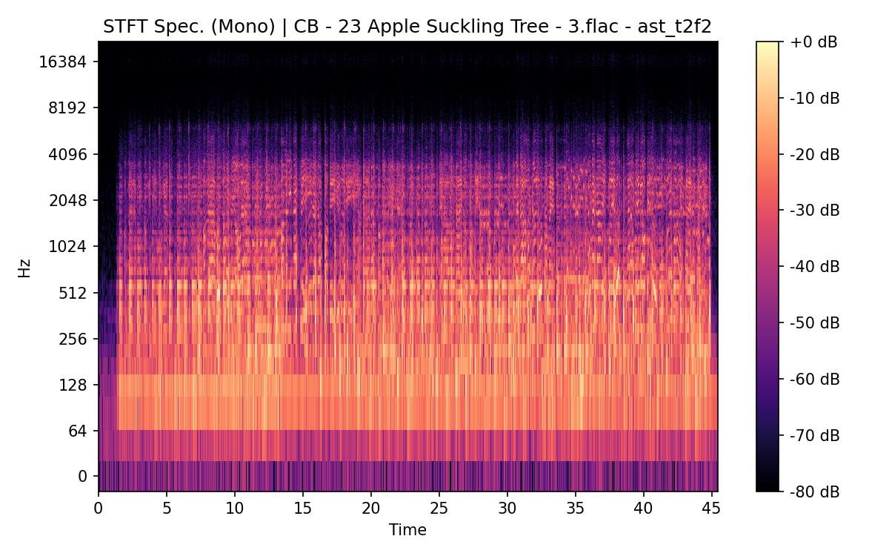

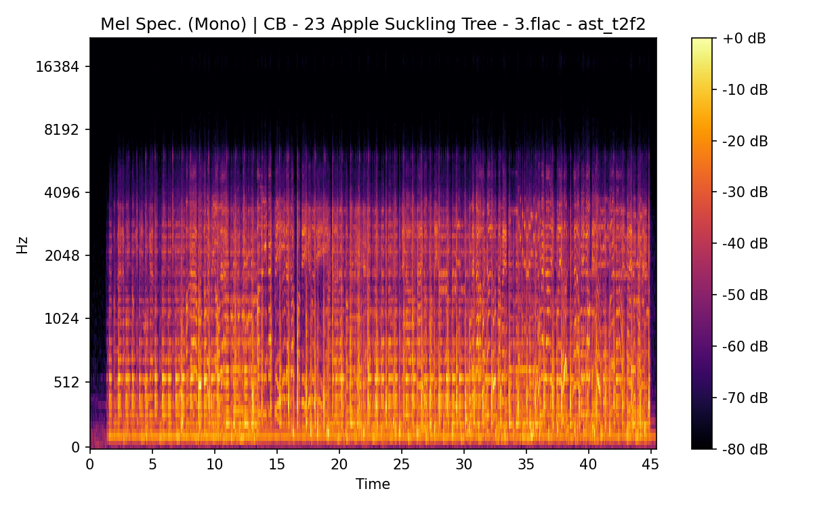
