# Beautiful Thing (Take 1)

[](){ #beat_t1 }

## Details

| label   | orig_file                   | md5                              |   disc |   track |   duration_sec | duration_fmt   |   loudness |   loudness_left |   loudness_right |   loudness_balance |      rms |   rms_left |   rms_right |   rms_balance |   lr_corr |   spectral_centroid |
|:--------|:----------------------------|:---------------------------------|-------:|--------:|---------------:|:---------------|-----------:|----------------:|-----------------:|-------------------:|---------:|-----------:|------------:|--------------:|----------:|--------------------:|
| FTR     | 05. Beautiful Thing.flac    | 79ecf85f24243f42b9e034898994009b |     10 |       5 |        100.4   | 01:40:400      |   -12.5021 |        -12.0287 |         -12.265  |           0.236303 | 0.232779 |   0.241353 |    0.241202 |   0.000151679 |  0.850926 |             660.984 |
| CB      | 05 Beautiful Thing - 1.flac | 91efc8041c48db14dc641b36513d4747 |      9 |       6 |        103.787 | 01:43:787      |   -14.5246 |        -14.27   |         -14.1075 |          -0.162468 | 0.178572 |   0.180882 |    0.18906  |  -0.00817728  |  0.853281 |             933.305 |

## Plots
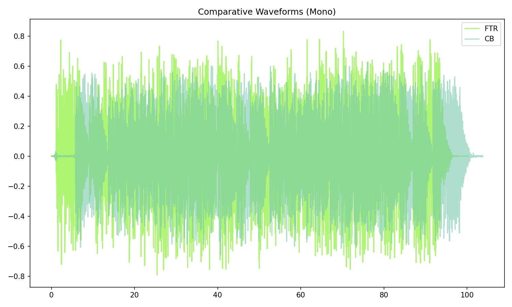

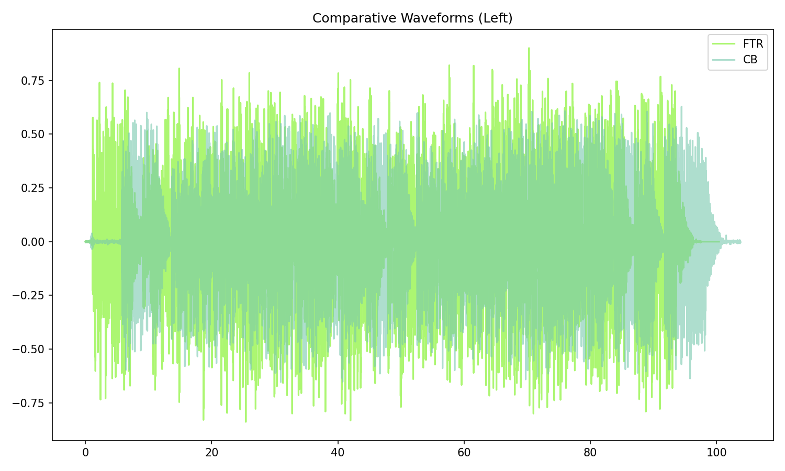

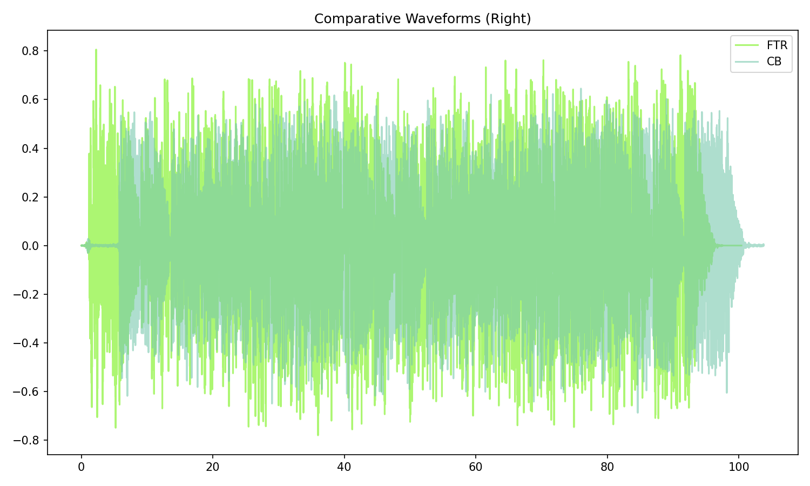


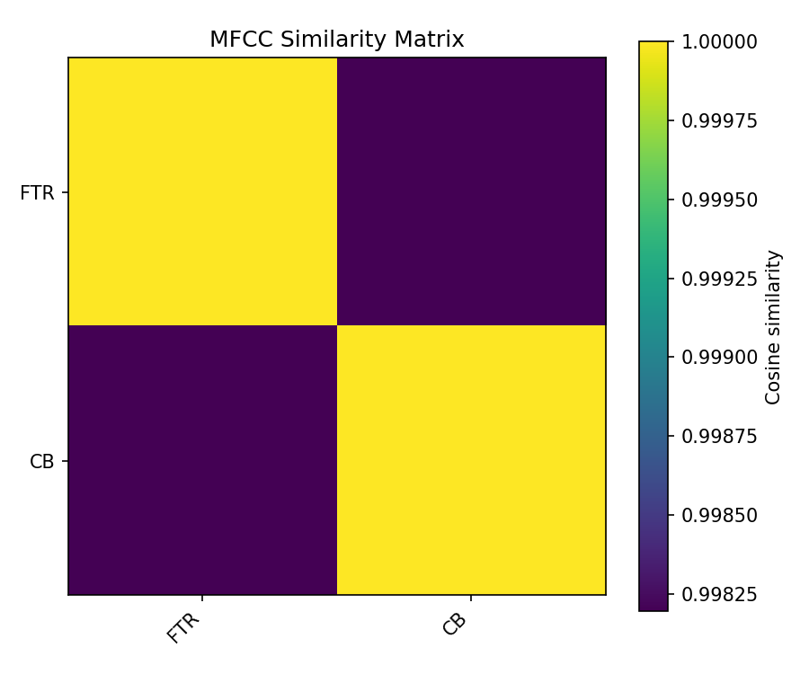

## Pitch & Speed Analysis (cents)

Reference version: **FTR**

| song_label   | ref_label   | cmp_label   | cmp_file                    |   tuning_cents_cmp |   tuning_cents_ref |   delta_tuning_cents |   semitone_shift_vs_ref |   chroma_similarity |   speed_factor_from_pitch |   duration_ratio_ref_over_cmp |
|:-------------|:------------|:------------|:----------------------------|-------------------:|-------------------:|---------------------:|------------------------:|--------------------:|--------------------------:|------------------------------:|
| beat_t1      | FTR         | FTR         | 05. Beautiful Thing.flac    |                -42 |                -42 |                    0 |                       0 |            1        |                         1 |                      1        |
| beat_t1      | FTR         | CB          | 05 Beautiful Thing - 1.flac |                -45 |                -42 |                   -3 |                       0 |            0.999696 |                         1 |                      0.967369 |

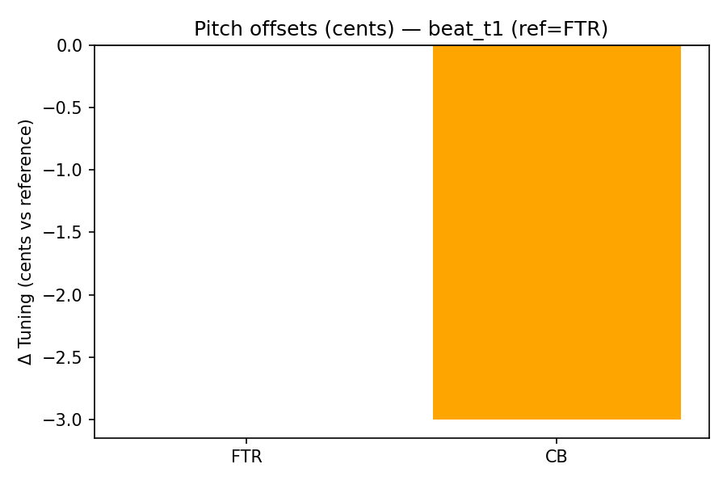

````text
Pitch/Speed analysis (reference = FTR)
============================================================

FTR - 05. Beautiful Thing.flac: shift=0 st ; Δtuning=0.0 cents ; speed_from_pitch=1.0000 ; duration_ratio(ref/cmp)=1.0000
CB - 05 Beautiful Thing - 1.flac: shift=0 st ; Δtuning=-3.0 cents ; speed_from_pitch=1.0000 ; duration_ratio(ref/cmp)=0.9674

````

## Stereo Balance

### FTR


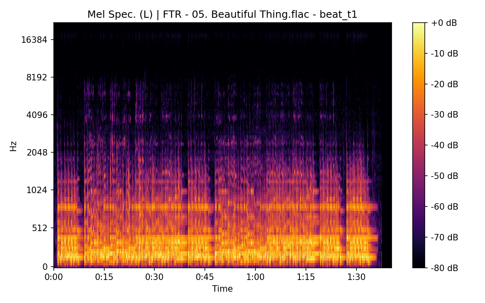


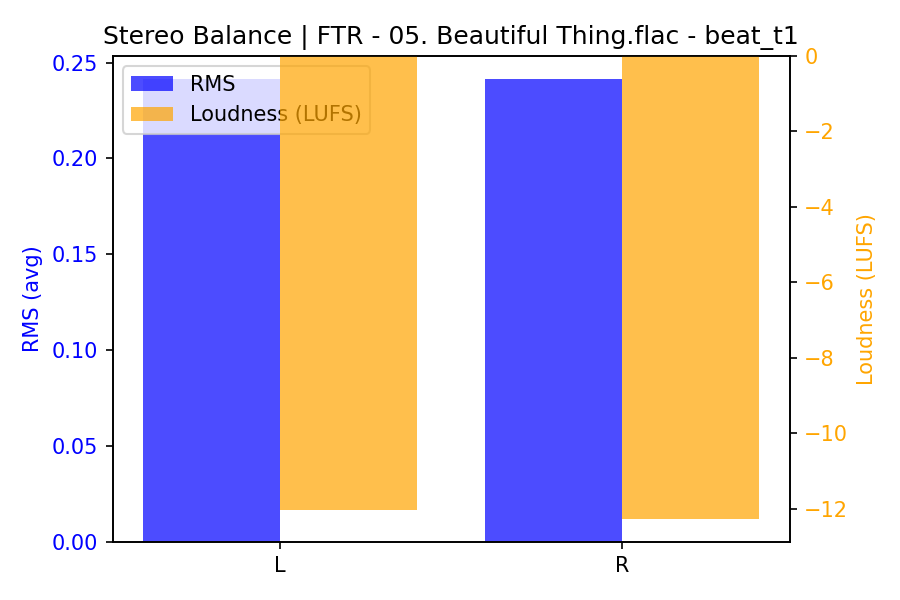

### CB

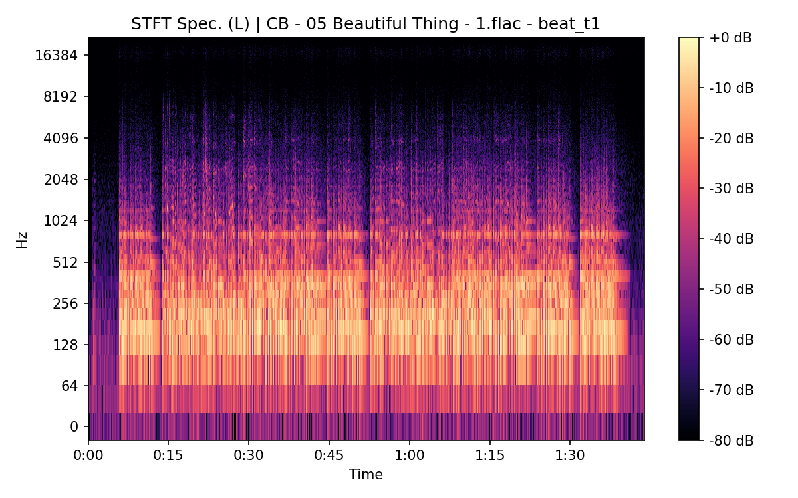

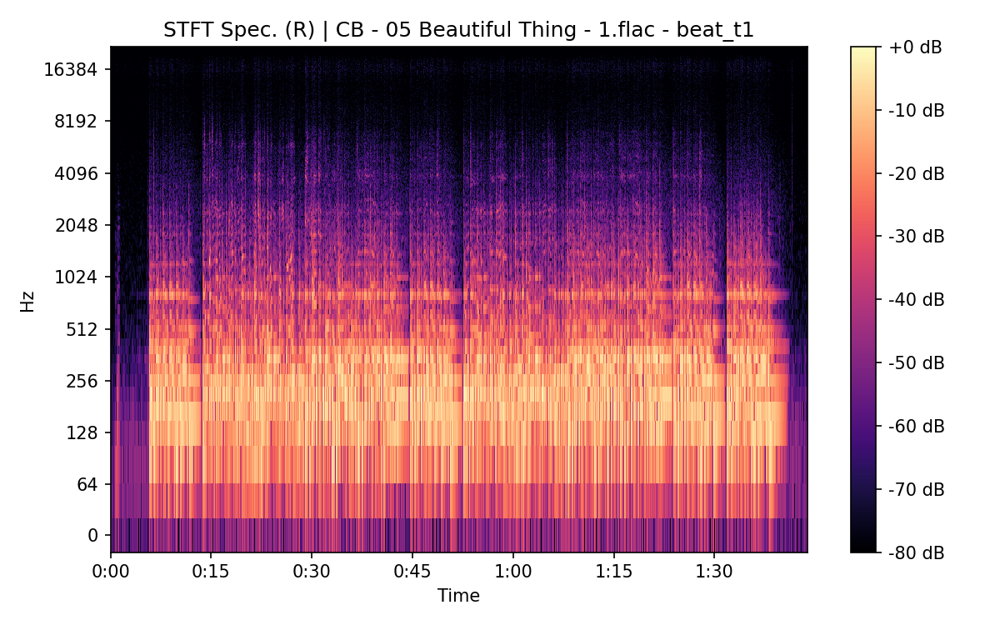

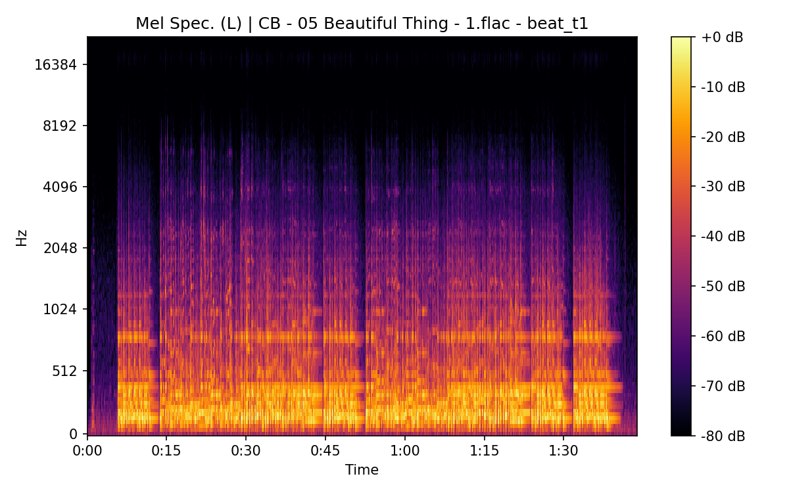

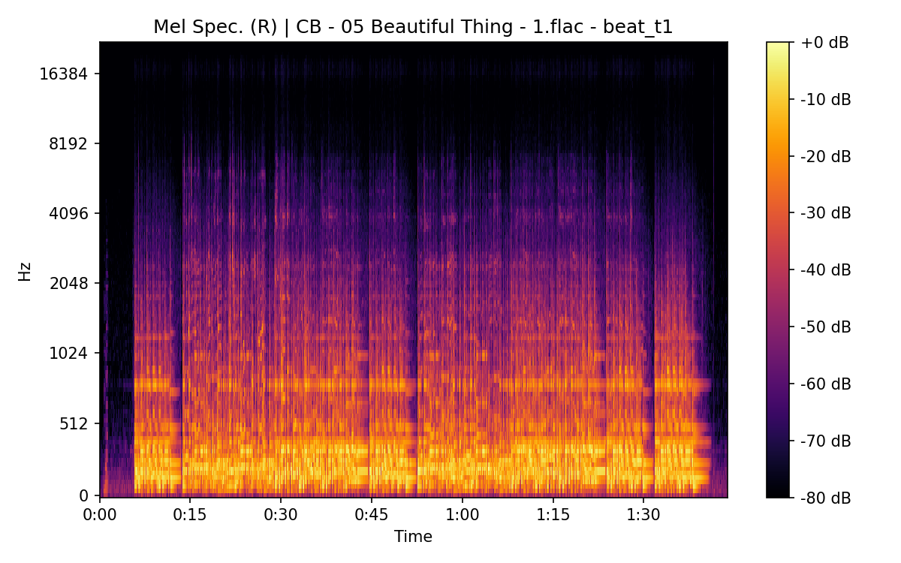

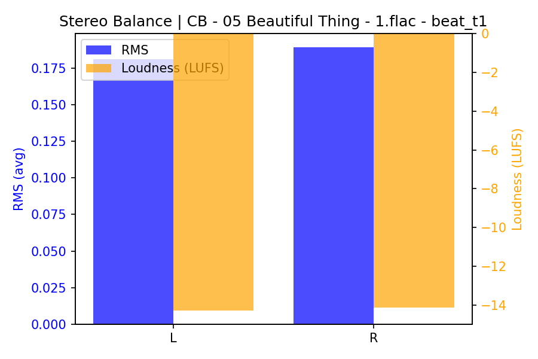

## Spectrograms (Mono)

### FTR

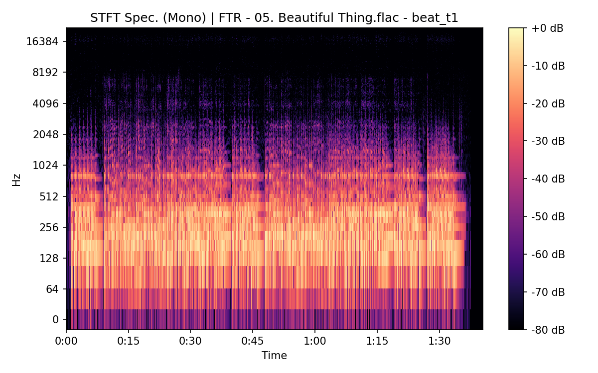

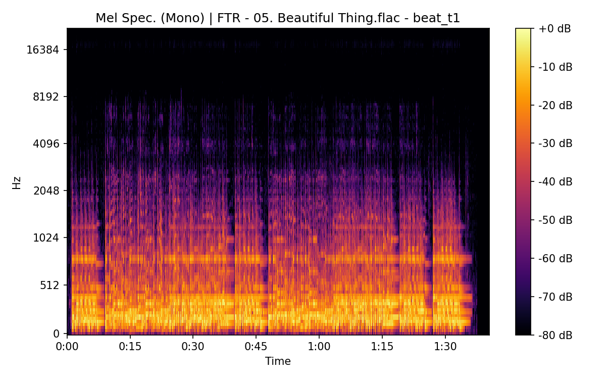

### CB

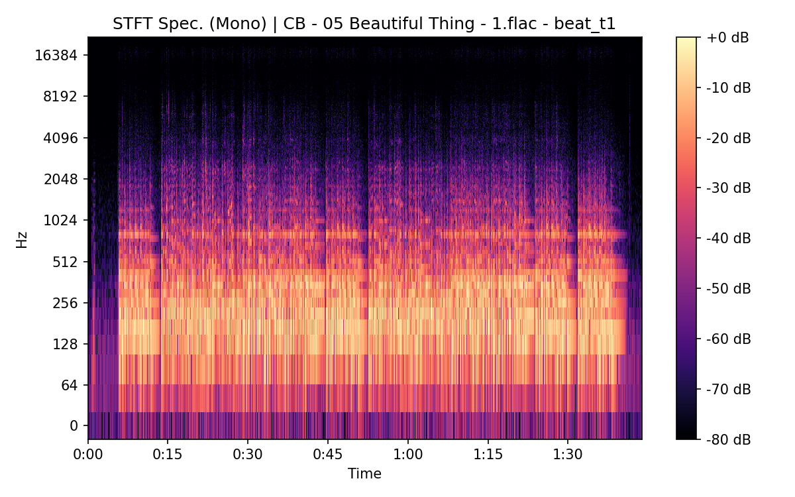


