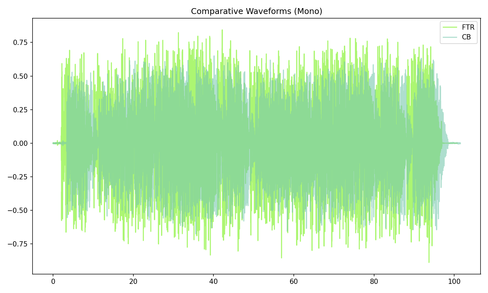

# Beautiful Thing (Take 2)

[](){ #beat_t2 }

## Details

| label   | orig_file                   | md5                              |   disc |   track |   duration_sec | duration_fmt   |   loudness |   loudness_left |   loudness_right |   loudness_balance |      rms |   rms_left |   rms_right |   rms_balance |   lr_corr |   spectral_centroid |
|:--------|:----------------------------|:---------------------------------|-------:|--------:|---------------:|:---------------|-----------:|----------------:|-----------------:|-------------------:|---------:|-----------:|------------:|--------------:|----------:|--------------------:|
| FTR     | 06. Beautiful Thing.flac    | d3e750a62c7b41bb190286892536face |     10 |       6 |         100.72 | 01:40:720      |   -11.7058 |        -11.0253 |         -11.6702 |           0.644899 | 0.257278 |   0.275199 |    0.26043  |    0.0147685  |  0.837744 |             649.799 |
| CB      | 06 Beautiful Thing - 2.flac | 7ccd7d79023d893a5e38c322cbf4be98 |      9 |       7 |         101.52 | 01:41:520      |   -13.685  |        -13.1899 |         -13.447  |           0.257146 | 0.203887 |   0.213332 |    0.211082 |    0.00224943 |  0.837708 |             854.286 |

## Plots



## Pitch & Speed Analysis (cents)

Reference version: **FTR**

| song_label   | ref_label   | cmp_label   | cmp_file                    |   tuning_cents_cmp |   tuning_cents_ref |   delta_tuning_cents |   semitone_shift_vs_ref |   chroma_similarity |   speed_factor_from_pitch |   duration_ratio_ref_over_cmp |
|:-------------|:------------|:------------|:----------------------------|-------------------:|-------------------:|---------------------:|------------------------:|--------------------:|--------------------------:|------------------------------:|
| beat_t2      | FTR         | FTR         | 06. Beautiful Thing.flac    |                -37 |                -37 |                    0 |                       0 |             1       |                         1 |                       1       |
| beat_t2      | FTR         | CB          | 06 Beautiful Thing - 2.flac |                -43 |                -37 |                   -6 |                       0 |             0.99977 |                         1 |                       0.99212 |


````text
Pitch/Speed analysis (reference = FTR)
============================================================

FTR - 06. Beautiful Thing.flac: shift=0 st ; Δtuning=0.0 cents ; speed_from_pitch=1.0000 ; duration_ratio(ref/cmp)=1.0000
CB - 06 Beautiful Thing - 2.flac: shift=0 st ; Δtuning=-6.0 cents ; speed_from_pitch=1.0000 ; duration_ratio(ref/cmp)=0.9921

````

## Stereo Balance

### FTR


### CB


## Spectrograms (Mono)

### FTR


### CB


