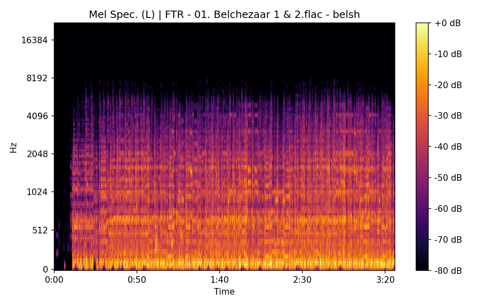

# Belshazzar

**(title taken from BS11)**

[](){ #belsh }

## Details

| label | orig_file                                  | md5                              | disc | track | duration_sec | duration_fmt | loudness | loudness_left | loudness_right | loudness_balance |       rms |  rms_left | rms_right | rms_balance |    lr_corr | spectral_centroid |
| :---- | :----------------------------------------- | :------------------------------- | ---: | ----: | -----------: | :----------- | -------: | ------------: | -------------: | ---------------: | --------: | --------: | --------: | ----------: | ---------: | ----------------: |
| BS11  | 05 - Bob Dylan & The Band - Belshazzar.wav | eca2ab9fe9dd65c8dcb1795b05d9a7ee |    1 |     5 |      202.307 | 03:22:307    | -16.6669 |      -16.6637 |       -16.2468 |        -0.416914 |  0.143152 |  0.146862 |  0.145123 |  0.00173864 |   0.911069 |           1860.76 |
| CAR   | 01-05-Bob_Dylan-Belshazzar-SMR.flac        | cadaf4a8e94a563c05f377f10ebfc2a2 |    1 |     5 |      202.303 | 03:22:303    | -16.6671 |      -16.6619 |        -16.247 |        -0.414899 |  0.143157 |  0.146866 |  0.145129 |  0.00173751 |   0.911068 |           1758.83 |
| ATWR  | 10 Belchazaar.flac                         | 0c9ad49d53574ad209ac8184455746d4 |    2 |    10 |      203.173 | 03:23:173    | -19.3144 |      -15.6949 |       -16.0561 |         0.361228 |  0.105636 |  0.150008 |   0.15676 | -0.00675151 | -0.0997065 |           1618.82 |
| SBD   | 11 Belchezaar.flac                         | 84ac4da11c6f24aeb86c9b715af3315d |    1 |    11 |      186.907 | 03:06:907    | -16.3052 |      -12.7538 |       -13.1213 |         0.367538 |  0.152978 |  0.214765 |  0.233121 |  -0.0183552 |  -0.103064 |           1563.14 |
| TGBT  | 4-17 Belchezaar 1 And 2.flac               | 9678b57ed300541406b4a7479b306a3b |    4 |    17 |      202.733 | 03:22:733    | -28.9629 |      -25.1054 |       -26.0099 |         0.904417 | 0.0350568 | 0.0547657 | 0.0457658 |  0.00899992 | -0.0889119 |           1573.55 |
| FTR   | 01. Belchezaar 1 & 2.flac                  | 22984d5b2cd12e63e023e138b8ff1b4b |    3 |     1 |       205.72 | 03:25:720    | -22.6228 |      -19.4122 |       -18.8882 |        -0.524028 |  0.072108 |  0.108507 |  0.104105 |  0.00440227 |  -0.113833 |           1183.32 |
| FTR   | 19. Belchezaar.flac                        | cdedf0827bca199e175a4f2cd8d737ab |    3 |    19 |       198.56 | 03:18:560    | -28.9528 |      -25.1018 |       -26.0099 |         0.908127 | 0.0357551 | 0.0558577 | 0.0466788 |  0.00917895 | -0.0888856 |           1472.71 |
| CB    | 01 Belshazar.flac                          | c3d7d7036789a924b43ea014f3f9e7de |    3 |     1 |       207.72 | 03:27:720    | -22.6307 |      -19.4212 |       -18.8901 |        -0.531065 |  0.071487 |  0.107578 |  0.103204 |  0.00437421 |   -0.11384 |           1183.72 |

## Plots


## Pitch & Speed Analysis (cents)

Reference version: **BS11**

| song_label | ref_label | cmp_label | cmp_file                                   | tuning_cents_cmp | tuning_cents_ref | delta_tuning_cents | semitone_shift_vs_ref | chroma_similarity | speed_factor_from_pitch | duration_ratio_ref_over_cmp |
| :--------- | :-------- | :-------- | :----------------------------------------- | ---------------: | ---------------: | -----------------: | --------------------: | ----------------: | ----------------------: | --------------------------: |
| belsh      | BS11      | BS11      | 05 - Bob Dylan & The Band - Belshazzar.wav |              -21 |              -21 |                  0 |                     0 |                 1 |                       1 |                           1 |
| belsh      | BS11      | CAR       | 01-05-Bob_Dylan-Belshazzar-SMR.flac        |              -24 |              -21 |                 -3 |                     0 |          0.999997 |                       1 |                     1.00002 |
| belsh      | BS11      | ATWR      | 10 Belchazaar.flac                         |              -20 |              -21 |                  1 |                     0 |           0.99796 |                       1 |                    0.995734 |
| belsh      | BS11      | SBD       | 11 Belchezaar.flac                         |              -19 |              -21 |                  2 |                     0 |          0.997612 |                       1 |                     1.08239 |
| belsh      | BS11      | TGBT      | 4-17 Belchezaar 1 And 2.flac               |               -5 |              -21 |                 16 |                     0 |          0.982026 |                       1 |                    0.997895 |
| belsh      | BS11      | FTR       | 01. Belchezaar 1 & 2.flac                  |              -16 |              -21 |                  5 |                     0 |          0.977497 |                       1 |                    0.983408 |
| belsh      | BS11      | FTR       | 19. Belchezaar.flac                        |                6 |              -21 |                 27 |                     0 |            0.9835 |                       1 |                     1.01887 |
| belsh      | BS11      | CB        | 01 Belshazar.flac                          |              -16 |              -21 |                  5 |                     0 |          0.977251 |                       1 |                    0.973939 |


```text
Pitch/Speed analysis (reference = BS11)
============================================================

BS11 - 05 - Bob Dylan & The Band - Belshazzar.wav: shift=0 st ; Δtuning=0.0 cents ; speed_from_pitch=1.0000 ; duration_ratio(ref/cmp)=1.0000
CAR - 01-05-Bob_Dylan-Belshazzar-SMR.flac: shift=0 st ; Δtuning=-3.0 cents ; speed_from_pitch=1.0000 ; duration_ratio(ref/cmp)=1.0000
ATWR - 10 Belchazaar.flac: shift=0 st ; Δtuning=1.0 cents ; speed_from_pitch=1.0000 ; duration_ratio(ref/cmp)=0.9957
SBD - 11 Belchezaar.flac: shift=0 st ; Δtuning=2.0 cents ; speed_from_pitch=1.0000 ; duration_ratio(ref/cmp)=1.0824
TGBT - 4-17 Belchezaar 1 And 2.flac: shift=0 st ; Δtuning=16.0 cents ; speed_from_pitch=1.0000 ; duration_ratio(ref/cmp)=0.9979
FTR - 01. Belchezaar 1 & 2.flac: shift=0 st ; Δtuning=5.0 cents ; speed_from_pitch=1.0000 ; duration_ratio(ref/cmp)=0.9834
FTR - 19. Belchezaar.flac: shift=0 st ; Δtuning=27.0 cents ; speed_from_pitch=1.0000 ; duration_ratio(ref/cmp)=1.0189
CB - 01 Belshazar.flac: shift=0 st ; Δtuning=5.0 cents ; speed_from_pitch=1.0000 ; duration_ratio(ref/cmp)=0.9739

```

## Stereo Balance

### BS11


### CAR


### ATWR


### SBD


### TGBT


### FTR





### FTR

.png>)

.png>)

.png>)

.png>)

.png>)

### CB


## Spectrograms (Mono)

### BS11


### CAR


### ATWR


### SBD


### TGBT


### FTR


### FTR

.png>)

.png>)

### CB


