# Bessie Smith

[](){ #bess }

## Details

| label   | orig_file             | md5                              |   disc |   track |   duration_sec | duration_fmt   |   loudness |   loudness_left |   loudness_right |   loudness_balance |      rms |   rms_left |   rms_right |   rms_balance |   lr_corr |   spectral_centroid |
|:--------|:----------------------|:---------------------------------|-------:|--------:|---------------:|:---------------|-----------:|----------------:|-----------------:|-------------------:|---------:|-----------:|------------:|--------------:|----------:|--------------------:|
| FTR     | 07. Bessie Smith.flac | 3ca0ace45918fd5a6ca8b91e7dff9476 |     11 |       7 |        258.373 | 04:18:373      |   -17.4336 |        -17.4283 |         -17.245  |          -0.183298 | 0.122804 |     0.1246 |    0.123838 |   0.000761986 |  0.954493 |             2083.04 |
| CB      | 31 Bessie Smith.flac  | d80b6552995be2328d5c7ecdd76d967e |      9 |       8 |        258.373 | 04:18:373      |   -17.432  |        -17.4267 |         -17.2434 |          -0.183312 | 0.122805 |     0.1246 |    0.123839 |   0.000761464 |  0.954493 |             2084.67 |

## Plots
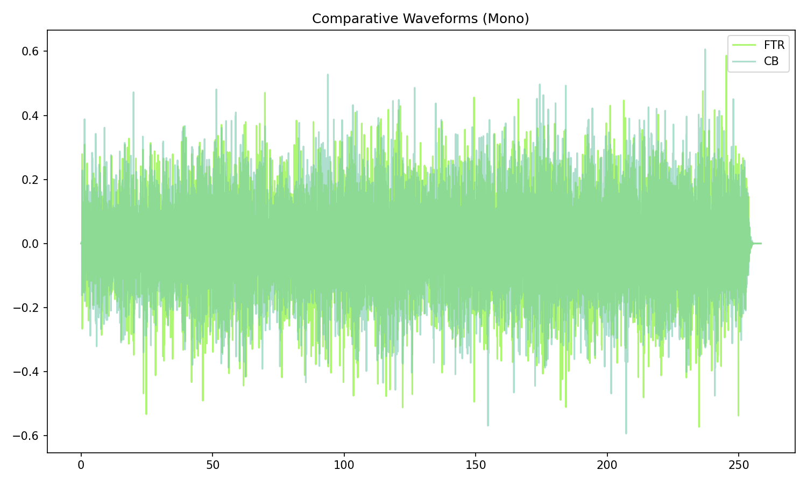

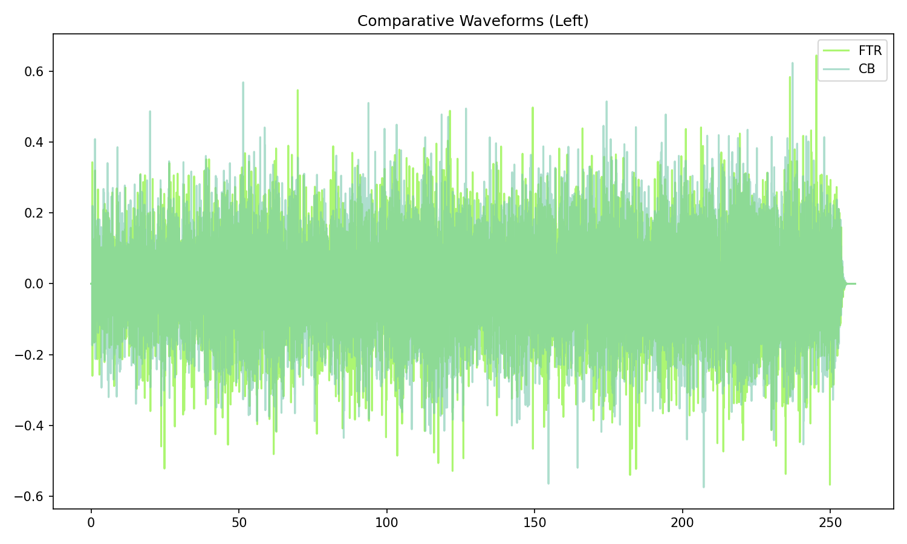

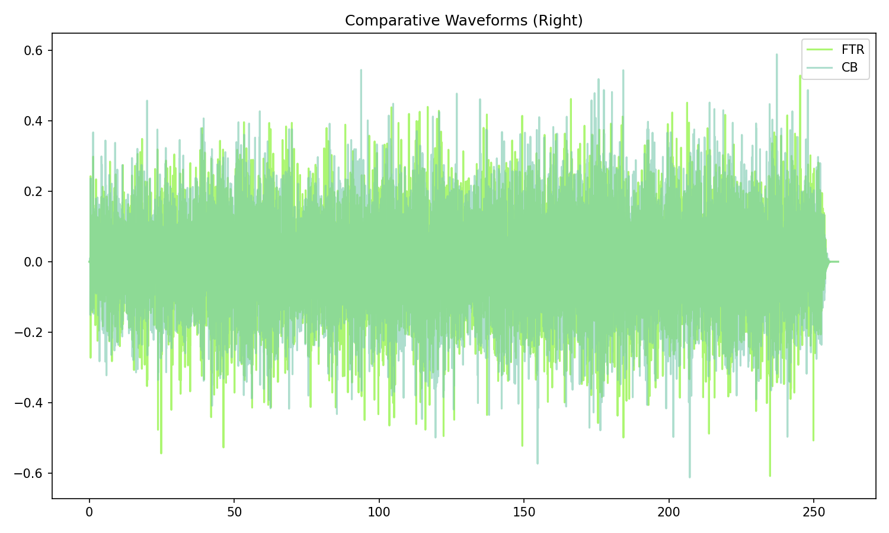

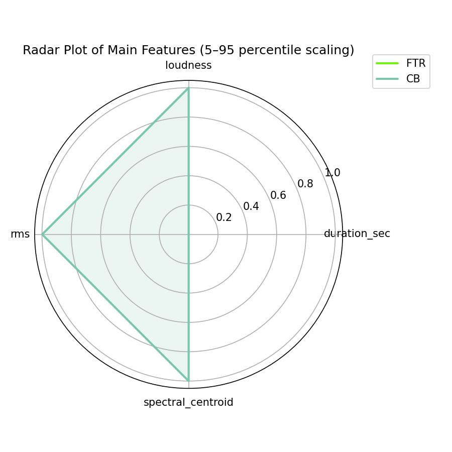

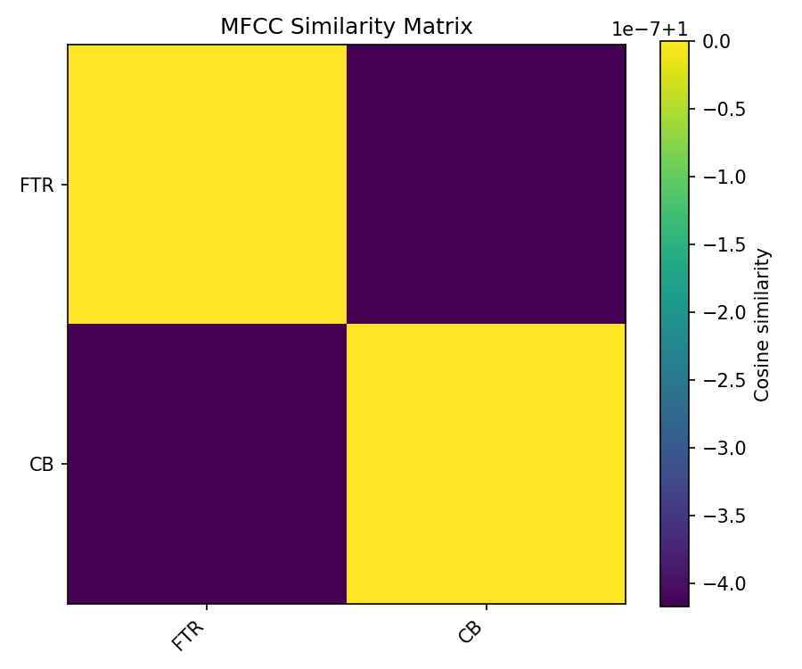

## Pitch & Speed Analysis (cents)

Reference version: **FTR**

| song_label   | ref_label   | cmp_label   | cmp_file              |   tuning_cents_cmp |   tuning_cents_ref |   delta_tuning_cents |   semitone_shift_vs_ref |   chroma_similarity |   speed_factor_from_pitch |   duration_ratio_ref_over_cmp |
|:-------------|:------------|:------------|:----------------------|-------------------:|-------------------:|---------------------:|------------------------:|--------------------:|--------------------------:|------------------------------:|
| bess         | FTR         | FTR         | 07. Bessie Smith.flac |                  7 |                  7 |                    0 |                       0 |            1        |                         1 |                             1 |
| bess         | FTR         | CB          | 31 Bessie Smith.flac  |                  7 |                  7 |                    0 |                       0 |            0.999997 |                         1 |                             1 |

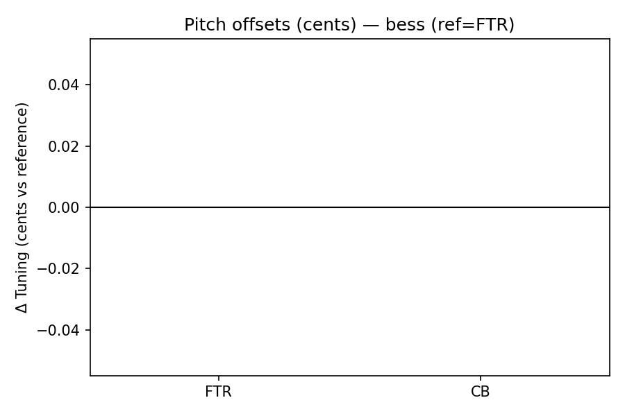

````text
Pitch/Speed analysis (reference = FTR)
============================================================

FTR - 07. Bessie Smith.flac: shift=0 st ; Δtuning=0.0 cents ; speed_from_pitch=1.0000 ; duration_ratio(ref/cmp)=1.0000
CB - 31 Bessie Smith.flac: shift=0 st ; Δtuning=0.0 cents ; speed_from_pitch=1.0000 ; duration_ratio(ref/cmp)=1.0000

````

## Stereo Balance

### FTR

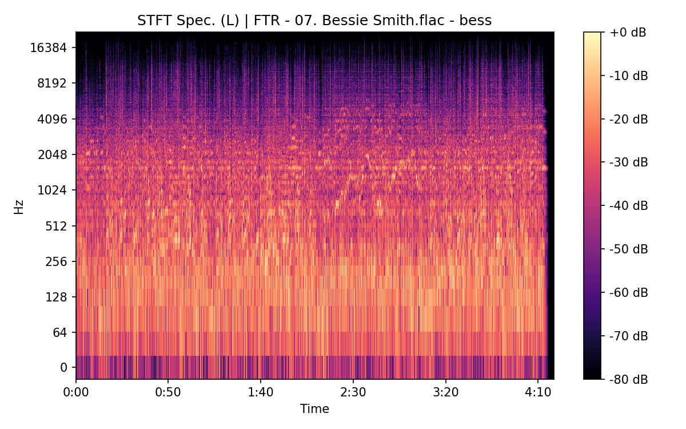

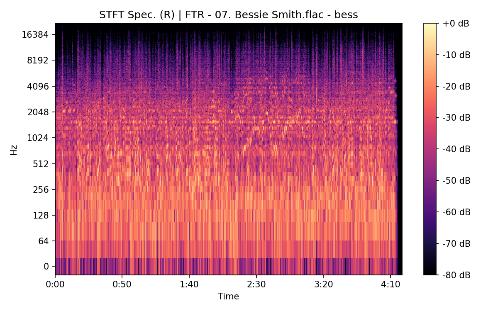


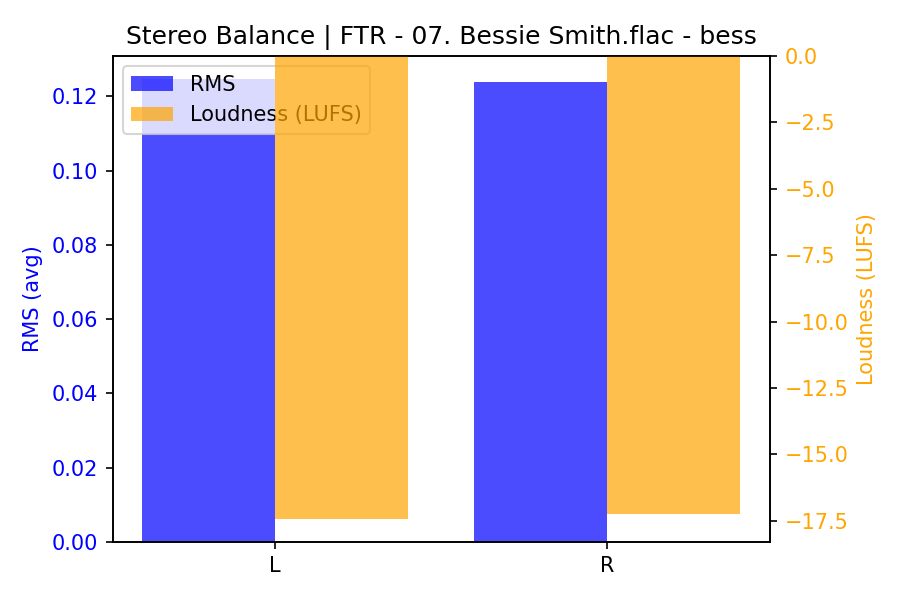

### CB

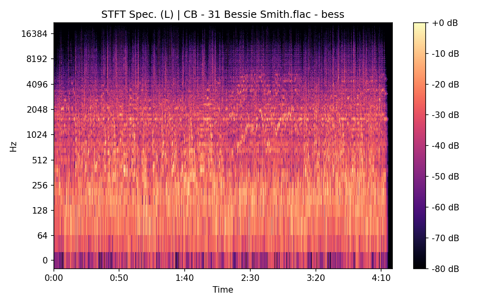


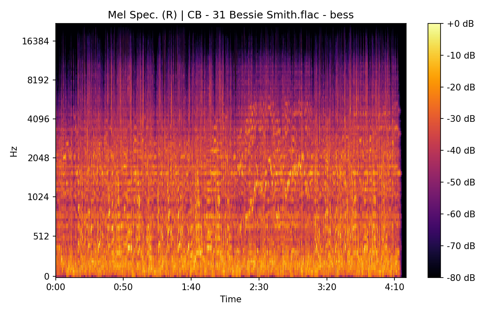

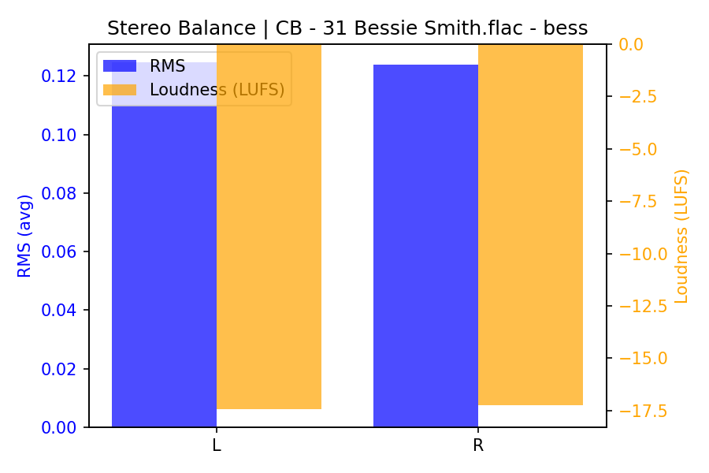

## Spectrograms (Mono)

### FTR

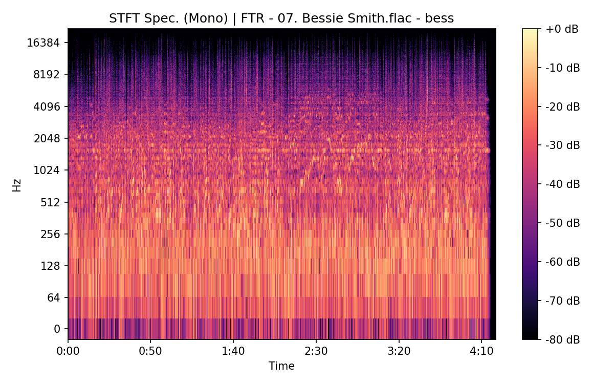


### CB


