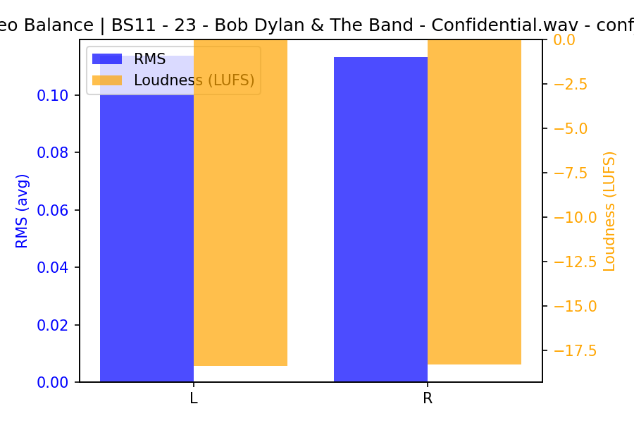

# Confidential (Take 1)

**(title taken from BS11)**

[](){ #conf_t1 }

## Details

| label | orig_file                                    | md5                              | disc | track | duration_sec | duration_fmt | loudness | loudness_left | loudness_right | loudness_balance |       rms |  rms_left | rms_right | rms_balance |   lr_corr | spectral_centroid |
| :---- | :------------------------------------------- | :------------------------------- | ---: | ----: | -----------: | :----------- | -------: | ------------: | -------------: | ---------------: | --------: | --------: | --------: | ----------: | --------: | ----------------: |
| BS11  | 23 - Bob Dylan & The Band - Confidential.wav | 712c0c11c899c8122e94298470393e3a |    5 |    23 |      96.5067 | 01:36:507    | -18.6832 |       -18.371 |       -18.3178 |       -0.0531442 |   0.11043 |   0.11376 |  0.113236 | 0.000523835 |   0.85935 |           1991.37 |
| CAR   | 05-23-Bob_Dylan-Confidential-SMR.flac        | 835ac88ed4af89decb0cc9d67028a215 |    5 |    23 |      96.4667 | 01:36:467    | -18.6832 |      -18.3699 |       -18.3185 |       -0.0513629 |   0.11048 |  0.113811 |  0.113288 | 0.000522397 |   0.85935 |            1806.5 |
| ATWR  | 19 Confidential To Me.flac                   | fad8fd3bbcc94c46236c4d1655f35315 |    4 |    19 |      94.4133 | 01:34:413    | -20.1084 |       -17.223 |       -16.7672 |        -0.455787 | 0.0867207 |  0.116955 |  0.113086 |  0.00386944 | 0.0319667 |           2097.23 |
| TGBT  | 4-08 Confidential To Me.flac                 | 1ef7c78f8f6aae517ff8bb248b0d4f34 |    4 |     8 |           94 | 01:34:000    | -21.5273 |       -16.461 |       -21.8406 |          5.37964 | 0.0731546 |  0.119191 | 0.0699323 |   0.0492585 | 0.0367521 |           1953.58 |
| FTR   | Track No06.flac                              | a4568f1da22ce56400194426907eaccf |    6 |     6 |      92.7867 | 01:32:787    | -24.3968 |      -19.4188 |       -24.7271 |          5.30823 | 0.0535417 | 0.0833238 | 0.0519636 |   0.0313601 | 0.0917253 |           1070.91 |
| CB    | 06 Confidential.flac                         | 2a7ffe9ade23a1de691eb85381c40e57 |    6 |     6 |      93.0533 | 01:33:053    | -24.4156 |      -19.4351 |       -24.7372 |          5.30205 | 0.0533619 | 0.0830727 | 0.0517618 |   0.0313109 | 0.0918169 |           1072.63 |

## Plots


## Pitch & Speed Analysis (cents)

Reference version: **BS11**

| song_label | ref_label | cmp_label | cmp_file                                     | tuning_cents_cmp | tuning_cents_ref | delta_tuning_cents | semitone_shift_vs_ref | chroma_similarity | speed_factor_from_pitch | duration_ratio_ref_over_cmp |
| :--------- | :-------- | :-------- | :------------------------------------------- | ---------------: | ---------------: | -----------------: | --------------------: | ----------------: | ----------------------: | --------------------------: |
| conf_t1    | BS11      | BS11      | 23 - Bob Dylan & The Band - Confidential.wav |              -26 |              -26 |                  0 |                     0 |                 1 |                       1 |                           1 |
| conf_t1    | BS11      | CAR       | 05-23-Bob_Dylan-Confidential-SMR.flac        |              -25 |              -26 |                  1 |                     0 |          0.999985 |                       1 |                     1.00041 |
| conf_t1    | BS11      | ATWR      | 19 Confidential To Me.flac                   |                1 |              -26 |                 27 |                     0 |          0.987688 |                       1 |                     1.02217 |
| conf_t1    | BS11      | TGBT      | 4-08 Confidential To Me.flac                 |              -15 |              -26 |                 11 |                     0 |           0.98702 |                       1 |                     1.02667 |
| conf_t1    | BS11      | FTR       | Track No06.flac                              |               -4 |              -26 |                 22 |                     0 |          0.986621 |                       1 |                     1.04009 |
| conf_t1    | BS11      | CB        | 06 Confidential.flac                         |               -3 |              -26 |                 23 |                     0 |          0.986423 |                       1 |                     1.03711 |


```text
Pitch/Speed analysis (reference = BS11)
============================================================

BS11 - 23 - Bob Dylan & The Band - Confidential.wav: shift=0 st ; Δtuning=0.0 cents ; speed_from_pitch=1.0000 ; duration_ratio(ref/cmp)=1.0000
CAR - 05-23-Bob_Dylan-Confidential-SMR.flac: shift=0 st ; Δtuning=1.0 cents ; speed_from_pitch=1.0000 ; duration_ratio(ref/cmp)=1.0004
ATWR - 19 Confidential To Me.flac: shift=0 st ; Δtuning=27.0 cents ; speed_from_pitch=1.0000 ; duration_ratio(ref/cmp)=1.0222
TGBT - 4-08 Confidential To Me.flac: shift=0 st ; Δtuning=11.0 cents ; speed_from_pitch=1.0000 ; duration_ratio(ref/cmp)=1.0267
FTR - Track No06.flac: shift=0 st ; Δtuning=22.0 cents ; speed_from_pitch=1.0000 ; duration_ratio(ref/cmp)=1.0401
CB - 06 Confidential.flac: shift=0 st ; Δtuning=23.0 cents ; speed_from_pitch=1.0000 ; duration_ratio(ref/cmp)=1.0371

```

## Stereo Balance

### BS11




### CAR


### ATWR


### TGBT


### FTR


### CB


## Spectrograms (Mono)

### BS11


### CAR


### ATWR


### TGBT


### FTR


### CB


