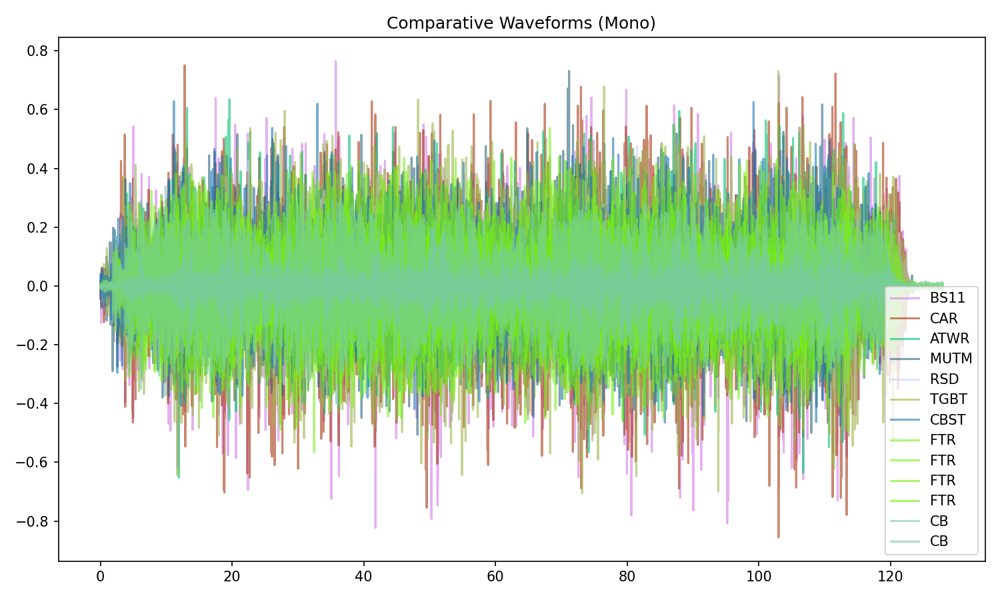
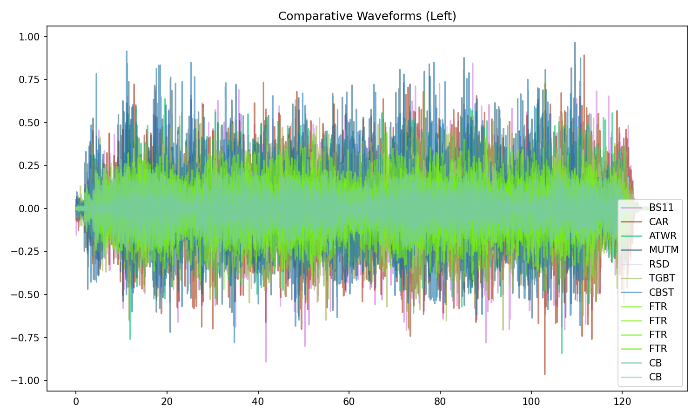
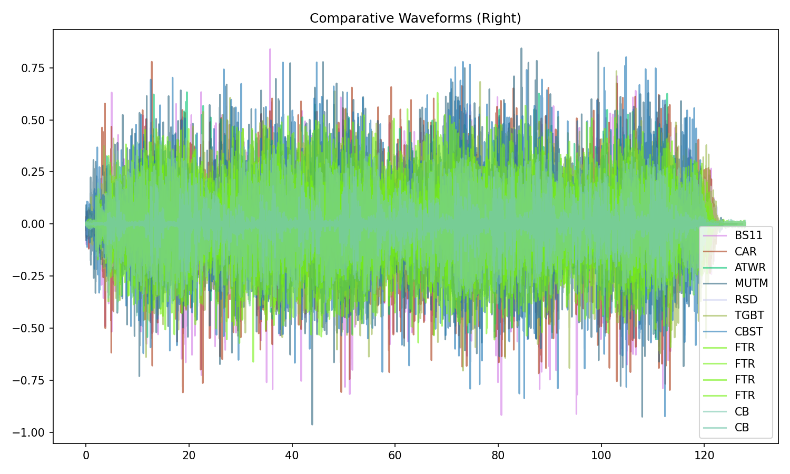
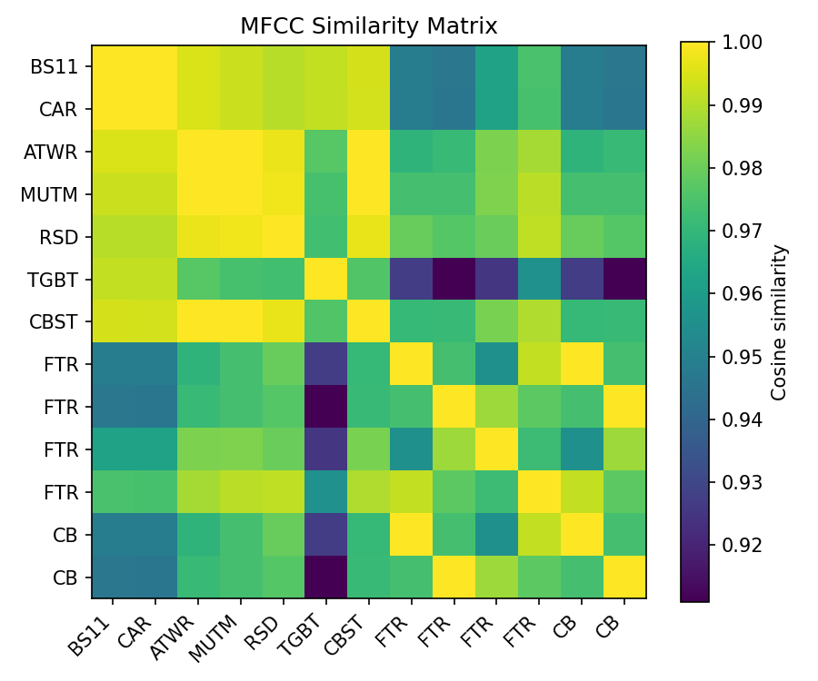
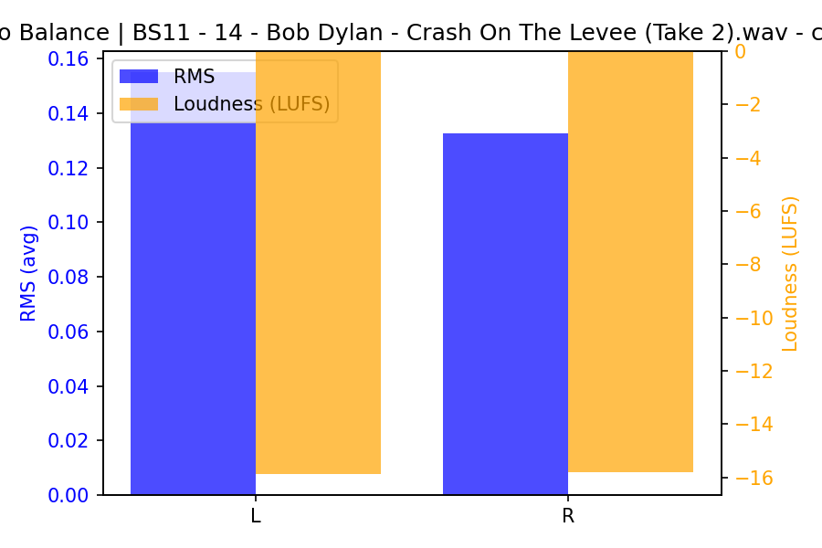
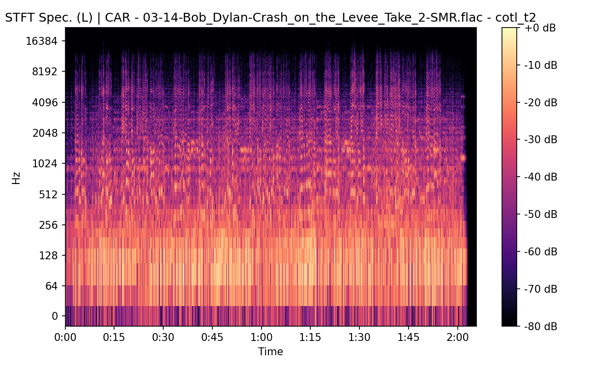
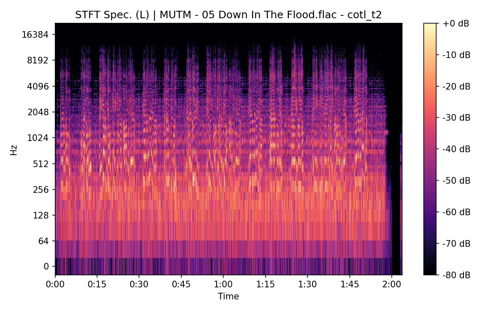
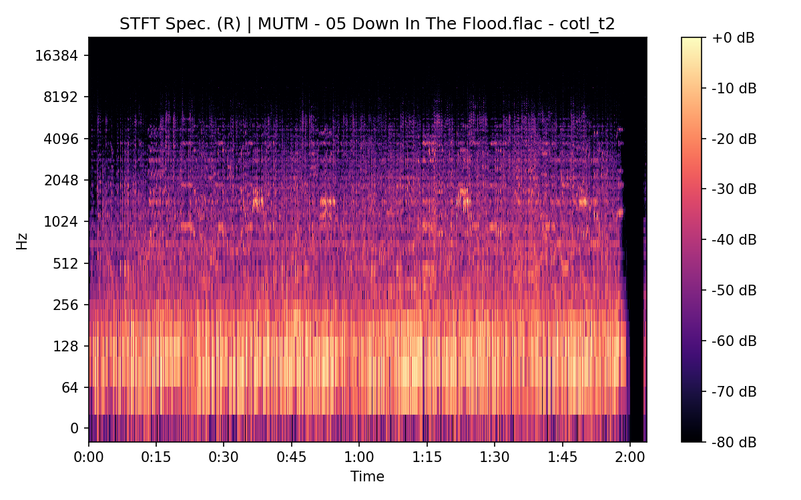
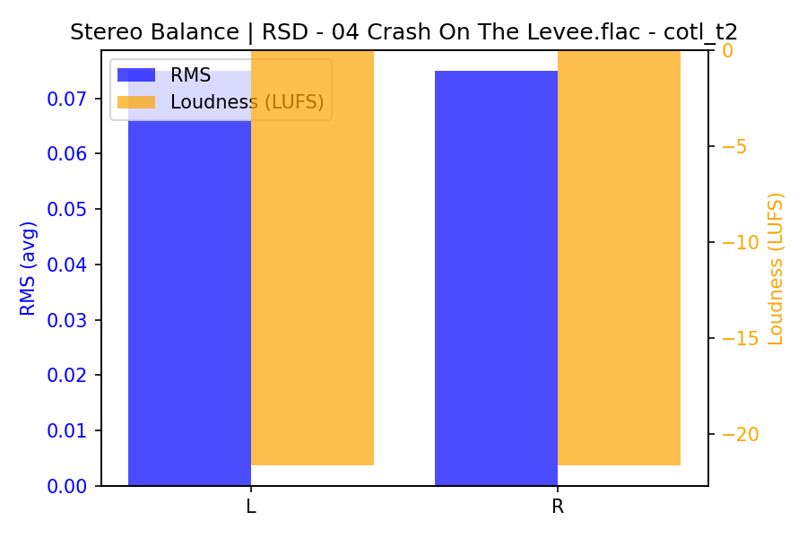
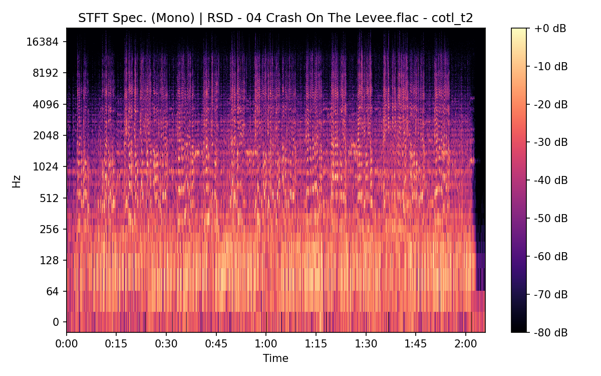

# Crash On The Levee (Take 2)

**(title taken from BS11)**

[](){ #cotl_t2 }

## Details

| label   | orig_file                                          | md5                              |   disc |   track |   duration_sec | duration_fmt   |   loudness |   loudness_left |   loudness_right |   loudness_balance |       rms |   rms_left |   rms_right |   rms_balance |    lr_corr |   spectral_centroid |
|:--------|:---------------------------------------------------|:---------------------------------|-------:|--------:|---------------:|:---------------|-----------:|----------------:|-----------------:|-------------------:|----------:|-----------:|------------:|--------------:|-----------:|--------------------:|
| BS11    | 14 - Bob Dylan - Crash On The Levee (Take 2).wav   | a50dd5e70b107e68e814de660d42d9d2 |      3 |      14 |        125.72  | 02:05:720      |   -16.1166 |        -15.8608 |         -15.7971 |         -0.0637696 | 0.141118  |  0.155056  |   0.132603  |   0.0224536   | 0.880859   |            2024.18  |
| CAR     | 03-14-Bob_Dylan-Crash_on_the_Levee_Take_2-SMR.flac | 0aa782abca4f3b5d496fb251fb849a29 |      3 |      14 |        125.711 | 02:05:711      |   -16.1264 |        -15.864  |         -15.8037 |         -0.060327  | 0.141124  |  0.155065  |   0.132607  |   0.0224581   | 0.880859   |            1879.57  |
| ATWR    | 19 Crash On The Levee - Take 2.flac                | 3065b0534458c4d6b93190baf7d112ff |      3 |      19 |        126.293 | 02:06:293      |   -18.2665 |        -17.4359 |         -18.5625 |          1.12663   | 0.110879  |  0.128789  |   0.0974758 |   0.0313134   | 0.870657   |            1731.21  |
| MUTM    | 05 Down In The Flood.flac                          | 480b86a67a278f4091862f51295faada |      1 |       5 |        123.613 | 02:03:613      |   -19.2916 |        -15.8851 |         -16.1876 |          0.302521  | 0.103096  |  0.114902  |   0.154511  |  -0.0396091   | 0.00488298 |            1658.96  |
| RSD     | 04 Crash On The Levee.flac                         | 16d8cb4f6543be9f6415bb4cdcd72a7a |      1 |       1 |        125.813 | 02:05:813      |   -21.6265 |        -21.6265 |         -21.6265 |          0         | 0.0749398 |  0.0749398 |   0.0749398 |   0           | 1          |            1829.89  |
| TGBT    | 07 Crash On The Levee #2.flac                      | 192a5f5ae713d4ecef4a229b39ad47dd |      3 |       7 |        127.4   | 02:07:400      |   -15.385  |        -15.4138 |         -15.3505 |         -0.0632928 | 0.156257  |  0.155161  |   0.157392  |  -0.002231    | 0.999423   |            2220.74  |
| CBST    | Dylan & Band - Safety Tape_Track05.flac            | f27dafdcf873b613ede9cac8f0b9c96a |      1 |       5 |        122.8   | 02:02:800      |   -19.0733 |        -15.6181 |         -15.9822 |          0.364091  | 0.107332  |  0.119764  |   0.160658  |  -0.0408932   | 0.00493263 |            1332.67  |
| FTR     | 18. Crash on the Levee.flac                        | 4e05235efba8231bfcc347208f115532 |      5 |      18 |        122.653 | 02:02:653      |   -28.5826 |        -22.0876 |         -29.1723 |          7.08475   | 0.0265435 |  0.0327401 |   0.0336012 |  -0.000861112 | 0.0280012  |            1750.83  |
| FTR     | 04. Crash on the Levee.flac                        | 517ff3933ef279e07664343ccbc7a7f9 |      7 |       4 |        127.947 | 02:07:947      |   -21.2749 |        -22.8568 |         -19.7743 |         -3.08257   | 0.0890681 |  0.0737753 |   0.105777  |  -0.0320014   | 0.976642   |             917.63  |
| FTR     | 18. Crash on the Levee.flac                        | 16ad5025173fdf32fe19bae278ac4a4f |      8 |      18 |        119.56  | 01:59:560      |   -17.8276 |        -19.7313 |         -16.2183 |         -3.51299   | 0.131413  |  0.105114  |   0.158326  |  -0.0532116   | 0.991278   |             616.046 |
| FTR     | 17. Crash on the Levee.flac                        | dfa8b791ec1b5b2a244e8fe6652f07eb |      9 |      17 |        123.84  | 02:03:840      |   -22.0337 |        -23.1368 |         -21.0407 |         -2.09611   | 0.0842216 |  0.0741038 |   0.0944363 |  -0.0203325   | 0.998317   |            1300.52  |
| CB      | 18 Down in the Flood.flac                          | 0cccdb45f205782b8c62af73dd316905 |      5 |      18 |        122.653 | 02:02:653      |   -28.5577 |        -29.1756 |         -22.0548 |         -7.12088   | 0.0265459 |  0.0336067 |   0.0327398 |   0.000866871 | 0.0280011  |            1750.6   |
| CB      | 04 Down in the Flood.flac                          | 3996927feba8f32eaac5a6edb0acf374 |      7 |      19 |        127.947 | 02:07:947      |   -21.2749 |        -22.8535 |         -19.7743 |         -3.07924   | 0.0890661 |  0.0737741 |   0.105774  |  -0.0319999   | 0.976642   |             917.545 |

## Plots









## Pitch & Speed Analysis (cents)

Reference version: **BS11**

| song_label   | ref_label   | cmp_label   | cmp_file                                           |   tuning_cents_cmp |   tuning_cents_ref |   delta_tuning_cents |   semitone_shift_vs_ref |   chroma_similarity |   speed_factor_from_pitch |   duration_ratio_ref_over_cmp |
|:-------------|:------------|:------------|:---------------------------------------------------|-------------------:|-------------------:|---------------------:|------------------------:|--------------------:|--------------------------:|------------------------------:|
| cotl_t2      | BS11        | BS11        | 14 - Bob Dylan - Crash On The Levee (Take 2).wav   |                -19 |                -19 |                    0 |                       0 |            1        |                  1        |                      1        |
| cotl_t2      | BS11        | CAR         | 03-14-Bob_Dylan-Crash_on_the_Levee_Take_2-SMR.flac |                -21 |                -19 |                   -2 |                       0 |            0.992783 |                  1        |                      1.00007  |
| cotl_t2      | BS11        | ATWR        | 19 Crash On The Levee - Take 2.flac                |                -10 |                -19 |                    9 |                       0 |            0.999128 |                  1        |                      0.99546  |
| cotl_t2      | BS11        | MUTM        | 05 Down In The Flood.flac                          |                 24 |                -19 |                   43 |                       0 |            0.992207 |                  1        |                      1.01704  |
| cotl_t2      | BS11        | RSD         | 04 Crash On The Levee.flac                         |                -22 |                -19 |                   -3 |                       0 |            0.992252 |                  1        |                      0.999261 |
| cotl_t2      | BS11        | TGBT        | 07 Crash On The Levee #2.flac                      |                -14 |                -19 |                    5 |                       0 |            0.997115 |                  1        |                      0.986813 |
| cotl_t2      | BS11        | CBST        | Dylan & Band - Safety Tape_Track05.flac            |                -21 |                -19 |                   -2 |                       0 |            0.987105 |                  1        |                      1.02378  |
| cotl_t2      | BS11        | FTR         | 18. Crash on the Levee.flac                        |                 16 |                -19 |                   35 |                       0 |            0.996943 |                  1        |                      1.025    |
| cotl_t2      | BS11        | FTR         | 04. Crash on the Levee.flac                        |                 39 |                -19 |                   58 |                      -1 |            0.976783 |                  0.943874 |                      0.982597 |
| cotl_t2      | BS11        | FTR         | 18. Crash on the Levee.flac                        |                 23 |                -19 |                   42 |                      -1 |            0.991803 |                  0.943874 |                      1.05152  |
| cotl_t2      | BS11        | FTR         | 17. Crash on the Levee.flac                        |                 21 |                -19 |                   40 |                       0 |            0.983248 |                  1        |                      1.01518  |
| cotl_t2      | BS11        | CB          | 18 Down in the Flood.flac                          |                  5 |                -19 |                   24 |                       0 |            0.990751 |                  1        |                      1.025    |
| cotl_t2      | BS11        | CB          | 04 Down in the Flood.flac                          |                 40 |                -19 |                   59 |                       0 |            0.986686 |                  1        |                      0.982597 |


````text
Pitch/Speed analysis (reference = BS11)
============================================================

BS11 - 14 - Bob Dylan - Crash On The Levee (Take 2).wav: shift=0 st ; Δtuning=0.0 cents ; speed_from_pitch=1.0000 ; duration_ratio(ref/cmp)=1.0000
CAR - 03-14-Bob_Dylan-Crash_on_the_Levee_Take_2-SMR.flac: shift=0 st ; Δtuning=-2.0 cents ; speed_from_pitch=1.0000 ; duration_ratio(ref/cmp)=1.0001
ATWR - 19 Crash On The Levee - Take 2.flac: shift=0 st ; Δtuning=9.0 cents ; speed_from_pitch=1.0000 ; duration_ratio(ref/cmp)=0.9955
MUTM - 05 Down In The Flood.flac: shift=0 st ; Δtuning=43.0 cents ; speed_from_pitch=1.0000 ; duration_ratio(ref/cmp)=1.0170
RSD - 04 Crash On The Levee.flac: shift=0 st ; Δtuning=-3.0 cents ; speed_from_pitch=1.0000 ; duration_ratio(ref/cmp)=0.9993
TGBT - 07 Crash On The Levee #2.flac: shift=0 st ; Δtuning=5.0 cents ; speed_from_pitch=1.0000 ; duration_ratio(ref/cmp)=0.9868
CBST - Dylan & Band - Safety Tape_Track05.flac: shift=0 st ; Δtuning=-2.0 cents ; speed_from_pitch=1.0000 ; duration_ratio(ref/cmp)=1.0238
FTR - 18. Crash on the Levee.flac: shift=0 st ; Δtuning=35.0 cents ; speed_from_pitch=1.0000 ; duration_ratio(ref/cmp)=1.0250
FTR - 04. Crash on the Levee.flac: shift=-1 st ; Δtuning=58.0 cents ; speed_from_pitch=0.9439 ; duration_ratio(ref/cmp)=0.9826
FTR - 18. Crash on the Levee.flac: shift=-1 st ; Δtuning=42.0 cents ; speed_from_pitch=0.9439 ; duration_ratio(ref/cmp)=1.0515
FTR - 17. Crash on the Levee.flac: shift=0 st ; Δtuning=40.0 cents ; speed_from_pitch=1.0000 ; duration_ratio(ref/cmp)=1.0152
CB - 18 Down in the Flood.flac: shift=0 st ; Δtuning=24.0 cents ; speed_from_pitch=1.0000 ; duration_ratio(ref/cmp)=1.0250
CB - 04 Down in the Flood.flac: shift=0 st ; Δtuning=59.0 cents ; speed_from_pitch=1.0000 ; duration_ratio(ref/cmp)=0.9826

````

## Stereo Balance

### BS11




### CAR




### ATWR


### MUTM






### RSD




### TGBT


### CBST


### FTR


### FTR

.png)

.png)

.png)

.png)

.png)

### FTR

.png)

.png)

.png)

.png)

.png)

### FTR

.png)

.png)

.png)

.png)

.png)

### CB


### CB

.png)

.png)

.png)

.png)

.png)

## Spectrograms (Mono)

### BS11


### CAR


### ATWR


### MUTM


### RSD




### TGBT


### CBST


### FTR


### FTR

.png)

.png)

### FTR

.png)

.png)

### FTR

.png)

.png)

### CB


### CB

.png)

.png)

