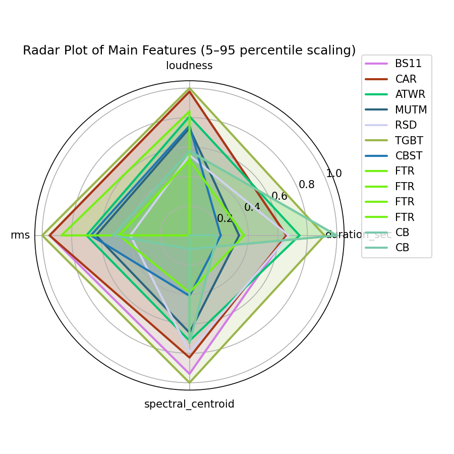
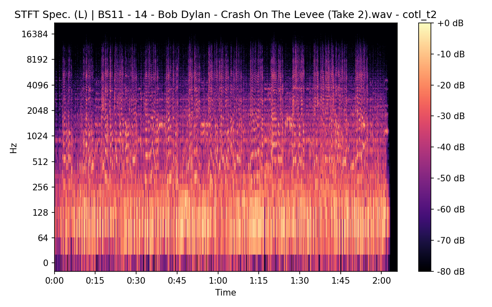

# Crash On The Levee (Take 2)

## Details

| label   | orig_file                                          | md5                              |   disc |   track |   duration_sec | duration_fmt   |   loudness |   loudness_left |   loudness_right |   loudness_balance |      rms |   rms_left |   rms_right |   rms_balance |    lr_corr |   spectral_centroid |
|:--------|:---------------------------------------------------|:---------------------------------|-------:|--------:|---------------:|:---------------|-----------:|----------------:|-----------------:|-------------------:|---------:|-----------:|------------:|--------------:|-----------:|--------------------:|
| BS11    | 14 - Bob Dylan - Crash On The Levee (Take 2).wav   | a50dd5e70b107e68e814de660d42d9d2 |      3 |      14 |        125.72  | 02:05:719      |   -16.1166 |        -15.8608 |         -15.7971 |         -0.0637696 | 0.141118 |   0.155056 |   0.132603  |     0.0224536 | 0.880859   |             2024.18 |
| CAR     | 03-14-Bob_Dylan-Crash_on_the_Levee_Take_2-SMR.flac | 0aa782abca4f3b5d496fb251fb849a29 |      3 |      14 |        125.711 | 02:05:711      |   -16.1264 |        -15.864  |         -15.8037 |         -0.060327  | 0.141124 |   0.155065 |   0.132607  |     0.0224581 | 0.880859   |             1879.57 |
| ATWR    | 19 Crash On The Levee - Take 2.flac                | 3065b0534458c4d6b93190baf7d112ff |      3 |      19 |        126.293 | 02:06:293      |   -18.2665 |        -17.4359 |         -18.5625 |          1.12663   | 0.110879 |   0.128789 |   0.0974758 |     0.0313134 | 0.870657   |             1731.21 |
| MUTM    | 05 Down In The Flood.flac                          | 480b86a67a278f4091862f51295faada |      1 |       5 |        123.613 | 02:03:613      |   -19.2916 |        -15.8851 |         -16.1876 |          0.302521  | 0.103096 |   0.114902 |   0.154511  |    -0.0396091 | 0.00488298 |             1658.96 |

## Plots





## Stereo Balance

### BS11




### CAR


### ATWR


### MUTM


## Spectrograms (Mono)

### BS11


### CAR


### ATWR


### MUTM


## Pitch & Speed Analysis

Reference version: **BS11**

| song_label   | ref_label   | cmp_label   |   tuning_cents_cmp |   tuning_cents_ref |   delta_tuning_cents |   semitone_shift_vs_ref |   chroma_similarity |   speed_factor_from_pitch |   duration_ratio_ref_over_cmp |
|:-------------|:------------|:------------|-------------------:|-------------------:|---------------------:|------------------------:|--------------------:|--------------------------:|------------------------------:|
| cotl_t2      | BS11        | BS11        |                -19 |                -19 |                    0 |                       0 |            1        |                         1 |                       1       |
| cotl_t2      | BS11        | CAR         |                -21 |                -19 |                   -2 |                       0 |            0.992783 |                         1 |                       1.00007 |
| cotl_t2      | BS11        | ATWR        |                -10 |                -19 |                    9 |                       0 |            0.999128 |                         1 |                       0.99546 |
| cotl_t2      | BS11        | MUTM        |                 24 |                -19 |                   43 |                       0 |            0.992207 |                         1 |                       1.01704 |


```
Pitch/Speed analysis (reference = BS11)
============================================================

BS11: shift=0 st ; Δtuning=0.0 cents ; speed_from_pitch=1.0000 ; duration_ratio(ref/cmp)=1.0000
CAR: shift=0 st ; Δtuning=-2.0 cents ; speed_from_pitch=1.0000 ; duration_ratio(ref/cmp)=1.0001
ATWR: shift=0 st ; Δtuning=9.0 cents ; speed_from_pitch=1.0000 ; duration_ratio(ref/cmp)=0.9955
MUTM: shift=0 st ; Δtuning=43.0 cents ; speed_from_pitch=1.0000 ; duration_ratio(ref/cmp)=1.0170
```

