# Down By The Station

**(title taken from BS11)**

[](){ #dbts }

## Details

| label   | orig_file                                           | md5                              |   disc |   track |   duration_sec | duration_fmt   |   loudness |   loudness_left |   loudness_right |   loudness_balance |      rms |   rms_left |   rms_right |   rms_balance |   lr_corr |   spectral_centroid |
|:--------|:----------------------------------------------------|:---------------------------------|-------:|--------:|---------------:|:---------------|-----------:|----------------:|-----------------:|-------------------:|---------:|-----------:|------------:|--------------:|----------:|--------------------:|
| BS11    | 04 - Bob Dylan & The Band - Down By The Station.wav | 8ee74cd2e85a67bf4640a32edf0be748 |      6 |       4 |        89.4267 | 01:29:427      |   -17.7762 |        -18.3207 |         -16.9708 |           -1.34989 | 0.128924 |   0.121777 |    0.14037  |    -0.0185929 |  0.930153 |             1603.5  |
| CAR     | 06-04-Bob_Dylan-Down_by_the_Station-SMR.flac        | 8935349d2d539be0b752d1684fc21a0b |      6 |       4 |        89.4267 | 01:29:427      |   -17.7762 |        -18.3207 |         -16.9708 |           -1.34989 | 0.12892  |   0.121774 |    0.140365 |    -0.0185912 |  0.930153 |             1364.92 |

## Plots
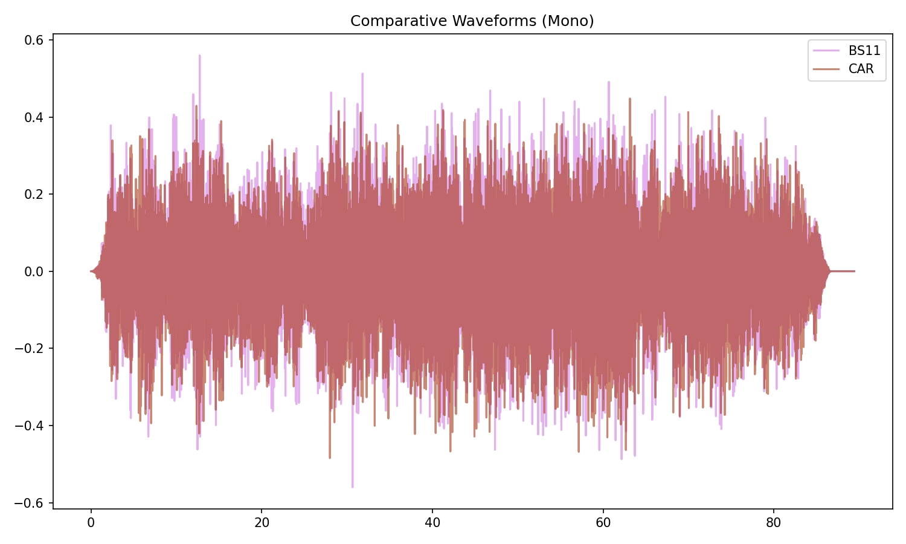

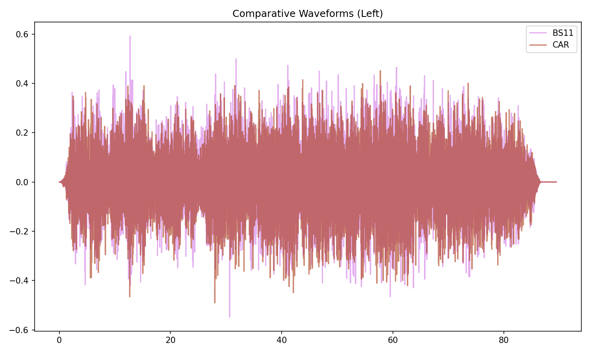

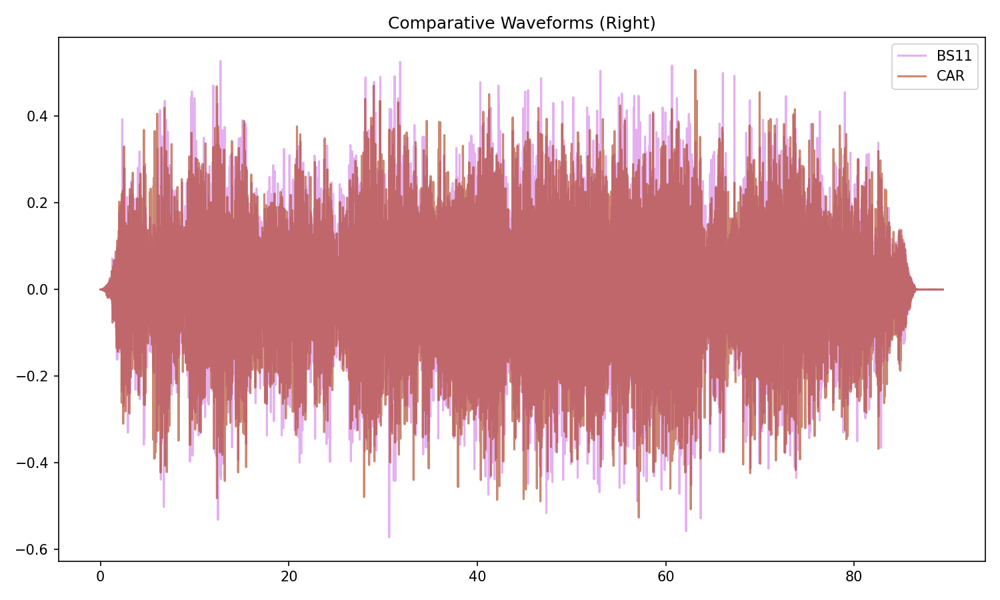

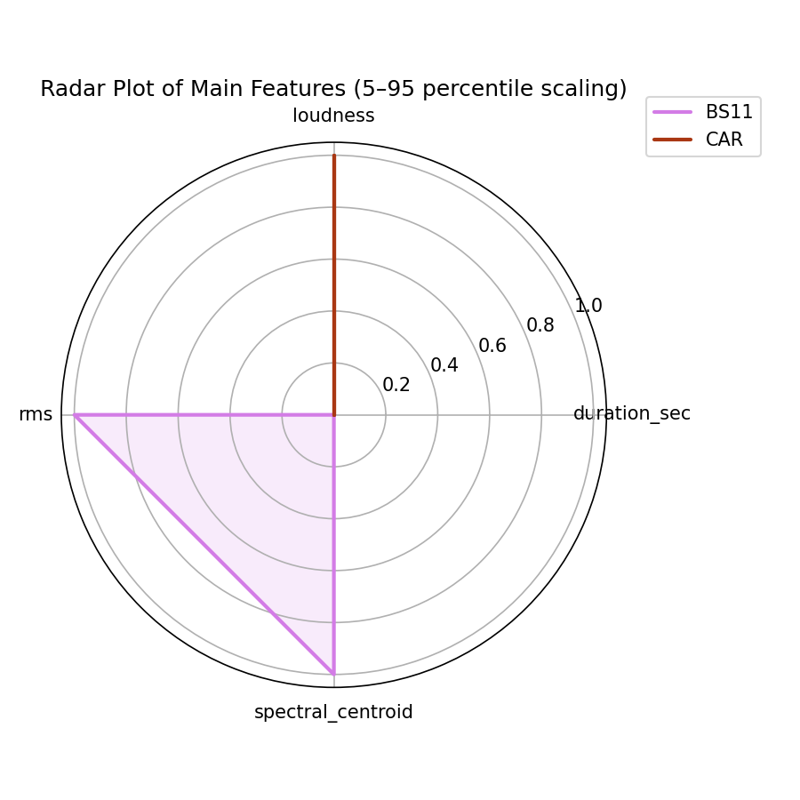

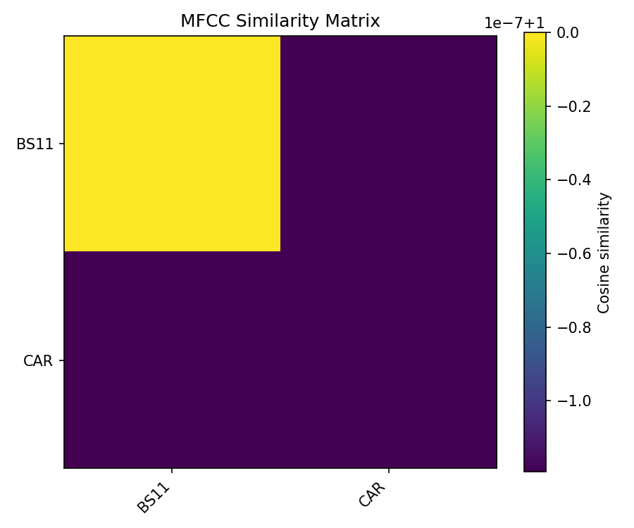

## Pitch & Speed Analysis (cents)

Reference version: **BS11**

| song_label   | ref_label   | cmp_label   | cmp_file                                            |   tuning_cents_cmp |   tuning_cents_ref |   delta_tuning_cents |   semitone_shift_vs_ref |   chroma_similarity |   speed_factor_from_pitch |   duration_ratio_ref_over_cmp |
|:-------------|:------------|:------------|:----------------------------------------------------|-------------------:|-------------------:|---------------------:|------------------------:|--------------------:|--------------------------:|------------------------------:|
| dbts         | BS11        | BS11        | 04 - Bob Dylan & The Band - Down By The Station.wav |                -35 |                -35 |                    0 |                       0 |            1        |                         1 |                             1 |
| dbts         | BS11        | CAR         | 06-04-Bob_Dylan-Down_by_the_Station-SMR.flac        |                -35 |                -35 |                    0 |                       0 |            0.999986 |                         1 |                             1 |

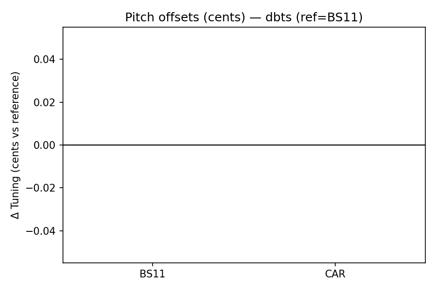

````text
Pitch/Speed analysis (reference = BS11)
============================================================

BS11 - 04 - Bob Dylan & The Band - Down By The Station.wav: shift=0 st ; Δtuning=0.0 cents ; speed_from_pitch=1.0000 ; duration_ratio(ref/cmp)=1.0000
CAR - 06-04-Bob_Dylan-Down_by_the_Station-SMR.flac: shift=0 st ; Δtuning=0.0 cents ; speed_from_pitch=1.0000 ; duration_ratio(ref/cmp)=1.0000

````

## Stereo Balance

### BS11


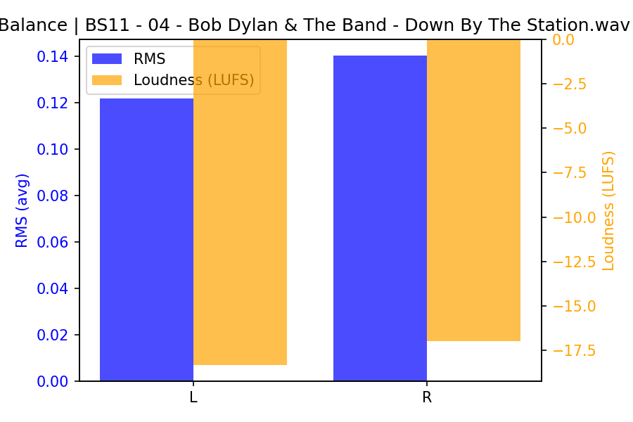

### CAR

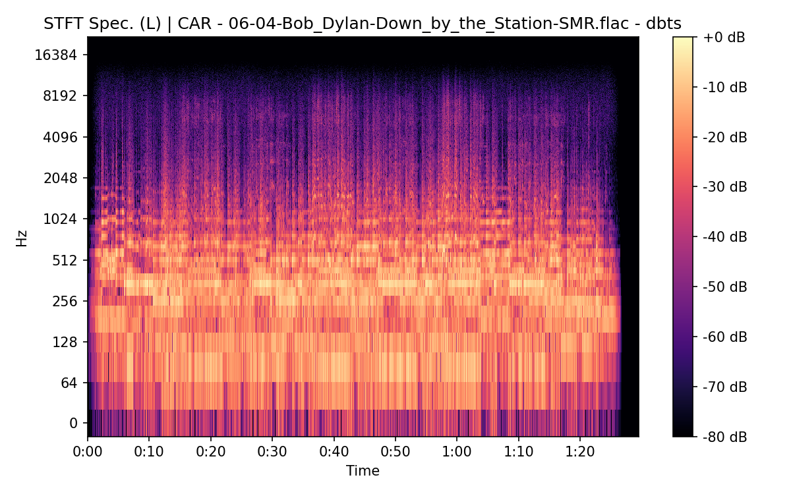

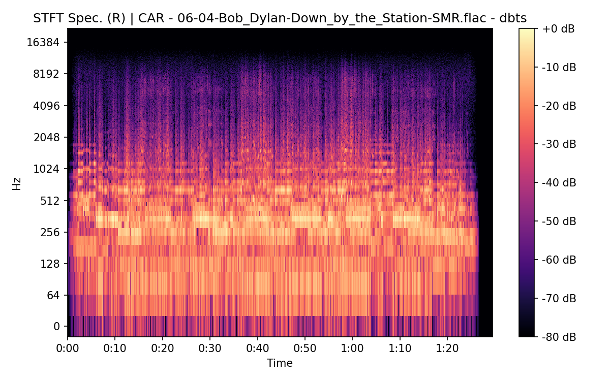

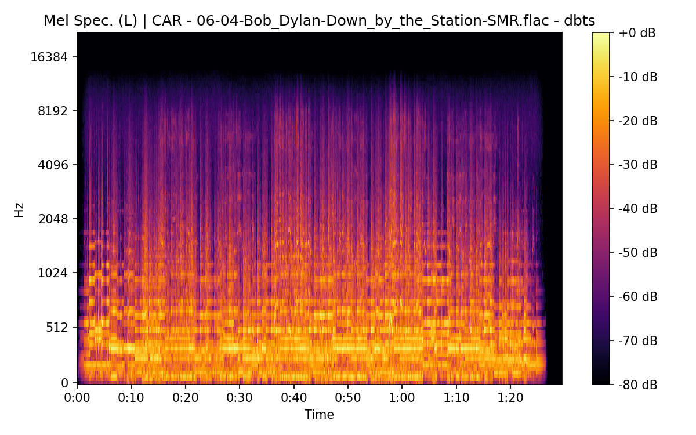


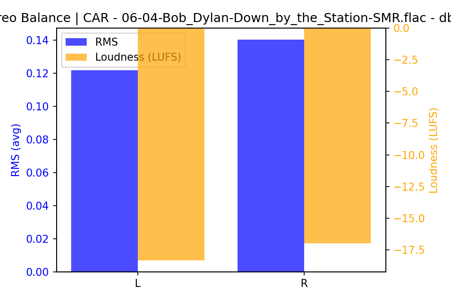

## Spectrograms (Mono)

### BS11


### CAR


