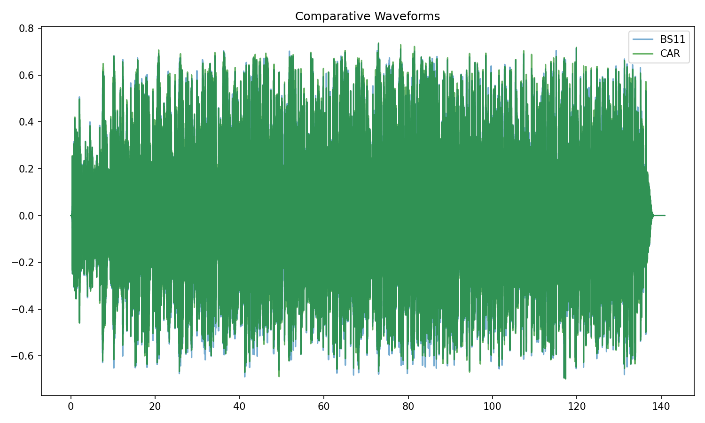
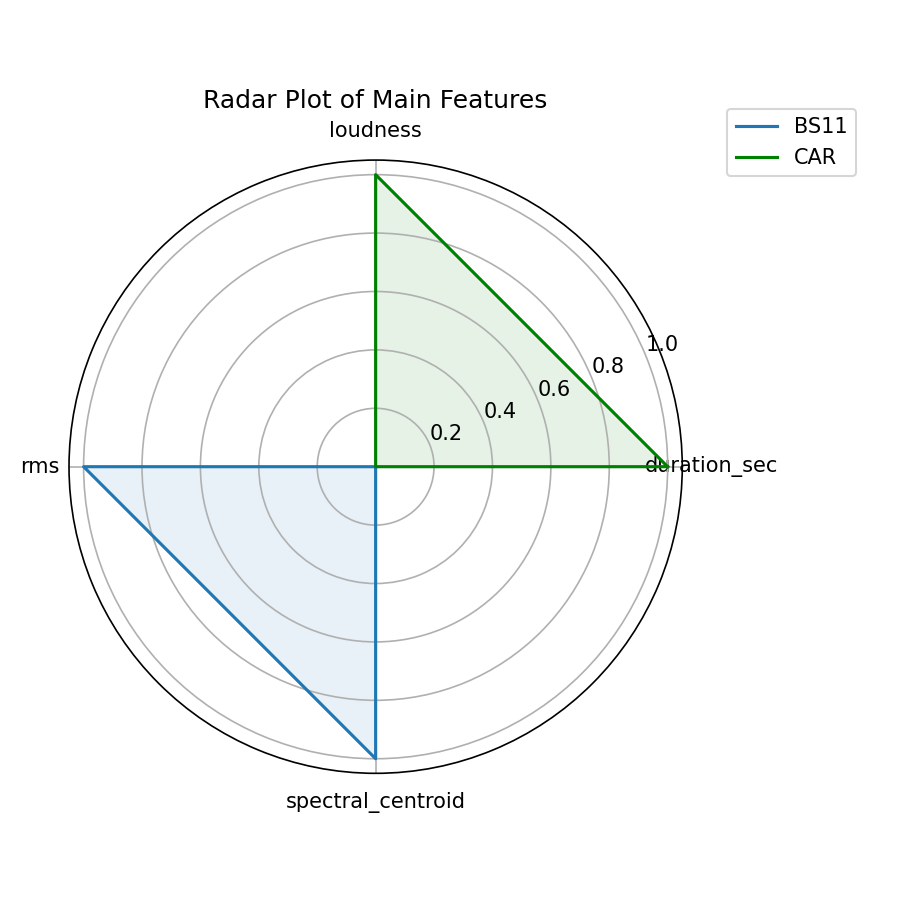
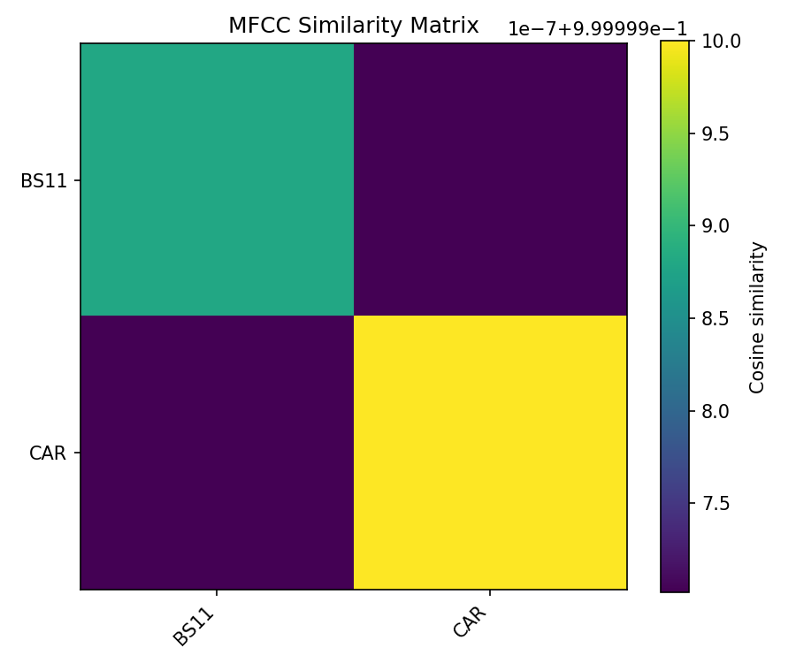
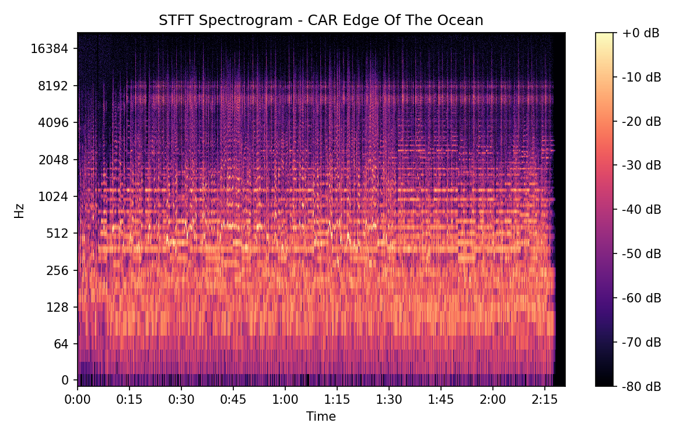

# Edge Of The Ocean

## Details

| label   | orig_file                                         | md5                              |   disc |   track |   duration_sec | duration_fmt   |   loudness |      rms |   spectral_centroid |
|:--------|:--------------------------------------------------|:---------------------------------|-------:|--------:|---------------:|:---------------|-----------:|---------:|--------------------:|
| BS11    | 01 - Bob Dylan & The Band - Edge Of The Ocean.wav | b1eca5c889bece4353a5ff8610740013 |      1 |       1 |        140.827 | 02:20:826      |   -17.1802 | 0.128836 |             2457.7  |
| CAR     | 01-01-Bob_Dylan-Edge_of_the_Ocean-SMR.flac        | 675e2200ebf4b28d49f0dbcb3e54eb99 |      1 |       1 |        140.83  | 02:20:829      |   -17.1774 | 0.128824 |             2321.66 |

## Plots

## Spectrograms

### BS11

### CAR

