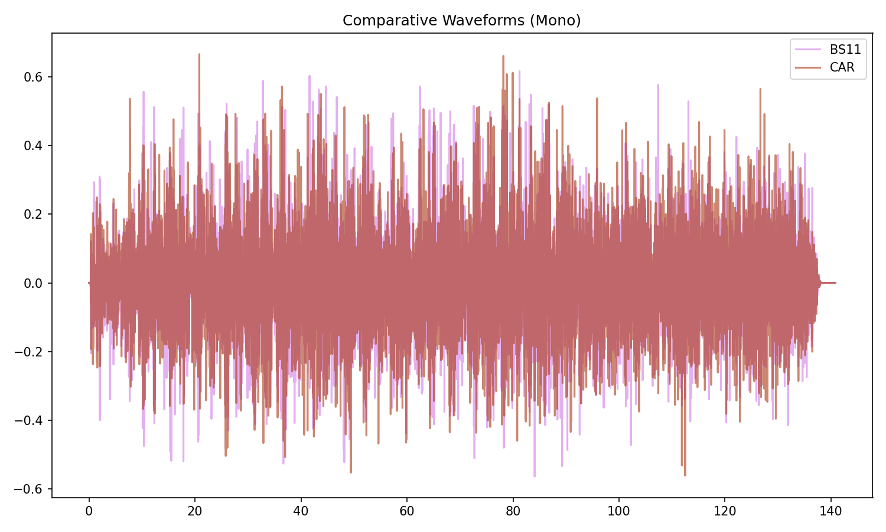
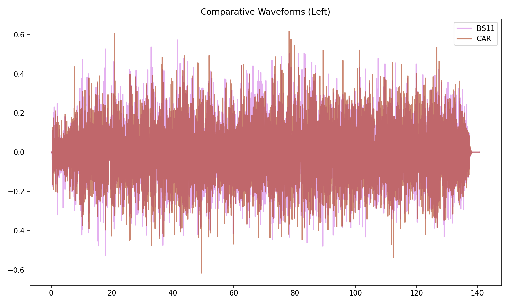
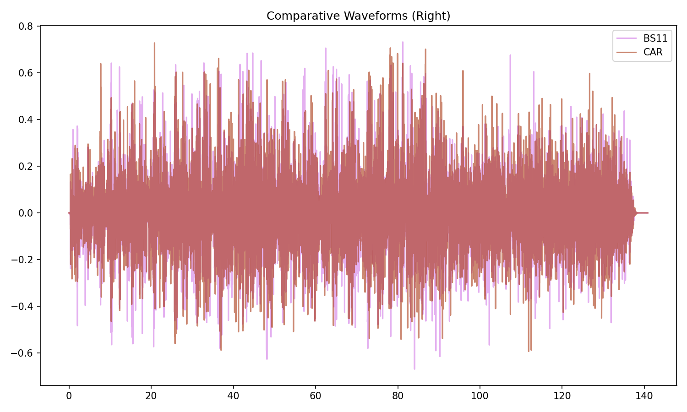
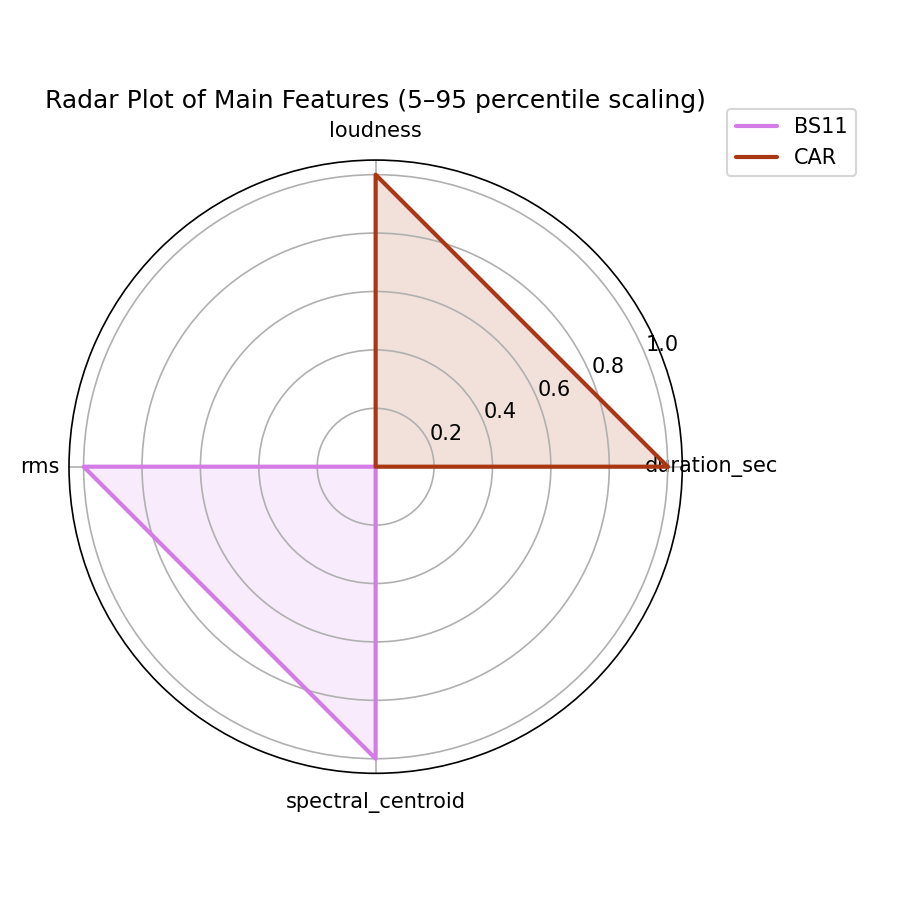
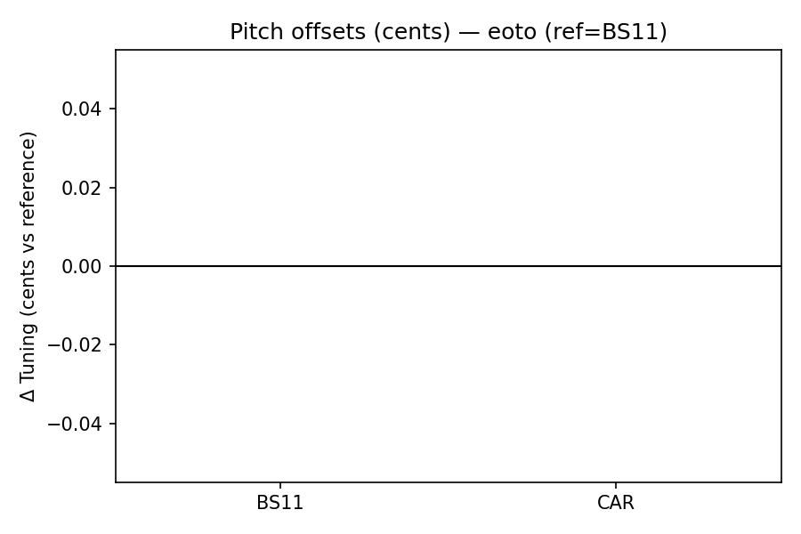
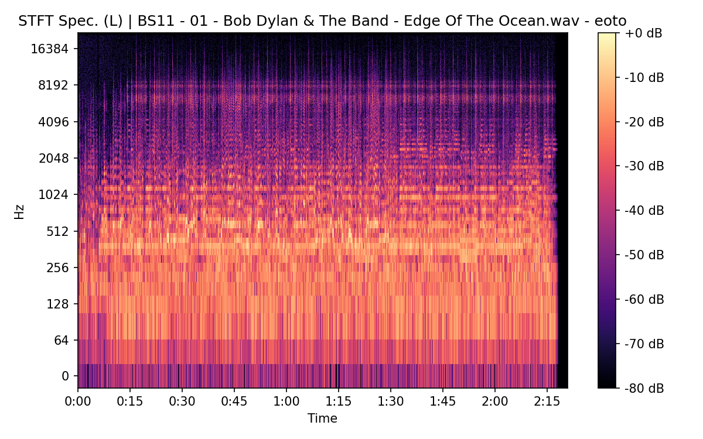
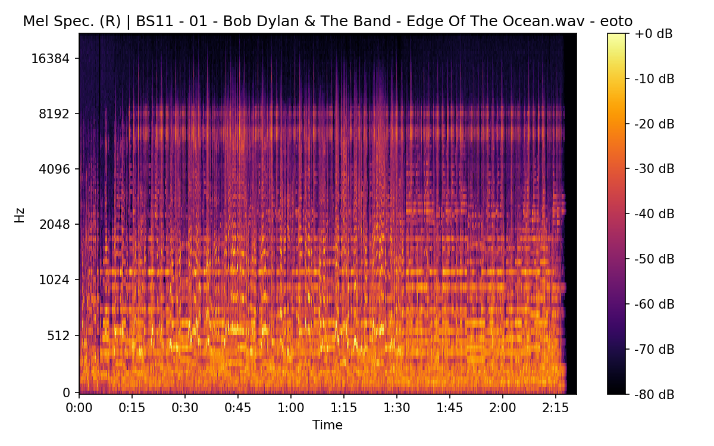
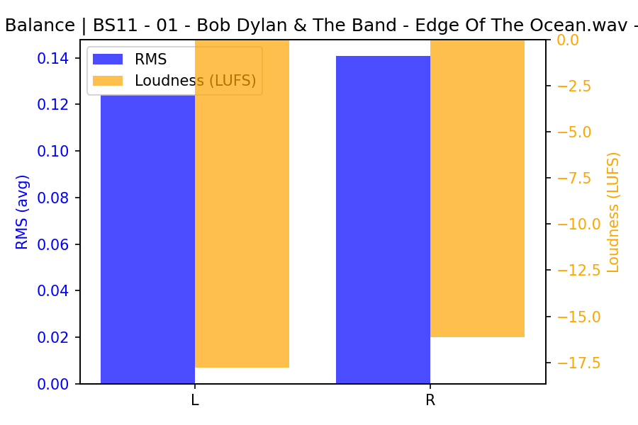
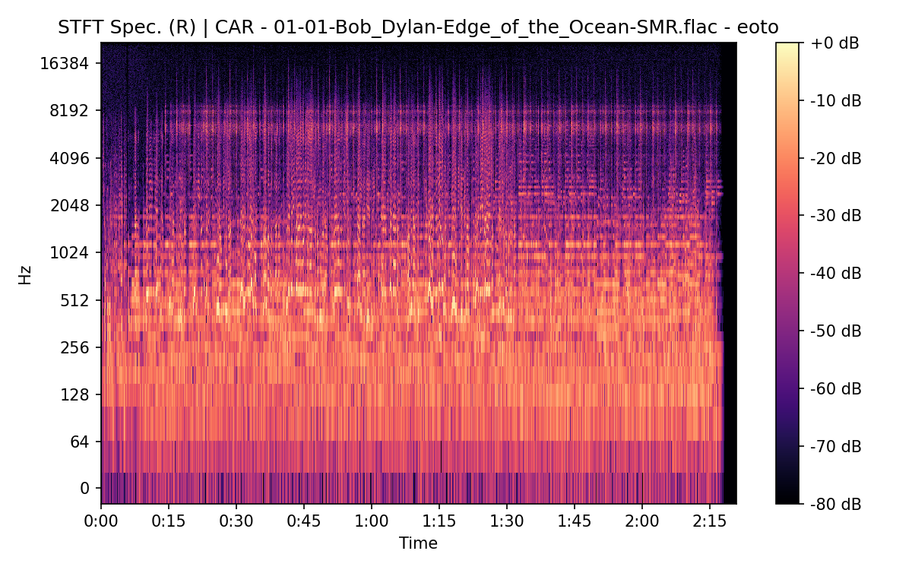
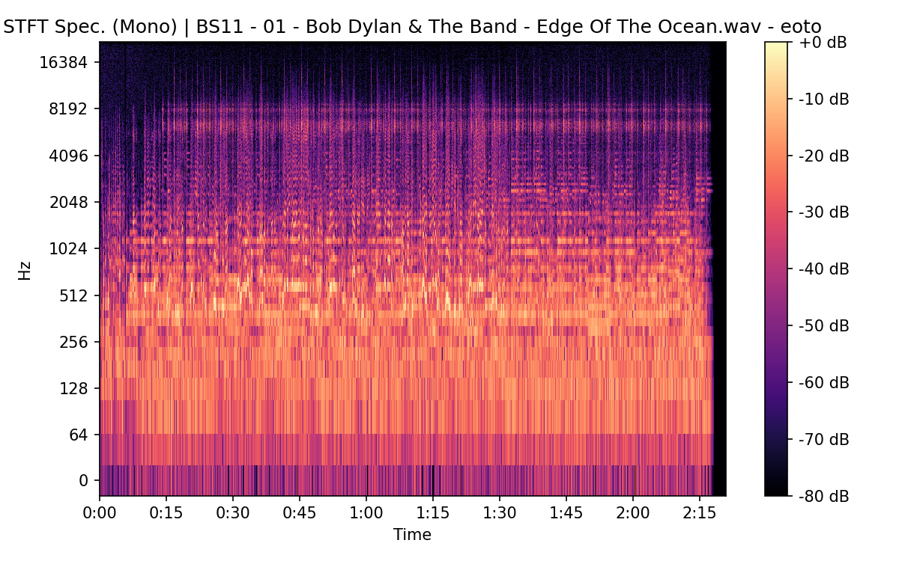

# Edge Of The Ocean

**(title taken from BS11)**

[](){ #eoto }

## Details

| label   | orig_file                                         | md5                              |   disc |   track |   duration_sec | duration_fmt   |   loudness |   loudness_left |   loudness_right |   loudness_balance |      rms |   rms_left |   rms_right |   rms_balance |   lr_corr |   spectral_centroid |
|:--------|:--------------------------------------------------|:---------------------------------|-------:|--------:|---------------:|:---------------|-----------:|----------------:|-----------------:|-------------------:|---------:|-----------:|------------:|--------------:|----------:|--------------------:|
| BS11    | 01 - Bob Dylan & The Band - Edge Of The Ocean.wav | b1eca5c889bece4353a5ff8610740013 |      1 |       1 |        140.827 | 02:20:827      |   -17.1802 |        -17.7741 |         -16.1488 |           -1.62535 | 0.128836 |   0.124416 |    0.140734 |    -0.0163171 |  0.885445 |             2457.7  |
| CAR     | 01-01-Bob_Dylan-Edge_of_the_Ocean-SMR.flac        | 675e2200ebf4b28d49f0dbcb3e54eb99 |      1 |       1 |        140.83  | 02:20:830      |   -17.1774 |        -17.7713 |         -16.143  |           -1.62823 | 0.128824 |   0.124405 |    0.140722 |    -0.0163167 |  0.885445 |             2321.66 |

## Plots









## Pitch & Speed Analysis (cents)

Reference version: **BS11**

| song_label   | ref_label   | cmp_label   | cmp_file                                          |   tuning_cents_cmp |   tuning_cents_ref |   delta_tuning_cents |   semitone_shift_vs_ref |   chroma_similarity |   speed_factor_from_pitch |   duration_ratio_ref_over_cmp |
|:-------------|:------------|:------------|:--------------------------------------------------|-------------------:|-------------------:|---------------------:|------------------------:|--------------------:|--------------------------:|------------------------------:|
| eoto         | BS11        | BS11        | 01 - Bob Dylan & The Band - Edge Of The Ocean.wav |                -36 |                -36 |                    0 |                       0 |             1       |                         1 |                      1        |
| eoto         | BS11        | CAR         | 01-01-Bob_Dylan-Edge_of_the_Ocean-SMR.flac        |                -36 |                -36 |                    0 |                       0 |             0.99998 |                         1 |                      0.999979 |



````text
Pitch/Speed analysis (reference = BS11)
============================================================

BS11 - 01 - Bob Dylan & The Band - Edge Of The Ocean.wav: shift=0 st ; Δtuning=0.0 cents ; speed_from_pitch=1.0000 ; duration_ratio(ref/cmp)=1.0000
CAR - 01-01-Bob_Dylan-Edge_of_the_Ocean-SMR.flac: shift=0 st ; Δtuning=0.0 cents ; speed_from_pitch=1.0000 ; duration_ratio(ref/cmp)=1.0000

````

## Stereo Balance

### BS11








### CAR





## Spectrograms (Mono)

### BS11




### CAR


