# Instrumental #4

## Details

| label   | orig_file               | md5                              |   disc |   track |   duration_sec | duration_fmt   |   loudness |   loudness_left |   loudness_right |   loudness_balance |       rms |   rms_left |   rms_right |   rms_balance |   lr_corr |   spectral_centroid |
|:--------|:------------------------|:---------------------------------|-------:|--------:|---------------:|:---------------|-----------:|----------------:|-----------------:|-------------------:|----------:|-----------:|------------:|--------------:|----------:|--------------------:|
| DITB    | 12 Instrumental #4.flac | 0b8a1b38c905175790eba5a62d10dbb7 |      1 |      12 |        38.5867 | 00:38:586      |   -23.1198 |        -25.1618 |         -18.0109 |           -7.15088 | 0.0676061 |  0.0432436 |    0.122861 |    -0.0796174 | 0.0572587 |             1640.16 |

## Plots
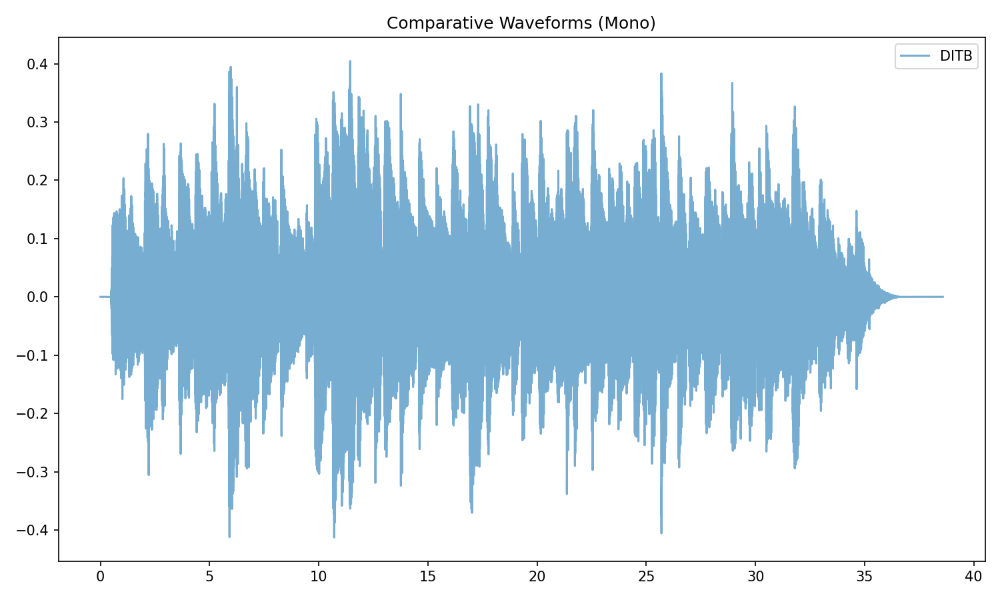

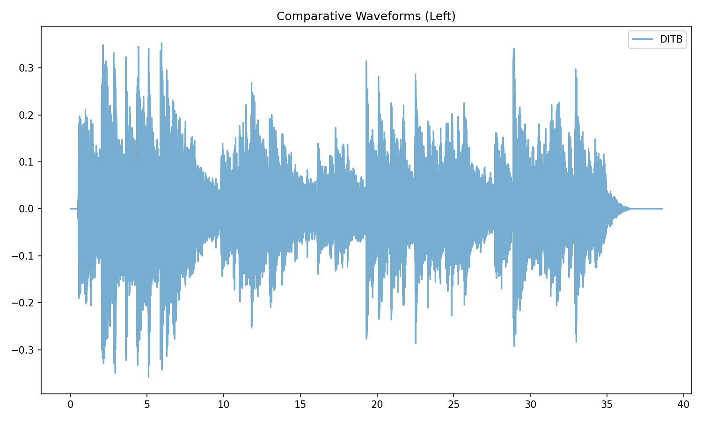

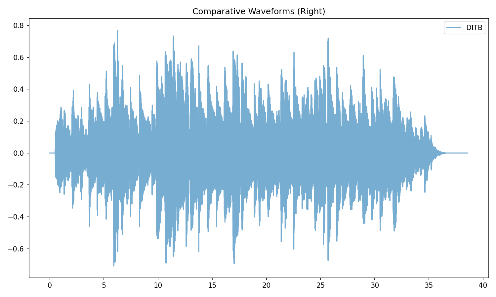

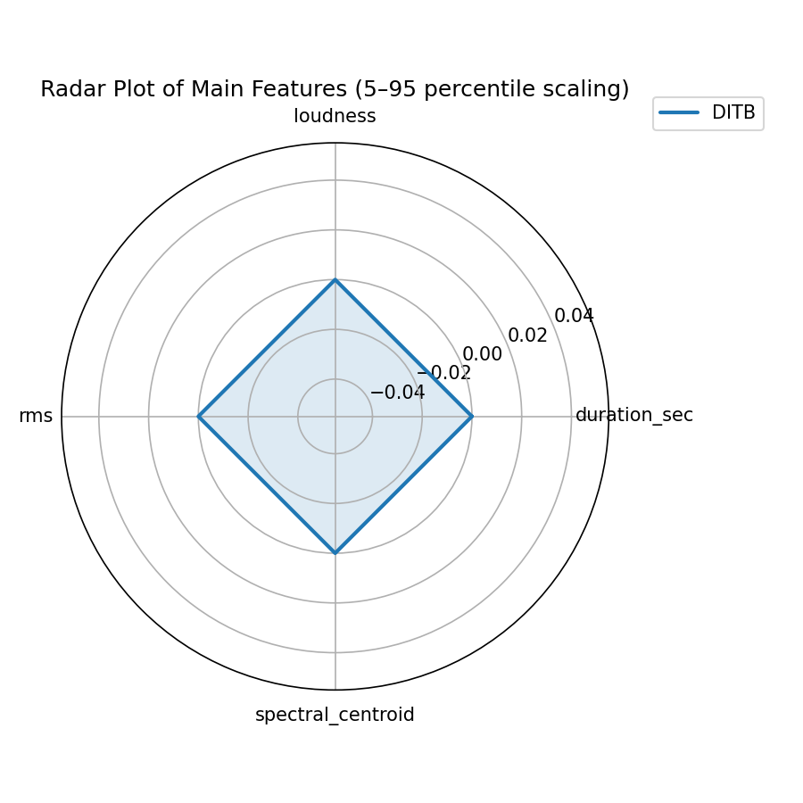

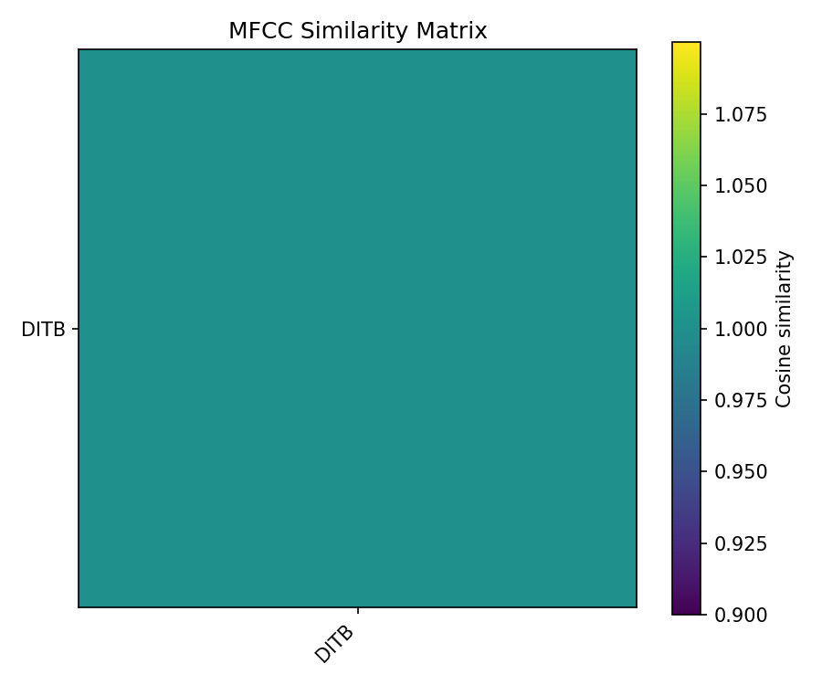

## Stereo Balance

### DITB

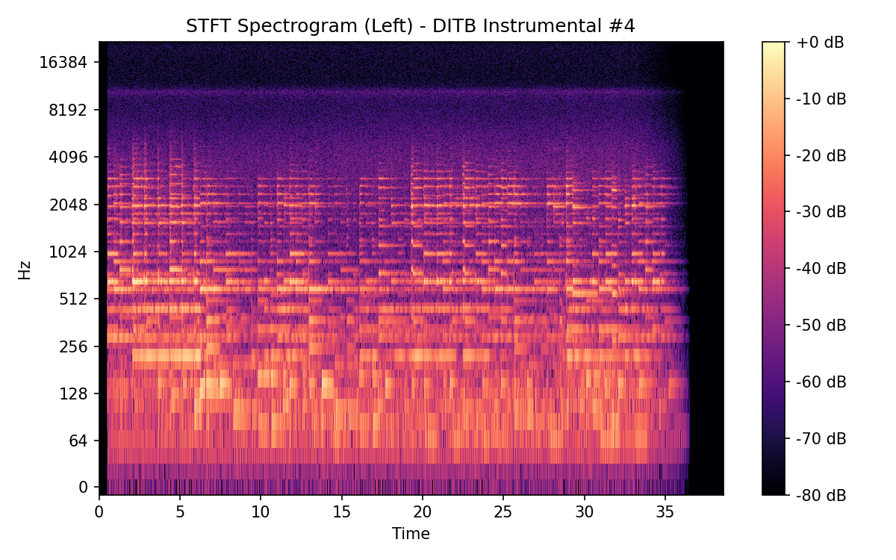

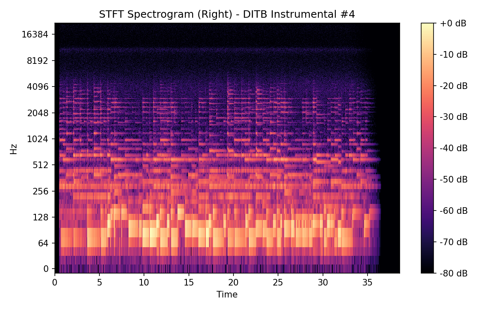

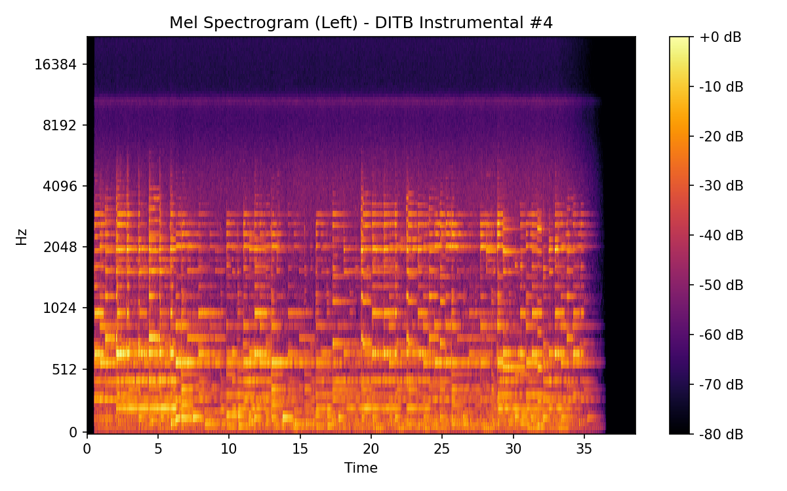

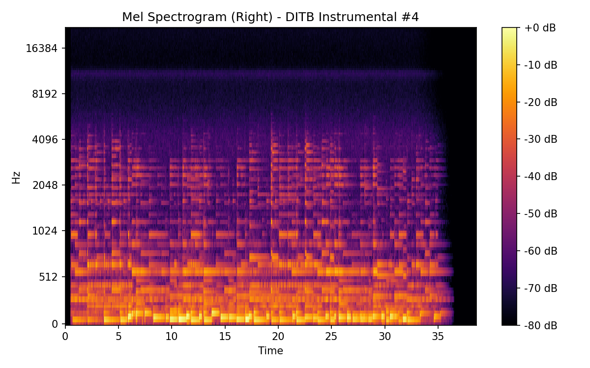

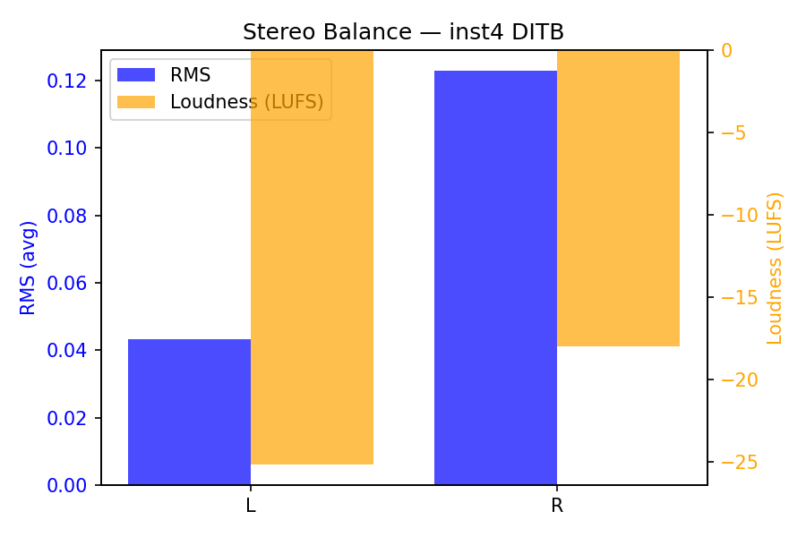

## Spectrograms (Mono)

### DITB

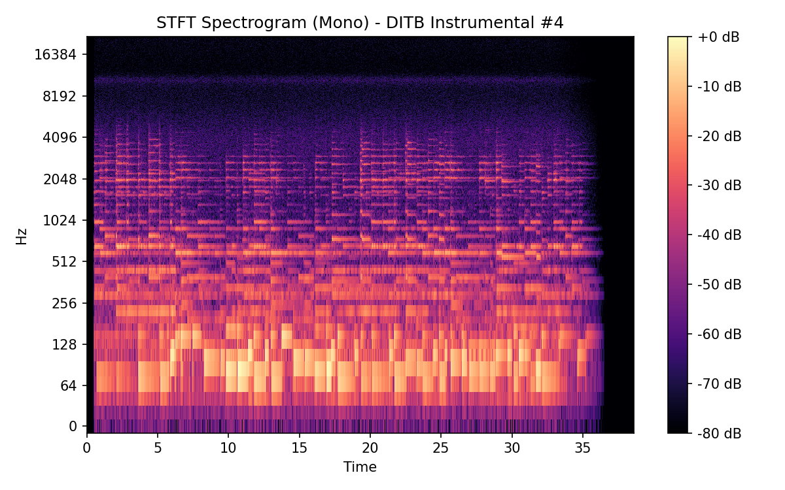

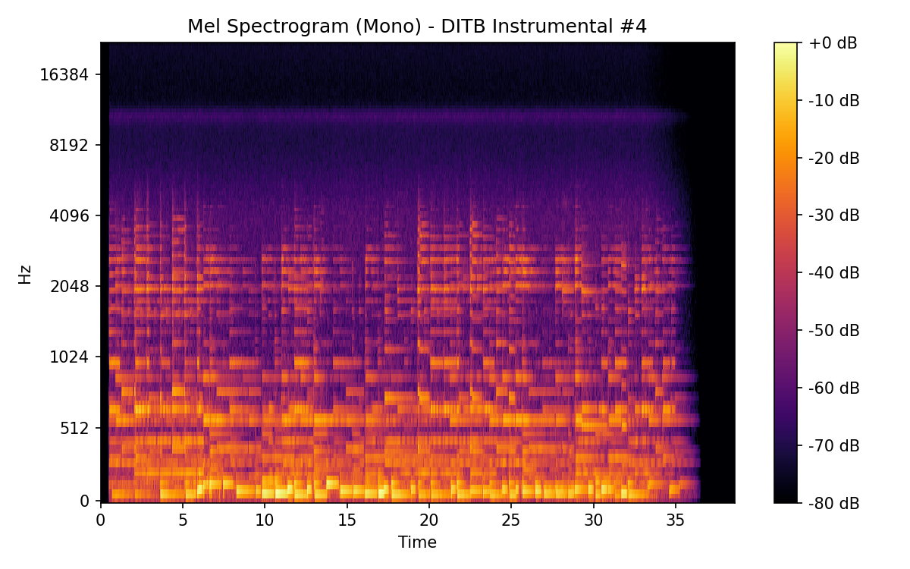

## Pitch & Speed Analysis (cents)

Reference version: **DITB**

| song_label   | ref_label   | cmp_label   |   tuning_cents_cmp |   tuning_cents_ref |   delta_tuning_cents |   semitone_shift_vs_ref |   chroma_similarity |   speed_factor_from_pitch |   duration_ratio_ref_over_cmp |
|:-------------|:------------|:------------|-------------------:|-------------------:|---------------------:|------------------------:|--------------------:|--------------------------:|------------------------------:|
| inst4        | DITB        | DITB        |                 13 |                 13 |                    0 |                       0 |                   1 |                         1 |                             1 |

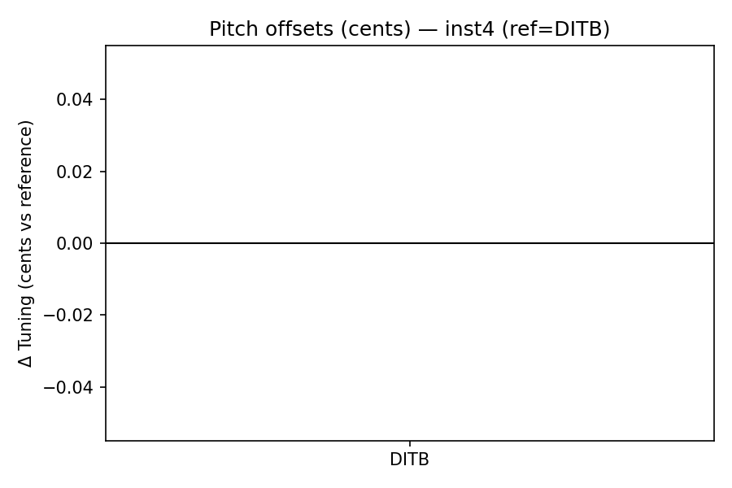

```
Pitch/Speed analysis (reference = DITB)
============================================================

DITB: shift=0 st ; Δtuning=0.0 cents ; speed_from_pitch=1.0000 ; duration_ratio(ref/cmp)=1.0000
```

