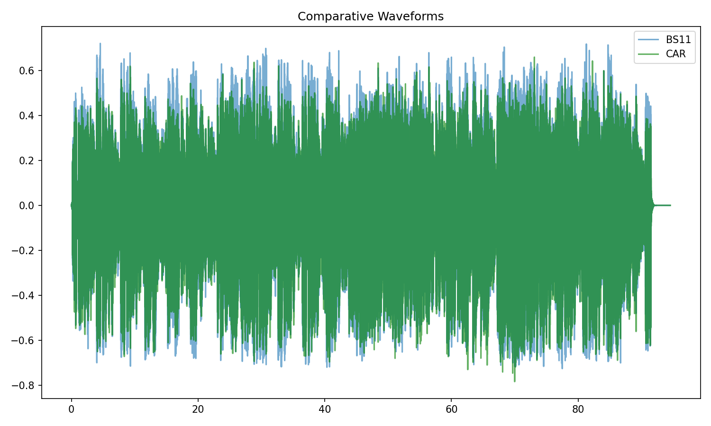
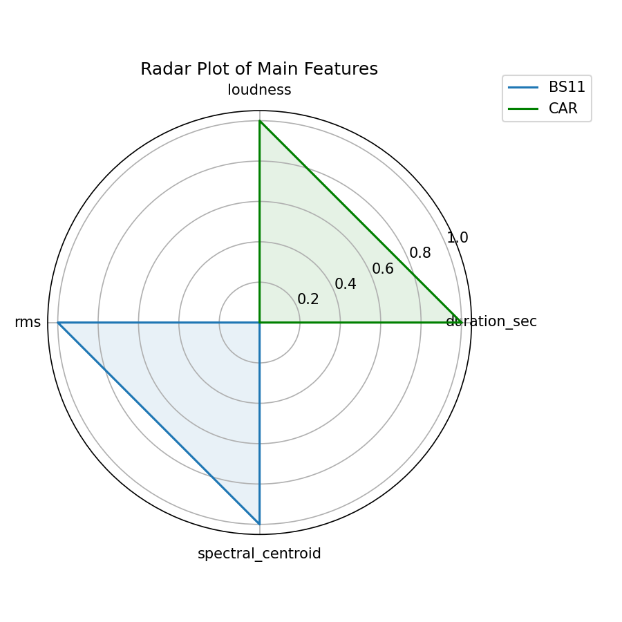
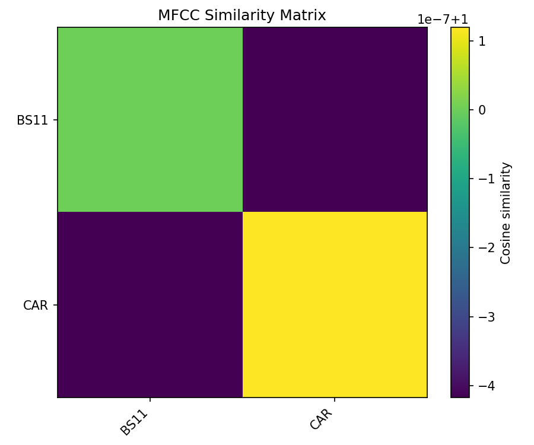
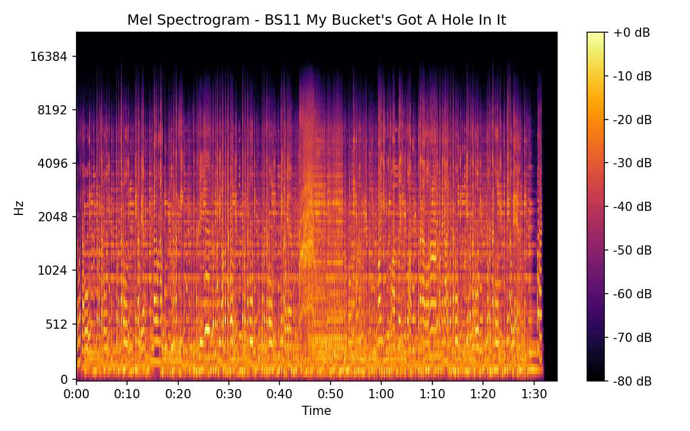
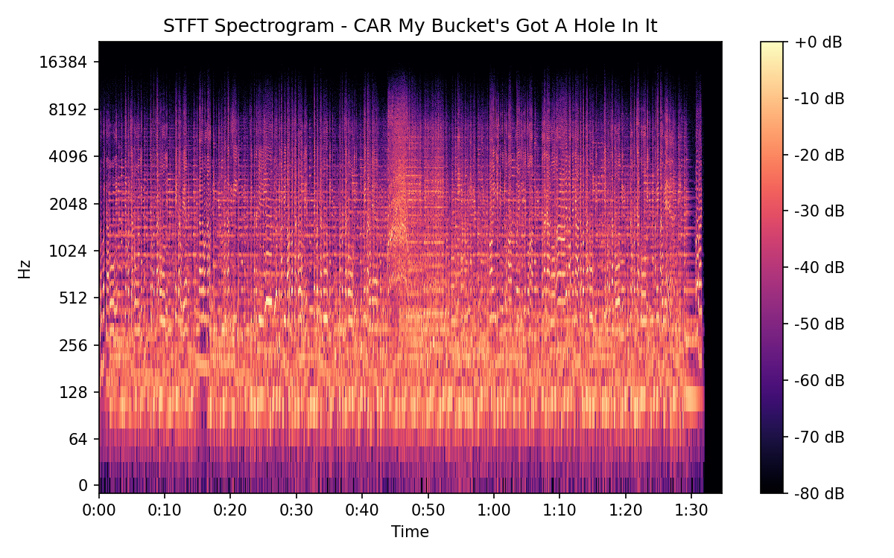
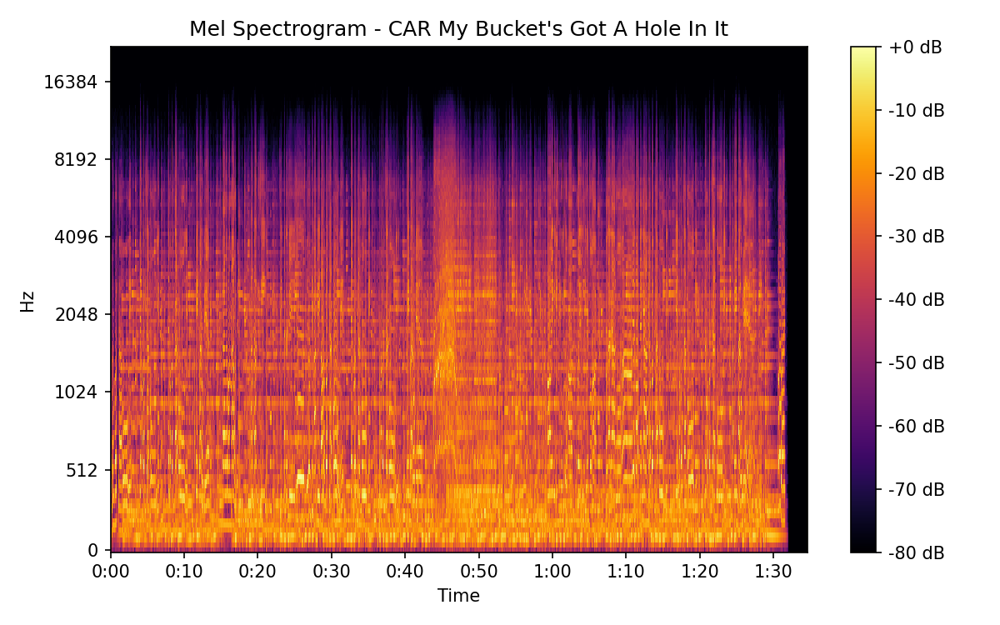

# My Bucket's Got A Hole In It

## Details

| label   | orig_file                                                    | md5                              |   disc |   track |   duration_sec | duration_fmt   |   loudness |      rms |   spectral_centroid |
|:--------|:-------------------------------------------------------------|:---------------------------------|-------:|--------:|---------------:|:---------------|-----------:|---------:|--------------------:|
| BS11    | 02 - Bob Dylan & The Band - My Bucket's Got A Hole In It.wav | b3d44c5d404b4f41e817e37063afe89b |      1 |       2 |        94.5067 | 01:34:506      |   -16.7729 | 0.134341 |             2139.95 |
| CAR     | 01-02-Bob_Dylan-My_Bucket_s_Got_a_Hole_in_It-SMR.flac        | 17a5c30864b23ef047d4b28e68778ab4 |      1 |       2 |        94.5733 | 01:34:573      |   -16.7729 | 0.13426  |             1965.15 |

## Plots

## Spectrograms

### BS11

### CAR

