# See You Later Allen Ginsberg (Take 2)

## Notes

`atwr` has both takes in one single track.

## Details

| label   | orig_file                                                             | md5                              |   disc |   track |   duration_sec | duration_fmt   |   loudness |   loudness_left |   loudness_right |   loudness_balance |      rms |   rms_left |   rms_right |   rms_balance |   lr_corr |   spectral_centroid |
|:--------|:----------------------------------------------------------------------|:---------------------------------|-------:|--------:|---------------:|:---------------|-----------:|----------------:|-----------------:|-------------------:|---------:|-----------:|------------:|--------------:|----------:|--------------------:|
| BS11    | 05 - Bob Dylan & The Band - See You Later Allen Ginsberg (Take 2).wav | e1b8971b1090470a5504148f92f8a58b |      2 |       5 |        51.24   | 00:51:240      |   -17.8778 |        -17.9355 |         -17.4219 |          -0.513581 | 0.118572 |   0.120911 |    0.120357 |   0.000553742 |  0.919718 |             2467.76 |
| CAR     | 02-05-Bob_Dylan-See_You_Later_Allen_Ginsberg_T-SMR.flac               | c4e540a402e85aa5894f4e3b8eda83a1 |      2 |       5 |        51.2466 | 00:51:246      |   -17.8705 |        -17.9369 |         -17.4058 |          -0.531075 | 0.11854  |   0.120877 |    0.120323 |   0.000554614 |  0.919716 |             2135.59 |

## Plots
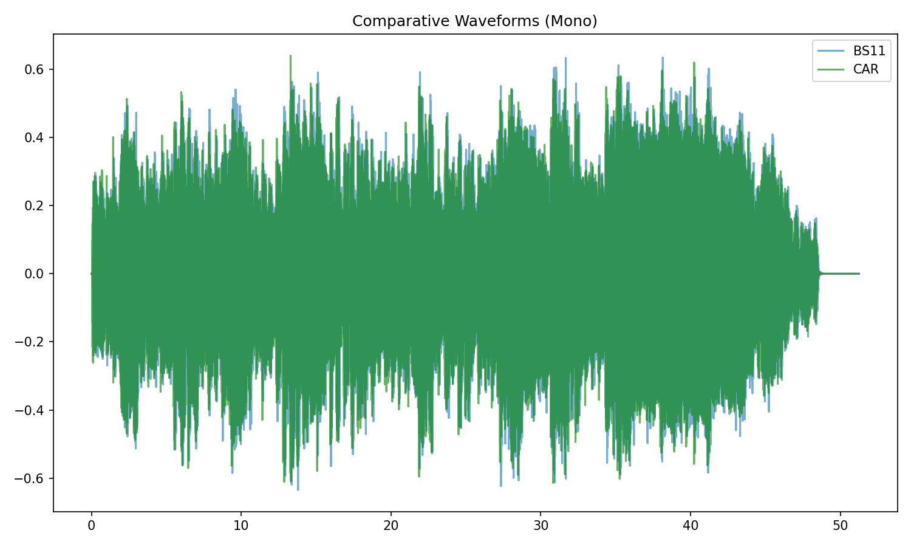

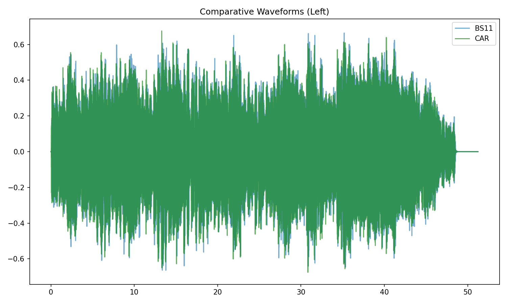

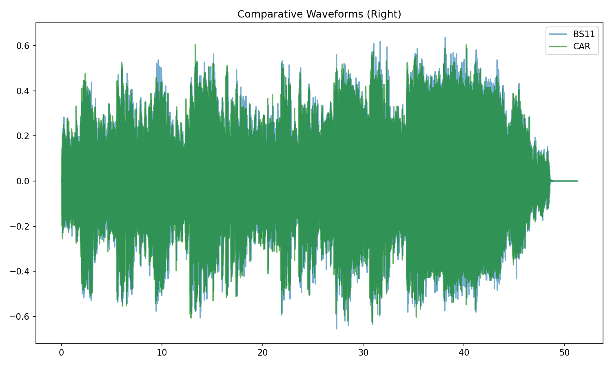

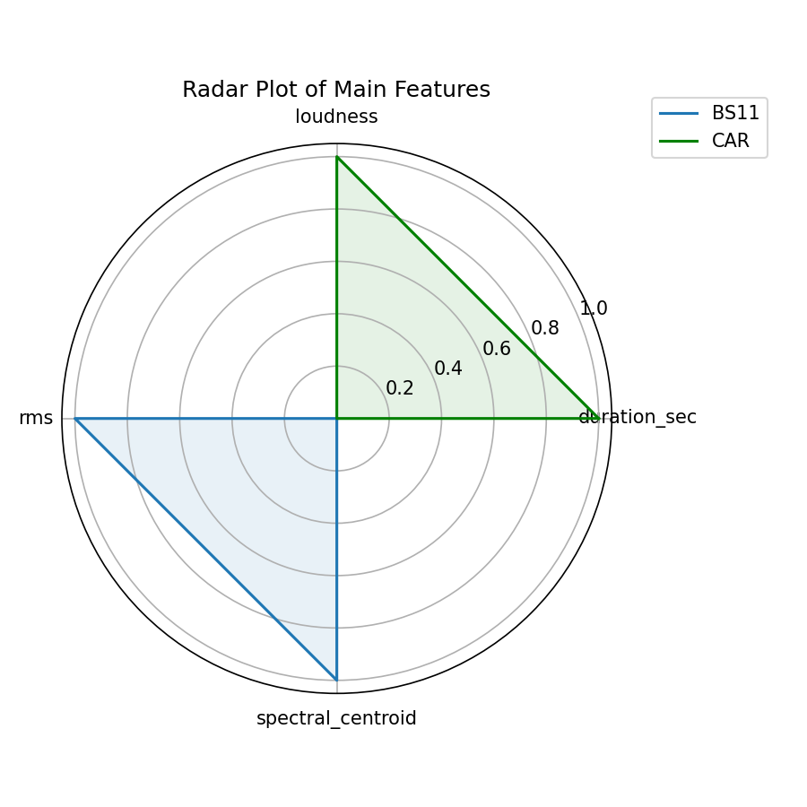

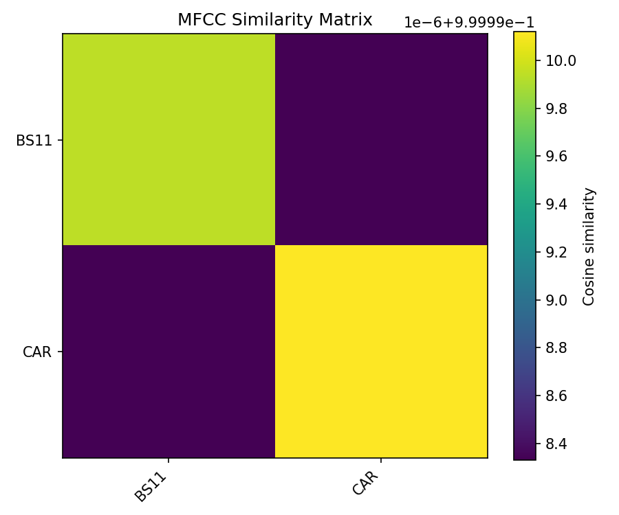

## Stereo Balance

### BS11

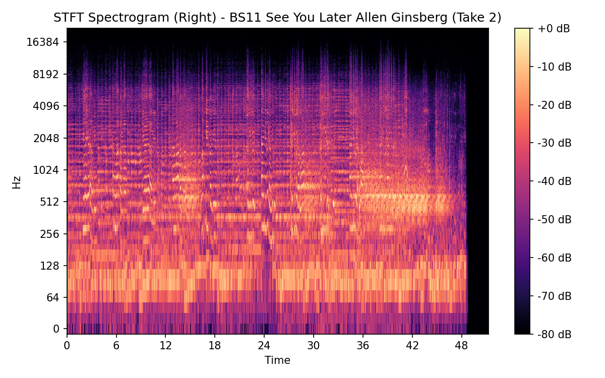

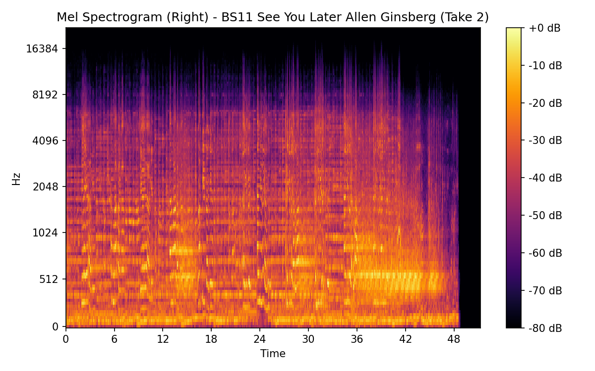

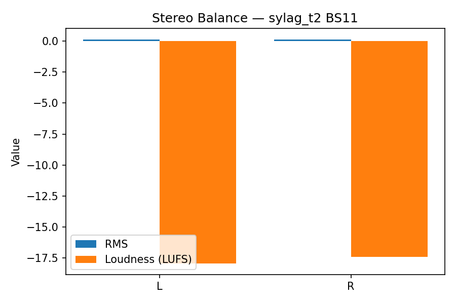

### CAR

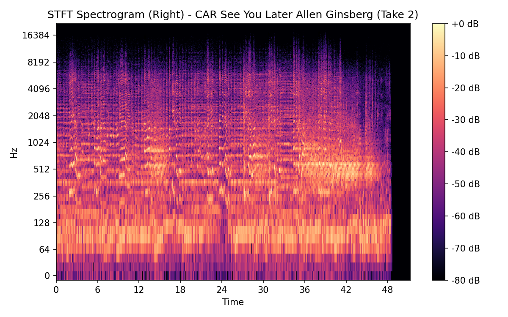

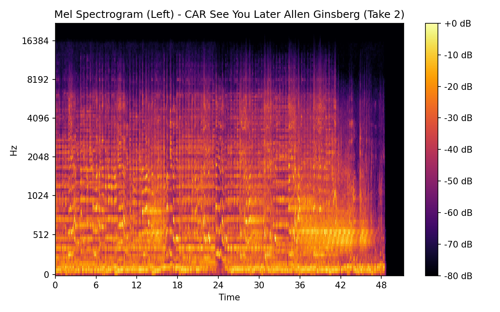

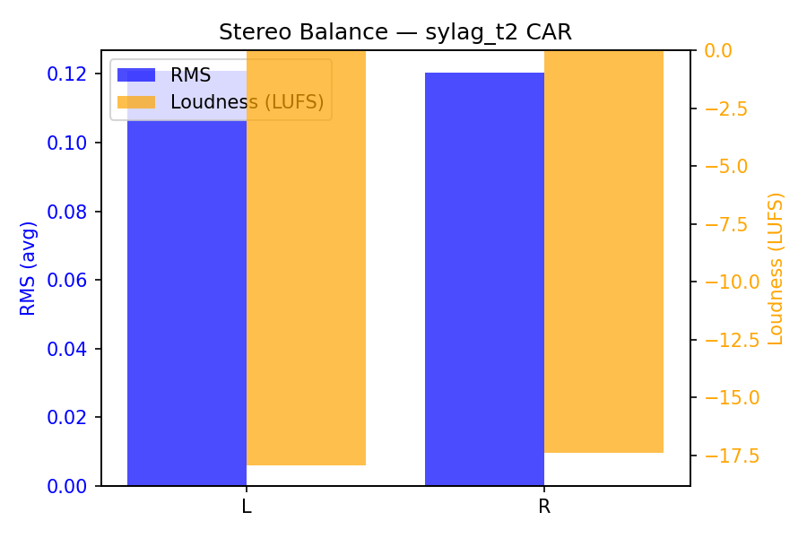

## Spectrograms (Mono)

### BS11

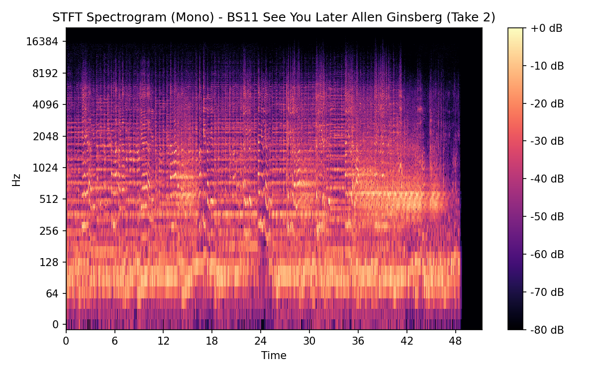

### CAR

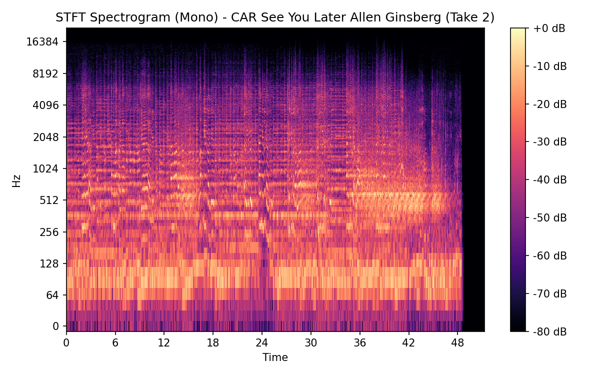

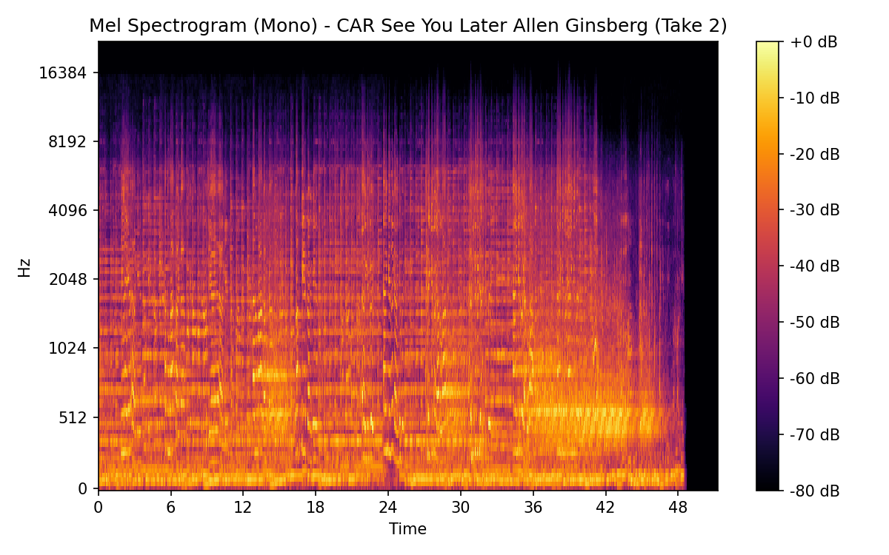

